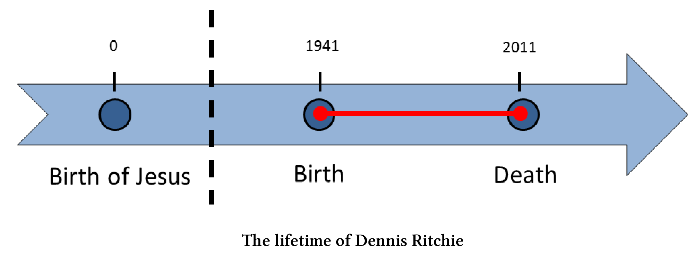
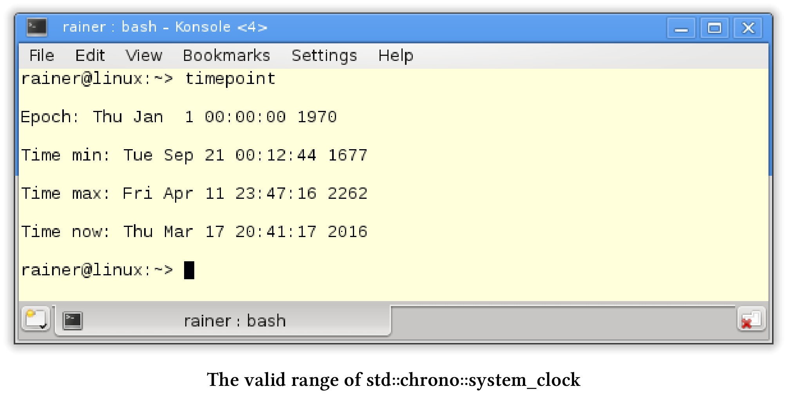
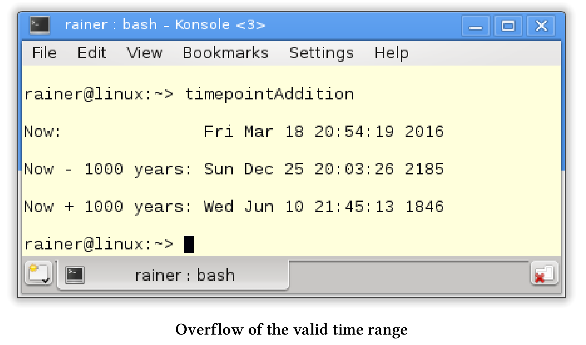
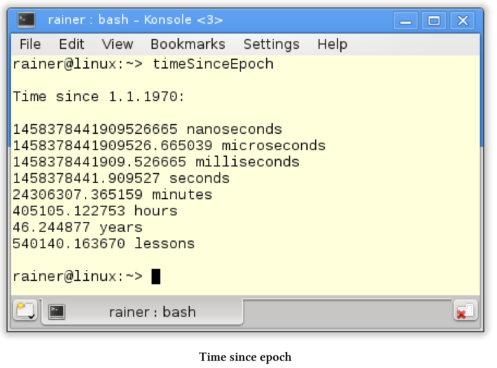
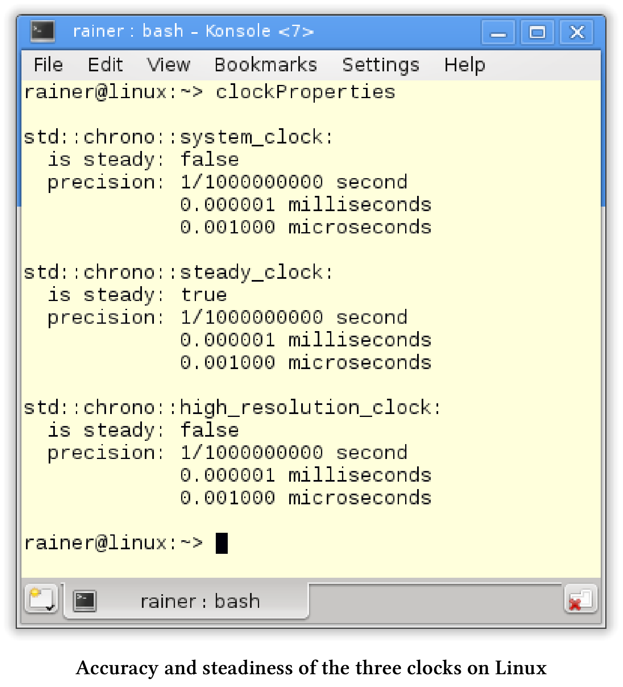
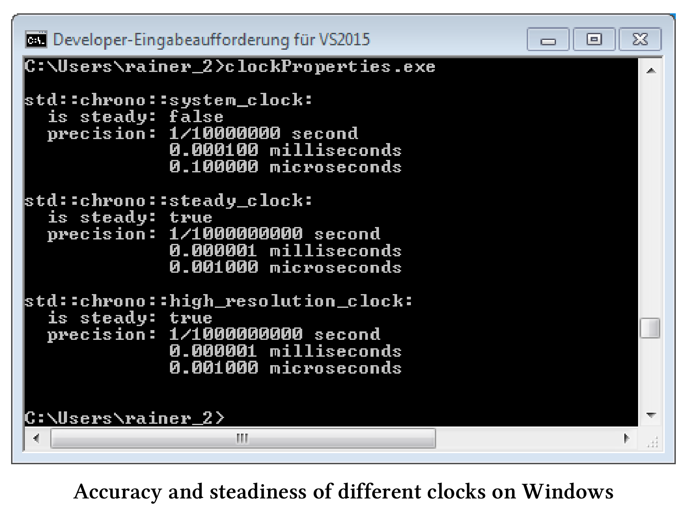
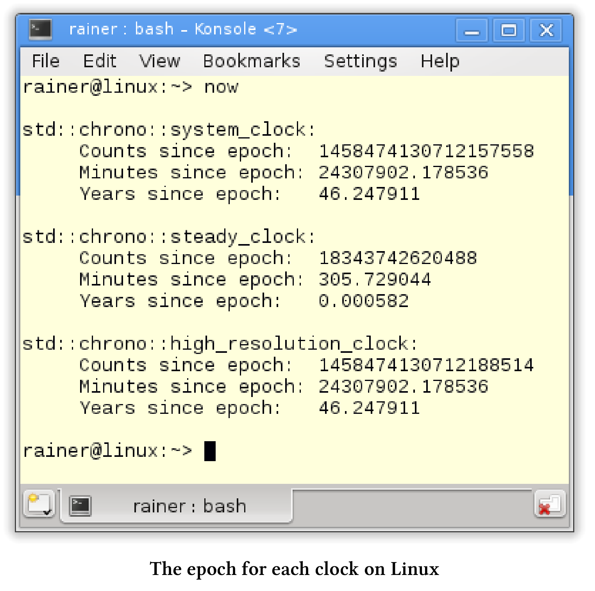
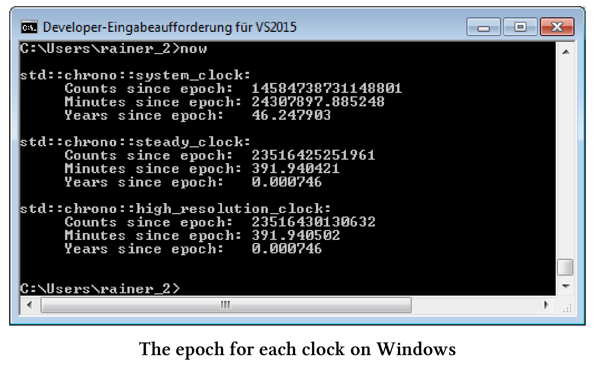
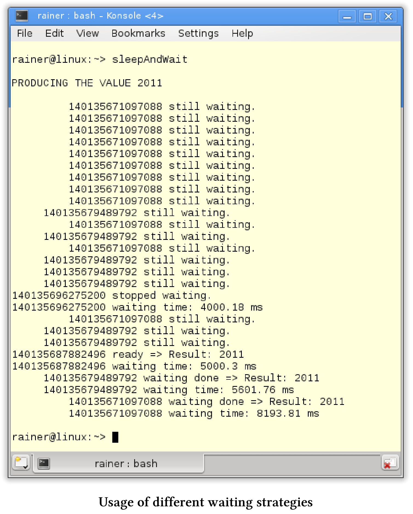

# 时间库

如果不写一些关于时间库的内容，那么使用现代C++处理并发性的书就显得不那么完整。时间库由三个部分组成：时间点、时间段和时钟。

## 时间点、时间段和时钟

时间点：由它的起始点(所谓的纪元[epoch]( https://en.wikipedia.org/wiki/Epoch_(reference_date)))和从纪元起经过的时间(表示为时间段)来表示。

时间段：是两个时间点之间的差值，它用时间刻度的数量来衡量。

时钟：由一个起点和一个时间刻度组成，此信息可以计算当前时间。

可以比较时间点。将时间段添加到某个时间点时，可以得到一个新的时间点。时钟周期是测量时间时钟的准确性。耶稣的出生在我的文明中作为一个开始的时间点，一年是一个典型的时间周期。

[Dennis Ritchie](https://en.wikipedia.org/wiki/Dennis_Ritchie)，C语言的创造者于2011年去世，我用他的一生来说明这三个概念。为了简单起见，这里只使用年份。

这是他的一生。



耶稣的诞生是我们时代的起点，也就是纪元元年。1941年和2011年的时间是由纪元源时间点和时间段来定义的。从2011年减去1941年，得到的是时间段。所以，Dennis Ritchie去世时，享年70岁。

我们继续研究时间库的组件。

## 时间点

时间点`std::chrono::time_point`由起始点(`epoch`)和附加的时间段定义。类模板由两个组件：时钟和时间段。默认情况下，时间段是从时钟类派生出来的。

`std::chrono::time_point`类模板

```c++
template<
  class Clock,
  class Duration= typename Clock::duration
>
class time_point;
```

对于时钟来说，有以下四个特殊的时间点:

* epoch: 时钟的起点。
* now: 当前时间。
* min: 时钟可以统计的最小时间点。
*  max: 时钟可以拥有的最大时间点。

最小和最大时间点的准确性取决于使用的时钟：`std::system::system_clock`, `std::chrono::steady_clock`或`std::chrono::high_resolution_clock`。

C++不保证时钟的准确性、起始点，还有有效时间范围。`std::chrono::system_clock`的起始时间通常是1970年1月1日，也就是所谓的[UNIX元年](https://en.wikipedia.org/wiki/Unix_time)，而`std::chrono::high_resolution_clock`具有最高的统计精度。

### 从时间点到日历时间

通过`std::chrono::system_clock::to_time_t`可以将一个内部使用`std::chrono::system_clock`的时间点，转换成一个类型为`std::time_t`的对象。通过函数[`std::gmtime`](http://en.cppreference.com/w/cpp/chrono/c/gmtime)对`std::time_t`对象进行进一步转换，可以得到以[世界统一时间]( https://en.wikipedia.org/wiki/Coordinated_Universal_Time)(UTC)表示的日历时间。最后，可以使用这个日历时间作为函数[`std::asctime`]( http://en.cppreference.com/w/cpp/chrono/c/asctime)的输入，以获得日历时间的文本表示。

显示日历时间

```c++
// timepoint.cpp

#include <chrono>
#include <ctime>
#include <iostream>
#include <string>

int main() {

  std::cout << std::endl;

  std::chrono::time_point<std::chrono::system_clock> sysTimePoint;
  std::time_t tp = std::chrono::system_clock::to_time_t(sysTimePoint);
  std::string sTp = std::asctime(std::gmtime(&tp));
  std::cout << "Epoch: " << sTp << std::endl;

  tp = std::chrono::system_clock::to_time_t(sysTimePoint.min());
  sTp = std::asctime(std::gmtime(&tp));
  std::cout << "Time min: " << sTp << std::endl;

  tp = std::chrono::system_clock::to_time_t(sysTimePoint.max());
  sTp = std::asctime(std::gmtime(&tp));
  std::cout << "Time max: " << sTp << std::endl;

  sysTimePoint = std::chrono::system_clock::now();
  tp = std::chrono::system_clock::to_time_t(sysTimePoint);
  sTp = std::asctime(std::gmtime(&tp));
  std::cout << "Time now: " << sTp << std::endl;

}
```

程序会显示`std::chrono::system_clock`的有效范围。我的Linux PC上，`std::chrono::system_clock`以UNIX元年作为起始点，时间点可以在1677年到2262年之间。



可以将时间段添加到时间点上，以获得新的时间点。在有效时间范围之外添加时间段，是未定义行为。

### 跨越有效的时间范围

下面的示例使用当前时间并加减1000年。为了简单起见，我忽略闰年，假设一年有365天。

```c++
// timepointAddition.cpp

#include <chrono>
#include <ctime>
#include <iostream>
#include <string>

using namespace std::chrono;
using namespace std;

string timePointAsString(const time_point<system_clock>& timePoint) {
  time_t tp = system_clock::to_time_t(timePoint);
  return asctime(gmtime(&tp));
}

int main() {

  cout << endl;

  time_point<system_clock> nowTimePoint = system_clock::now();

  cout << "Now: " << timePointAsString(nowTimePoint) << endl;

  const auto thousandYears = hours(24 * 365 * 1000);
  time_point<system_clock> historyTimePoint = nowTimePoint - thousandYears;
  cout << "Now - 1000 years: " << timePointAsString(historyTimePoint) << endl;

  time_point<system_clock> futureTimePoint = nowTimePoint + thousandYears;
  cout << "Now + 1000 years: " << timePointAsString(futureTimePoint) << endl;

}
```

程序的输出显示，第25行和第28行中时间点的溢出，将导致错误的结果。从现在的时间点减去1000年，获得了将来的时间点；在当前时间点上加上1000年，得到了过去的时间点。



两个时间点之间的差值是时间段。时间段支持基本的算法，可以在不同的时间刻度下进行显示。

## 时间段

`std::chrono::duration`是一个类模板， `Rep`类型的计次数和计次周期组成。

`std::chrono::duration`类模板

```c++
template<
  class Rep,
  class Period = std::ratio<1>
> class duration;
```

计次周期默认长度为`std::ratio<1>`。`std::ratio<1>`表示1秒，也可以写成`std::ratio< 1,1 >`，以此类推，`std::ratio<60>`是一分钟，`std::ratio<1,1000> `是1毫秒。当`Rep`类型是浮点数时，可以使用它来保存时间刻度的分数形式。

C++11预定义了几个重要的时间单位:

```c++
typedef duration<signed int, nano> nanoseconds;
typedef duration<signed int, micro> microseconds;
typedef duration<signed int, milli> milliseconds;
typedef duration<signed int> seconds;
typedef duration<signed int, ratio< 60>> minutes;
typedef duration<signed int, ratio<3600>> hours;
```

从UNIX元年(1970年1月1日)到现在有多少时间了?通过不同时间的类型别名，我可以很容易地回答这个问题。下面的例子中，继续忽略闰年，假设一年有365天。

```c++
// timeSinceEpoch.cpp

#include <chrono>
#include <iostream>

using namespace std;

int main() {

  cout << fixed << endl;

  cout << "Time since 1.1.1970:\n" << endl;

  const auto timeNow = chrono::system_clock::now();
  const auto duration = timeNow.time_since_epoch();
  cout << duration.count() << " nanoseconds " << endl;

  typedef chrono::duration<long double, ratio<1, 1000000>> MyMicroSecondTick;
  MyMicroSecondTick micro(duration);
  cout << micro.count() << " microseconds" << endl;

  typedef chrono::duration<long double, ratio<1, 1000>> MyMilliSecondTick;
  MyMilliSecondTick milli(duration);
  cout << milli.count() << " milliseconds" << endl;

  typedef chrono::duration<long double> MySecondTick;
  MySecondTick sec(duration);
  cout << sec.count() << " seconds " << endl;

  typedef chrono::duration<double, ratio<60>> MyMinuteTick;
  MyMinuteTick myMinute(duration);
  cout << myMinute.count() << " minutes" << endl;

  typedef chrono::duration<double, ratio<60 * 60>> MyHourTick;
  MyHourTick myHour(duration);
  cout << myHour.count() << " hours" << endl;

  typedef chrono::duration<double, ratio<60 * 60 * 24 * 365>> MyYearTick;
  MyYearTick myYear(duration);
  cout << myYear.count() << " years" << endl;

  typedef chrono::duration<double, ratio<60 * 45>> MyLessonTick;
  MyLessonTick myLesson(duration);
  cout << myLesson.count() << " lessons" << endl;

  cout << endl;

}
```

时间长度是微秒(第18行)、毫秒(第22行)、秒(第26行)、分钟(第30行)、小时(第34行)和年(第38行)。另外，我在第42行定义了德国学校单节课的时长(45分钟)。



## 计算时间

时间单位表示的时间支持基本的算术运算，可以用一个数字乘以或除以一个时间段。当然，也可以比较时间单位表示的时间，所有这些计算和比较都是基于时间单位的。

在C++14标准中，更加方便。C++14标准支持时间段的文字表示。

|           类型            | 后缀 | 示例 |
| :-----------------------: | :--: | :--: |
|    std::chrono::hours     |  h   |  5h  |
|   std::chrono::minutes    | min  | 5min |
|   std::chrono::seconds    |  s   |  5s  |
| std::chrono::milliseconds |  ms  | 5min |
| std::chrono::microseconds |  us  | 5us  |
| std::chrono::nanoseconds  |  ns  | 5ns  |

我17岁的儿子Marius，在学校的一天中要花多少时间?我在下面的示例中，回答了这个问题，并以不同的时间段格式显示结果。

```c++
// schoolDay.cpp

#include <iostream>
#include <chrono>

using namespace std::literals::chrono_literals;
using namespace std::chrono;
using namespace std;

int main() {

  cout << endl;

  constexpr auto schoolHour = 45min;

  constexpr auto shortBreak = 300s;
  constexpr auto longBreak = 0.25h;

  constexpr auto schoolWay = 15min;
  constexpr auto homework = 2h;

  constexpr auto schoolDaySec = 2 * schoolWay + 6 * schoolHour + 4 * shortBreak +
    longBreak + homework;

  cout << "School day in seconds: " << schoolDaySec.count() << endl;

  constexpr duration<double, ratio<3600>> schoolDayHour = schoolDaySec;
  constexpr duration<double, ratio<60>> schoolDayMin = schoolDaySec;
  constexpr duration<double, ratio<1, 1000>> schoolDayMilli = schoolDaySec;

  cout << "School day in hours: " << schoolDayHour.count() << endl;
  cout << "School day in minutes: " << schoolDayMin.count() << endl;
  cout << "School day in milliseconds: " << schoolDayMilli.count() << endl;

  cout << endl;

}
```

有一节德语课的时间(第14行)，一个短暂的休息(第16行)，一个长时间的休息(第17行)，Marius去学校的路(第19行)上花费的时间，以及做家庭作业(第20行)的时间。计算结果`schoolDaysInSeconds`(第22行)在编译时可用。


> **编译时的计算**
>
> 时间常量(第14 - 20行)、第22行中的`schoolDaySec`和各种时间段(第28 - 30行)都是常量表达式(`constexpr`)。因此，所有值都可在编译时获得，只有输出是在运行时执行。

报时的准确性取决于所用的时钟。C++中，有三种时钟`std::chrono::system_clock`, `std::chrono::steady_clock`和`std::chrono::high_resolution_clock`。

## 时钟

三种不同类型的时钟之间有什么区别?

* `std::chrono::sytem_clock`: 是系统范围内的实时时钟([挂壁钟](https://en.wikipedia.org/wiki/Wall-clock_time))。该时钟具有`to_time_t`和`from_time_t`的辅助功能，可以将时间点转换为日历时间。
*  `std::chrono::steady_clock`: 是唯一提供保证的时钟，并且不能调整它。因此，`std::chrono::steady_clock`是测量时间间隔的首选时钟。
*  `std::chrono::high_resolution_clock`：是精度最高的时钟，但它可以只是时钟`std::chrono::system_clock`或`std::chrono::steady_clock`的别名。

> **无保证的准确性、起始点和有效的时间范围**
>
> C++标准不保证时钟的精度、起始点和有效时间范围。通常，`std::chrono:system_clock`的起始点是1970年1月1日，也就是所谓的UNIX元年，而`std::chrono::steady_clock`的起始点则是PC的启动时间。

### 准确性和稳定性

知道哪些时钟是稳定的，以及它们提供的精度是很有趣的事情。稳定意味着时钟不能调整，可以直接从时钟中得到答案。

三个时钟的准确性和稳定性

```c++
// clockProperties.cpp

#include <chrono>
#include <iomanip>
#include <iostream>

using namespace std::chrono;
using namespace std;

template < typename T>
void printRatio() {
  cout << " precision: " << T::num << "/" << T::den << " second " << endl;
  typedef typename ratio_multiply<T, kilo>::type MillSec;
  typedef typename ratio_multiply<T, mega>::type MicroSec;
  cout << fixed;
  cout << " " << static_cast<double>(MillSec::num) / MillSec::den
    << " milliseconds " << endl;
  cout << " " << static_cast<double>(MicroSec::num) / MicroSec::den
    << " microseconds " << endl;
}

int main() {

  cout << boolalpha << endl;

  cout << "std::chrono::system_clock: " << endl;
  cout << " is steady: " << system_clock::is_steady << endl;
  printRatio<chrono::system_clock::period>();

  cout << endl;

  cout << "std::chrono::steady_clock: " << endl;
  cout << " is steady: " << chrono::steady_clock::is_steady << endl;
  printRatio<chrono::steady_clock::period>();

  cout << endl;

  cout << "std::chrono::high_resolution_clock: " << endl;
  cout << " is steady: " << chrono::high_resolution_clock::is_steady
    << endl;
  printRatio<chrono::high_resolution_clock::period>();

  cout << endl;

}
```

在第27行、第33行和第39行显示每个时钟是否稳定。函数`printRatio`(第10 -20行)比较难懂。首先，以秒为单位显示时钟的精度。此外，使用函数模板`std::ratio_multiply`，以及常量`std::kilo`和`std::mega`来将单位调整为以浮点数显示的毫秒和微秒。您可以通过[cppreference.com]( http://en.cppreference.com/w/cpp/numeric/ratio)获得计算时间在编译时的更多详细信息。

Linux上的输出与Windows上的不同。Linux上，`std::chrono::system_clock`要精确得多；Windows上，`std::chrono::high_resultion_clock`是稳定的。





虽然C++标准没有指定时钟的纪元，但是可以通过计算得到。

### 纪元元年

由于辅助函数[time_since_epoch](http://en.cppreference.com/w/cpp/chrono/time_point/time_since_epoch)，每个时钟返回显示自元年以来已经过了很多时间。

计算每个时钟的元年

```c++
// now.cpp

#include <chrono>
#include <iomanip>
#include <iostream>

using namespace std::chrono;

template < typename T>
void durationSinceEpoch(const T dur) {
  std::cout << " Counts since epoch: " << dur.count() << std::endl;
  typedef duration<double, std::ratio<60>> MyMinuteTick;
  const MyMinuteTick myMinute(dur);
  std::cout << std::fixed;
  std::cout << " Minutes since epoch: " << myMinute.count() << std::endl;
  typedef duration<double, std::ratio<60 * 60 * 24 * 365>> MyYearTick;
  const MyYearTick myYear(dur);
  std::cout << " Years since epoch: " << myYear.count() << std::endl;

}

int main() {

  std::cout << std::endl;

  system_clock::time_point timeNowSysClock = system_clock::now();
  system_clock::duration timeDurSysClock = timeNowSysClock.time_since_epoch();
  std::cout << "system_clock: " << std::endl;
  durationSinceEpoch(timeDurSysClock);

  std::cout << std::endl;

  const auto timeNowStClock = steady_clock::now();
  const auto timeDurStClock = timeNowStClock.time_since_epoch();
  std::cout << "steady_clock: " << std::endl;
  durationSinceEpoch(timeDurStClock);
  std::cout << std::endl;

  const auto timeNowHiRes = high_resolution_clock::now();
  const auto timeDurHiResClock = timeNowHiRes.time_since_epoch();
  std::cout << "high_resolution_clock: " << std::endl;
  durationSinceEpoch(timeDurHiResClock);

  std::cout << std::endl;

}
```

变量`timeDurSysClock`(第26行)、`timeDurStClock`(第33行)和`timeDurHiResClock`(第40行)包含从对应时钟的起始点经过的时间。如果不使用`auto`自动类型推断，则写入时间点和时间段的确切类型将非常冗长。函数`durationSinceEpoch`(第9 - 19行)中，以不同的分辨率显示时间持续时间。首先，显示时间刻度的数量(第11行)，然后显示分钟的数量(第15行)，最后显示自`epoch`以来的年份(第18行)。所有值都依赖于所使用的时钟。为了简单起见，忽略闰年，假设一年有365天。

同样，Linux和Windows上的结果也是不同的。





为了得出正确的结论，我得提一下，Linux PC已经运行了大约5小时(305分钟)，而Windows PC已经运行了超过6小时(391分钟)。

我的Linux PC上，`std::chrono::system_clock`和`std::chrono::high_resolution_clock`以UNIX元年作为起始点。`std::chrono::steady_clock`的起始点是我电脑的启动时间。虽然`std::high_resolution_clock`是Linux上的`std::system_clock`的别名，但`std::high_resolution_clock`似乎是Windows上的`std::steady_clock`的别名，这一结论与前一小节的精度和稳定性结果相一致。

有了时间库，可以限制让线程进入睡眠状态的时限。休眠和等待函数的参数，可以是时间点或是时间段。

## 休眠和等待

时间概念是多线程组件(如线程、锁、条件变量和future)的一个重要特性。

**惯例**

多线程中处理时间的方法遵循一个简单的惯例。以`_for`结尾的方法必须按时间长度进行参数化；以`_until`结尾的方法，指定一个时间点。下面简要概述了处理睡眠、阻塞和等待的方法。

|         多线程组件         |          _until           |       _for        |
| :------------------------: | :-----------------------: | :---------------: |
|       std::thread th       |  th.sleep_until(in2min)   | th.sleep_for(2s)  |
|    std::unique_lock lk     | lk.try_lock_until(in2min) |  lk.try_lock(2s)  |
| std::condition_variable cv |   cv.wait_until(in2min)   |  cv.wait_for(2s)  |
|       std::future fu       |   fu.wait_until(in2min)   |  fu.wait_for(2s)  |
|  std::shared_future shFu   |     shFu.wait(in2min)     | shFu.wait_for(2s) |

`in2min`表示未来2分钟的时间，`2s`是时间段2秒。虽然使用自动初始化的时间点` in2min`，以下的表达式仍然冗长:

定义一个时间点

```c++
auto in2min= std::chrono::steady_clock::now() + std::chrono::minutes(2);
```

当使用时间单位时，C++14的时间文字可以帮助我们：2s就代表2秒。

接下来，让我们看看不同的等待策略。

**各种等待策略**

以下程序的主要思想是，promise提供四种共享future的结果。因为多个`shared_future`可以等待相同的promise通知，所以没问题。每个future都有不同的等待策略，并且promise和future在不同的线程中执行。为了简单起见，本小节中只讨论一个正在等待的线程。

下面是四个等待线程的策略:

* consumeThread1: 为promise的结果等待4秒。
* consumeThread2: 为promise的结果等待20秒。
* consumeThread3: 查询promise的结果，并返回休眠700毫秒。
*  consumeThread4: 向对方询问结果，然后继续休眠。它的休眠时间从1毫秒开始，每次翻倍。

程序如下。

各种等待策略

```c++
// sleepAndWait.cpp

#include <utility>
#include <iostream>
#include <future>
#include <thread>
#include <utility>

using namespace std;
using namespace std::chrono;

mutex coutMutex;

long double getDifference(const steady_clock::time_point& tp1,
  const steady_clock::time_point& tp2) {
  const auto diff = tp2 - tp1;
  const auto res = duration <long double, milli>(diff).count();
  return res;
}

void producer(promise<int>&& prom) {
  cout << "PRODUCING THE VALUE 2011\n\n";
  this_thread::sleep_for(seconds(5));
  prom.set_value(2011);
}

void consumer(shared_future<int> fut,
  steady_clock::duration dur) {
  const auto start = steady_clock::now();
  future_status status = fut.wait_until(steady_clock::now() + dur);
  if (status == future_status::ready) {
    lock_guard<mutex> lockCout(coutMutex);
    cout << this_thread::get_id() << " ready => Result: " << fut.get()
      << endl;
  }
  else {
    lock_guard<mutex> lockCout(coutMutex);
    cout << this_thread::get_id() << " stopped waiting." << endl;
  }
  const auto end = steady_clock::now();
  lock_guard<mutex> lockCout(coutMutex);
  cout << this_thread::get_id() << " waiting time: "
    << getDifference(start, end) << " ms" << endl;
}

void consumePeriodically(shared_future<int> fut) {
  const auto start = steady_clock::now();
  future_status status;
  do {
    this_thread::sleep_for(milliseconds(700));
    status = fut.wait_for(seconds(0));
    if (status == future_status::timeout) {
      lock_guard<mutex> lockCout(coutMutex);
      cout << " " << this_thread::get_id()
        << " still waiting." << endl;
    }
    if (status == future_status::ready) {
      lock_guard<mutex> lockCout(coutMutex);
      cout << " " << this_thread::get_id()
        << " waiting done => Result: " << fut.get() << endl;
    }
  } while (status != future_status::ready);
  const auto end = steady_clock::now();
  lock_guard<mutex> lockCout(coutMutex);
  cout << " " << this_thread::get_id() << " waiting time: "
    << getDifference(start, end) << " ms" << endl;
}

void consumeWithBackoff(shared_future<int> fut) {
  const auto start = steady_clock::now();
  future_status status;
  auto dur = milliseconds(1);
  do {
    this_thread::sleep_for(dur);
    status = fut.wait_for(seconds(0));
    dur *= 2;
    if (status == future_status::timeout) {
      lock_guard<mutex> lockCout(coutMutex);
      cout << " " << this_thread::get_id()
        << " still waiting." << endl;
    }
    if (status == future_status::ready) {
      lock_guard<mutex> lockCout(coutMutex);
      cout << " " << this_thread::get_id()
        << " waiting done => Result: " << fut.get() << endl;
    }
  } while (status != future_status::ready);
  const auto end = steady_clock::now();
  lock_guard<mutex> lockCout(coutMutex);
  cout << " " << this_thread::get_id()
    << " waiting time: " << getDifference(start, end) << " ms" << endl;
}

int main() {

  cout << endl;

  promise<int> prom;
  shared_future<int> future = prom.get_future();
  thread producerThread(producer, move(prom));

  thread consumerThread1(consumer, future, seconds(4));
  thread consumerThread2(consumer, future, seconds(20));
  thread consumerThread3(consumePeriodically, future);
  thread consumerThread4(consumeWithBackoff, future);

  consumerThread1.join();
  consumerThread2.join();
  consumerThread3.join();
  consumerThread4.join();
  producerThread.join();

  cout << endl;

}
```

我在主函数中创建promise(第98行)，使用promise创建关联的future(第99行)，并将promise移动到一个单独的线程(第100行)。因为promise不支持复制语义，必须将其移动到线程中。这对于共享future来说是不必要的(第102 - 105行)，它们支持复制语义，因此可以复制。

讨论线程的工作包之前，简单介绍一下辅助函数`getDifference`(第14 - 19行)。该函数接受两个时间点，并以毫秒为单位返回这两个时间点之间的时间段。

那创建的五个线程呢?

* producerThread: 执行函数生成器(第21 - 25行)，并在5秒休眠后发布其结果2011。这是future正在等待的结果。
* consumerThread1: 执行函数`consumer`函数(第27 - 44行)。线程最多等待4秒(第30行)才继续工作。这段等待的时间不够长，无法从promise中得到结果。
* consumerThread2: 执行`consumer`函数(第27 - 44行)。线程在继续工作之前最多等待20秒。
* consumerThread3: 定期执行`consume`函数(第46 - 67行)。休眠700毫秒(第50行)，并请求promise的结果(第60行)。因为第51行`std::chrono::seconds(0)`，所以不需要等待。如果计算结果可用，将第60行在显示。
* consumerThread4: 执行`consumeWithBackoff`函数(第69 - 92行)。在第一个迭代1秒内休眠，并在每个迭代中将休眠时间加倍。否则，它的策略就与consumerThread3的策略差不多了。

现在来同步程序。确定当前时间的时钟和`std::cout`都是共享变量，但不需要同步。首先，调用`std::chrono::steady_clock::now()`是线程安全的(第30行和第40行)；其次，C++运行时保证这些字符被写入`std::cout`是线程安全的。这里，只使用了`std::lock_guard`来保护`std::cout`(在第32、37和41行)。

尽管线程逐个地向`std::cout`写入数据，但是输出并不容易理解。



第一个输出来自于promise。左边的输出来自future。首先，consumerThread4询问结果，8个字符缩进输出，consumerThread4也显示它的id，consumerThread3紧跟其后，4个字符缩进它的输出，consumerThread1和consumerThread2的输出没有缩进。

* consumeThread1: 等待4000.18ms，但是没有得到结果。
* consumeThread2: 在等待5000.3ms后获取结果，但其等待时间最长可达20秒。
* consumeThread3: 在等待5601.76ms后获取结果。也就是5600ms= 8 * 700ms。
* consumeThread4: 在等待8193.81ms后的获取结果。换句话说，它等待的时间达到了3s之久。