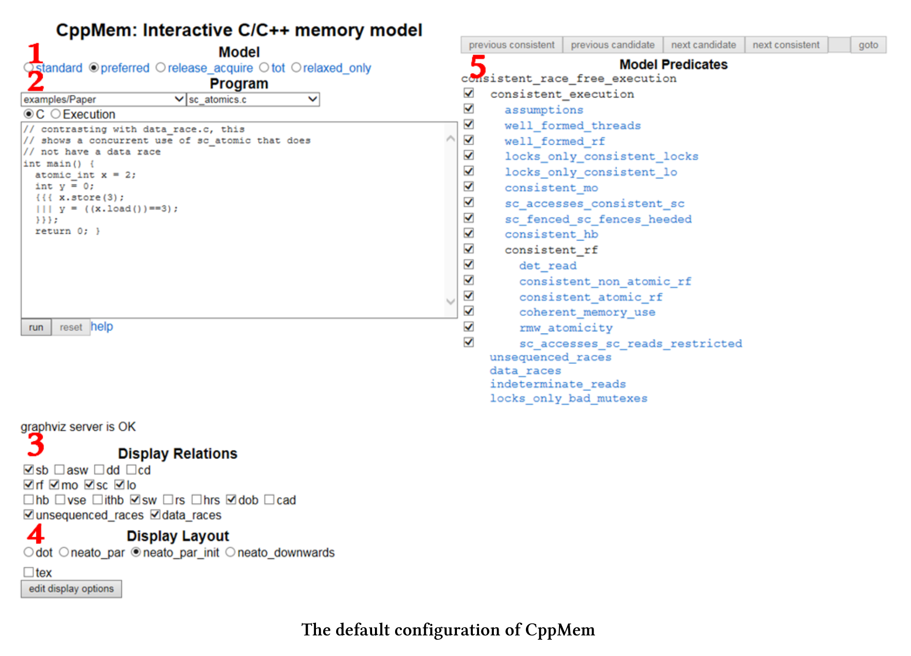
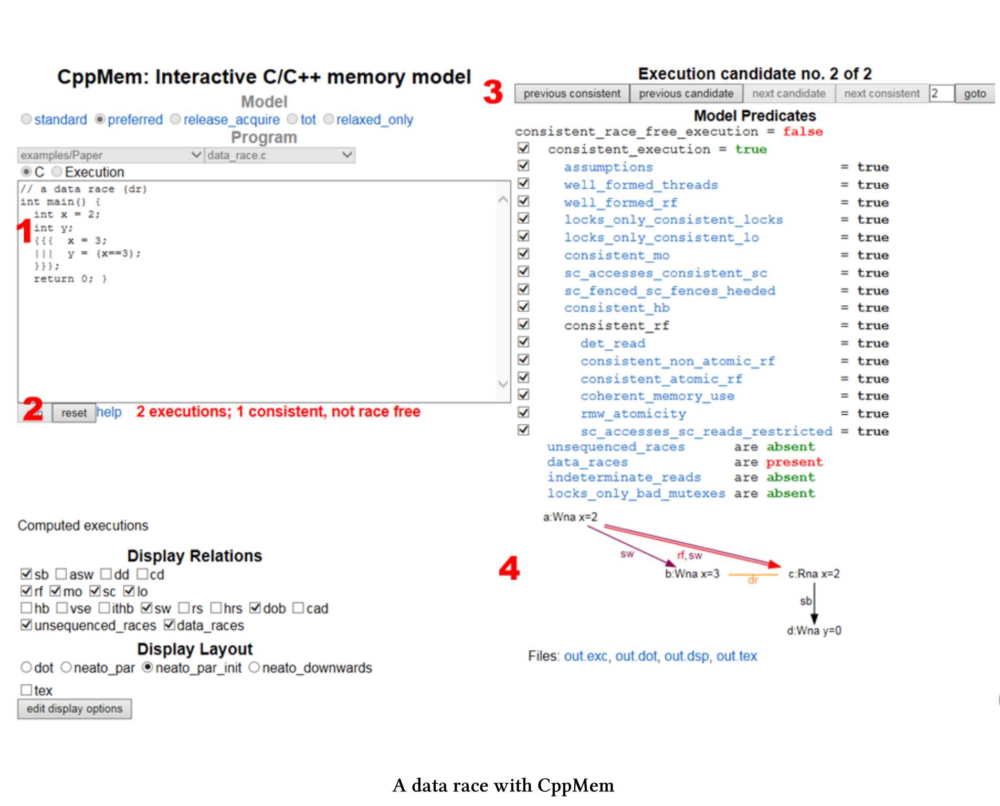

# CppMem-概述

[CppMem](http://svr-pes20-cppmem.cl.cam.ac.uk/cppmem/)是一个交互式工具，用于对C++小代码段的内存模型行为进行研究。它应该是每个认真处理内存模型程序员的必备工具。

CppMem的网上版本(也可以把它安装在你的个人电脑上)以两种方式提供服务:

1. CppMem验证小代码段的行为，基于选择的C++内存模型，该工具考虑所有可能的线程交错，将每个线程可视化到一个图中，并用附加的细节对这些图进行注释。
2. CppMem的精确分析，可以更加深入了解C++内存模型。简言之，CppMem是一个帮助理解内存模型的工具。

当然，必须跨过一些门槛，这通常是强大工具的共性。CppMem的本质是提供与这个极具挑战性的主题相关的非常详细的分析，并且是高度可配置的。因此，我才打算介绍该工具的各种组件。

## 简单概述

我对CppMem的简单概述是基于默认配置的。这篇概述只是提供了进一步的实验基础，应该有助于理解我正在进行的优化过程。



简单起见，我引用了屏幕截图中的红色数字。

### 1. Model模型

* 指定C++内存模型。首选是C++11内存模型的一个(简化)等价的变体。

### 2. Program 程序

* 包含可执行程序，其语法类似于简化的C++11。确切地说，不能直接将C或C++代码程序复制到CppMem中。
* 可以在许多典型多线程场景之间进行切换。要获得这些程序的详细信息，请阅读这篇写得非常好的文章，该文章将[C++并发性数学化](http://www.cl.cam.ac.uk/~pes20/cpp/popl085ap-sewell.pdf)。当然，也可以运行自己的代码。
* CppMem是关于多线程的，所以可以使用多线程的快捷方式。
  * 可以使用表达式`{ { {…|||…} } }`。三个点`(…)`表示每个线程的工作包。
  * 如果使用表达式`x.readvalue(1)`，则CppMem会计算线程交错的情况，其中线程会为`x`赋值1。

### 3. Display Relations 关系显示

*  描述原子操作、栅栏和锁上的读、写和读写改之间的关系。
* 可以使用复选框显式地启用带注释的图中的关系。
* 有三种关系，最有趣的是原始关系和派生关系之间的粗略区别。这里使用的是默认值。
  * 渊源关系:
    * sb: sequenced-before 序前
    * rf: read from 读取
    * mo: modification order 修改顺序
    * sc: sequentially consistent 按顺序一致
    * lo: lock order 锁定顺序
  * 派生关系:
    * sw: synchronises-with 与...同步
    * dob: dependency-ordered-before 序前依赖
    * unsequenced_races: 单线程中的竞争
    * data_races: 线程内的数据竞争

### 4. Display Layout 布局显示

* 可以选择使用哪个[Doxygraph](https://sourceforge.net/projects/doxygraph/)图形。

### 5. Model Predicates 模型谓词

* 使用此按钮，可以为所选模型设置谓词，这会导致不一致(非无数据争用)的执行，所以当执行不一致，就会看到不一致执行的原因。我在这本书里不使用这个按钮。

有关更多细节，请参阅[文档](http://svr-pes20-cppmem.cl.cam.ac.uk/cppmem/help.html)。

作为对CppMem的入门，这就足够了。现在，是时候尝试一下CppMem了。

CppMem提供了许多示例。

### 示例

这些示例展示了使用并发代码，特别是使用无锁代码时的典型用例。可以将这些例子，分成几类。

**论文**

示例/论文类别为您提供了一些示例，这些示例在本文中对[C++并发性的数学化](https://www.cl.cam.ac.uk/~pes20/cpp/popl085ap-sewell.pdf)进行了深入的讨论。

* data_race.c : x上的数据竞争
* partial_sb.c : 单线程中计算的序前
* unsequenced_race.c : 根据评价顺序，对x上未排序的竞争进行评价
* sc_atomics.c : 正确的使用原子变量
* thread_create_and_asw.c : 额外的同步——与适当的线程创建同步

让我们从第一个示例开始。

**测试运行**

从CppMem样本中选择data_race.c程序。run之后，立即显示有一个数据竞争。



简单起见，只解释示例中的红色数字。

1. 很容易观察到的数据竞争。一个线程写`x (x==3)`，另一个线程不同步读`x (x==3)`。
2. 由于C++内存模型，两个线程可能交织在一起运行，其中只有一个与所选模型一致。如果在表达式`x==3`中的`x`，在主函数中进行赋值`int x= 2`，则会出现这种情况。图中在用`rf`和`sw`标注的边缘显示了这种关系。
3. 不同的线程交错之间切换显得非常有趣。
4. 该图显示关系中启用的所有关系。
   * `a:Wna x=2`在图表中是第`a`中表述，它是非原子性的。`Wna`表示“非原子写入”。
   * 图中的关键是`x (b:Wna)`的写和`x (C:Rna)`的读之间的连线。这也就是`x`上的数据竞争。

**进一步分类**

进一步的分类会关注于无锁编程的方面。每个类别的示例都有不同的形式，每个表单使用不同的内存顺序。有关类别的更多讨论，请阅读前面提到的[将C++并发性数学化](https://www.cl.cam.ac.uk/~pes20/cpp/popl085ap-sewell.pdf)的文章。如果可能的话，我会用顺序一致性来表示程序。

**存储缓冲(示例/SB_store_buffering)**

两个线程分别写入不同的位置，然后从另一个位置读取。

SB+sc_sc+sc_sc+sc.c

```c++
// SB+sc_sc+sc_sc
// Store Buffering (or Dekker's), with all four accesses SC atomics
// Question: can the two reads both see 0 in the same execution?
int main() {
  atomic_int x=0; atomic_int y=0;
  {{{ { y.store(1,memory_order_seq_cst);
  	r1=x.load(memory_order_seq_cst); }
  ||| { x.store(1,memory_order_seq_cst);
  	r2=y.load(memory_order_seq_cst); } }}}
  return 0;
}
```

**消息传递(示例/MP_message_passing)**

一个线程写入数据(非原子变量)并设置一个原子标志，而另一个线程等待读取数据标志(非原子变量)。

MP+na_sc+sc_na.c

```c++
// MP+na_sc+sc_na
// Message Passing, of data held in non-atomic x,
// with sc atomic stores and loads on y giving release/acquire synchronisation
// Question: is the read of x required to see the new data value 1
// rather than the initial state value 0?
int main() {
	int x=0; atomic_int y=0;
  {{{ { x=1;
  	y.store(1,memory_order_seq_cst); }
  ||| { r1=y.load(memory_order_seq_cst).readsvalue(1);
  	r2=x; } }}}
  return 0;
}
```

**读取缓冲(例子/LB_load_buffering)**

两个读操作可以看到之后的其他线程的写操作吗?

Lb+sc_sc+sc_sc.c

```c++
// LB+sc_sc+sc_sc
// Load Buffering, with all four accesses sequentially consistent atomics
// Question: can the two reads both see 1 in the same execution?
int main() {
  atomic_int x=0; atomic_int y=0;
  {{{ { r1=x.load(memory_order_seq_cst);
  	y.store(1,memory_order_seq_cst); }
  ||| { r2=y.load(memory_order_seq_cst);
  	x.store(1,memory_order_seq_cst); } }}}
  return 0;
}
```

**从写到读的因果关系(例子/WRC)**

第三个线程是否看到第一个线程的写操作?

* 第一个线程写x。
* 第二个线程从中读取数据并写入到y。
* 第三个线程读取x。

WRC+rel+acq_rel+acq_rlx.c

```c++
// WRC
// the question is whether the final read is required to see 1
// With two release/acquire pairs, it is
int main() {
  atomic_int x = 0;
  atomic_int y = 0;
  {{{ x.store(1,mo_release);
  ||| { r1=x.load(mo_acquire).readsvalue(1);
  	y.store(1,mo_release); }
  ||| { r2=y.load(mo_acquire).readsvalue(1);
  	r3=x.load(mo_relaxed); }
  }}}
  return 0;
}
```

**独立读-独立写(示例\IRIW)**

两个线程写入不同的位置，第二个线程能以不同的顺序看到写操作吗?

IRIW+rel+rel+acq_acq+acq_acq.c

```c++
// IRIW with release/acquire
// the question is whether the reading threads have
// to see the writes to x and y in the same order.
// With release/acquire, they do not.
int main() {
  atomic_int x = 0; atomic_int y = 0;
  {{{ x.store(1, memory_order_release);
  ||| y.store(1, memory_order_release);
  ||| { r1=x.load(memory_order_acquire).readsvalue(1);
  	r2=y.load(memory_order_acquire).readsvalue(0); }
  ||| { r3=y.load(memory_order_acquire).readsvalue(1);
  	r4=x.load(memory_order_acquire).readsvalue(0); }
  }}};
  return 0;
}
```

