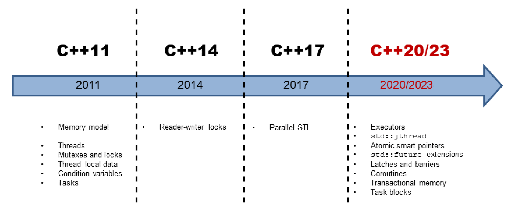
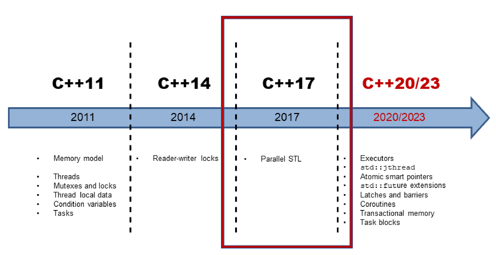
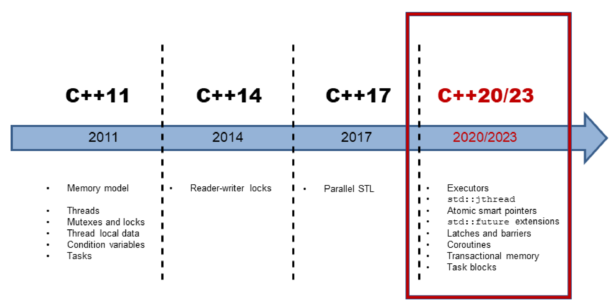
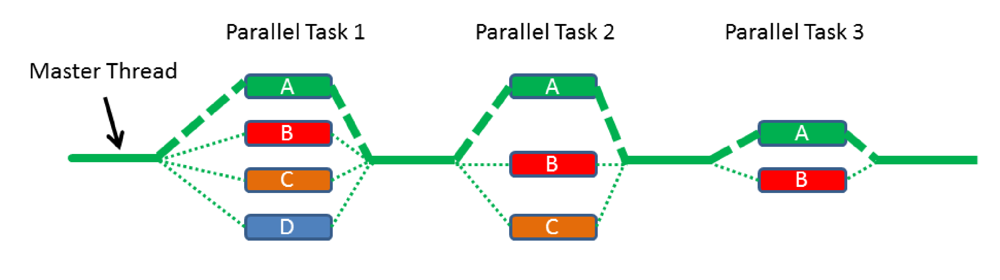

# C++并行历史概述

随着C++11的发布，C++标准添加了多线程和内存模型。这样，标准库有了基本的构建块，比如：原子变量、线程、锁和条件变量。C++11提供了比引用更抽象的构建块，这是未来C++标准(C++20/23)能建立更高抽象的基础。

粗略地说，可以将C++并发分为三个演化过程。

## C++11和C++14: 铺垫

C++11引入多线程，包括两个部分：良好的内存模型和标准化的线程接口。C++14为C++的多线程功能增加了读写锁。

### 内存模型

多线程的基础，是定义良好的内存模型。内存模型需要处理以下几个方面的内容:

* 原子操作: 不受中断地操作。
* 部分排序运算: 不能重排序的操作序列。
* 操作的可见效果: 保证其他线程可以看到对共享变量的操作。

C++内存模型的灵感来自于Java。然而，与Java的内存模型不同，C++允许打破顺序一致性的约束(原子操作的默认方式)。

顺序一致性提供了两个保证：

1. 程序指令按源码顺序执行。
2. 线程上的所有操作都遵循一个全局顺序。

内存模型基于原子数据类型(短原子)的原子操作。

### 原子类型

C++有一组基本的原子数据类型，分别是布尔值、字符、数字和指针的变体。可以使用类模板`std::atomic`来定义原子数据类型。原子类型可以建立同步和排序约束，也适用于非原子类型。

标准化线程接口是C++并发的核心。

### 多线程

C++中的多线程由线程、(共享数据的)同步语义、线程本地数据和任务组成。

### 线程

`std::thread`表示一个独立的程序执行单元。执行单元，表示可接受调用的单元。可调用单元可以是函数名、函数对象或Lambda函数。

新线程的可执行单元结束时，要么进行等待主线程完成(`t.join()`)，要么从主线程中分离出来(`t.detach()`)。如果没有对线程`t`执行`t.join()`或`t.detach()`操作，则线程`t`是可汇入的(joinable)。如果可汇入线程进行销毁时，会在其析构函数中调用`std::terminate`，则程序终止。

分离的线程在后台运行，通常称为**守护线程**。

`std::thread`是一个可变参数模板，它可以接收任意数量的参数。

#### 共享数据

如果多个线程同时使用共享变量，并且该变量是可变的(非const)，则需要协调对该变量的访问。同时读写共享变量是一种数据竞争，也是一种未定义的行为。在C++中，可以通过锁(或互斥锁)来协调对共享变量的访问。

#### 互斥锁

互斥锁(互斥量)保证在任何给定时间内，只有一个线程可以访问共享变量。互斥锁锁定/解锁共享变量所属的临界区(C++有5个不同的互斥对象)。即使互斥锁同时共享一个锁，也可以递归地、试探性地、有或没有时间限制地进行锁定。

#### 锁

应该将互斥锁封装在锁中，从而自动释放互斥锁。锁通过将互斥锁的生命周期绑定到自己的生命周期来实现RAII。C++中`std::lock_guard`/`std::scoped_lock`可用于简单场景，`std::unique_lock`/`std::shared_lock`用于高级场景，例如：显式锁定或解锁互斥锁。

### 线程本地数据

将变量声明为`thread-local`可以确保每个线程都有变量的副本。线程本地数据的生存周期，与线程的生存周期相同。

### 条件变量

条件变量允许通过消息机制对线程进行同步。一个线程为发送方，而另一个线程为接收方，其中接收方阻塞等待来自发送方的消息。条件变量的典型用例是"生产者-消费者"模式。条件变量可以是发送方，也可以是接收方。正确使用条件变量非常具有挑战性。所以，这样的任务通常有更简单的解决方案。

### 任务

任务与线程有很多共同之处。虽然显式地创建了一个线程，但任务只是工作的开始。C++运行时会自动处理任务的生存期，比如：`std::async`。

任务就像两个通信端点之间的数据通道。支持线程之间的安全通信，当一个端点将数据放入数据通道时，另一个端点将在未来某个时刻获取该值。数据可以是值、异常或通知。除了`std::async`, C++还有`std::promise`和`std::future`，这两个类模板可以对任务有更多的控制。

## C++17: 标准模板库算法的并行

C++17的并发性发生了巨大的变化，特别是标准模板库(STL)的并行算法。C++11和C++14只提供了并发性的基础构建块。这些工具适合库或框架开发人员，但不适合应用程序开发人员。C++11和C++14中的多线程，在C++ 17中的并发性面前，相当于汇编语言!

### 执行策略

C++17中，大多数STL算法都有并行实现，这样就可以使用执行策略来调用算法。该策略指定算法是串行执行(`std::execution::seq`)、并行执行(`std::execution::par`)，还是与向量化的并行执行(`std::execution::par_unseq`)。

### 新算法

除了在重载，并行了原始的69种算法，还添加了8种新算法。这些新算法非常适合并行归约、扫描或转换。

## 案例研究

介绍了内存模型和多线程接口的理论知识之后，会将这些知识应用到一些案例中。

### 求向量元素的加和

计算一个向量的加和有多种方法。可以串行执行，也可以通过数据共享并发执行，不同的实现方式，性能上有很大的差别。

### 单例：线程安全的初始化

单例对象的初始化是线程安全的，是共享变量线程安全初始化的经典案例。有许多实现方法可以做到这一点，不过在性能上有一定的差异。

### 使用CppMem进行优化

我会从一个小程序开始，然后不断地改进它，并用CppMem验证优化过程的每个步骤。 [CppMem](http://svr-pes20-cppmem.cl.cam.ac.uk/cppmem)是一个交互式工具，用于研究小代码段的C++内存模型行为。

## C++20/23: 并发的未来

对未来的标准预测非常难([Niels Bohr](https://en.wikipedia.org/wiki/Niels_Bohr))，这里描述了C++20/23的并发特性。

### Executors

Executor由一组如何运行可调用单元的规则组成。它们指定执行是否应该在线程、线程池，甚至单线程(无并发)上运行(可调用的)基础构建块上进行。提案[N4734](http://www.open-std.org/jtc1/sc22/wg21/docs/papers/2018/n4734.pdf)的扩展依赖于扩展的future，也依赖于STL的并行算法，以及C++20/23中新的并发特性，如：门闩和栅栏、协程、事务性内存和任务块(最终都会使用它们)。

#### std::jthread

`std::jthread`是`std::thread`的增强版。除了`std::thread`外，`std::jthread`还可以发出中断信号，并自动并入启动的线程。

#### 原子智能指针

智能指针[`std::shared_ptr`](http://en.cppreference.com/w/cpp/memory/shared_ptr)和[`std::weak_ptr`](http://en.cppreference.com/w/cpp/memory/weak_ptr)在并发程序中存在概念问题。它们的本质上是共享的，这就使得状态可变，所以容易出现数据竞争，从而导致未定义的行为。`std::shared_ptr`和`std::weak_ptr`保证引用计数器的递增或递减是一个原子操作。资源只被删除一次，但不能保证对资源访问的原子性。新的原子智能指针`std::atomic<std::shared_ptr<T>>`和`std::atomic<std::weak_ptr<T>>`解决了这个问题。两者都是`std::atomic`的偏特化版本。

#### 扩展版future

C++11引入了promise和future，其有很多优点，但也有一个缺点：不能组合成强大的工作流。在C++20/23中，future应该会消弭这个缺点。

#### 门闩和栅栏

C++14没有信号量，而信号量是用于限制访问资源的利器。因为C++20/23提出了门闩和屏障，就不用担心没有信号量可用的问题了。可以使用门闩和栅栏在异步点进行等待，直到计数器变为零。门闩和栅栏的区别在于，`std::latch`只能使用一次，而`std::barrier`和`std::flex_barrier`可以使用多次。与`std::barrier`不同，`std::flex_barrier`可以在每次迭代之后调整它的计数器。

#### 协程

协程是可以挂起，并保持执行函数的状态。协程通常在操作系统、事件循环、无限列表或管道中使用，用于实现需要协作才能完成的任务。

#### 事务内存

事务内存基于数据库理论中事务的基本思想。事务是一种操作，它提供了ACID数据库事务的前三个属性：原子性、一致性和隔离性。数据库特有的持久性不适用C++的事务内存。新标准有两种类型的事务内存：同步块和原子块。它们都按总顺序执行的，表现得好像有一个全局锁在保护它们。与同步块相比，原子块不能执行事务不安全的代码。

#### 任务块

任务块在C++中实现了fork-join范式。下图说明了任务块的关键思想：启动任务的fork阶段和同步任务的join阶段。

### 模式和最佳实践

模式是从实践中记录下来的最佳方式。[Christopher Alexander](https://en.wikipedia.org/wiki/Christopher_Alexander)说，“模式表达了特定环境、问题和解决方案之间的关系“。从更概念化的角度看待并发编程，会得到更多解决问题的方式。与更概念化的并发模式相比，本章提供了面对并发挑战的实用技巧。

#### 同步

数据竞争的必要前提是数据处于共享的、可变状态。同步模式可以归结为两个问题：处理共享和处理可变。

#### 并行架构

并发架构章节中介绍了三种模式。前两种模式是活动对象和监视器对象的同步，以及调度器方法的使用。第三种半同步/半异步模式关注体系结构，并在并发系统中解耦异步和同步(服务)的处理。

#### 最佳实践

并发编程比较复杂，因此通过最佳实践，可以更多的了解多线程和内存模型。

###数据结构

#### 挑战项目

编写并发程序本来就很复杂，使用C++11和C++14的特性也是如此。因此，我将详细描述具挑战性的问题。希望用一整章的篇幅来讨论并发编程的挑战，会让你更清楚其中的陷阱。这里有竞争条件、数据竞争和死锁等挑战项目。

#### 计时库

计时库是C++并发工具的重要组成部分。通常，可以让线程在特定的时间内处于休眠状态，或者一直休眠到特定的时间点。计时库包括：时间点、时间段和时钟。

#### CppMem

CppMem是一个交互式工具，用于深入了解内存模型。它提供了两项非常有价值的服务：可以验证无锁代码，可以分析无锁代码，并且能得到对代码的鲁棒性有更多的理解。本书会经常使用CppMem。由于CppMem的配置选项和见解非常具有挑战性，也会提供相应章节，以便对CppMem有一些基本的了解。

#### 术语表

术语表对最基本的术语作了简单的解释。