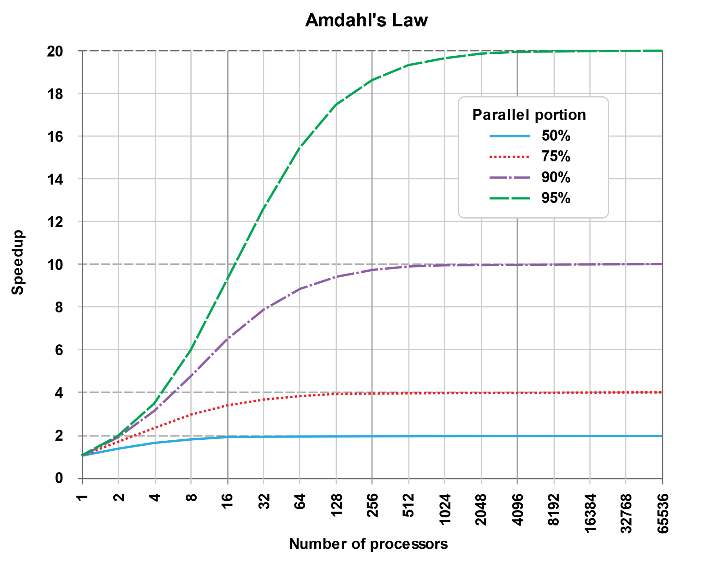
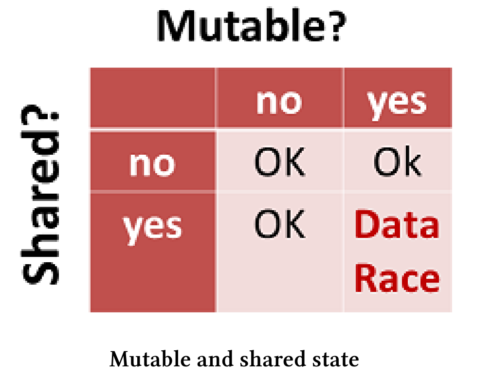
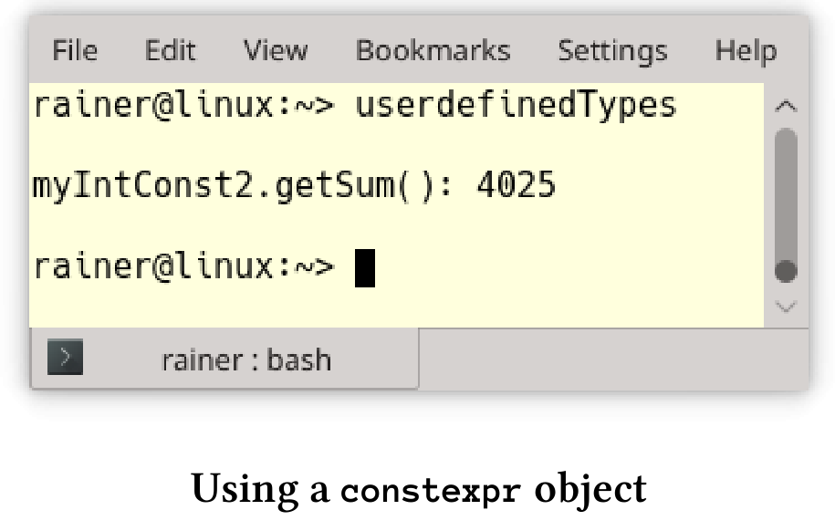
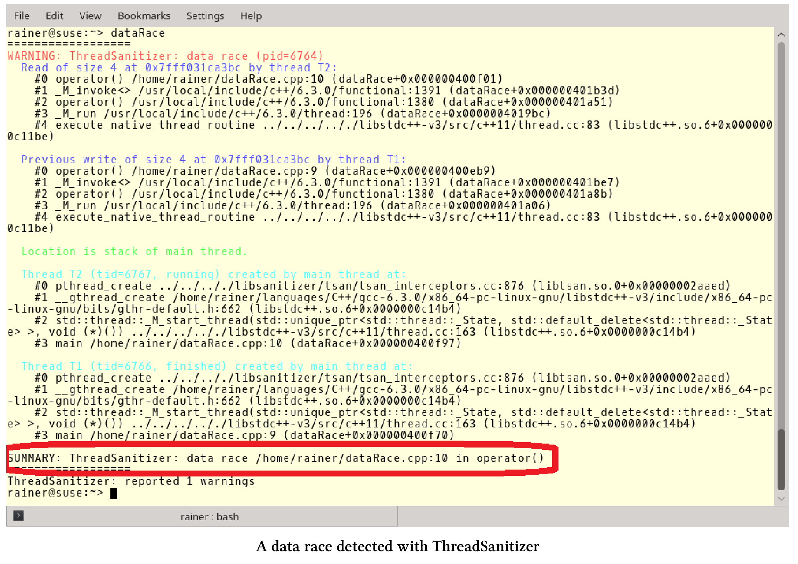

# 通常情况

我们先从一些原子操作和线程操作的最佳实践开始。

## 代码评审

代码评审应该是专业软件开发过程必备的一部分，尤其是处理并发。并发性本质上非常复杂，需要深思熟虑的分析和经验。

为了使评审更有效，请在评审之前将想要讨论的代码发送给评审人员，并声明代码中哪些地方是不可变的。正式评审开始之前，应该给予评审员足够的时间来分析代码。

不知道怎么做?举个例子。还记得`std::shared_lock`一章readerWriterLock.cpp中的数据竞争吗?

```c++
// readerWriterLock.cpp

#include <iostream>
#include <map>
#include <shared_mutex>
#include <string>
#include <thread>

std::map<std::string, int> teleBook{ {"Dijkstra", 1972}, {"Scott", 1976},
                                                          {"Ritchie", 1983} };

std::shared_timed_mutex teleBookMutex;

void addToTeleBook(const std::string& na, int tele) {
  std::lock_guard<std::shared_timed_mutex> writerLock(teleBookMutex);
  std::cout << "\nSTARTING UPDATE " << na;
  std::this_thread::sleep_for(std::chrono::milliseconds(500));
  teleBook[na] = tele;
  std::cout << " ... ENDING UPDATE " << na << std::endl;
}

void printNumber(const std::string& na) {
  std::shared_lock<std::shared_timed_mutex> readerLock(teleBookMutex);
  std::cout << na << ": " << teleBook[na];
}

int main() {

  std::cout << std::endl;

  std::thread reader1([] {printNumber("Scott"); });
  std::thread reader2([] {printNumber("Ritchie"); });
  std::thread w1([] {addToTeleBook("Scott",1968); });
  std::thread reader3([] {printNumber("Dijkstra"); });
  std::thread reader4([] {printNumber("Scott"); });
  std::thread w2([] {addToTeleBook("Bjarne", 1965); });
  std::thread reader5([] {printNumber("Scott"); });
  std::thread reader6([] {printNumber("Ritchie"); });
  std::thread reader7([] {printNumber("Scott"); });
  std::thread reader8([] {printNumber("Bjarne"); });

  reader1.join();
  reader2.join();
  reader3.join();
  reader4.join();
  reader5.join();
  reader6.join();
  reader7.join();
  reader8.join();
  w1.join();
  w2.join();

  std::cout << std::endl;

  std::cout << "\nThe new telephone book" << std::endl;
  for (auto teleIt : teleBook) {
    std::cout << teleIt.first << ": " << teleIt.second << std::endl;
  }

  std::cout << std::endl;

}
```

问题在于第24行`teleBook[na]`，这是一个可以修改的电话簿。可以通过将读取线程`reader8`放在其他读取线程之前，来触发数据竞争。在我的C++研讨会上，这个程序作为发现数据竞争的一种练习，大约10%的参与者在5分钟内能发现数据竞争。

## 尽量减少可变数据的共享

应该尽量减少可变数据的共享，原因有两个：性能和安全性。安全性主要是关于数据竞争，这里我们来详谈一下性能。

在计算向量和的章节中，我们做了详尽的性能研究。展示了将`std::vector`的值加起来要花费多少时间。

下面是单线程求和的关键部分。

```c++
...
  
constexpr long long size = 100000000;

std::cout << std::endl;

std::vector<int> randValues;
randValues.reserve(size);

// random values
std::random_device seed;std::mt19937 engine(seed());
std::uniform_int_distribution<> uniformDist(1, 10);

const unsigned long long sum = std::accumulate(randValues.begin(),                                   randValues.end(), 0);

...
```

然后，在四个线程上执行求和，并很天真地使用了一个共享的求和变量。

```c++
...
void sumUp(unsigned long long& sum, const std::vector<int>& val,
  				  unsigned long long beg, unsigned long long end){
  for (auto it = beg; it < end; ++it){
    std::lock_guard<std::mutex> myLock(myMutex);
    sum += val[it];
  }
}
...
```

后来，通过使用原子变量求和。

```c++
...
void sumUp(std::atomic<unsigned long long>& sum, const std::vector<int>& val,
						unsigned long long beg, unsigned long long end){
  for (auto it = beg; it < end; ++it){
  	sum.fetch_add(val[it]);
  }
}
...
```

最后，通过计算局部和，得到了性能的提升。

```c++
...
void sumUp(unsigned long long& sum, const std::vector<int>& val,
						unsigned long long beg, unsigned long long end){
  unsigned long long tmpSum{};
  for (auto i = beg; i < end; ++i){
  	tmpSum += val[i];
  }
  std::lock_guard<std::mutex> lockGuard(myMutex);
  sum += tmpSum;
}
...
```

性能数字令人印象深刻，并提供了明确的指示。求和变量共享的部分越少，从多线程中获得性能收益越高。

|  单线程  | std::lock_guard | 原子变量 | 本地求和 |
| :------: | :-------------: | :------: | :------: |
| 0.07 sec |    3.34 sec     | 1.34 sec | 0.03 sec |

## 减少等待

你可能听说过[阿姆达尔定律](https://en.wikipedia.org/wiki/Amdahl%27s_law)。它预测了使用多个处理器可以获得的理论上的最大加速比。定律很简单，如果p是可以并发运行的代码的比例，则可以获得最大的加速$\frac{1}{1-p}$。因此，如果90%的代码可以并发运行，就可以
得到(最多)10倍的加速$\frac{1}{1-p}==\frac{1}{1-0.9}==\frac{1}{0.1}==10$。

反过来看，如果使用锁导致10%的代码必须串行，那么最多可以获得10倍的加速。当然，这里假设可以访问的处理资源是无限制的。

该图清楚地显示了Amdahl定律的曲线。



By Daniels220 at English Wikipedia, CC BY-SA 3.0, https://commons.wikimedia.org/w/index.php?curid=6678551

核心的最佳数量在很大程度上取决于代码的并行部分。例如：如果有50%的并行代码，那么就可以用16个核芯可达到最高的性能，使用过多的内核会使程序运行速度变慢。如果您有95%的并行代码，那么使用2048个核芯可将性能达到峰值。

## 不可变数据

数据竞争是指，至少两个线程同时访问一个共享变量的情况，并且至少有一个线程尝试修改该变量。数据竞争的一个必要条件是可变的共享状态，下面的图表清楚地说明了我的观点。



如果没有不可变的数据，则不会发生数据竞争。只需确保不可变数据以线程安全的方式初始化即可。在线程安全初始化的章节中，介绍了四种方法来保证这一点，这里复述一下:

* 线程创建前进行初始化。
* 常数表达式。
* `std::call_once`与`std::once_flag`的组合。
*  具有块作用域的静态变量。

C++中创建不可变数据的两种方法：`const`和`constexpr`。`const`是一种运行时技术，而`constexpr`可保证该值在编译时初始化，因此是线程安全的。甚至自定义的类型，也可以在编译时初始化。

**自定义的类型**

对于用户定义的类型，在编译时创建实例，会有一些限制。

`constexpr`的构造函数的限制:

* 只能用常量表达式。
* 不能使用异常处理。
* 必须声明为默认或删除，否则函数体必须为空(C++11)。

自定义的`constexpr`类型的限制：

* 不能有虚拟基类。
*  要求每个基对象和每个非静态成员必须在构造函数的初始化列表中初始化，或者直接在类体中初始化。因此，使用的构造函数(例如基类的构造函数)必须是`constexpr`，而且必须使用常量表达式进行初始化。

[cppreference.com](https://en.cppreference.com/w/cpp/language/constexpr)为`constexpr`自定义类型提供了更多的信息。为了将实践添加到理论中，我定义了`MyInt`类，`MyInt`涉及到了刚刚提到的点，还有`constexpr`方法。

```c++
// userdefinedTypes.cpp

#include <iostream>
#include <ostream>

class MyInt {
public:
  constexpr MyInt() = default;
  constexpr MyInt(int fir, int sec) :myVal1(fir), myVal2(sec) {}
  MyInt(int i) {
    myVal1 = i - 2;
    myVal2 = i + 3;
  }

  constexpr int getSum() const { return myVal1 + myVal2; }

  friend std::ostream& operator<<(std::ostream& out, const MyInt& myInt) {
    out << "(" << myInt.myVal1 << "," << myInt.myVal2 << ")";
    return out;
  }

private:
  int myVal1 = 1998;
  int myVal2 = 2003;

};

int main() {

  std::cout << std::endl;

  constexpr MyInt myIntConst1;

  constexpr int sec = 2014;
  constexpr MyInt myIntConst2(2011, sec);
  std::cout << "myIntConst2.getSum(): " << myIntConst2.getSum() << std::endl;

  int arr[myIntConst2.getSum()];
  static_assert(myIntConst2.getSum() == 4025, "2011 + 2014 should be 4025");

  std::cout << std::endl;

}
```

`MyInt`类有两个`constexpr`构造函数。一个默认构造函数(第8行)和一个接受两个参数的构造函数(第9行)。另外，该类有两个方法，但是只有`getSum`方法是常量表达式。因为`constexpr`方法在C++11和C++14是不同的，不会自动进行`const`修饰，所以方法声明为`const`。如果在`constexpr`对象中使用变量`myVal1`和`myVal2`(第23行和第24行)，有两种方法可以定义它们。首先，可以在构造函数的初始化列表中初始化它们(第9行)；其次，可以在类体中初始化它们(第23行和第24行)。这里，构造函数的初始化列表中的初始化具有更高的优先级。

第38行和第39行中可以在一个常量表达式中调用`constexpr`方法。下面是程序的输出。



再次强调：`constexpr`对象只能使用`constexpr`方法初始化。

像Haskell这样没有可变数据的函数式编程语言，则非常适合并发编程。

## 使用纯函数

Haskell被称为纯函数语言，纯函数是在给定相同参数时，总是产生相同结果的函数。它没有副作用，因此不能改变程序的状态。

从并发性的角度来看，纯函数具有明显的优势。它们可以重新排序，也可以在另一个线程上自动运行。

C++中的函数默认不是纯函数。以下三个函数都是纯函数，但每个函数都有不同的特征。

```c++
int powFunc(int m, int n){
  if (n == 0) return 1;
  return m * powFunc(m, n-1);
}
```

`powFunc`是一个普通函数。

```c++
template<int m, int n>
struct PowMeta{
	static int const value = m * PowMeta<m, n-1>::value;
};

template<int m>
struct PowMeta<m, 0>{
  static int const value = 1;
};
```

`PowMeta`是一个元函数(meta-function)，因为它在编译时运行。

```c++
constexpr int powConst(int m, int n){
  int r = 1;
  for(int k = 1; k <= n; ++k) r *= m;
  return r;
}
```

`powCont`函数可以在运行时和编译时运行，它是一个常量函数。

## 寻找正确的抽象概念

多线程环境中，有多种方法可以初始化单例。可以使用标准库中的`lock_guard`或`std::call_once`，或使用依赖于核心语言的静态变量，亦或是使用依赖于原子变量的获取-释放语义。显然，使用获取-释放语义最具挑战性。使用者必须执行它，维护它，还要向同事解释它。与这些工作相比，Meyers单例在更容易实现，并且运行速度更快。

可以使用`std::reduce`，而不是实现一个并行循环进行求和。可以使用二元操作可调用和并行执行策略，对`std::reduce`进行参数化。

越是追求正确的抽象，工作就会越轻松。

## 使用静态代码分析工具

案例分析章节中，我介绍了CppMem。[CppMem](http://svr-pes20-cppmem.cl.cam.ac.uk/cppmem/)是一个交互式工具，用于对小代码段的C++内存模型，进行行为研究。CppMem可以提供两个方面的帮助：首先，可以验证代码的正确性；其次，可以更深入地了解内存模型，从而更全面地了解多线程问题。

## 使用动态执行工具

[ThreadSanitizer](https://github.com/google/sanitizers/wiki/ThreadSanitizerCppManual)是一个针对C/C++的数据竞争探测器。ThreadSanitizer已经作为Clang 3.2和GCC 4.8的一部分。要使用ThreadSanitizer，必须使用编译标志`-fsanitize=thread`来编译和链接你的程序。

下面的程序有一个数据竞争。

```c++
// dataRace.cpp

#include <thread>

int main() {

  int globalVar{};

  std::thread t1([&globalVar] { ++globalVar; });
  std::thread t2([&globalVar] { ++globalVar; });

  t1.join();
  t2.join();

}
```

`t1`和`t2`同时访问`globalVar`，两个线程都试图修改`globalVar`。让我们编译并运行该程序。

`g++ -std=c++11 dataRace.cpp -fsanitize=thread -pthread -g -o dataRace`

这个程序的输出相当冗长。



我用红色框突出了屏幕截图的关键段，这段表示在源码第10行有一个数据竞争。