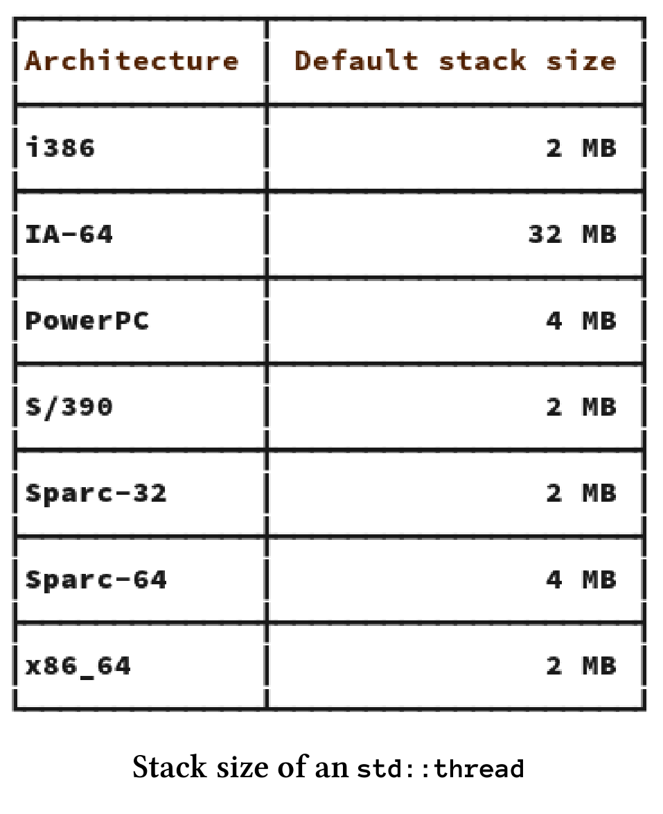
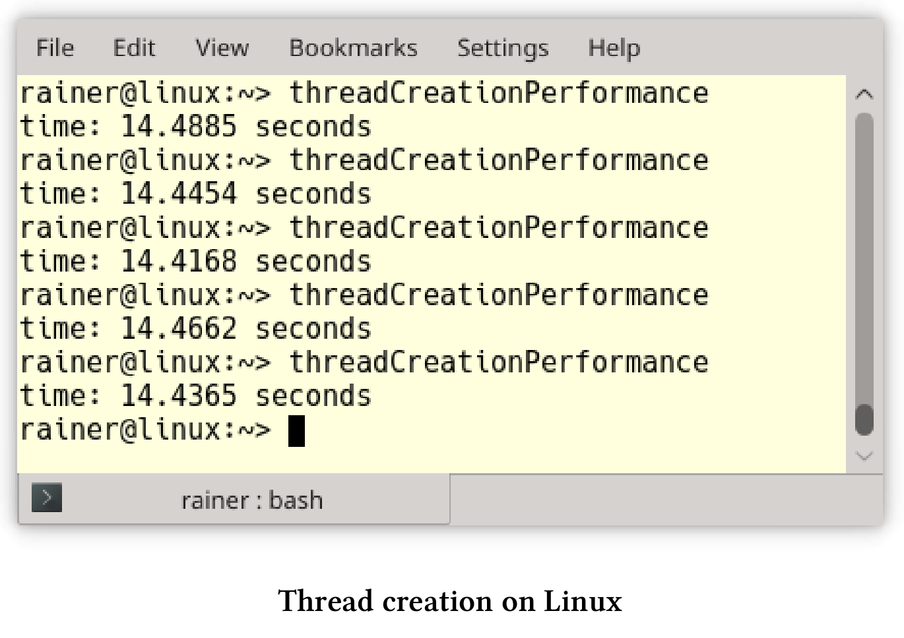
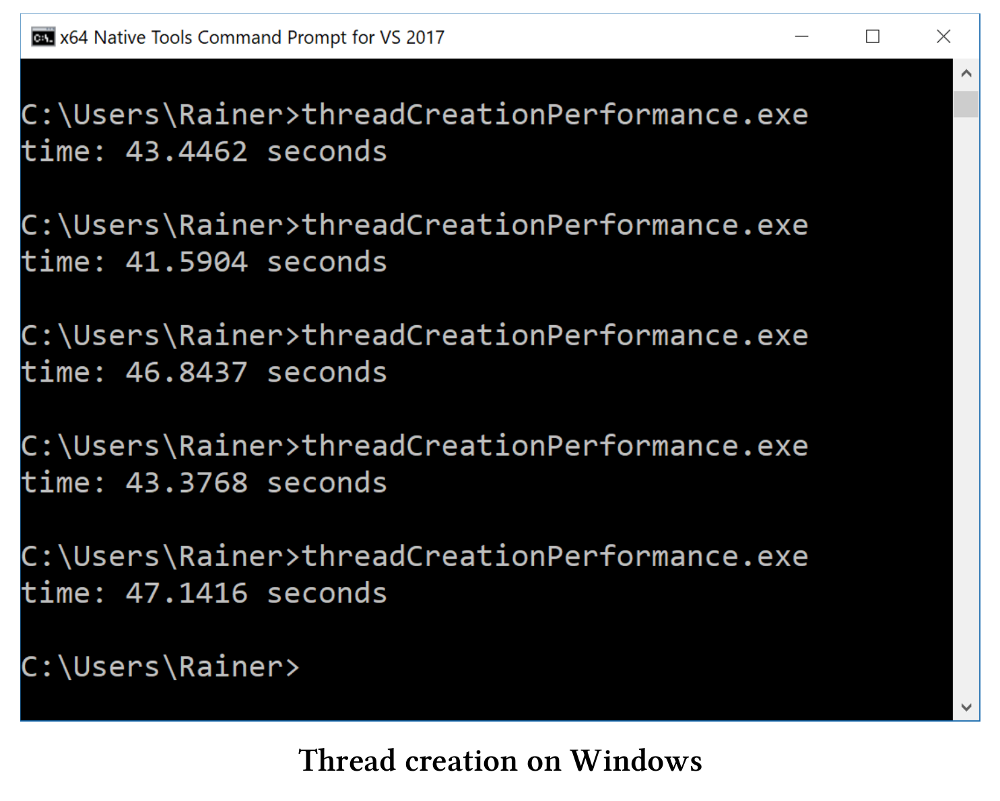
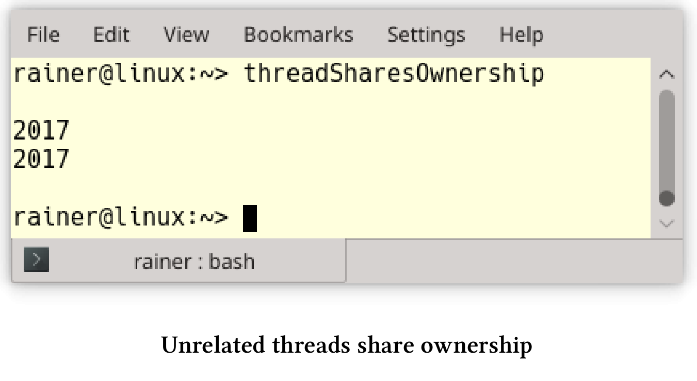
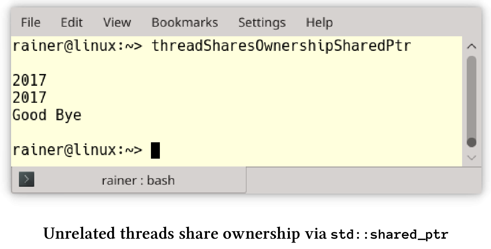
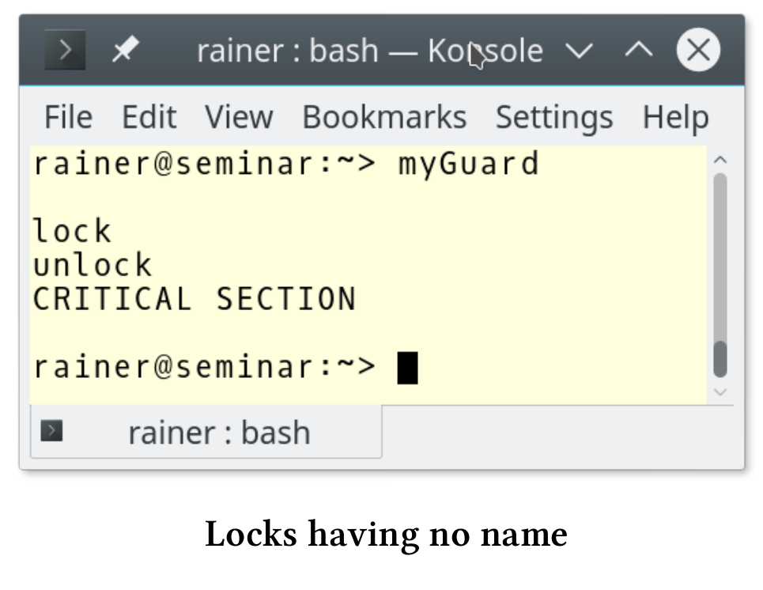

# 多线程

## 线程

线程是编写并发程序的基础件。

**减少线程的创建**

一个线程的开销有多大?非常巨大！这就是最佳实践背后的问题。让我们先看看线程的大小，而不是创建它的成本。

**线程大小**

`std::thread`是对本机操作系统线程的包装，这意味着需要对Windows线程和[POSIX thread](https://en.wikipedia.org/wiki/POSIX_Threads)的大小进行了解：

* Windows：[线程堆栈大小]( https://msdn.microsoft.com/en-us/library/windows/desktop/ms686774(v=vs.85).aspx)给了我答案：1MB。
* POSIX：pthread手册页为我提供了i386和x86_64架构的答案：2MB。下面有支持POSIX架构的线程堆栈大小：



**创建耗时**

我不知道创建一个线程需要多少时间，所以我在Linux和Windows上做了一个简单的性能测试。

我在台式机上使用GCC 6.2.1，在笔记本电脑上使用cl.exe(Visual Studio 2017)进行性能测试。我用最大优化来编译程序，这意味着在Linux上的优化标志为`O3`和Windows为`Ox`。

下面是我的程序。

```c++
// threadCreationPerformance.cpp

#include <chrono>
#include <iostream>
#include <thread>

static const long long numThreads = 1'000'000;

int main() {
  auto start = std::chrono::system_clock::now();

  for (volatile int i = 0; i < numThreads; ++i) std::thread([] {}).detach();

  std::chrono::duration<double> dur = std::chrono::system_clock::now() - start;
  std::cout << "time: " << dur.count() << " seconds" << std::endl;
}
```

该程序创建了100万个线程，这些线程执行第13行中的空Lambda函数。以下是在Linux和Windows测试的结果:

**Linux**



这意味着在Linux上创建一个线程大约需要14.5秒/ 1000000 = 14.5微秒。

**Windows**



在Windows上创建线程大约需要44秒/ 1000000 = 44微秒。

换句话说，在Linux上一秒钟可创建大约69000个线程，在Windows上一秒钟可创建23000个线程。

**使用任务而不是线程**

```c++
// asyncVersusThread.cpp

#include <future>
#include <thread>
#include <iostream>

int main() {

  std::cout << std::endl;

  int res;
  std::thread t([&] {res = 2000 + 11; });
  t.join();
  std::cout << "res: " << res << std::endl;

  auto fut = std::async([] {return 2000 + 11; });
  std::cout << "fut.get(): " << fut.get() << std::endl;

  std::cout << std::endl;

}
```

有很多原因让我们优先选择任务而不是线程：

* 可以使用一个安全的通信通道来返回结果。如果使用共享变量，则必须同步的对它进行访问。
* 调用者可以很容易的得到返回值、通知和异常。

通过扩展版future，我们可构建future，以及高度复杂的工作流。这些工作流基于`continuation then`，以及`when_any`和`when_all`的组合。

**如果要分离线程，一定要非常小心**

下面的代码片段需要我们关注一下。

```c++
std::string s{"C++11"}

std::thread t([&s]{ std::cout << s << std::endl; });
t.detach();
```

线程`t`与它的创建者的生命周期是分离的，所以两个竞态条件会导致未定义行为。

1. 线程可能比其创建者的生命周期还长，结果是`t`引用了一个不存在的`std::string`。 
2. 因为输出流`std::cout`的生存期与主线程的生存期绑定在一起，所以程序在线程`t`开始工作之前，输出流就可能关闭了。

**考虑使用自动汇入的线程**

如果`t.join()`和`t.detach()`都没有调用，则具有可调用单元的线程`t`被称为可汇入的，这时进行销毁的话，析构函数会抛出`std::terminate`异常。为了不忘记`t.join()`，可以对`std::thread`进行包装。这个包装器在构造函数中检查给定线程是否仍然可连接，并将给定线程在析构函数中进行汇入操作。

我们不必自己构建这个包装器，可以使用Anthony Williams的scoped_thread，或是[核心准则支持的库](https://github.com/Microsoft/GSL)的`gsl::joining_thread`。

## 数据共享

随着可变数据的数据共享，也就开启了多线程编程的挑战。

**通过复制传递数据**

```c++
std::string s{"C++11"}

std::thread t1([s]{ ... }); // do something with s
t1.join();

std::thread t2([&s]{ ... }); // do something with s
t2.join();

// do something with s
```

如果将`std::string s`之类的数据通过复制传递给线程`t1`，则创建者线程和创建的线程`t1`使用独立的数据。线程`t2`相反，通过引用获取`std::string s`，这意味着必须同步对创建者线程和已创建线程`t2`中的`s`的访问。这里非常容易出错。

**使用`std::shared_ptr`在非关联线程之间共享所有权**

试想，有一个在非关联的线程之间共享的对象存在。接下来的问题是，对象的所有者是谁？谁负责这个对象的内存管理？现在，可以在内存泄漏(如果不释放内存)和未定义行为(因为多次调用delete)之间进行选择。大多数情况下，未定义行为会使运行时崩溃。

下面的程序展示了这个看似无解的问题。

```c++
// threadSharesOwnership.cpp

#include <iostream>
#include <thread>

using namespace std::literals::chrono_literals;

struct MyInt {
  int val{ 2017 };
  ~MyInt() {
    std::cout << "Good Bye" << std::endl;
  }
};

void showNumber(MyInt* myInt) {
  std::cout << myInt->val << std::endl;
}

void threadCreator() {
  MyInt* tmpInt = new MyInt;

  std::thread t1(showNumber, tmpInt);
  std::thread t2(showNumber, tmpInt);

  t1.detach();
  t2.detach();
}

int main() {

  std::cout << std::endl;

  threadCreator();
  std::this_thread::sleep_for(1s);

  std::cout << std::endl;

}
```

这个例子很简单，主线程休眠1秒钟(第34行)，以确保它比子线程`t1`和`t2`的生命周期长。当然，这不是恰当的同步，但帮我阐明了观点。程序的关键是：谁负责删除第20行中的`tmpInt` ?线程`t1`(第22行)？还是线程`t2`(第23行)？或函数本身(主线程)？因为无法预测每个线程运行多长时间，所以这个程序应该会有内存泄漏。因此，第10行中的`MyInt`的析构函数永远不会被调用:



如果使用`std::shared_ptr`，则生命周期问题就很容易处理。



```c++
// threadSharesOwnershipSharedPtr.cpp

#include <iostream>
#include <memory>
#include <thread>

using namespace std::literals::chrono_literals;

struct MyInt {
  int val{ 2017 };
  ~MyInt() {
    std::cout << "Good Bye" << std::endl;
  }
};

void showNumber(std::shared_ptr<MyInt> myInt) {
  std::cout << myInt->val << std::endl;
}

void threadCreator() {
  auto sharedPtr = std::make_shared<MyInt>();

  std::thread t1(showNumber, sharedPtr);
  std::thread t2(showNumber, sharedPtr);

  t1.detach();
  t2.detach();
}

int main() {

  std::cout << std::endl;

  threadCreator();
  std::this_thread::sleep_for(1s);

  std::cout << std::endl;

}
```

对源代码进行两个小的必要的修改：首先，第21行中的指针变成了`std::shared_ptr`，然后，第16行中的函数`showNumber`接受了一个智能指针，而不是普通指针。

**尽量减少持有锁的时间**.

如果持有锁，那么只有单个线程可以进入临界区。

```c++
void setDataReadyBad(){
  std::lock_guard<std::mutex> lck(mutex_);
  mySharedWork = {1, 0, 3};
  dataReady = true;
  std::cout << "Data prepared" << std::endl;
  condVar.notify_one();
} // unlock the mutex

void setDataReadyGood(){
  mySharedWork = {1, 0, 3};
  {
  	std::lock_guard<std::mutex> lck(mutex_);
    dataReady = true;
  } // unlock the mutex
  std::cout << "Data prepared" << std::endl;
  condVar.notify_one();
}
```

函数`setDataReadyBad`和`setDataReadyGood`是条件变量的通知组件。可变的数据是必要的，以防止伪唤醒和未唤醒的发生。由于`dataReady`是一个非原子变量，因此必须使用锁`lck`对其进行同步。为了使锁的生命周期尽可能短，可以在函数`setDataReadyGood`中使用一个范围`({…}) `。

**将互斥量放入锁中**

不应该使用没有锁的互斥量。

```c++
std::mutex m;
m.lock();
// critical section
m.unlock();
```

临界区内可能会发生意外，或者忘记解锁。如果不解锁，则想要获取该互斥锁的另一个线程将被阻塞，最后程序将死锁。

由于锁可以自动处理底层的互斥量，因此死锁的风险大大降低了。根据RAII习惯用法，锁在构造函数中自动绑定互斥量，并在析构函数中释放互斥量。

```c++
{
  std::mutex m,
  std::lock_guard<std::mutex> lockGuard(m);
  // critical section
} // unlock the mutex
```

`({…})`范围确保锁的生命周期自动结束，所以底层的互斥量会被解锁。

**最多锁定一个互斥锁**

有时在某个时间点需要多个互斥锁，这种情况下，可能会引发死锁的竞态条件。因此，可能的话，应该尽量避免同时持有多个互斥锁。

**给锁起个名字**

如果使用没有名称的锁，比如`std::lock_guard`，那么将立即销毁。

```c++
{
  std::mutex m,
  std::lock_guard<std::mutex>{m};
  // critical section
}
```

这个看起来无害的代码片段中，`std::lock_guard`立即被销毁。因此，下面的临界区是不同步执行的。C++标准的锁遵循所有相同的模式，会在构造函数中锁定互斥锁，并在析构函数中解锁，这种模式称为RAII。

下面例子的行为令人惊讶:

```c++
// myGuard.cpp

#include <mutex>
#include <iostream>

template <typename T>
class MyGuard {
  T& myMutex;
public:
  MyGuard(T& m) :myMutex(m) {
    myMutex.lock();
    std::cout << "lock" << std::endl;
  }
  ~MyGuard() {
    myMutex.unlock();
    std::cout << "unlock" << std::endl;
  }
};

int main() {

  std::cout << std::endl;

  std::mutex m;
  MyGuard<std::mutex> {m};
  std::cout << "CRITICAL SECTION" << std::endl;

  std::cout << std::endl;

}
```

`MyGuard`在其构造函数和析构函数中调用`lock`和`unlock`。由于临时变量的原因，对构造函数和析构函数的调用发生在第25行。特别是，这意味着析构函数的调用发生在第25行，而不是第31行。因此，第26行中的临界段没有同步执行。

这个程序的截图显示了，解锁的发生在输出CRITICAL SECTION之前。



**使用std::lock或std::scoped_lock原子地锁定更多的互斥对象**

如果一个线程需要多个互斥对象，那么必须非常小心地将互斥对象以相同的顺序进行锁定。如果不这样，一个糟糕的线程交叉就可能导致死锁。

```c++
void deadLock(CriticalData& a, CriticalData& b){
  std::lock_guard<std::mutex> guard1(a.mut);
  // some time passes
  std::lock_guard<std::mutex> guard2(b.mut);
  // do something with a and b
}

...
  
std::thread t1([&]{deadLock(c1,c2);});
std::thread t2([&]{deadLock(c2,c1);});

...
  
```

线程`t1`和`t2`需要两个`CriticalData`，而`CriticalData`用自己的`mut`来控制同步访问。不幸的是，因为这两个调用参数`c1`和`c2`的顺序不同，所以产生了一个竞态，从而会导致死锁。当线程`t1`可以锁定第一个互斥对象`a.mut`，而没锁住第二个`b.mut `，这样线程`t2`锁住了第二个线程，而阻塞等待`a.mut`解锁，就会产生出一个死锁的状态。

现在有了`std::unique_lock`，可以对互斥锁进行延迟锁定。函数`std::lock`可以原子地对任意数量的互斥锁进行锁定。

```c++
void deadLock(CriticalData& a, CriticalData& b){
  unique_lock<mutex> guard1(a.mut,defer_lock);
  // some time passes
  unique_lock<mutex> guard2(b.mut,defer_lock);
  std::lock(guard1,guard2);
  // do something with a and b
}

...
  
std::thread t1([&]{deadLock(c1,c2);});
std::thread t2([&]{deadLock(c2,c1);});

...
  
```

C++17有一个新锁`std::scoped_lock`，它可以获得任意数量的互斥锁并自动锁定它们。这样，工作流变得更加简单了：

```c++
void deadLock(CriticalData& a, CriticalData& b){
  std::scoped_lock(a.mut, b.mut);
  // do something with a and b
}

...
  
std::thread t1([&]{deadLock(c1,c2);});
std::thread t2([&]{deadLock(c2,c1);});

...
```

**不要在持有锁时，调用未知代码**

在持有互斥锁的同时，调用`unknownFunction`会导致未定义行为。

```c++
std::mutex m;
{
  std::lock_guard<std::mutex> lockGuard(m);
  sharedVariable= unknownFunction();
}
```

我只能对`unknownFunction`进行推测数。如果`unknownFunction`：

* 试图锁定互斥量`m`，这就是未定义行为。大多数情况下，会出现死锁。
* 启动一个试图锁定互斥锁`m`的新线程，就会出现死锁。
* 锁定另一个互斥锁`m2`可能会陷入死锁，因为需要同时锁定了两个互斥锁`m`和`m2`。
* 不要直接或间接尝试锁住互斥锁，虽然一切可能都没什么问题。“可能”是因为你的同事，可以修改函数或函数是动态链接的，这样就会得到一个与已知版本不同的函数。对于可能发生的事情，所有一切都是可能的。
*   可能会出现性能问题，因为不知道`unknownFunction`函数需要多长时间。

要解决这些问题，请使用局部变量。

```c++
auto tempVar = unknownFunction();
std::mutex m,
{
  std::lock_guard<std::mutex> lockGuard(m);
  sharedVariable = tempVar;
}
```

这种方式解决了所有的问题。`tempVar`是一个局部变量，因此不会成为数据竞争的受害者，所以可以在没有同步机制的情况下调用`unknownFunction`。此外，将`tempVar`的值赋给`sharedVariable`，可以将持有锁的时间降到最低。

## 条件变量

通过通知同步线程是一个简单的概念，但是条件变量使这个任务变得非常具有挑战性。主要原因是条件变量没有状态：

* 如果条件变量得到了通知，则可能是错误的(伪唤醒)。
* 如果条件变量在准备就绪之前得到通知，则通知丢失(未唤醒)。

**不要使用没有谓词的条件变量**

使用没有谓词的条件变量，通常是竞争条件之一。

```c++
// conditionVariableLostWakeup.cpp

#include <condition_variable>
#include <mutex>
#include <thread>

std::mutex mutex_;
std::condition_variable condVar;

void waitingForWork() {
  std::unique_lock<std::mutex> lck(mutex_);
  condVar.wait(lck);
  // do the work
}

void setDataReady() {
  condVar.notify_one();
}

int main() {

  std::thread t1(setDataReady);
  std::thread t2(waitingForWork);

  t1.join();
  t2.join();

}
```

如果线程`t1`在线程`t2`之前运行，就会出现死锁。`t1`在`t2`接收之前发送通知，通知就会丢失。这种情况经常发生，因为线程`t1`在线程`t2`之前启动，而线程`t1`需要执行的工作更少。

在工作流中添加一个布尔变量`dataReady`可以解决这个问题。`dataReady`还可以防止伪唤醒，因为等待的线程会检查通知是否来自于正确的线程。

```c++
// conditionVarialbleLostWakeupSolved.cpp

#include <condition_variable>
#include <mutex>
#include <thread>

std::mutex mutex_;
std::condition_variable condVar;

bool dataReady{ false };

void waitingForWork() {
  std::unique_lock<std::mutex> lck(mutex_);
  condVar.wait(lck, [] { return dataReady; });
  // do the work
}

void setDataReady() {
  {
    std::lock_guard<std::mutex> lck(mutex_);
    dataReady = true;
  }
  condVar.notify_one();
}

int main() {

  std::thread t1(setDataReady);
  std::thread t2(waitingForWork);

  t1.join();
  t2.join();

}
```

**使用Promise和Future代替条件变量**

对于一次性通知，promise和future则是更好的选择。conditioVarialbleLostWakeupSolved.cpp的工作流程，可以使用promise和future直接实现。

```c++
// notificationWithPromiseAndFuture.cpp

#include <future>
#include <utility>

void waitingForWork(std::future<void>&& fut) {
  fut.wait();
  // do the work
}

void setDataReady(std::promise<void>&& prom) {
  prom.set_value();
}

int main() {

  std::promise<void> sendReady;
  auto fut = sendReady.get_future();

  std::thread t1(waitingForWork, std::move(fut));
  std::thread t2(setDataReady, std::move(sendReady));

  t1.join();
  t2.join();

}
```

工作流程被简化到极致。promise`prom.set_value()`会发送future`fut.wait()`正在等待的通知。因为没有临界区，程序不需要互斥量和锁。因为不可能发生丢失唤醒或虚假唤醒，所以有没有谓词也没有关系。

如果工作流要求多次使用条件变量，那么promise和future就是不二之选。

## Promise和Future

promise和future常被用作线程或条件变量的替代物。

**尽可能使用std::async**

如果可能，应该使用`std::async`来执行异步任务。

```c++
auto fut = std::async([]{ return 2000 + 11; });
// some time passes
std::cout << "fut.get(): " << fut.get() << std::endl;
```

通过调用`auto fut = std::async([]{ return 2000 + 11; })`，相当于对C++运行时说：“运行这个”。调用者不关心它是否立即执行，以及是运行在同一个线程上，还有是运行在线程池上，或是运行在[GPU](https://en.wikipedia.org/wiki/Graphics_processing_unit)上。调用者只对future的结果感兴趣：`fut.get()`。

从概念上看，线程只是运行作业的实现细节。对于线程而言，使用者应该只指定做什么，而不应该指定如何做。