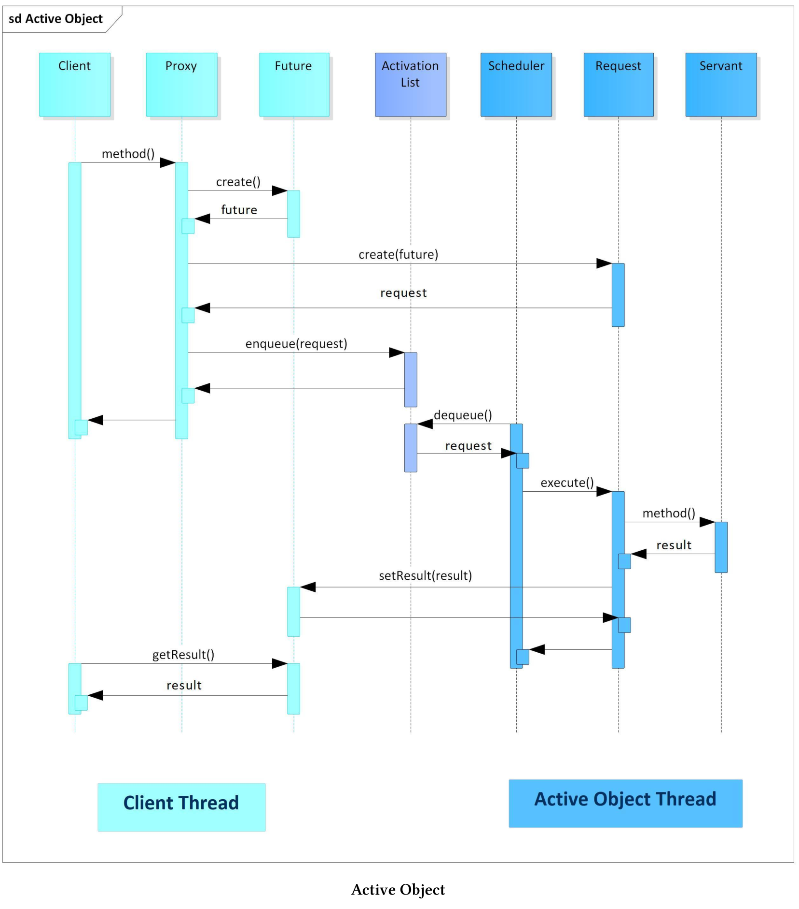
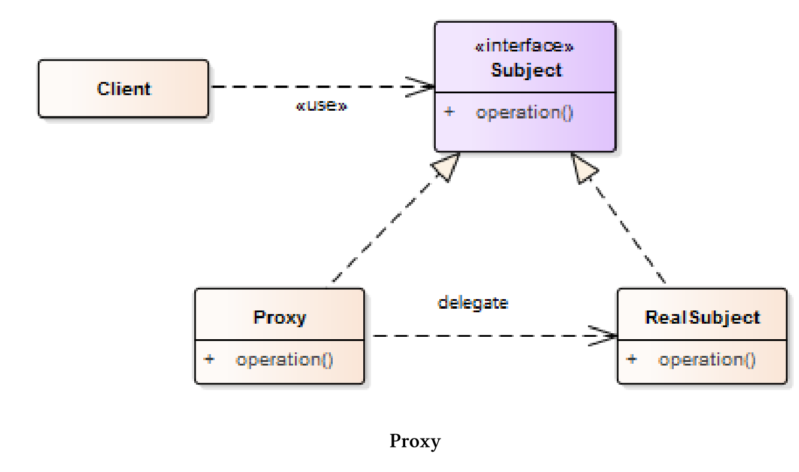
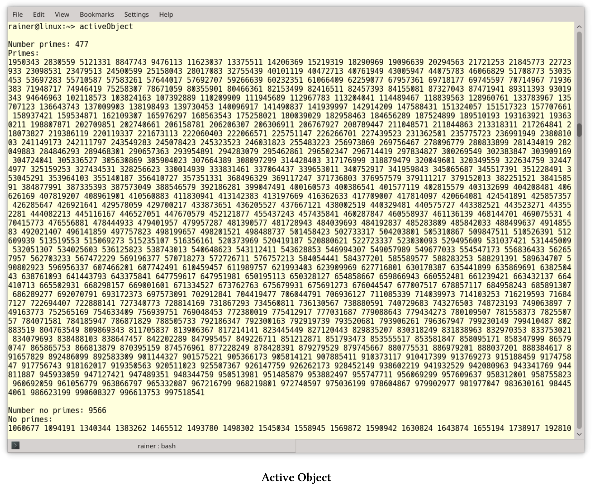

# 活动对象

活动对象模式将执行与对象的成员函数解耦，每个对象会留在在自己的控制线程中。其目标是通过使用异步方法，处理调度器的请求，从而触发并发。维基百科：[Active object]( https://en.wikipedia.org/wiki/Active_object)。所以，这种模式也称为并发对象模式。

客户端的调用会转到代理，代理表现为活动对象的接口。服务提供活动对象的实现，并在单独的线程中运行。代理在运行时将客户端的调用转换为对服务的调用，调度程序将方法加入到激活列表中。调度器与服务在相同的线程中活动，并将方法调用从激活列表中取出，再将它们分派到相应的服务上。最后，客户端可以通过future从代理处获取最终的结果。

## 组件

活动对象模式由六个组件组成:

1.  代理为活动对象的可访问方法提供接口。代理将触发激活列表的方法，并请求对象的构造。并且，代理和客户端运行在相同的线程中。
2. 方法请求类定义了执行活动对象的接口。
3. 激活列表的目标是维护挂起的请求，激活列表将客户端线程与活动对象线程解耦。代理对入队请求的进行处理，而调度器将请求移出队列。
4. 调度器与代理可在不同的线程中运行。调度器会在活动对象的线程中运行，并决定接下来执行激活列表中的哪个请求。
5. 可以通过服务实现活动对象，并在活动对象的线程中运行，服务也支持代理接口。
6. future是由代理创造的，客户端可以从future上获取活动对象调用的结果。客户端可以安静等待结果，也可以对结果进行轮询。

下面的图片显示了消息的顺序。



> **代理**
>
> 代理设计模式是[《设计模式:可重用的面向对象软件的元素》](https://en.wikipedia.org/wiki/Design_Patterns)中的经典模式，代理是其他对象的代表。典型的代理可以是远程代理[CORBA](https://en.wikipedia.org/wiki/Common_Object_Request_Broker_Architecture)、安全代理、虚拟代理或智能指针，如`std::shared_ptr`。每个代理会为它所代表的对象添加额外的功能。远程代理代表远程对象，并使客户端产生本地对象的错觉。安全代理通过对数据进行加密和解密，将不安全的连接转换为安全的连接。虚拟代理以惰性的方式封装对象的创建，智能指针将接管底层内存的生存期。
>
> 
>
> *  代理具有与RealSubject相同的接口，用于管理引用，还有subject的生命周期。
> * 与Subject具有相同的接口，如代理和RealSubject。
> * RealSubject用于提供具体的功能。
>
> 关于代理模式的更多细节，可以参考[Wikipedia](https://en.wikipedia.org/wiki/Proxy_pattern)页面。

## 优点和缺点

介绍Active Object模式的最小实现前，先了解一下它的优点和缺点。

* 优点:
  * 同步只需要在活动对象的线程上进行，不需要在客户端的线程上进行。
  * 客户端(用户)和服务器(实现者)之间的解耦，同步的挑战则在实现者的一边。
  * 由于客户端为异步请求，所以系统的吞吐量提高了，从而调用处理密集型方法不会阻塞整个系统。
  * 调度器可以实现各种策略来执行挂起请求，因此可以按不同的顺序执行入队请求。
* 缺点:
  * 如果请求的粒度太细，则活动对象模式(如代理、激活列表和调度器)的性能开销可能过大。
  * 由于调度器的调度策略和操作系统的调度互相影响，调试活动对象模式通常非常困难，尤其是以不同顺序执行请求的情况下。

## 具体实现

下面的示例展示了活动对象模式的简单实现。我没有定义一个请求，这应该由代理和服务实现。而且，当请求调度程序执行下一个请求时，服务应该只执行这个请求。

所涉及的类型为`future<vector<future<pair<bool, int>>>>`，这个类型的标识有点长。为了提高可读性，我使用了声明(第16 - 37行)。

```c++
// activeObject.cpp

#include <algorithm>
#include <deque>
#include <functional>
#include <future>
#include <iostream>
#include <memory>
#include <mutex>
#include <numeric>
#include <random>
#include <thread>
#include <utility>
#include <vector>

using std::async;
using std::boolalpha;
using std::cout;
using std::deque;
using std::distance;
using std::endl;
using std::for_each;
using std::find_if;
using std::future;
using std::lock_guard;
using std::make_move_iterator;
using std::make_pair;
using std::move;
using std::mt19937;
using std::mutex;
using std::packaged_task;
using std::pair;
using std::random_device;
using std::sort;
using std::thread;
using std::uniform_int_distribution;
using std::vector;

class IsPrime {
public:
  pair<bool, int> operator()(int i) {
    for (int j = 2; j * j <= i; ++j) {
      if (i % j == 0)return std::make_pair(false, i);
    }
    return std::make_pair(true, i);
  }
};

class ActivaeObject {
public:

  future<pair<bool, int>> enqueueTask(int i) {
    IsPrime isPrime;
    packaged_task<pair<bool, int>(int)> newJob(isPrime);
    auto isPrimeFuture = newJob.get_future();
    auto pair = make_pair(move(newJob), i);
    {
      lock_guard<mutex> lockGuard(activationListMutex);
      activationList.push_back(move(pair));
    }
    return isPrimeFuture;
  }

  void run() {
    thread servant([this] {
      while (!isEmpty()) {
        auto myTask = dequeueTask();
        myTask.first(myTask.second);
      }
      });
    servant.join();
  }

private:

  pair<packaged_task<pair<bool, int>(int)>, int> dequeueTask() {
    lock_guard<mutex> lockGuard(activationListMutex);
    auto myTask = std::move(activationList.front());
    activationList.pop_front();
    return myTask;
  }

  bool isEmpty() {
    lock_guard<mutex> lockGuard(activationListMutex);
    auto empty = activationList.empty();
    return empty;
  }

  deque<pair<packaged_task<pair<bool, int>(int)>, int >> activationList;
  mutex activationListMutex;
};

vector<int> getRandNumber(int number) {
  random_device seed;
  mt19937 engine(seed());
  uniform_int_distribution<> dist(1000000, 1000000000);
  vector<int> numbers;
  for (long long i = 0; i < number; ++i) numbers.push_back(dist(engine));
  return numbers;
}

future<vector<future<pair<bool, int>>>> getFutures(ActivaeObject& activeObject,
  int numberPrimes) {
  return async([&activeObject, numberPrimes] {
    vector<future<pair<bool, int>>> futures;
    auto randNumbers = getRandNumber(numberPrimes);
    for (auto numb : randNumbers) {
      futures.push_back(activeObject.enqueueTask(numb));
    }
    return futures;
    });
}


int main() {

  cout << boolalpha << endl;

  ActivaeObject activeObject;

  // a few clients enqueue work concurrently
  auto client1 = getFutures(activeObject, 1998);
  auto client2 = getFutures(activeObject, 2003);
  auto client3 = getFutures(activeObject, 2011);
  auto client4 = getFutures(activeObject, 2014);
  auto client5 = getFutures(activeObject, 2017);

  // give me the futures
  auto futures = client1.get();
  auto futures2 = client2.get();
  auto futures3 = client3.get();
  auto futures4 = client4.get();
  auto futures5 = client5.get();

  // put all futures together
  futures.insert(futures.end(), make_move_iterator(futures2.begin()),
    make_move_iterator(futures2.end()));

  futures.insert(futures.end(), make_move_iterator(futures3.begin()),
    make_move_iterator(futures3.end()));

  futures.insert(futures.end(), make_move_iterator(futures4.begin()),
    make_move_iterator(futures4.end()));

  futures.insert(futures.end(), make_move_iterator(futures5.begin()),
    make_move_iterator(futures5.end()));

  // run the promises
  activeObject.run();

  // get the results from the futures
  vector<pair<bool, int>> futResults;
  futResults.reserve(futResults.size());
  for (auto& fut : futures)futResults.push_back(fut.get());

  sort(futResults.begin(), futResults.end());

  // separate the primes from the non-primes
  auto prIt = find_if(futResults.begin(), futResults.end(),
    [](pair<bool, int>pa) {return pa.first == true; });

  cout << "Number primes: " << distance(prIt, futResults.end()) << endl;
  cout << "Primes: " << endl;
  for_each(prIt, futResults.end(), [](auto p) {cout << p.second << " "; });

  cout << "\n\n";

  cout << "Number no primes: " << distance(futResults.begin(), prIt) << endl;
  cout << "No primes: " << endl;
  for_each(futResults.begin(), prIt, [](auto p) {cout << p.second << " "; });

  cout << endl;

}
```

示例的基本思想是，客户端可以在激活列表上并发地安排作业。线程的工作是确定哪些数是质数。激活列表是活动对象的一部分，而活动对象在一个单独的线程上进行入队操作，并且客户端可以在激活列表中查询作业的结果。

程序的详情：5个客户端通过`getFutures`将工作(第121 - 126行)入队到`activeObject`。`numberPrimes`中的数字是1000000到1000000000之间(第96行)的随机数，将这些数值放入`vector<future<pair<bool, int>> `中。`future<pair<bool, int>`持有一个`bool`和`int`对，其中`bool`表示`int`值是否是质数。再看看第108行：`future .push_back(activeObject.enqueueTask(numb))`。此调用将触发新作业进入激活列表的队列，所有对激活列表的调用都必须受到保护，这里激活列表是一个promise队列(第89行)：`deque<pair<packaged_task<pair<bool, int>(int)>, int >> `。

每个promise在调用执行函数对象`IsPrime`(第39 - 47行)时，会返回一个`bool`和`int`对。现在，工作包已经准备好了，开始计算吧。所有客户端在第129 - 133行中返回关联future的句柄，并把所有的future放在一起(第136 - 146行)，这样会使工作更加容易。第149行中的调用`activeObject.run()`启动执行。`run`(第64 - 72行)启动单独的线程，并执行promises(第68行)，直到执行完所有作业(第66行)。`isEmpty`(第83 - 87行)确定队列是否为空，`dequeTask`会返回一个新任务。通过在每个`future`上调用`futResults.push_back(fut.get())`(第154行)，所有结果都会推送到`futResults`上。第156行对成对的向量进行排序:`vector<pair<bool, int>>`。其余代码则是给出了计算结果，第159行中的迭代器`prIt`将第一个迭代器指向一个素数对。

程序打印素数数量为`distance(prIt, futResults.end())`(第162行)，并(第164行)逐一显示。



## 拓展阅读

* [Pattern-Oriented Software Architecture: Patterns for Concurrent and Networked Objects](https://www.dre.vanderbilt.edu/~schmidt/POSA/POSA2/)
* [Prefer Using Active Object instead of Naked Thread (Herb Sutter)]( http://www.drdobbs.com/parallel/prefer-using-active-objects-instead-of-n/225700095)
* [Active Object implementation in C++11]( https://github.com/lightful/syscpp/)

