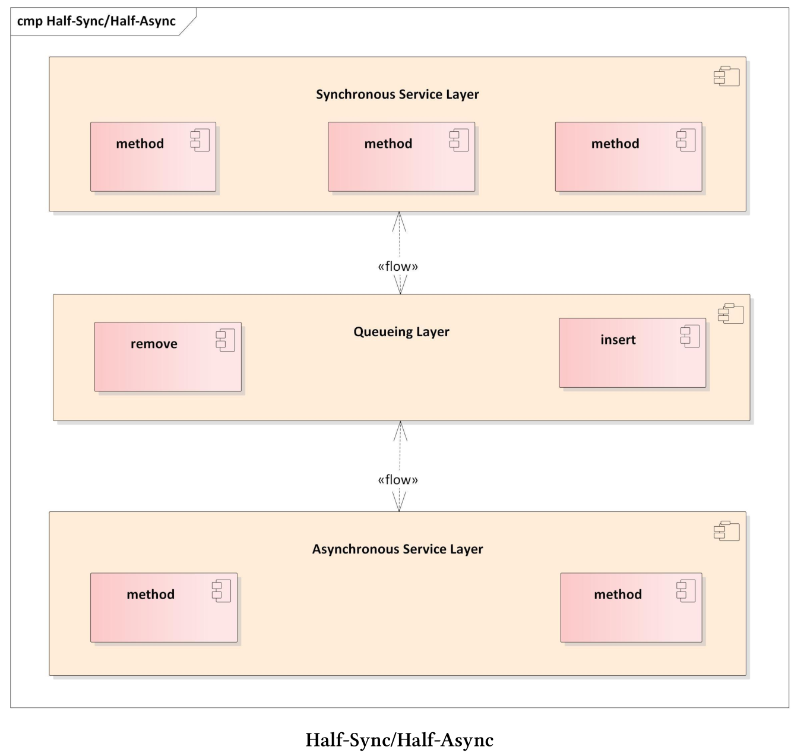
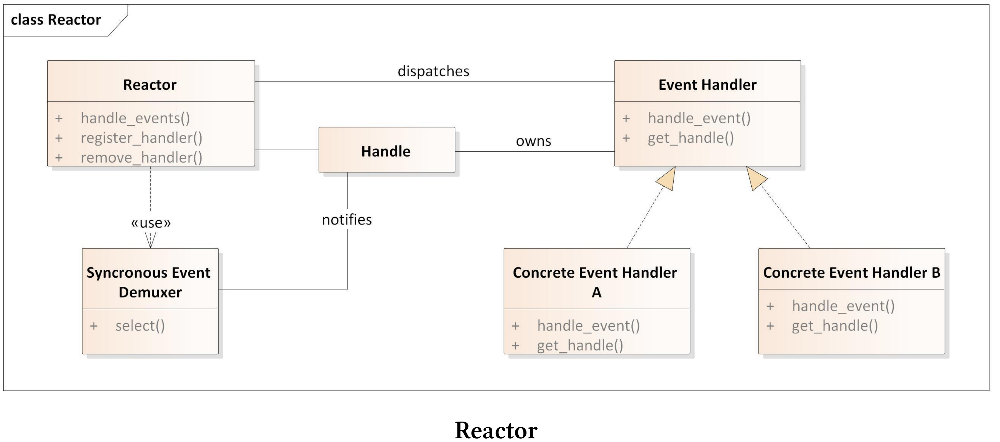
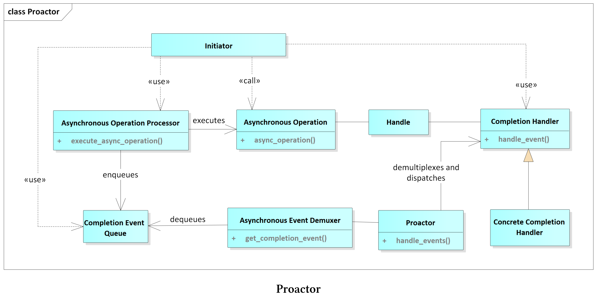

# 半同步/半异步

半同步/半异步模式会对并发系统中异步和同步服务进行解耦，从而在不过度降低性能的情况下简化编程。该模式引入了两个可以相互通信的层，一个用于异步，另一个用于同步。



半同步/半异步模式通常用于服务器的事件循环或图形界面。事件循环的工作流是将事件请求插入队，并在单独的线程中同步处理。异步处理确保了运行效率，而同步处理简化了申请流程。异步服务层和同步服务层分解为两个层，并且在这两个层之间有队列坐标。异步层由较底层的系统服务(如中断)组成，而同步层由较高层的服务(如数据库查询或文件操作)组成。异步层和同步层可以通过队列层相互通信。

## 优点和缺点

半同步/半异步模式的优点和缺点是什么?

* 优点:
  * 异步和同步分界线很明确。底层系统服务在异步层中处理，高层服务在同步层中处理。
  *  对请求队列处理的层，保证了异步层和同步层的解耦。
  * 清晰的分离使软件更容易理解、调试、维护和扩展。
  * 同步服务中的阻塞不会影响异步服务。
* 缺点:
  * 异步层和同步层之间交叉的部分可能会导致开销。通常，因为异步服务通常在内核空间中运行，同步服务在用户空间中运行，所以“边界的部分”会涉及内核空间和用户空间之间的上下文切换。
  * 为了严格分离各层，要求复制数据或数据是不可变的

半同步/半异步模式通常用于事件的多路分解和调度框架，如Reactor或Proactor模式。

## Reactor模式

Reactor模式也称为调度程序或通知程序。该模式是一个事件驱动的框架，用于将多个服务请求并发地分发到各个服务端。

**使用要求**

服务器应该并发地处理客户端的请求。每个客户端的请求都有一个唯一标识符，并支持映射到特定的服务端。以下几点是Reactor必备的：

* 不阻塞。
* 支持最大吞吐量，避免不必要的上下文切换，避免数据的复制或同步。
* 易于扩展，以支持服务的修改。
* 不使用复杂的同步机制。

**解决方案**

对于支持的服务类型，实现一个事件处理程序来满足特定客户端的请求。反应器中使用注册的方式，将服务端的事件处理程序进行注册，这里使用了事件解复用器来同步等待所有传入的事件。当一个事件到达时，反应器得到通知，并将相应的事件分派给特定的服务。

**组件**



* 句柄:
  * 句柄标识了事件源，如网络连接、打开文件或GUI事件。
  * 事件源生成连接、读或写等事件，这些事件会在句柄上进行排队。
*  同步事件多路分解器:
  * 同步事件多路分解器会等待一个或多个事件。多路分解器会进行阻塞，直到关联的句柄能够处理该事件为止。
* 事件处理接口:
  * 事件处理程序定义了处理特定事件的接口。
  * 事件处理程序定义了应用程序支持的服务。
* 特定事件处理程序：
  * 特定的事件处理实现，由事件处理接口确定。
* 反应器:
  * 反应器支持接口注册和注销。
  * 反应器使用同步事件多路分解器，例如系统调用[select](https://en.wikipedia.org/wiki/Select_(Unix)), [epoll](https://en.wikipedia.org/wiki/Epoll)或[WaitForMultipleObjects]( https://docs.microsoft.com/en-us/windows/desktop/api/synchapi/nf-synchapi-waitformultipleobjects)来等待特定事件。
  * 反应器将事件映射到具体处理程序上。
  * 反应器会对事件循环的生命周期进行管理。

反应器(而不是应用程序)等待特定事件，并进行分解和分派。具体的事件处理在反应器中注册，反应器改变了控制流程。反应器等待特定事件，并调用特定的处理程序。这种控制的倒置，称为[好莱坞原则](https://en.wikipedia.org/wiki/Inversion_of_control)。(译者注：“不要给[我们](https://baike.baidu.com/item/我们/2751)打电话，我们会给你打电话(don‘t call us, we‘ll call you)”这是著名的好莱坞原则。)

下面的代码段显示了C++框架的事件循环——[自适应通信环境(ACE)]( https://www.dre.vanderbilt.edu/~schmidt/ACE.html)。

```c++
// CTRL c
SignalHandler *mutateTimer1 = new SignalHandler(timerId1);

// CTRL z
SignalHandler *mutateTimer2 = new SignalHandler(timerId2);

ACE_Reactor::instance()->register_handler(SIGINT, mutateTimer1);
ACE_Reactor::instance()->register_handler(SIGTSTP, mutateTimer2);


// "run" the timer.
Timer::instance()->wait_fot_event();
```

第2行和第5行定义按CTRL+c和CTRL+z的键盘事件的信号处理程序。第7行和第8行记录它们，事件循环从第12行开始。

**优点和缺点**

反应器模式的优点和缺点是什么呢?

* 优点:
  * 框架和应用逻辑解耦。
  * 各种具体处理程序的模块化。
  * 接口和实现的分离，使服务更容易适应或扩展。
  * 整体结构支持并发。
* 缺点:
  * 需要调用事件分解系统。
  * 长时间运行的程序会阻塞反应器。
  * 反转控制使得测试和调试更加困难。

半同步/半异步模式通常在反应器模式中，用于在独立线程中对客户端请求的响应。

Proactor模式是反应器模式的异步变体。反应器模式同步地分解和分派事件处理程序，而Proactor模式异步地分派事件处理程序。

## Proactor模式

Proactor模式允许事件驱动的应用程序，对异步操作完成时触发的服务请求进行多路的分解和分派。

**使用要求**

事件驱动程序(如服务器)，其性能可以通过异步处理服务来提高。为了实现这种方式，事件驱动程序必须同步处理多个事件，从而避免昂贵的数据同步或上下文切换。此外，修改后的服务应该很容易集成入系统，应用程序应该避免对多线程和同步方式进行挑战。

**解决方案**

将服务分为两部分：异步运行的长时间操作和处理操作结果的程序。结果处理程序与反应器模式中的事件处理程序非常相似，不过异步操作通常是操作系统的工作。所以，作为反应器模式，Proactor模式定义了事件循环。

异步操作(如连接请求)是该模式的独特之处，并且在不阻塞调用线程的情况下执行操作。当耗时相当长的操作完成时，它将一个完成事件放入完成事件队列，Proactor通过使用异步事件多路分解器在队列上等待。异步事件多路分解器将从队列中删除完成事件，而Proactor将其分派给特定的处理程序，处理操作的结果。

**组件**

Proactor模式由九个组件组成。



* 句柄:
  * 表示操作系统的实体(如套接字)，可以生成完成事件。
* 异步操作:
  * 通常异步执行耗时相当长的操作。可以在套接字上进行读或写操作。
* 异步操作处理器:
  * 执行异步操作，完成后在完成事件队列上注册完成事件。
*  完成事件接口:
  * 定义处理异步操作结果的接口。
* 完成事件处理逻辑:
  * 用特定的程序处理异步操作的结果。
* 完成事件队列:
  * 作为完成事件的缓冲，直到被异步事件分解器移出队列。
* 异步事件多路分解器:
  * 在完成事件队列上等待完成事件时，可以阻塞程序。
  * 从完成事件队列中删除完成事件。
* Proactor:
  * 调用异步事件分解器对完成事件进行脱队操作。
  * 分解和分派完成事件，并调用特定的处理程序处理完成事件。
*  创建者:
  * 调用异步操作。
  * 可与异步操作处理器进行交互。

**优点和缺点**

Proactor模式的优点和缺点是什么呢?

* 优点:
  * 应用程序将独立的异步功能进行功能性分离。
  * Proactor的接口可用于支持不同操作系统上的多种异步事件分解器。
  * 应用程序不需要启动新线程，因为耗时相当长的异步操作会在调用者的线程中运行。
  * Proactor模式可以避免上下文的切换。
  * 应用程序的逻辑部分不启动任何线程，因此不需要同步。
* 缺点:
  * 为了高效地应用Proactor模式，操作系统需要支持异步操作。
  * 由于操作启动和完成之间在时间和空间上的分离，调试或测试程序相当困难。
  * 异步操作的调用和完成事件的维护需要额外的内存。

> **Asio，即「异步 IO」(Asynchronous Input/Output)**
>
> 随着[Boost.Asio](https://www.boost.org/doc/libs/1_69_0/doc/html/boost_asio.html)库可能作为网络库成为C++23的一部分，在未来大家可以在C++中轻易实现Proactor模式了。Boost.Asio是由Christopher Kohlhoff的提供，是“一个用于网络和低级I/O编程的跨平台C++库，并使用现代C++为其他开发者提供了一致性异步模型”。

## 扩展阅读

* [Adaptive Communication Environment (ACE)]( https://en.wikipedia.org/wiki/Adaptive_Communication_Environment)
* [Boost.Asio]( https://www.boost.org/doc/libs/1_69_0/doc/html/boost_asio.html)
* [Pattern-Oriented Software Architecture: Patterns for Concurrent and Networked Objects]( https://www.dre.vanderbilt.edu/~schmidt/POSA/POSA2/)
* [基于 Asio 的 C++ 网络编程](https://segmentfault.com/a/1190000007225464)

