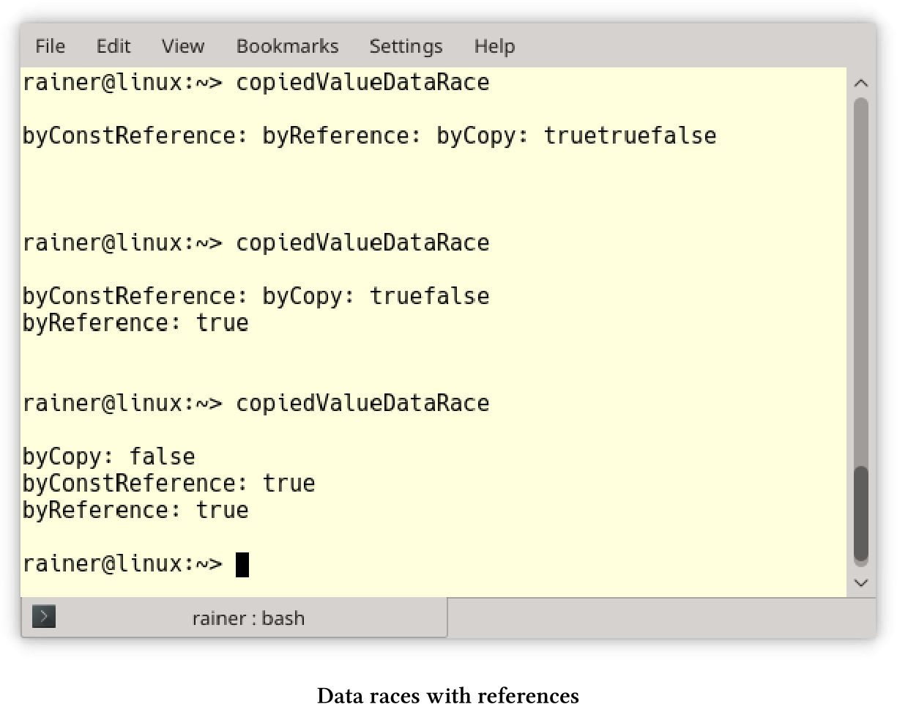
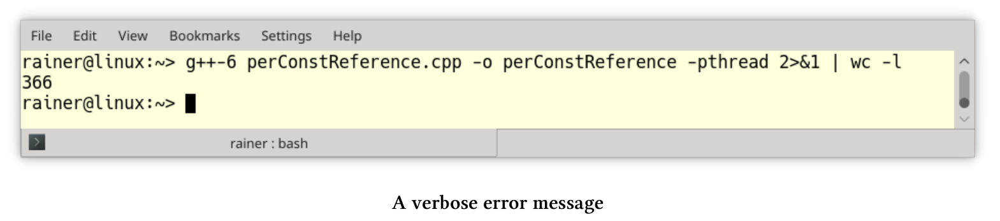
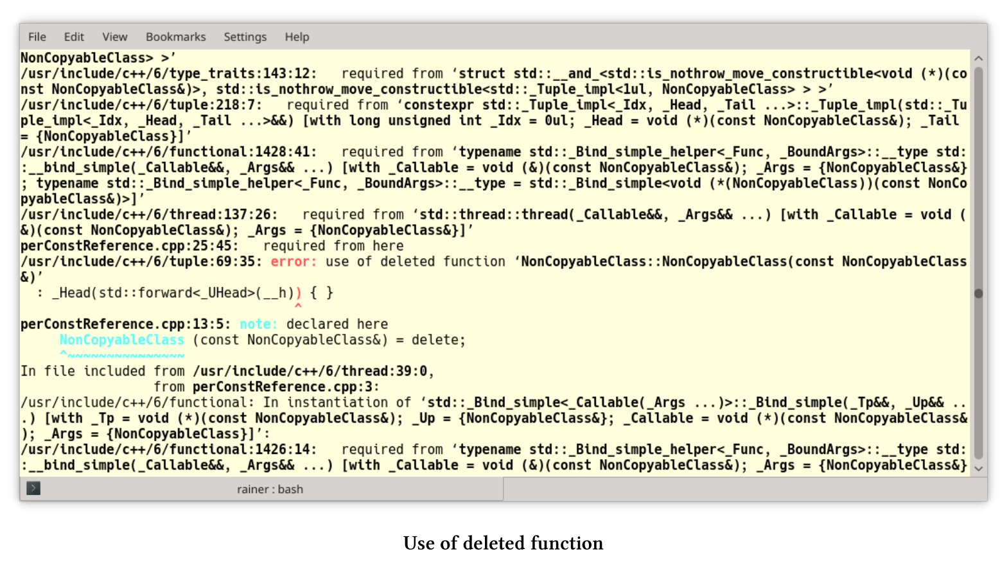
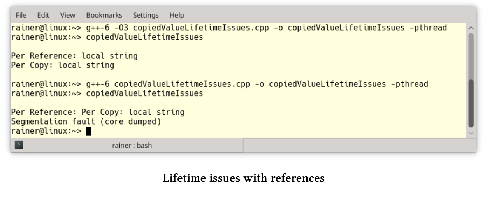

# 处理共享

如果使用不共享数据，就没有竞争。不共享意味着线程只处理本地变量，可以通过值复制、特定的线程存储，也可以通过受保护的数据通道将结果传输到future来实现。本节中的模式非常直观，我会给出一些简单的解释。

## 值复制

线程通过值复制，而不是引用来获取参数时，就不需要对任何数据的访问进行同步，也就没有数据竞争的条件和数据生命周期的问题。

**使用引用的数据竞争**

下面的程序启动三个线程：一个线程通过复制获取参数，另一个线程通过引用获取参数，最后一个线程通过常量引用获取参数。

```c++
// copiedValueDataRace.cpp

#include <functional>
#include <iostream>
#include <string>
#include <thread>

using namespace std::chrono_literals;

void byCopy(bool b) {
  std::this_thread::sleep_for(1ms);
  std::cout << "byCopy: " << b << std::endl;
}

void byReference(bool& b) {
  std::this_thread::sleep_for(1ms);
  std::cout << "byReference: " << b << std::endl;
}

void byConstReference(const bool& b) {
  std::this_thread::sleep_for(1ms);
  std::cout << "byConstReference: " << b << std::endl;
}

int main() {

  std::cout << std::boolalpha << std::endl;

  bool shared(false);

  std::thread t1(byCopy, shared);
  std::thread t2(byReference, std::ref(shared));
  std::thread t3(byConstReference, std::cref(shared));

  shared = true;

  t1.join();
  t2.join();
  t3.join();

  std::cout << std::endl;

}
```

每个线程在显示布尔值之前会休眠1毫秒(第11、16和21行)，其中只有线程`t1`具有布尔值的副本，因此没有数据竞争。程序显示线程`t2`和`t3`中的布尔值，而且布尔值在没有同步的情况下进行修改。



copiedValueDataRace.cpp例子中，我做了一个假设，这个假设对于布尔值来说很简单，但是对于更复杂的类型来说就不一定了。如果参数是“值对象”，那么通过复制传递参数必然就是无数据竞争。

> **值对象**
>
> “值对象”是一个对象，相等性基于状态。值对象是不可变的，以便在创建为“相等”的情况下，保持同等的生命周期。如果通过复制将值对象传递给线程，则不需要同步访问。[ValueObject](https://martinfowler.com/bliki/ValueObject.html)源于Martin Fowler的文章，“考虑两类对象：值对象和引用对象”。

**当引用为拷贝时**

示例copyedValueDataRace.cpp中的线程`t3`可能可以替换为`std::thread t3(byConstReference, shared)`。 该程序可以编译并运行，但是只是看起来像是引用而已， 原因是[`std::decay`](https://en.cppreference.com/w/cpp/types/decay)会应用于线程的每个参数。 `std::decay`对类型T的执行是从左值到右值，数组到指针和函数到指针的隐式转换。这种用例中，对类型T使用的是`[std :: remove_reference]` 。

perConstReference.cpp使用不可复制类型NonCopyableClass。

线程引用参数的"隐式"复制

```c++
// perConstReference.cpp

#include <thread>

class NonCopyableClass {
public:

  // the compiler generated default constructor
  NonCopyableClass() = default;

  // disallow copying
  NonCopyableClass& operator=(const NonCopyableClass&) = delete;
  NonCopyableClass(const NonCopyableClass&) = delete;

};

void perConstReference(const NonCopyableClass& nonCopy){}

int main() {

  NonCopyableClass nonCopy;

  perConstReference(nonCopy);

  std::thread t(perConstReference, nonCopy);
  t.join();
}
```

对象`nonCopy`(第21行)是不可复制的， 如果使用参数`nonCopy`调用函数`perConstReference`则没什么问题，因为该函数接受常量引用参数。线程`t`(第25行)中使用相同的函数，会导致GCC 6生成300多行冗长的编译器错误：



因为复制构造函数在NonCopyableClass类中是不可用的，所以错误消息的重要部分位于屏幕截图中间的红色部分：“错误：使用已删除的功能”。 



**引用参数的生命周期问题**

如果分离通过引用获取参数的线程，则必须格外小心。 copyValueValueLifetimeIssues.cpp中就有未定义行为。

使用引用引发的生命周期问题

```c++
// copiedValueLifetimeIssues.cpp

#include <iostream>
#include <string>
#include <thread>

void executeTwoThreads() {

  const std::string localString("local string");

  std::thread t1([localString] {
    std::cout << "Per Copy: " << localString << std::endl;
    });

  std::thread t2([&localString] {
    std::cout << "Per Reference: " << localString << std::endl;
    });

  t1.detach();
  t2.detach();
}

using namespace std::chrono_literals;

int main() {

  std::cout << std::endl;

  executeTwoThreads();

  std::this_thread::sleep_for(1s);

  std::cout << std::endl;

}
```

executeTwoThreads(第7 - 21行)启动了两个线程，且两个线程都被分离(第19行和第20行)，并且线程在执行时会打印局部变量`localString`(第9行)。第一个线程通过复制捕获局部变量，第二个线程通过引用捕获局部变量。为了让程序看起来简单，我使用Lambda函数来绑定参数。

因为executeTwoThreads函数不会等待两个线程完成，所以线程`t2`引用本地字符串，而该字符串与函数的生命周期绑定，这就会导致未定义行为的发生。奇怪的是，在GCC 6中以最大优化`-O3`编译连接的可执行文件似乎可以工作，而非优化的可执行文件却崩溃了。



**扩展阅读**

* [Pattern-Oriented Software Architecture: A Pattern Language for Distributed Computing](http://www.dre.vanderbilt.edu/~schmidt/POSA/POSA4/)

## 线程特定的存储器

线程的本地存储，允许多个线程通过全局访问使用本地存储。通过使用存储说明符`thread_local`，变量变成了线程的局部变量。这意味着，可以在不同步的情况下，使用线程局部变量。

下面是一个典型的用例。假设想要计算一个向量`randValues`的元素和，使用for循环执行此任务非常简单。

```c++
// calculateWithLoop.cpp
...
unsigned long long sum = {};
for (auto n: randValues) sum += n;
```

不过，电脑有四个核心，也可以使串行程序变成一个并发程序。

```c++
// threadLocalSummation.cpp
...
thread_local unsigned long long tmpSum = 0;
void sumUp(std::atomic<unsigned long long>& sum, const std::vector<int>& val,
unsigned long long beg, unsigned long long end){
for (auto i = beg; i < end; ++i){
tmpSum += val[i];
}
sum.fetch_add(tmpSum, std::memory_order_relaxed);
}
...
std::atomic<unsigned long long> sum{};
std::thread t1(sumUp, std::ref(sum), std::ref(randValues), 0, fir);
std::thread t2(sumUp, std::ref(sum), std::ref(randValues), fir, sec);
std::thread t3(sumUp, std::ref(sum), std::ref(randValues), sec, thi);
std::thread t4(sumUp, std::ref(sum), std::ref(randValues), thi, fou);
```

将for循环放入函数中，让每个线程计算线程局部变量`tmpSum`中总和的四分之一。`sum.fetch_add(tmpSum, std::memory_order_relaxed)`最后以原子的方式汇总所有值。

> **使用标准模板库的算法**
>
> 如果有算法标准模板库可以做这项工作，就用不着循环了。本例中，[std::accumulate](https://en.cppreference.com/w/cpp/algorithm/accumulate)就可以完成这项工作，以汇总向量加和：`sum = std::accumulate(randValues.begin(), randValues.end(), 0) `。在C++17中，可以使用`std::accumulate`的并行版本`std::reduce`：`sum = std::reduce(std::execution::par, randValues.begin(), randValues.end(), 0)`。

**扩展阅读**

* [ValueObject](https://martinfowler.com/bliki/ValueObject.html)
* [Pattern-Oriented Software Architecture: Patterns for Concurrent and Networked Objects](https://www.dre.vanderbilt.edu/~schmidt/POSA/POSA2/)

## Future

C++11提供了三种类型的future和promise：`std::async`、`std::packaged_task`和`std::promise`与`std::future`对。promise这个词可以追溯到70年代。future是可写promise设置的只读占位符。从同步的角度来看，promise/future对的关键属性是两者都由受保护的数据通道进行连接。

实现future时需要做出一些决策：

* future可以通过get调用隐式或显式地获取值。
* future可以积极地或消极地启动计算，只有`std::async`可以通过启动策略控制是否支持延迟计算。

```c++
auto lazyOrEager = std::async([]{ return "LazyOrEager"; });
auto lazy = std::async(std::launch::deferred, []{ return "Lazy"; });
auto eager = std::async(std::launch::async, []{ return "Eager"; });

lazyOrEager.get();
lazy.get();
eager.get();
```

如果没有指定启动策略，则由系统决定是立即启动还是延迟启动。通过使用启动策略`std::launch::async`，创建一个新线程，promise会立即开始它的工作。这与启动策略`std::launch::async`不同，`eager.get()`会启动promise，而promise是在创建线程中执行的。

* 如果promise的值不可用，则future阻塞或抛出异常。C++11阻塞了wait或get，也可以等待promise的超时(`wait_for`和`wait_until`)。
* 有多种方法实现future：[协程](https://en.wikipedia.org/wiki/Coroutine)、[生成器]( https://en.wikipedia.org/wiki/Generator_(computer_programming))或[通道](https://en.wikipedia.org/wiki/Channel_(programming))。

**扩展阅读**

* [Futures and promises](https://en.wikipedia.org/wiki/Futures_and_promises)