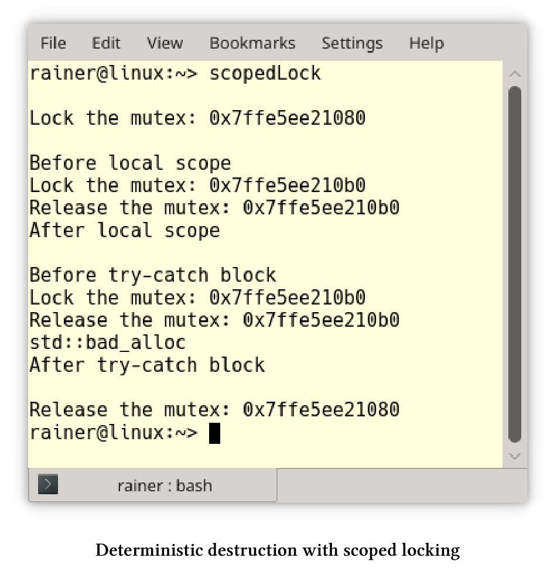
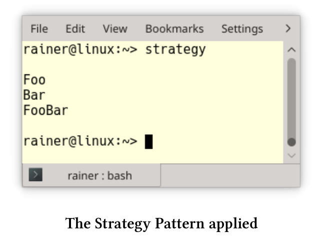
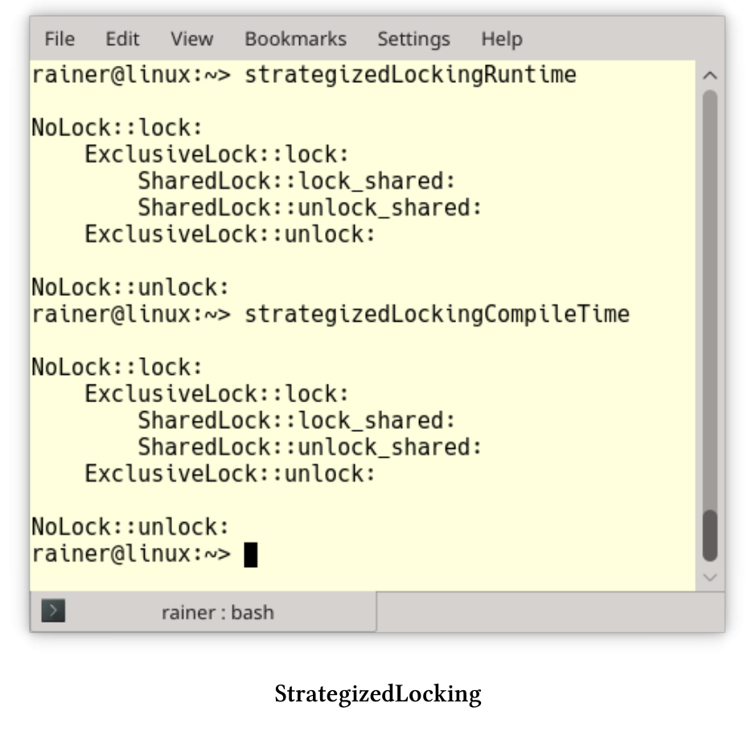
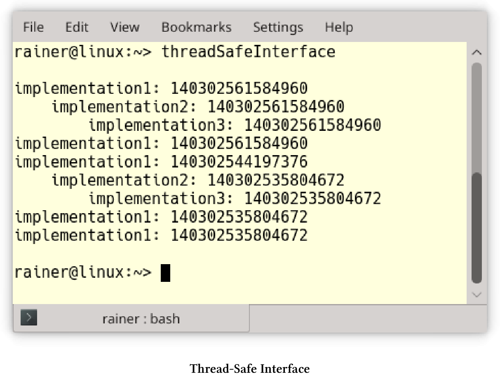
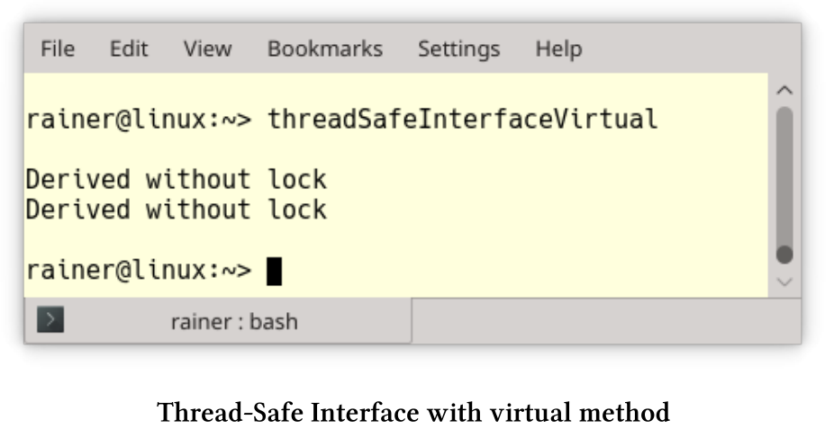
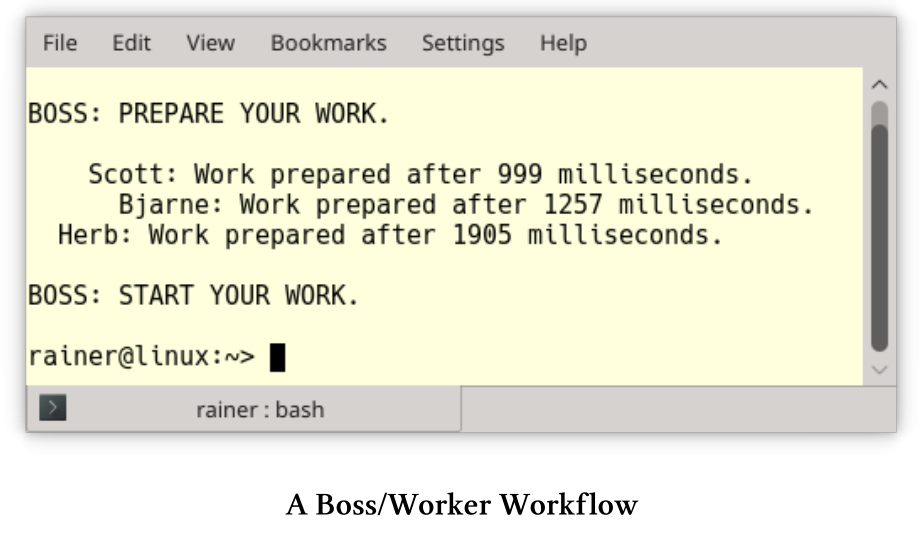

# 处理突变

如果不同时读写数据，就没有数据竞争，最简单的方法是使用不可变值。除此之外，还有两种典型的策略。首先，用锁来保护临界区，例如：范围锁或策略锁。在面向对象设计中，关键部分的通常是对象(包括它的接口)，线程安全的接口会保护整个对象。其次，修改线程只是在工作完成时发出信号，这就是*保护性暂挂*模式。

## 范围锁

范围锁是将RAII(资源获取即初始化)应用于互斥锁，这个用法的关键思想是将资源获取和释放绑定到对象的生存期。顾名思义，对象的生命周期范围是确定的。这里的范围意味着，C++运行时会负责调用对象的析构函数，从而释放资源。

ScopedLock类实现了范围锁。

```c++
// scopedLock.cpp

#include <iostream>
#include <mutex>
#include <new>
#include <string>
#include <utility>

class ScopedLock{
private:
  std::mutex& mut;
public:
	explicit ScopedLock(std::mutex& m) :mut(m) {
		mut.lock();
		std::cout << "Lock the mutex: " << &mut << std::endl;
	}
	~ScopedLock() {
		std::cout << "Release the mutex: " << &mut << std::endl;
		mut.unlock();
	}
};

int main() {

	std::cout << std::endl;

	std::mutex mutex1;
	ScopedLock scopedLock1{ mutex1 };

	std::cout << "\nBefore local scope" << std::endl;
	{
		std::mutex mutex2;
		ScopedLock scopedLock2{ mutex2 };
	}
	std::cout << "After local scope" << std::endl;

	std::cout << "\nBefore try-catch block" << std::endl;
	try {
		std::mutex mutex3;
		ScopedLock scopedLoack3{ mutex3 };
		throw std::bad_alloc();
	}
	catch (std::bad_alloc& e) {
		std::cout << e.what();
	}
	std::cout << "\nAfter try-catch block" << std::endl;

	std::cout << std::endl;

}
```

ScopedLock通过引用的方式获取互斥对象(第13行)。互斥量在构造函数(第15行)中锁定，在析构函数(第19行)中进行解锁。由于RAII的使用习惯，对象在销毁时，会自动对互斥量进行解锁。



`scopedLock1`的作用域在主函数体中。因此，`mutex1`最后才解锁，`mutex2`(第34行)和`mutex3`(第42行)也是同理。对于`mutex3`而言，如果触发异常，也会调用`scopedLock3`的析构函数。有趣的是，`mutex3`重用了`mutex2`的内存，因为两者的地址相同。

C++17支持四种类型的锁：`std::lock_guard`/`std::scoped_lock`用于简单场景，`std::unique_lock`/`std::shared_lock`用于高级场景，可以在关于锁的章节中了解更多的细节。

**拓展阅读**

* [Pattern-Oriented Software Architecture: Patterns for Concurrent and Networked Objects]( https://www.dre.vanderbilt.edu/~schmidt/POSA/POSA2/)

## 策略锁

编写代码库时，这个库可用于各种领域，包括并发。为了安全起见，要用锁来保护关键部分。倘若库在单线程环境中运行，因为实现使用了重量级同步机制，则会存在性能问题。那么，现在就轮到策略锁登场了。

策略锁是将策略模式的思想应用于锁。这意味着，会将锁定策略放到实例对象中，并使其成为一个可热插拔的组件。那么，什么是策略模式呢?

**Strategy Pattern**


策略模式是[《设计模式：可重用的面向对象软件元素》]( https://en.wikipedia.org/wiki/Design_Patterns)一书中经典的行为模式之一。其关键思想是定义一系列算法，将它们封装在一个对象中，从而使其成为可热插拔的组件。

策略模式

```c++
// strategy.cpp

#include <iostream>
#include <memory>

class Strategy {
public:
  virtual void operator()() = 0;
  virtual ~Strategy() = default;
};

class Context {
  std::shared_ptr<Strategy> _start;
public:
  explicit Context() : _start(nullptr) {}
  void setStrategy(std::shared_ptr<Strategy> start) { _start = start; }
  void strategy() { if (_start)(*_start)(); }
};

class Strategy1 :public Strategy {
  void operator()() override {
    std::cout << "Foo" << std::endl;
  }
};

class Strategy2 : public Strategy {
  void operator()() override {
    std::cout << "Bar" << std::endl;
  }
};

class Strategy3 :public Strategy {
  void operator()() override {
    std::cout << "FooBar" << std::endl;
  }
};

int main() {

  std::cout << std::endl;

  Context con;

  con.setStrategy(std::shared_ptr<Strategy>(new Strategy1));
  con.strategy();

  con.setStrategy(std::shared_ptr<Strategy>(new Strategy2));
  con.strategy();

  con.setStrategy(std::shared_ptr<Strategy>(new Strategy3));
  con.strategy();

  std::cout << std::endl;

}
```

第6至10行中的抽象类`Strategy`定义了策略。每个特定的策略，如`Strategy1`(第20行)、`Strategy2`(第26行)或`Strategy3`(第32行)，都必须支持函数调用操作符(第8行)。使用者在`Context`中集合了各种策略，在第16行设置特定的策略，并在第17行执行它。因为`Context`通过一个指向`Strategy`类的指针来执行，所以`Strategy1`、`Strategy2`和`Strategy3`的执行方法是私有的。



**具体实现**

实现策略锁有两种经典的方法：运行时多态性(面向对象)和编译时多态性(模板)。两种方式各有利弊。

*  优点：
  * 运行时多态
    * 允许在运行时配置策略锁。
    * 了解有面向对象的开发人员，更容易理解。
  * 编译时多态
    * 无抽象的惩罚。
    * 扁平的层次结构。
* 缺点：
  *  运行时多态
    * 额外需要一个指针。
    * 可能有很深的派生层次。
  * 编译时多态
    * 出错时会有非常详细的信息。

讨论了理论之后，我在两个程序中实现了策略锁。示例中，策略锁可支持无锁、独占锁和共享锁。简单起见，我在内部使用了互斥锁。此外，策略锁的模型也限定了其锁定的范围。

**运行时多态**

strategizedLockingRuntime.cpp程序中展示了三种互斥锁。

运行时的多态性策略锁

```c++
// strategizedLockingRuntime.cpp

#include <iostream>
#include <mutex>
#include <shared_mutex>

class Lock {
public:
  virtual void lock() const = 0;
  virtual void unlock() const = 0;
};

class StrategizedLocking {
  Lock& lock;
public:
  StrategizedLocking(Lock& l) :lock(l) {
    lock.lock();
  }
  ~StrategizedLocking() {
    lock.unlock();
  }
};

struct NullObjectMutex {
  void lock() {};
  void unlock() {};
};

class NoLock :public Lock {
  void lock() const override {
    std::cout << "NoLock::lock: " << std::endl;
    nullObjectMutex.lock();
  }
  void unlock() const override {
    std::cout << "NoLock::unlock: " << std::endl;
    nullObjectMutex.unlock();
  }
  mutable NullObjectMutex nullObjectMutex;
};

class ExclusiveLock : public Lock {
  void lock() const override {
    std::cout << "  ExclusiveLock::lock: " << std::endl;
    mutex.lock();
  }
  void unlock() const override {
    std::cout << "  ExclusiveLock::unlock: " << std::endl;
    mutex.unlock();
  }
  mutable std::mutex mutex;
};

class SharedLock : public Lock {
  void lock() const override {
    std::cout << " SharedLock::lock_shared: " << std::endl;
    sharedMutex.lock_shared();
  }
  void unlock() const override {
    std::cout << " SharedLock::unlock_shared: " << std::endl;
    sharedMutex.unlock_shared();
  }
  mutable std::shared_mutex sharedMutex;
};

int main() {

  std::cout << std::endl;

  NoLock noLock;
  StrategizedLocking stratLock1{ noLock };

  {
    ExclusiveLock exLock;
    StrategizedLocking stratLock2{ exLock };
    {
      SharedLock sharLock;
      StrategizedLocking startLock3{ sharLock };
    }
  }

  std::cout << std::endl;

}
```

`StrategizedLocking`类中有一把锁(第14行)。`StrategizedLocking`模型是范围锁，因此在构造函数(第16行)中进行锁定，在析构函数(第19行)中进行解锁。`Lock`(第7 - 11行)是一个抽象类，定义了所有接口。派生类分别是`NoLock` (第29行)、`ExclusiveLock`(第41行)和`SharedLock`(第53行)。`SharedLock`在`std::shared_mutex`上可使用`lock_shared`(第56行)和`unlock_shared`进行锁定和解锁。每个锁持有一个互斥对象`NullObjectMutex`(第38行)、`std::mutex`(第50行)或`std::shared_mutex`(第62行)。其实，`NullObjectMutex`就是一个无操作的占位符。互斥对象声明为可变，就意味着可以用在常量方法中使用，比如：lock和unlock中。

> **空对象**
>
> 类NullObjectMutex是[空对象模式](https://en.wikipedia.org/wiki/Null_object_pattern)的一个例子，由空方法组成，算是一个占位符，这样便于优化器可以将它完全删除。

**编译时多态**

基于模板的实现与基于面向对象的实现非常相似。

编译时多态性策略锁

```c++
// StrategizedLockingCompileTime.cpp

#include <iostream>
#include <mutex>
#include <shared_mutex>


template <typename LOCK>
class StrategizedLocking {
  LOCK& lock;
public:
  StrategizedLocking(LOCK& l) :lock(l) {
    lock.lock();
  }
  ~StrategizedLocking() {
    lock.unlock();
  }
};

struct NullObjectMutex {
  void lock() {};
  void unlock() {};
};

class NoLock {
public:
  void lock() const {
    std::cout << "NoLock::lock: " << std::endl;
    nullObjectMutex.lock();
  }
  void unlock() const {
    std::cout << "NoLock::unlock: " << std::endl;
    nullObjectMutex.unlock();
  }
  mutable NullObjectMutex nullObjectMutex;
};

class ExclusiveLock {
public:
  void lock() const {
    std::cout << "  ExclusiveLock::lock: " << std::endl;
    mutex.lock();
  }
  void unlock() const {
    std::cout << "  ExclusiveLock::unlock: " << std::endl;
    mutex.unlock();
  }
  mutable std::mutex mutex;
};

class SharedLock {
public:
  void lock() const {
    std::cout << " SharedLock::lock_shared: " << std::endl;
    sharedMutex.lock_shared();
  }
  void unlock() const {
    std::cout << " SharedLock::unlock_shared: " << std::endl;
    sharedMutex.unlock_shared();
  }
  mutable std::shared_mutex sharedMutex;
};

int main() {

  std::cout << std::endl;

  NoLock noLock;
  StrategizedLocking stratLock1{ noLock };

  {
    ExclusiveLock exLock;
    StrategizedLocking stratLock2{ exLock };
    {
      SharedLock sharLock;
      StrategizedLocking startLock3{ sharLock };
    }
  }

  std::cout << std::endl;

}
```

这次`NoLock`(第25行)、`ExclusiveLock`(第38行)和`SharedLock`(第51行)没有抽象的基类了。结果`StrategizedLocking`可以用不支持相应接口的对象进行实例化，而这将导致编译时错误。C++20中，可以使用`Lockable : template <Lockable Lock> class StrategizedLocking`代替`template <typename Lock> class StrategizedLocking`。这意味着所有使用的锁必须支持Lockable[概念](https://en.cppreference.com/w/cpp/language/constraints)。概念需要命名，并且[Lockable](https://en.cppreference.com/w/cpp/named_req)已经在C++20中定义了。如果没有满足此要求，则编译将失败，并出现简单易懂的错误消息。

两个程序会生成相同的输出:



**拓展阅读**

* [Design Patterns: Elements of Reusable Object-Oriented Software]( https://en.wikipedia.org/wiki/Design_Patterns)
* [Strategy Pattern](https://en.wikipedia.org/wiki/Strategy_pattern)
* [Null Object Pattern](https://en.wikipedia.org/wiki/Null_object_pattern)
* [Pattern-Oriented Software Architecture: Patterns for Concurrent and Networked Objects](https://www.dre.vanderbilt.edu/~schmidt/POSA/POSA2/)

## 线程安全的接口

当程序的关键部分只是一个对象时，那么使用线程安全的接口就在合适不过了。用锁可能会导致性能问题，甚至会导致死锁。下面的伪代码可以清楚地阐明我的观点。

```c++
struct Critical{
  void method1(){
    lock(mut);
    method2();
    ...
  }
  void method2(){
    lock(mut);
    ...
  }
  mutex mut;
};

Critical crit;
crit.method1();
```

使用`crit.method1`会使互斥锁锁定两次。为了简单起见，这个锁是一个范围锁。当然，这里还有两个问题：

1. 当`lock`是递归锁时，`method2`中的第二个`lock(mut)`是多余的。
2.  当`lock`不是递归锁时，`method2`中的第二个`lock(mut)`会导致未定义行为。大多数情况下，会出现死锁。

线程安全的接口可以避免这两个问题，因为：

* 所有(public)接口都应该使用锁。
* 所有(保护的和私有的)方法都不使用锁。
* 接口只能使用保护的方法或私有方法调用，而公共方法则不能调用。

threadSafeInterface.cpp程序显示了其用法。

```c++
// threadSafeInterface.cpp

#include <iostream>
#include <mutex>
#include <shared_mutex>

class Critical {

public:
  void interface1() const {
    std::lock_guard<std::mutex> lockGuard(mut);
    implementation1();
  }
  void interface2() {
    std::lock_guard<std::mutex> lockGuard(mut);
    implementation2();
    implementation3();
    implementation1();
  }
private:
  void implementation1() const {
    std::cout << "implementation1: "
      << std::this_thread::get_id() << std::endl;
  }
  void implementation2() const {
    std::cout << "  implementation2: "
      << std::this_thread::get_id() << std::endl;
  }
  void implementation3() const {
    std::cout << "   implementation3: "
      << std::this_thread::get_id() << std::endl;
  }


  mutable std::mutex mut;

};

int main() {

  std::cout << std::endl;

  std::thread t1([] {
    const Critical crit;
    crit.interface1();
    });

  std::thread t2([] {
    Critical crit;
    crit.interface2();
    crit.interface1();
    });


  Critical crit;
  crit.interface1();
  crit.interface2();

  t1.join();
  t2.join();

  std::cout << std::endl;

}
```

包括主线程在内的三个线程都使用了Critical实例。由于线程安全的接口，所有对公开API的调用都是同步的。第35行中的互斥对象是可变的，因此可以在const方法`implementation1`中使用。

线程安全的接口有三个好处：

1. 互斥锁不可能递归调用。在C++中，对非递归互斥对象的递归调用会导致未定义行为，通常都会死锁。
2. 该程序使用最小范围的锁定，因此同步的代价最小。仅在关键类的公共或私有方法中使用`std::recursive_mutex`将产生重量级的同步，从而遭受性能惩罚。
3. 从用户的角度来看，`Critical`很容易使用，而同步只是实现的一个细节而已。

三个线程交错的输出：



尽管线程安全的接口看起来很容易实现，但是也需要留意两个风险点。

**风险**

类中使用静态成员和使用虚接口时，需要特别小心。

**静态成员**

当类有静态成员时，就必须同步该类实例上的所有成员函数。

```c++
class Critical {

public:
  void interface1() const {
    std::lock_guard<std::mutex> lockGuard(mut);
    implementation1();
  }
  void interface2() {
    std::lock_guard<std::mutex> lockGuard(mut);
    implementation2();
    implementation3();
    implementation1();
  }
  
private:
  void implementation1() const {
    std::cout << "implementation1: "
      << std::this_thread::get_id() << std::endl;
    ++called;
  }
  void implementation2() const {
    std::cout << "  implementation2: "
      << std::this_thread::get_id() << std::endl;
    ++called;
  }
  void implementation3() const {
    std::cout << "   implementation3: "
      << std::this_thread::get_id() << std::endl;
    ++called;
  }

  inline static int called{ 0 };
  inline static std::mutex mut;

};
```

`Critical`类使用了静态成员(第32行)来计算调用成员函数的频率。`Critical`的所有实例，都使用同一个静态成员，因此必须同步。本例中，临界区为`Critical`的所有实例。

> 内联静态成员
>
> C++17中，静态数据成员可以声明为内联。可以在类中定义，以及初始化内联静态数据成员。
>
> ```c++
> struct X
> {
>   	inline static int n = 1;
> }
> ```
>

**虚接口**

当重写虚接口函数时，即使重写的函数是私有的，也应该有锁。

```c++
// threadSafeInterfaceVirtual.cpp

#include <iostream>
#include <mutex>
#include <thread>

class Base {

public:
  virtual void interface() {
    std::lock_guard<std::mutex> lockGuard(mut);
    std::cout << "Base with lock" << std::endl;
  }
private:
  std::mutex mut;
};

class Derived : public Base {

  void interface() override {
    std::cout << "Derived without lock" << std::endl;
  };

};

int main() {

  std::cout << std::endl;

  Base* base1 = new Derived;
  base1->interface();

  Derived der;
  Base& base2 = der;
  base2.interface();

  std::cout << std::endl;

}
```

`base1->interface`和`base2.interface`中，`base1`和`base2`是静态类型是`Base`，因此`interface`是一个公开接口。由于接口方法是虚函数，因此在运行时使用派生的动态类型Derived进行。最后，调用派生类Derived的私有接口。



有两种方法可以避免风险：

1. 使接口成为非虚接口，这种技术称为[NVI(非虚拟接口)](https://en.wikibooks.org/wiki/More_C%2B%2B_Idioms/Non-Virtual_Interface)。
2. 将接口声明为`final`: `virtual void interface() final;`。

**扩展阅读**

* [Pattern-Oriented Software Architecture: Patterns for Concurrent and Networked Objects](https://www.dre.vanderbilt.edu/~schmidt/POSA/POSA2/)

## 保护性暂挂模式

锁和一些先决条件的组合，是构成保护性暂挂模式的基础件。如果未满足先决条件，则线程将自己置为休眠状态。为了避免数据竞争或死锁，检查线程时会使用锁。

现在，来看看各种情况:

* 处于等待状态的线程，会根据通知更改状态，也可以主动请求更改状态。我把这称为“推拉原则”。
* 等待可以有时限，也可以没有时限。
* 可以将通知发送给一个或所有正在等待的线程。

**推拉原则**

先来说说推原则。

**推原则**

大多数情况下，使用条件变量或future/promise来进行线程同步。条件变量或promise将通知发送到正在等待的线程。promise没有`notify_one`或`notify_all`方法，而空的`set_value`调用通常用于模拟通知。下面的程序段展示发送通知的线程和等待的线程。

*  条件变量

```c++
void waitingForWork(){
  std::cout << "Worker: Waiting for work." << std::endl;
  std::unique_lock<std::mutex> lck(mutex_);
  condVar.wait(lck, []{ return dataReady; });
  doTheWork();
  std::cout << "Work done." << std::endl;
}

void setDataReady(){
  {
    std::lock_guard<std::mutex> lck(mutex_);
    dataReady = true;
  }
  std::cout << "Sender: Data is ready." << std::endl;
  condVar.notify_one();
}
```

* future/promise

```c++
void waitingForWork(std::future<void>&& fut){
  std::cout << "Worker: Waiting for work." << std::endl;
  fut.wait();
  doTheWork();
  std::cout << "Work done." << std::endl;
}
void setDataReady(std::promise<void>&& prom){
  std::cout << "Sender: Data is ready." << std::endl;
  prom.set_value();
}
```

**拉原则**

线程也可以主动地要求改变状态，而不是被动地等待状态改变。C++中并不支持“拉原则”，但可以用原子变量来实现。

```c++
std::vector<int> mySharedWork;
std::mutex mutex_;
std::condition_variable condVar;

bool dataReady{false};

void waitingForWork(){
  std::cout << "Waiting " << std::endl;
  std::unique_lock<std::mutex> lck(mutex_);
  condVar.wait(lck, []{ return dataReady; });
  mySharedWork[1] = 2;
  std::cout << "Work done " << std::endl;
}

void setDataReady(){
  mySharedWork = {1, 0, 3};
  {
    std::lock_guard<std::mutex> lck(mutex_);
    dataReady = true;
  }
  std::cout << "Data prepared" << std::endl;
  condVar.notify_one();
}
```

**有或无时限的等待**

条件变量和future有三个用于等待的方法:`wait`、`wait_for`和`wait_until`。`wait_for`需要一个时间段，`wait_until`需要一个时间点。

各种等待策略中，消费者线程等待时间为`steady_clock::now() + dur`。如果promise已经准备好了，就会获取值；如果没准备好，则只显示其id: `this_thread::get_it()`。

```c++
void producer(promise<int>&& prom){
  cout << "PRODUCING THE VALUE 2011\n\n";
  this_thread::sleep_for(seconds(5));
  prom.set_value(2011);
}

void consumer(shared_future<int> fut,
steady_clock::duration dur){
  const auto start = steady_clock::now();
  future_status status= fut.wait_until(steady_clock::now() + dur);
  if ( status == future_status::ready ){
    lock_guard<mutex> lockCout(coutMutex);
    cout << this_thread::get_id() << " ready => Result: " << fut.get()
    << endl;
  }
  else{
    lock_guard<mutex> lockCout(coutMutex);
    cout << this_thread::get_id() << " stopped waiting." << endl;
  }
  const auto end= steady_clock::now();
  lock_guard<mutex> lockCout(coutMutex);
  cout << this_thread::get_id() << " waiting time: "
  		 << getDifference(start,end) << " ms" << endl;
}
```

**通知一个或所有等待线程**

`notify_one`可以唤醒一个等待的线程，`notify_all`可以唤醒所有等待的线程。使用`notify_one`时，不能确定哪一个线程会被唤醒，而其他条件变量则保持在等待状态。因为future和promise之间存在关联性，所以这种情况在`std::future`中是不可能发生的。如果想模拟一对多的关系，那么应该使用`std::shared_future`而不是`std::future`，因为`std::shared_future`是可以复制的。

下面的程序显示了一个简单的工作流，promise和future之间是一对一/一对多的关系。

```c++
// bossWorker.cpp

#include <future>
#include <chrono>
#include <iostream>
#include <random>
#include <string>
#include <thread>
#include <utility>

int getRandomTime(int start, int end) {

  std::random_device seed;
  std::mt19937 engine(seed());
  std::uniform_int_distribution<int> dist(start, end);

  return dist(engine);
}

class Worker {
public:
  explicit Worker(const std::string& n) :name(n) {}

  void operator()(std::promise<void>&& prepareWork,
    std::shared_future<void> boss2Worker) {

    // prepare the work and notify the boss
    int prepareTime = getRandomTime(500, 2000);
    std::this_thread::sleep_for(std::chrono::microseconds(prepareTime));
    prepareWork.set_value();
    std::cout << name << ": " << "Work prepared after "
      << prepareTime << " milliseconds." << std::endl;

    // still waiting for the permission to start working
    boss2Worker.wait();
  }
private:
  std::string name;
};

int main() {

  std::cout << std::endl;

  // define the std::promise = > Instruction from the boss
  std::promise<void> startWorkPromise;

  // get the std::shared_future's from the std::promise
  std::shared_future<void> startWorkFuture = startWorkPromise.get_future();

  std::promise<void> herbPrepared;
  std::future<void> waitForHerb = herbPrepared.get_future();
  Worker herb(" Herb");
  std::thread herbWork(herb, std::move(herbPrepared), startWorkFuture);

  std::promise<void> scottPrepared;
  std::future<void> waitForScott = scottPrepared.get_future();
  Worker scott(" Scott");
  std::thread scottWork(scott, std::move(scottPrepared), startWorkFuture);

  std::promise<void> bjarnePrepared;
  std::future<void> waitForBjarne = bjarnePrepared.get_future();
  Worker bjarne(" Bjarne");
  std::thread bjarneWork(bjarne, std::move(bjarnePrepared), startWorkFuture);

  std::cout << "BOSS: PREPARE YOUR WORK.\n " << std::endl;

  // waiting for the worker
  waitForHerb.wait(), waitForScott.wait(), waitForBjarne.wait();

  // notify the workers that they should begin to work
  std::cout << "\nBOSS: START YOUR WORK. \n" << std::endl;
  startWorkPromise.set_value();

  herbWork.join();
  scottWork.join();
  bjarneWork.join();

}
```

该程序的关键思想是boss(主线程)有三个员工：herb(第53行)、scott(第58行)和bjarne(第63行)，每个worker由一个线程表示。老板在第64行等待，直到所有的员工完成工作。这意味着，每个员工在任务下发后的任意时间点，都可以向老板发送完成通知。因为会转到`std::future`，所以员工到老板的通知是一对一的(第30行)。而从老板到员工的工作指令，则是一对多的通知(第73行)。对于这个一对多的通知，需要使用`std::shared_future`。



**扩展阅读**

* [Concurrent Programming in Java: Design Principles and Patterns (Doug Lea)](http://gee.cs.oswego.edu/dl/cpj/)