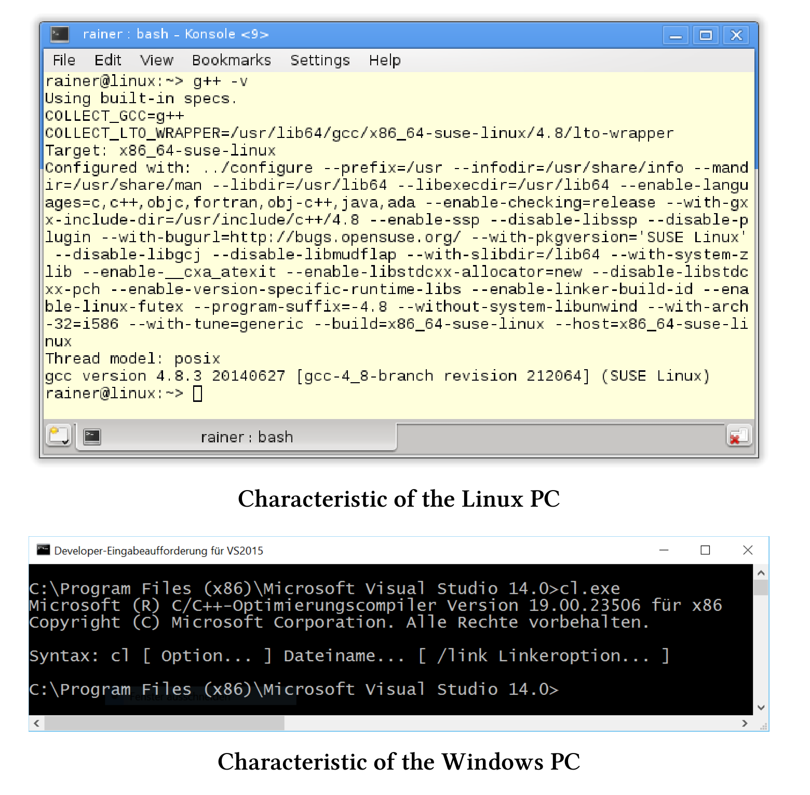

# 案例研究

了解了内存模型和多线程接口后，现在就要进行实践了，本章会提供一些性能数据作为参考。

> **电脑配置参考**
>
> 我用Linux桌面版(GCC 4.8.3)和Windows笔记本电脑(cl.exe 19.00.23506)对程序的性能进行测试，使用优化的64位可执行文件进行测试。Linux PC有四个核心，而Windows PC有两个核心。下面是这两个编译器的详细信息：
>
> 

读者们应该只将这里的性能数值作为参考。我更喜欢凭直觉判断哪些算法可行，哪些算法不可行，但对Linux和Windows操作系统支持算法的确切数目不感兴趣。我想知道一些算法在不同的操作系统下，是否会有不同的性能表现(译者注：这里作者主要想比较操作系统中的实现，而不是对机器硬件进行比较)。

