# 求向量元素的加和

向`std::vector`中添加元素最快的方法是哪种？为了得到答案，我准备向`std::vector`中填充了一亿个数值，这些数在1~10之间[均匀分布](https://en.wikipedia.org/wiki/Uniform_distribution_(continuous)) 。我们的任务是用各种方法计算这些数字的和，并添加执行时间作为性能指标。本节将讨论原子、锁、线程本地数据和任务。

## 单线程方式

最直接的方式是使用for循环进行数字的添加。

**for循环**

下面的代码中，第27行进行加和计算。

```c++
// calculateWithLoop.cpp

#include <chrono>
#include <iostream>
#include <random>
#include <vector>

constexpr long long size = 100000000;

int main() {

  std::cout << std::endl;

  std::vector<int>randValues;
  randValues.reserve(size);

  // random values
  std::random_device seed;
  std::mt19937 engine(seed());
  std::uniform_int_distribution<> uniformDIst(1, 10);
  for (long long i = 0; i < size; ++i)
    randValues.push_back(uniformDIst(engine));

  const auto sta = std::chrono::steady_clock::now();

  unsigned long long sum = {};
  for (auto n : randValues)sum += n;

  const std::chrono::duration<double> dur =
    std::chrono::steady_clock::now() - sta;

  std::cout << "Time for mySumition " << dur.count()
    << "seconds" << std::endl;
  std::cout << "Result: " << sum << std::endl;

  std::cout << std::endl;

}
```

我的电脑可够快？

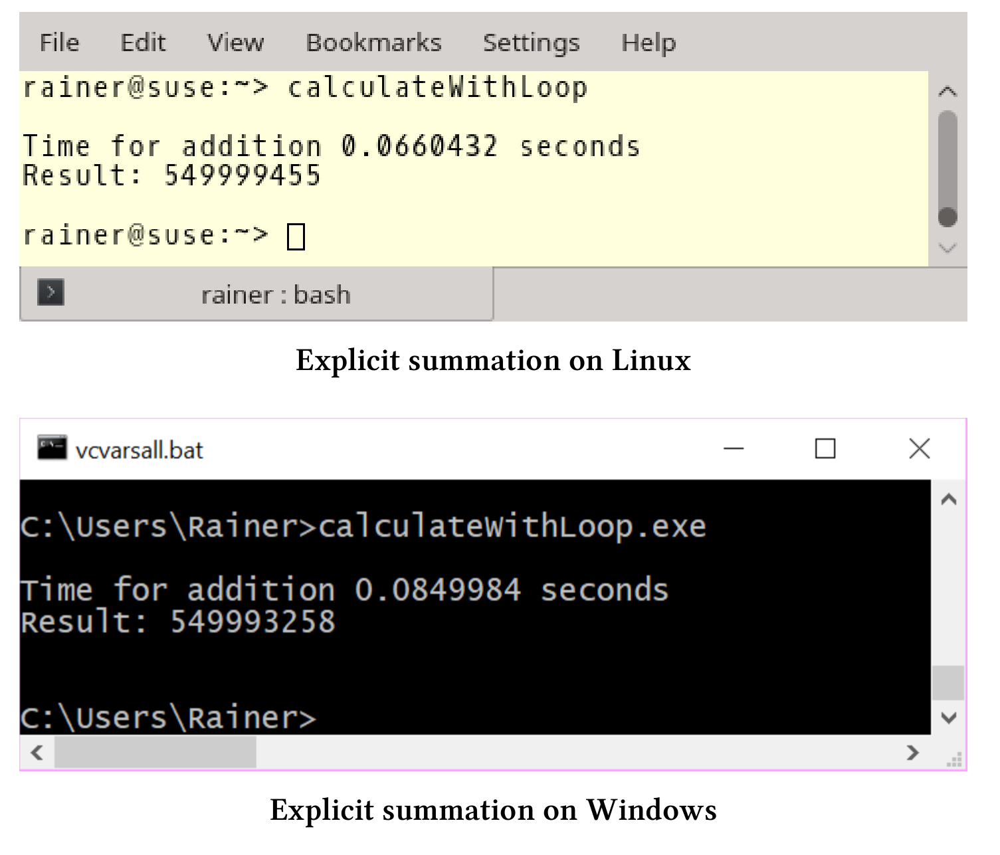

显式地使用循环没什么技术含量。大多数情况下，可以使用标准模板库中的算法。

**使用std::accumulate进行加和计算**

`std::accumulate`是计算向量和的正确选择，下面代码展示了`std::accumulate`的使用方法。完整的源文件可以在本书的参考资料中找到。

```c++
// calculateWithStd.cpp
...
const unsigned long long sum = std::accumulate(randValues.begin(),
              randValues.end(), 0);
...
```

Linux上，`std::accumulate`的性能与for循环的性能大致相同，而在Windows上使用`std::accumulate`会产生很大的性能收益。

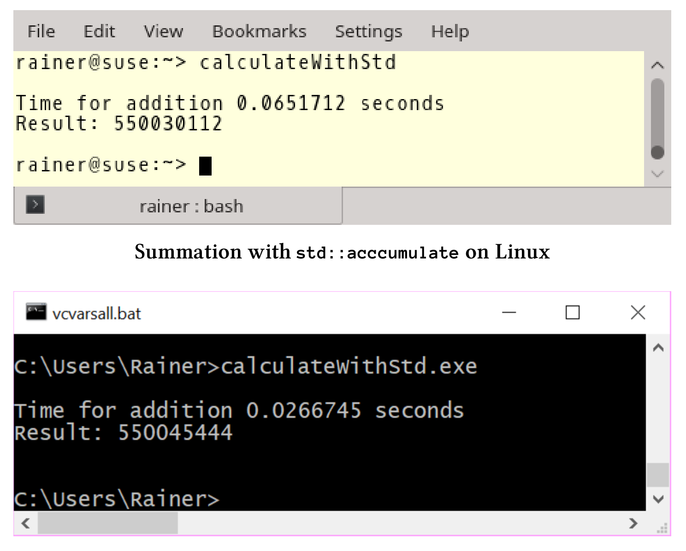

现在有了基线参考时间，就可以继续剩余的两个单线程场景了：使用锁和原子操作。为什么是这两个场景？我们需要有性能数字佐证，在没有竞争的情况下，锁和原子操作对数据进行保护，需要付出多大的性能代价。

**使用锁进行保护**

如果使用锁保护对求和变量的访问，需要回答两个问题。

1. 无争抢的同步锁，需要多大的代价?
2. 最优的情况下，锁能有多快？

这里使用`std::lock_guard`的方式，完整源码可在本书资源中找到。

```c++
// calculateWithLock.cpp
...
std::mutex myMutex;
for (auto i: randValues){
	std::lock_guard<std::mutex> myLockGuard(myMutex);
	sum += i;
}
...
```

执行时间与预期的一样：对变量`sum`进行保护后，程序变得很慢。

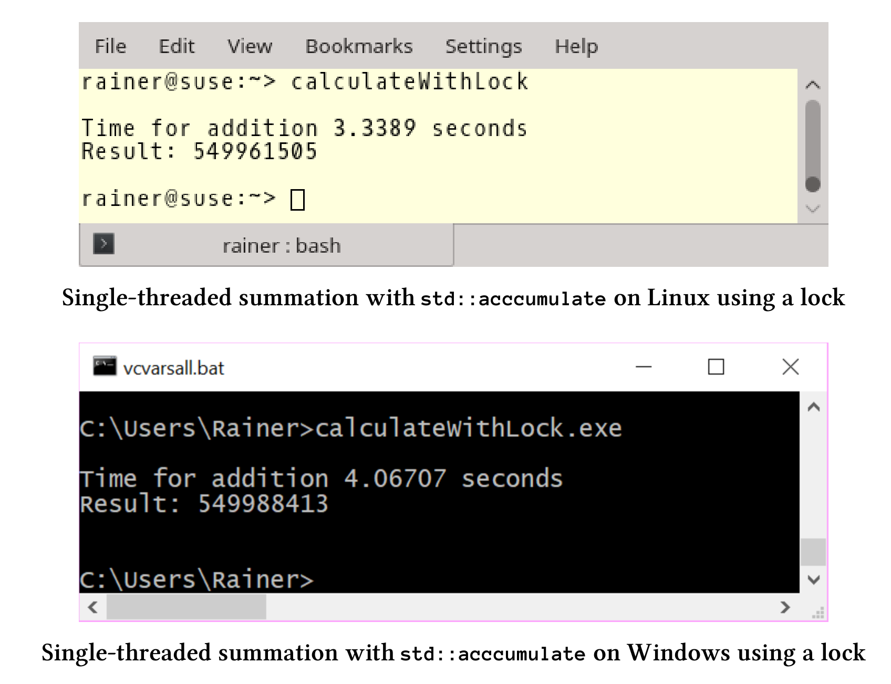

`std::lock_guard`的方式大约比`std::accumulate `慢50-150倍。接下来，让我们来看看原子操作的表现。

**使用原子操作进行保护**

对于原子操作的问题与锁一样：

1. 原子同步的代价有多大?
2. 如果没有竞争，原子操作能有多快?

还有一个问题：原子操作和锁的性能有多大差异?

```c++
// calculateWithAtomic.cpp

#include <atomic>
#include <chrono>
#include <iostream>
#include <numeric>
#include <random>
#include <vector>

constexpr long long size = 100000000;

int main() {

  std::cout << std::endl;

  std::vector<int>randValues;
  randValues.reserve(size);

  // random values
  std::random_device seed;
  std::mt19937 engine(seed());
  std::uniform_int_distribution<> uniformDist(1, 10);
  for (long long i = 0; i < size; ++i)
    randValues.push_back(uniformDist(engine));

  std::atomic<unsigned long long> sum = {};
  std::cout << std::boolalpha << "sum.is_lock_free(): "
    << sum.is_lock_free() << std::endl;
  std::cout << std::endl;

  auto sta = std::chrono::steady_clock::now();

  for (auto i : randValues) sum += i;

  std::chrono::duration<double> dur = std::chrono::steady_clock::now() - sta;


  std::cout << "Time for addition " << dur.count()
    << " seconds" << std::endl;
  std::cout << "Result: " << sum << std::endl;

  std::cout << std::endl;
  
  sum = 0;
  sta = std::chrono::steady_clock::now();

  for (auto i : randValues) sum.fetch_add(i);

  dur = std::chrono::steady_clock::now() - sta;
  std::cout << "Time for addition " << dur.count()
    << " seconds" << std::endl;
  std::cout << "Result: " << sum << std::endl;

  std::cout << std::endl;

}
```

首先，第28行检查是否有锁，否则锁和原子操作就没有区别了。所有主流平台上，原子变量都是无锁的。然后，用两种方法计算加和。第33行使用`+=`操作符，第45行使用`fetch_add`方法。单线程情况下，两种方式相差不多；不过，我可以显式地指定`fetch_add`的内存序。关于这点将在下一小节中详细介绍。

下面是程序的结果。

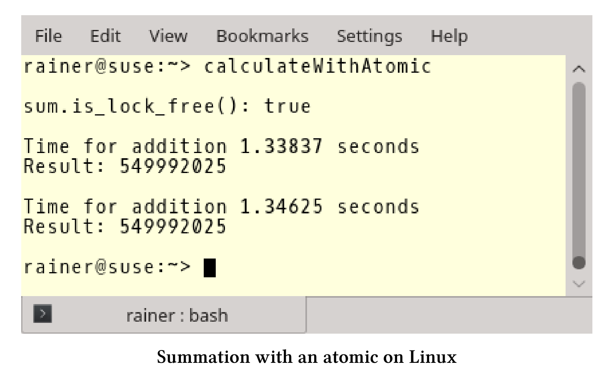

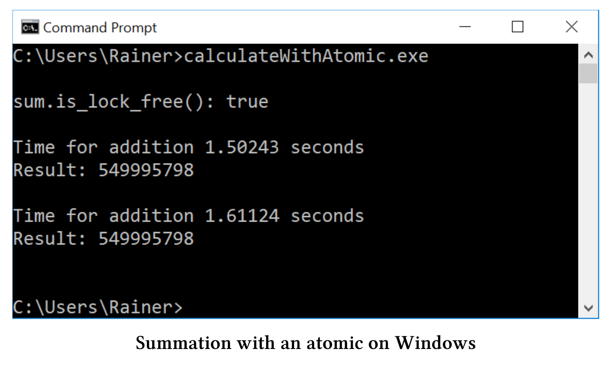

**单线程场景总结**

1. 原子操作在Linux和Windows上的速度比`std::accumulate `要慢12 - 50倍。
2. 在Linux和Windows上，原子操作的速度比锁快2 - 3倍。
3. `std::accumulate`似乎在Windows上有更好的优化。

进行多线程场景测试之前，用表总结了单线程执行的结果，时间单位是秒。

| 操作系统(编译器) | for循环 | `std::accumulate` |  锁  | 原子操作  |
| :--------------: | :-----: | :---------------: | :--: | :-------: |
|    Linux(GCC)    |  0.07   |       0.07        | 3.34 | 1.34/1.33 |
| Windows(cl.exe)  |  0.08   |       0.03        | 4.07 | 1.50/1.61 |

## 多线程：使用共享变量进行求和

使用四个线程并用共享变量进行求和，并不是最优的最优的方式，因为同步开销超过了性能收益。

还是那两个问题：

1. 使用锁和原子的求和方式，在性能上有什么不同?
2. `std::accumulate`的单线程执行和多线程执行的性能表现有什么不同?

**使用`std::lock_guard`**

实现线程安全的求和，最简单方法是使用`std::lock_guard`。

```c++
// synchronisationWithLock.cpp

#include<chrono>
#include <iostream>
#include <mutex>
#include <random>
#include <thread>
#include <utility>
#include <vector>

constexpr long long size = 100000000;

constexpr long long fir = 25000000;
constexpr long long sec = 50000000;
constexpr long long thi = 75000000;
constexpr long long fou = 100000000;

std::mutex myMutex;

void sumUp(unsigned long long& sum, const std::vector<int>& val,
  unsigned long long beg, unsigned long long end) {
  for (auto it = beg; it < end; ++it) {
    std::lock_guard<std::mutex> myLock(myMutex);
    sum += val[it];
  }
}

int main() {

  std::cout << std::endl;

  std::vector<int> randValues;
  randValues.reserve(size);

  std::mt19937 engine;
  std::uniform_int_distribution<> uniformDist(1, 10);
  for (long long i = 0; i < size; ++i)
    randValues.push_back(uniformDist(engine));

  unsigned long long sum = 0;
  const auto sta = std::chrono::steady_clock::now();

  std::thread t1(sumUp, std::ref(sum), std::ref(randValues), 0, fir);
  std::thread t2(sumUp, std::ref(sum), std::ref(randValues), fir, sec);
  std::thread t3(sumUp, std::ref(sum), std::ref(randValues), sec, thi);
  std::thread t4(sumUp, std::ref(sum), std::ref(randValues), thi, fou);

  t1.join();
  t2.join();
  t3.join();
  t4.join();

  std::chrono::duration<double> dur = std::chrono::steady_clock::now() - sta;
  std::cout << "Time for addition " << dur.count()
    << " seconds" << std::endl;
  std::cout << "Result: " << sum << std::endl;

  std::cout << std::endl;

}
```

程序很简单，函数`sumUp`(第20 - 26行)是需要线程完成的工作包。通过引用的方式得到变量`sum`和`std::vector val`，`beg`和`end`用来限定求和的范围，`std::lock_guard`(第23行)用于保护共享变量`sum`。每个线程(第43 - 46行)对四分之一的数据进行加和计算。

下面是我电脑上的性能数据：

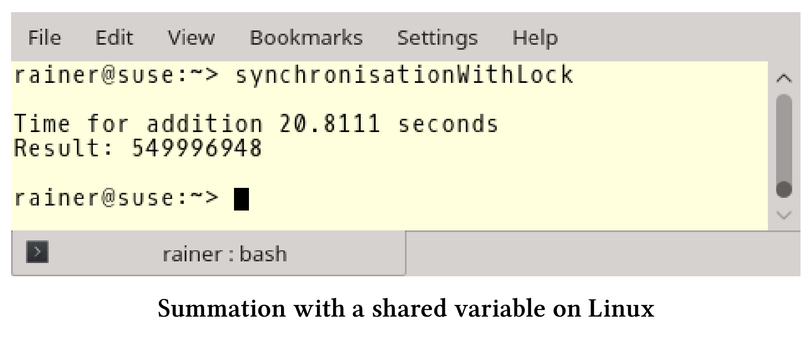

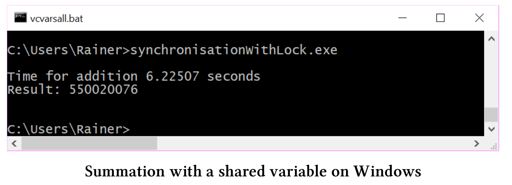

因为`std::lock_guard`需要对行了同步，所以瓶颈在共享变量`sum`处。简单直接的解决方案：用轻量级的原子操作来替换重量级的锁。

> 没有更改，为了简单起见，本小节之后只展示`sumUp`函数体。完整的示例，请参阅本书的参考资料。

**使用原子变量**

求和变量`sum`是一个原子变量，就不再需要`std::lock_guard`。以下是修改后的求和函数。

```c++
// synchronisationWithAtomic.cpp
...
void sumUp(std::atomic<unsigned long long>& sum, const 	std::vector<int>& val,
		unsigned long long beg, unsigned long long end){
	for (auto it = beg; it < end; ++it){
		sum += val[it];
	}
}
```

我的Windows笔记本电脑的性能数据相当奇怪，耗时是使用`std::lock_guard`的两倍多。


除了使用`+=`操作符外，还可以使用`fetch_add`。

**使用fetch_add**

这次，代码的修改的更少，只是将求和表达式改为`sum.fetch_add(val[it])`。

```c++
// synchronisationWithFetchAdd.cpp
...
void sumUp(std::atomic<unsigned long long>& sum, const std::vector<int>& val,
	unsigned long long beg, unsigned long long end){
	for (auto it = beg; it < end; ++it){
		sum.fetch_add(val[it]);
	}
}
...
```

现在的性能与前面的例子相似，操作符`+=`和`fetch_add`之间貌似没有什么区别。

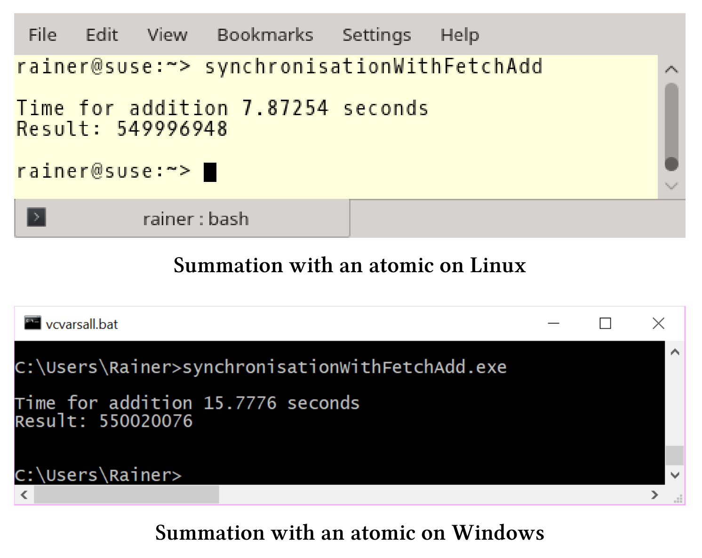

虽然`+=`操作和`fetch_add`在性能上没有区别，但是`fetch_add`有一个优势，可以显式地弱化内存序，并使用自由语义。

**使用自由语义的fetch_add**

```c++
// synchronisationWithFetchAddRelaxed.cpp

...
  void sumUp(std::atomic<unsigned long long>& sum, const std::vector<int>& val,
             unsigned long long beg, unsigned long long end){
  for (auto it = beg; it < end; ++it){
    sum.fetch_add(val[it], std::memory_order_relaxed);
  }
}
  
...
```

原子变量默认是顺序一致的。对于原子变量的加和和赋值，使用`fetch_add`是没问题的，也可以进行优化。我将求和表达式中的内存序调整为自由语义：`sum.fetch_add (val[it],std::memory_order_relaxed)`。自由语义是最弱的内存序，也是我们优化的终点。

这个用例中，自由语义能很好的完成工作，因为`fetch_add`进行的每个加和都是原子的，并且线程会进行同步。

因为是最弱的内存模型，所以性能最好。

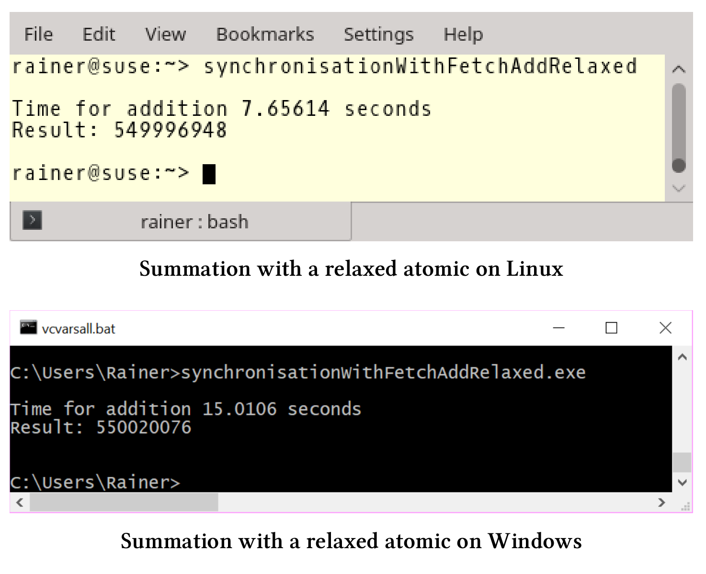

**多线程使用共享变量求和总结**

性能数值的时间单位是秒。

| 操作系统(编译器) | `std::lock_guard` | 原子 += | fetch_add | fetch_add (使用自由内存序) |
| :--------------: | :---------------: | :-----: | :-------: | :------------------------: |
|    Linux(GCC)    |       20.81       |  7.78   |   7.87    |            7.66            |
| Windows(cl.exe)  |       6.22        |  15.73  |   15.78   |           15.01            |

性能数据并不乐观，使用自由语义的共享原子变量，在四个线程的帮助下计算加和，其速度大约比使用`std::accumulate`算法的单个线程慢100倍。

结合前面的两种加和的策略，接下来会使用四个线程，并尽量减少线程之间的同步。

## 线程本地的加和

接下来使用局部变量、线程本地数据和任务，可以最小化同步。

**使用本地变量**

每个线程都使用本地变量求和，所以可以在不同步的情况下完成自己的工作。不过，汇总局部变量的总和时需要进行同步。简单地说：只添加了4个同步，所以从性能的角度来看，使用哪种同步并不重要。我使用`std::lock_guard`和一个具有顺序一致语义和自由语义的原子变量。

**std::lock_guard**

使用`std::lock_guard`进行最小化同步的加和计算。

```c++
// localVariable.cpp

#include <mutex>
#include<chrono>
#include <iostream>
#include <random>
#include <thread>
#include <utility>
#include <vector>

constexpr long long size = 100000000;

constexpr long long fir = 25000000;
constexpr long long sec = 50000000;
constexpr long long thi = 75000000;
constexpr long long fou = 100000000;

std::mutex myMutex;

void sumUp(unsigned long long& sum, const std::vector<int>& val,
  unsigned long long beg, unsigned long long end) {
  unsigned long long tmpSum{};
  for (auto i = beg; i < end; ++i) {
    tmpSum += val[i];
  }
  std::lock_guard<std::mutex> lockGuard(myMutex);
  sum += tmpSum;
}

int main() {

  std::cout << std::endl;

  std::vector<int> randValues;
  randValues.reserve(size);

  std::mt19937 engine;
  std::uniform_int_distribution<> uniformDist(1, 10);
  for (long long i = 0; i < size; ++i)
    randValues.push_back(uniformDist(engine));

  unsigned long long sum{};
  const auto sta = std::chrono::steady_clock::now();

  std::thread t1(sumUp, std::ref(sum), std::ref(randValues), 0, fir);
  std::thread t2(sumUp, std::ref(sum), std::ref(randValues), fir, sec);
  std::thread t3(sumUp, std::ref(sum), std::ref(randValues), sec, thi);
  std::thread t4(sumUp, std::ref(sum), std::ref(randValues), thi, fou);

  t1.join();
  t2.join();
  t3.join();
  t4.join();

  std::chrono::duration<double> dur = 
    std::chrono::steady_clock::now() - sta;


  std::cout << "Time for addition " << dur.count()
    << " seconds" << std::endl;
  std::cout << "Result: " << sum << std::endl;

  std::cout << std::endl;

}
```

第26和27行，将局部求和结果`tmpSum`添加到全局求和变量`sum`中。

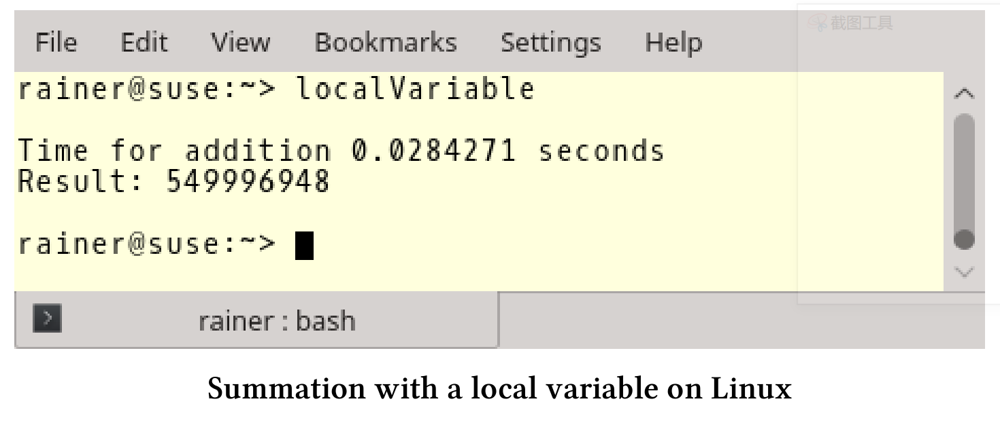

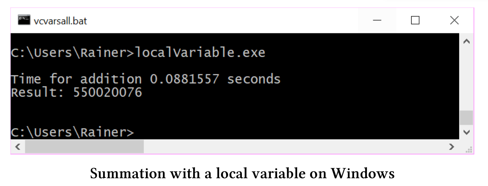

接下来使用局部变量的示例中，只有函数求和方式发生了变化，所以只展示这个函数体实现。完整的程序代码，请参考源文件。

**使用顺序一致语义的原子变量**

让我们用一个原子变量来声明全局求和变量`sum`。

```c++
// localVariableAtomic.cpp
...
void sumUp(std::atomic<unsigned long long>& sum, const std::vector<int>& val,
           unsigned long long beg, unsigned long long end){
  unsigned int long long tmpSum{};
  for (auto i = beg; i < end; ++i){
    tmpSum += val[i];
  }
  sum+= tmpSum;
}
...
```

下面是具体的性能数据：

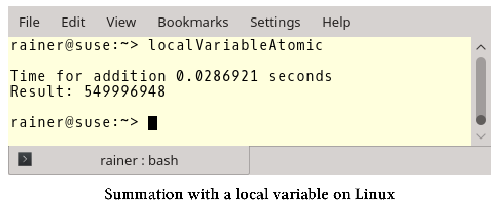

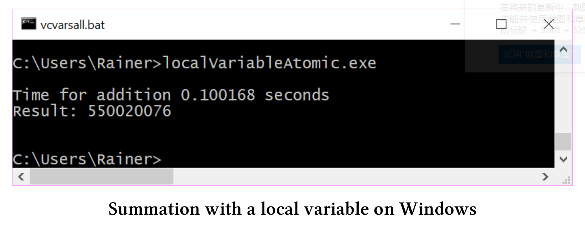

**使用自由语义的原子变量**

现在不使用默认的内存序，而使用的是自由语义。只需要保证，所有求和操作是原子的就好。

```c++
// localVariableAtomicRelaxed.cpp
...
void sumUp(std::atomic<unsigned long long>& sum, const std::vector<int>& val,
           unsigned long long beg, unsigned long long end){
  unsigned int long long tmpSum{};
  for (auto i = beg; i < end; ++i){
    tmpSum += val[i];
  }
  sum.fetch_add(tmpSum, std::memory_order_relaxed);
}
...
```

和预期一样，使用`std::lock_guard`，使用顺序一致的原子变量，或是使用自由语义的原子变量进行求和，在性能方面并没什么差异。

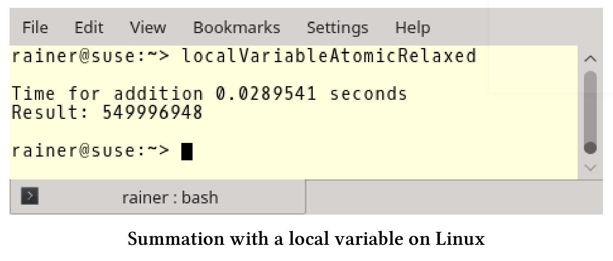

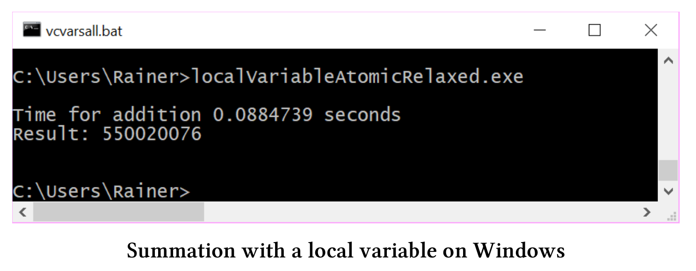

线程本地数据不同于其他类型的数据，它的生命周期与线程绑定，并非函数的生命周期，例如：本例中的变量`tmpSum`。

**使用线程本地数据**

线程本地数据属于创建它的线程，其只在需要时被创建，非常适合于本地求和。

```c++
// threadLocalSummation.cpp

#include <atomic>
#include<chrono>
#include <iostream>
#include <random>
#include <thread>
#include <utility>
#include <vector>

constexpr long long size = 100000000;

constexpr long long fir = 25000000;
constexpr long long sec = 50000000;
constexpr long long thi = 75000000;
constexpr long long fou = 100000000;

thread_local unsigned long long tmpSum = 0;

void sumUp(std::atomic<unsigned long long>& sum, const std::vector<int>& val,
  unsigned long long beg, unsigned long long end) {
  for (auto i = beg; i < end; ++i) {
    tmpSum += val[i];
  }
  sum.fetch_add(tmpSum, std::memory_order_relaxed);
}

int main() {

  std::cout << std::endl;

  std::vector<int> randValues;
  randValues.reserve(size);

  std::mt19937 engine;
  std::uniform_int_distribution<> uniformDist(1, 10);
  for (long long i = 0; i < size; ++i)
    randValues.push_back(uniformDist(engine));

  std::atomic<unsigned long long> sum{};
  const auto sta = std::chrono::steady_clock::now();

  std::thread t1(sumUp, std::ref(sum), std::ref(randValues), 0, fir);
  std::thread t2(sumUp, std::ref(sum), std::ref(randValues), fir, sec);
  std::thread t3(sumUp, std::ref(sum), std::ref(randValues), sec, thi);
  std::thread t4(sumUp, std::ref(sum), std::ref(randValues), thi, fou);

  t1.join();
  t2.join();
  t3.join();
  t4.join();

  std::chrono::duration<double> dur = 
    std::chrono::steady_clock::now() - sta;

  std::cout << "Time for addition " << dur.count()
    << " seconds" << std::endl;
  std::cout << "Result: " << sum << std::endl;

  std::cout << std::endl;

}
```

第18行中声明了线程本地变量`tmpSum`，并在第23和25行中使用它进行加和。

下面是使用本地变量加和的性能数据：

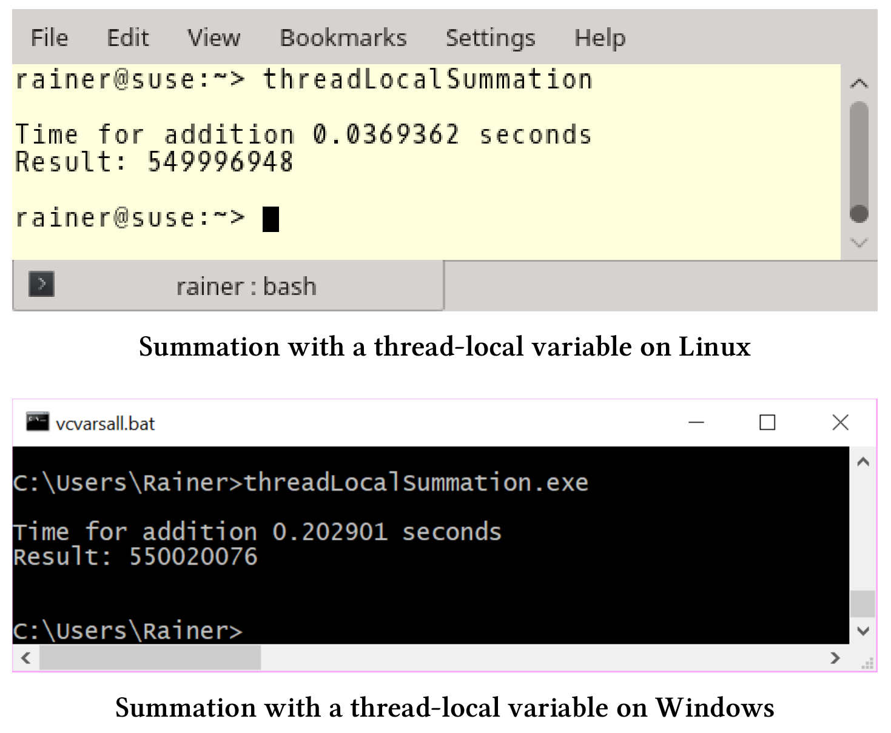

最后，来看下如何使用任务(task)完成这项工作。

**使用任务**

使用任务，我们可以使用隐式同步完成整个工作。每个部分求和在单独的线程中执行，最后在主线程中进行求和。

代码如下：

```c++
// tasksSummation.cpp

#include<chrono>
#include <future>
#include <iostream>
#include <random>
#include <thread>
#include <utility>
#include <vector>

constexpr long long size = 100000000;

constexpr long long fir = 25000000;
constexpr long long sec = 50000000;
constexpr long long thi = 75000000;
constexpr long long fou = 100000000;

void sumUp(std::promise<unsigned long long>&& prom, const std::vector<int>& val,
  unsigned long long beg, unsigned long long end) {
  unsigned long long sum = {};
  for (auto i = beg; i < end; ++i) {
    sum += val[i];
  }
  prom.set_value(sum);
}

int main() {

  std::cout << std::endl;

  std::vector<int> randValues;
  randValues.reserve(size);

  std::mt19937 engine;
  std::uniform_int_distribution<> uniformDist(1, 10);
  for (long long i = 0; i < size; ++i)
    randValues.push_back(uniformDist(engine));

  std::promise<unsigned long long> prom1;
  std::promise<unsigned long long> prom2;
  std::promise<unsigned long long> prom3;
  std::promise<unsigned long long> prom4;

  auto fut1 = prom1.get_future();
  auto fut2 = prom2.get_future();
  auto fut3 = prom3.get_future();
  auto fut4 = prom4.get_future();

  const auto sta = std::chrono::steady_clock::now();

  std::thread t1(sumUp, std::move(prom1), std::ref(randValues), 0, fir);
  std::thread t2(sumUp, std::move(prom2), std::ref(randValues), fir, sec);
  std::thread t3(sumUp, std::move(prom3), std::ref(randValues), sec, thi);
  std::thread t4(sumUp, std::move(prom4), std::ref(randValues), thi, fou);

  auto sum = fut1.get() + fut2.get() + fut3.get() + fut4.get();

  std::chrono::duration<double> dur = std::chrono::steady_clock::now() - sta;
  std::cout << "Time for addition " << dur.count()
    << " seconds" << std::endl;
  std::cout << "Result: " << sum << std::endl;

  t1.join();
  t2.join();
  t3.join();
  t4.join();

  std::cout << std::endl;

}
```

第39 - 47行定义了四个promise和future。第51 - 54行中，每个promise都被移动到线程中。promise只能移动，不能复制。`sumUp`的第一个参数使用右值引用的promise。future在第56行使用阻塞的`get`获取求和结果。

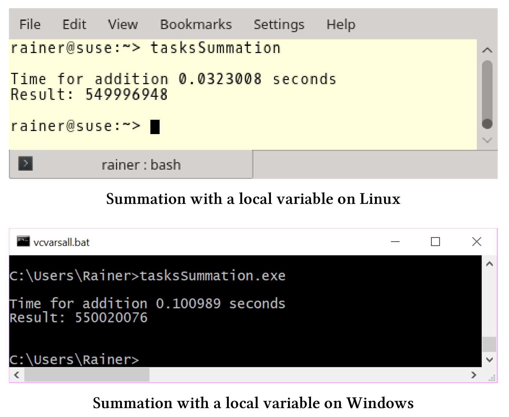

**所有线程本地求和场景的总结**

无论是使用局部变量，任务来部分求和，还是各种同步原语(如原子)，性能上好像没有太大的区别，只有线程本地数据似乎让程序变慢了一些。这个观察结果适用于Linux和Windows，不要对Linux相对于Windows的更高性能感到惊讶。别忘了，Linux的电脑上有4个核，而Windows笔记本电脑只有2个核。

| 操作系统(编译器) | `std::lock_guard` | 使用顺序一致语义的原子变量 | 使用自由语义的原子变量 | 线程本地数据 | 任务 |
| ---------------- | :---------------: | :------------------------: | :--------------------: | ------------ | ---- |
| Linux(GCC)       |       0.03        |            0.03            |          0.03          | 0.04         | 0.03 |
| Windows(cl.exe)  |       0.10        |            0.10            |          0.10          | 0.20         | 0.10 |

多线程的本地求和的速度，大约是单线程求和的两倍。因为线程之间几乎不需要同步，所以在最优的情况下，我认为性能会提高四倍。背后的根本原因是什么？

## 总结：求向量元素的加和

**单线程**

基于for循环和STL算法`std::accumulate`的性能差不多。优化版本中，编译器会使用向量化的[SIMD](https://en.wikipedia.org/wiki/SIMD)指令(SSE或AVX)用于求和。因此，循环计数器增加了4(SSE)或8(AVX)。

**使用共享变量多线程求和**

使用共享变量作为求和变量，可以说明了一点：同步操作是代价是非常昂贵的，应该尽可能避免。虽然我使用了原子变量，甚至打破了顺序一致性，但这四个线程比一个线程还要慢100倍。从性能角度考虑，要尽可能减少同步。

**线程本地求和**

线程本地求和仅比单线程for循环或`std::accumulate`快两倍，即使四个线程都可以独立工作，这种情况仍然存在。这也让我很惊讶，因为我原以为会有四倍的性能提升。更让我惊讶的是，电脑的四个核心并没有充分利用。

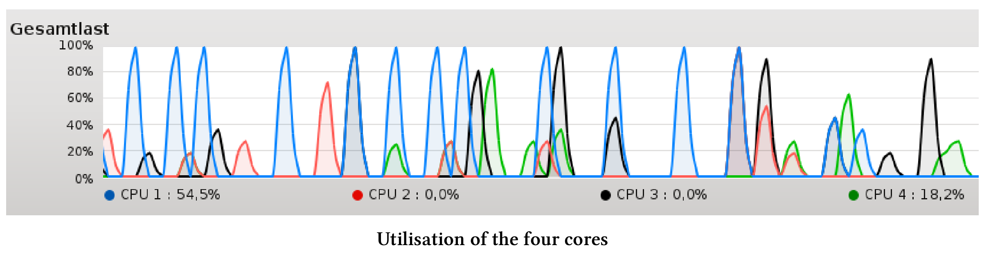

没有充分利用的原因也很简单，CPU无法快速地从内存中获取数据。程序执行是有[内存限制]( https://en.wikipedia.org/wiki/Memory_bound_function)的，或者说内存延迟了CPU核的计算速度。下图展示了计算时的瓶颈内存。

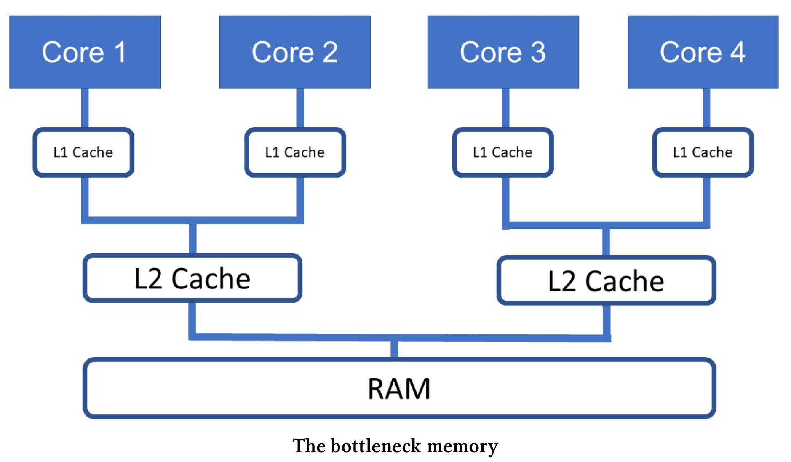

[Roofline模型](https://en.wikipedia.org/wiki/Roofline_model)是一种直观的性能模型，可对运行在多核或多核体系结构上的应用程序进行性能评估。该模型依赖于体系结构的峰值性能、峰值带宽和计算密度。