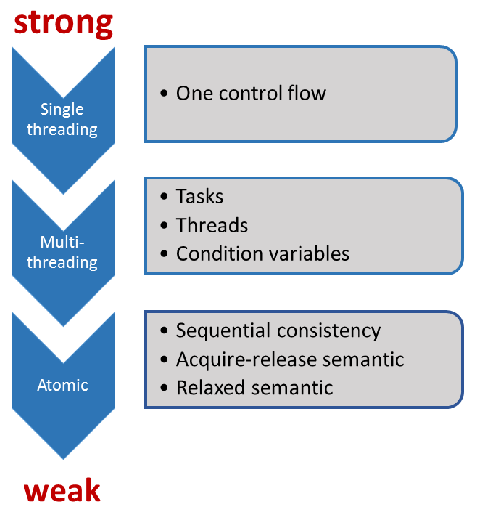

# 编程协议

协议约定的双方为：开发者和系统。系统由生成机器码的编译器、执行机器码的处理器和存储程序状态的缓存组成。每个部分可以进行优化，例如：编译器可以使用寄存器或修改循环，处理器可以乱序执行或分支预测，缓存指令可以预取或缓冲。生成的(在好的情况下)可执行文件，可以针对硬件平台进行了优化。确切地说，这里不只有一个协议，而是一组(细粒度的)协议。换句话说：遵循越弱的规则，程序的优化潜力越大。

有一个经验法则是：协议越强，优化的空间越少。当程序开发者使用弱协议或弱内存模型时，相应就会有许多优化选择。结果是，这个项目只能由少数专家来维护，而你我可能都不属于专家的范畴。

粗略地说，C++11中有三个协议级别。

C++11之前，C++不包括多线程或原子。系统只遵循控制流，因此优化的潜力非常有限。该系统的关键是，保证程序开发者所观察到的程序行为，与源代码中指令的顺序一致。当然，这就意味着没有内存模型，只有序列点。序列点是程序中的点，在这些点上的所有指令的效果是可见的，函数执行的开始或结束都是序列点。当使用两个参数调用一个函数时，C++并不保证先计算哪个参数，因此其行为是未指定的，原因很简单——逗号操作符不是序列点。

C++11中，这些都发生了变化。C++11是C++第一个支持多线程的标准。C++内存模型深受[Java内存模型]( https://en.wikipedia.org/wiki/Java_memory_model)的影响，不过C++内存模型做了很多改进。为了得到定义良好的程序，程序开发者在处理共享变量时必须遵守规则。如果存在数据竞争，则程序的行为是未定义的。如前所述，如果线程共享可变数据，必须注意数据竞争。

在使用原子操作的时候，经常会讨论无锁编程。我在本节中谈到了弱规则和强规则，其中原子操作的顺序一致语义被称为**强内存模型**，原子操作的自由语义被称为**弱内存模型**。

## 基础

C++内存模型需要保证以下操作：

* 原子操作：不受中断地执行。
* 部分排序操作：操作序列的顺序不能重排。
* 可见操作：保证共享变量上的操作对其他线程可见。

协议基础是针对原子操作的，其特点是原子的、不可分割的，并且在执行上会创建同步和约束顺序。当然，同步和约束顺序也适用于非原子的操作。一方面，原子类型上的操作总是原子的；另一方面，可以根据需要定制同步和约束顺序。

## 挑战

内存模型越弱，就能把越多的注意力转放到其他事情上，比如：

* 优化潜力。
* 控制流数量。
* 了解更多底层的知识。
* 程序行为与我们的预期是否一致。
* 更加微观的优化。

我们应该是处理多线程的专家。如果想要处理原子(顺序一致)操作，我们应该打开通向下一个专业级别的大门。想要知道使用获得-释放语义或自由语义时会发生什么，就得向下一个境界迈进了。

我们从无锁编程开始，深入研究C++内存模型。当完成了基础知识的了解后，就要开始真正接触内存模型了。我们的起点是顺序一致语义，接着是获得-释放语义，而自由语义则作为旅程的终章。

现在，开启我们的原子操作之旅吧！