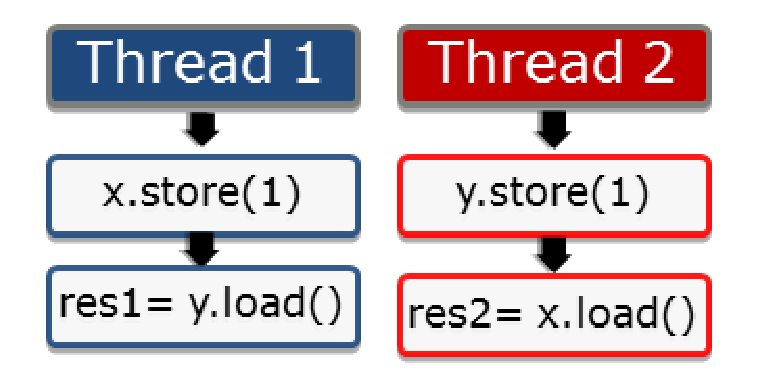
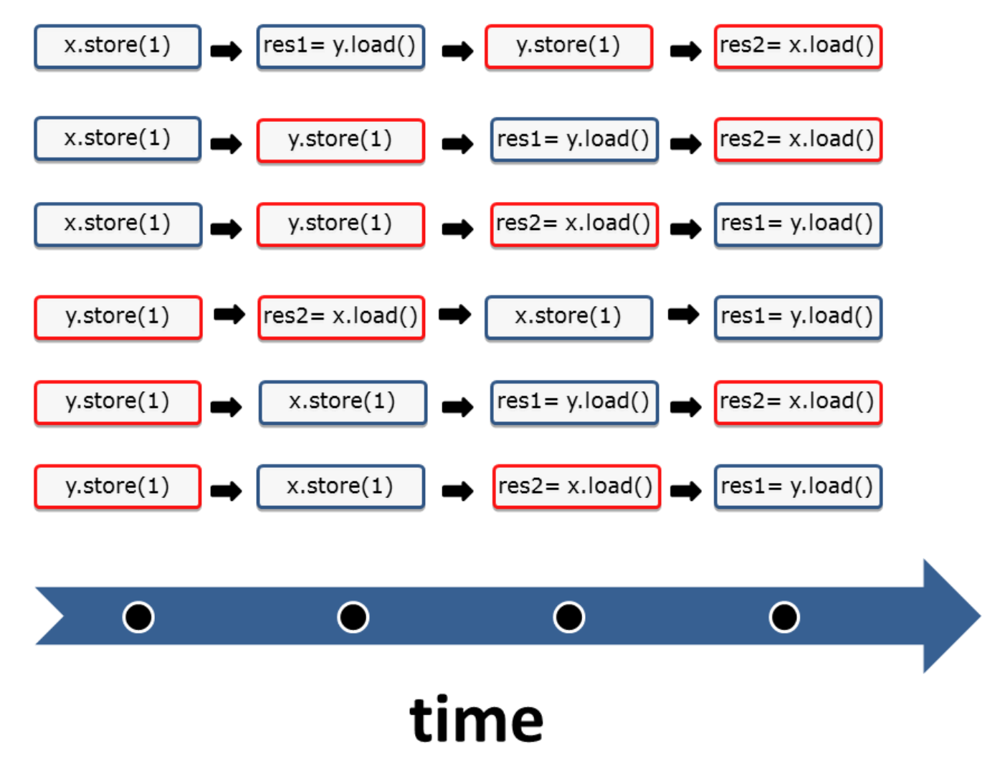
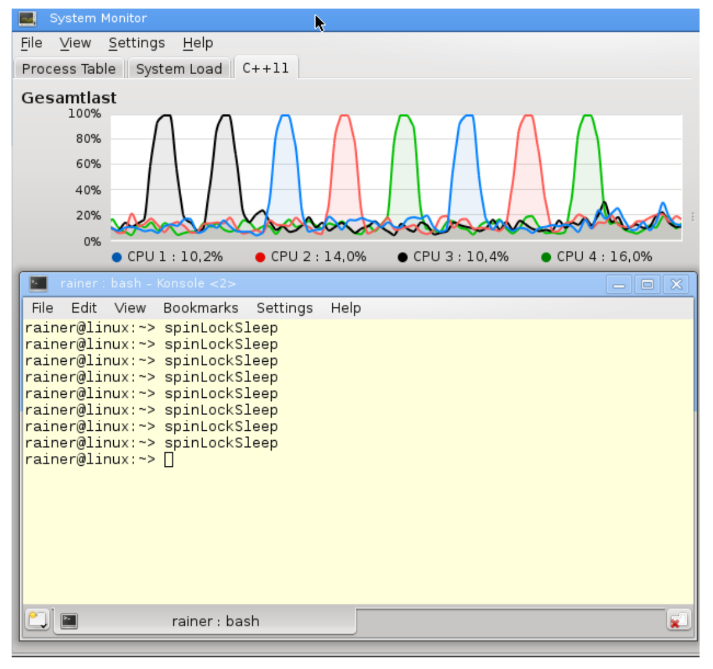
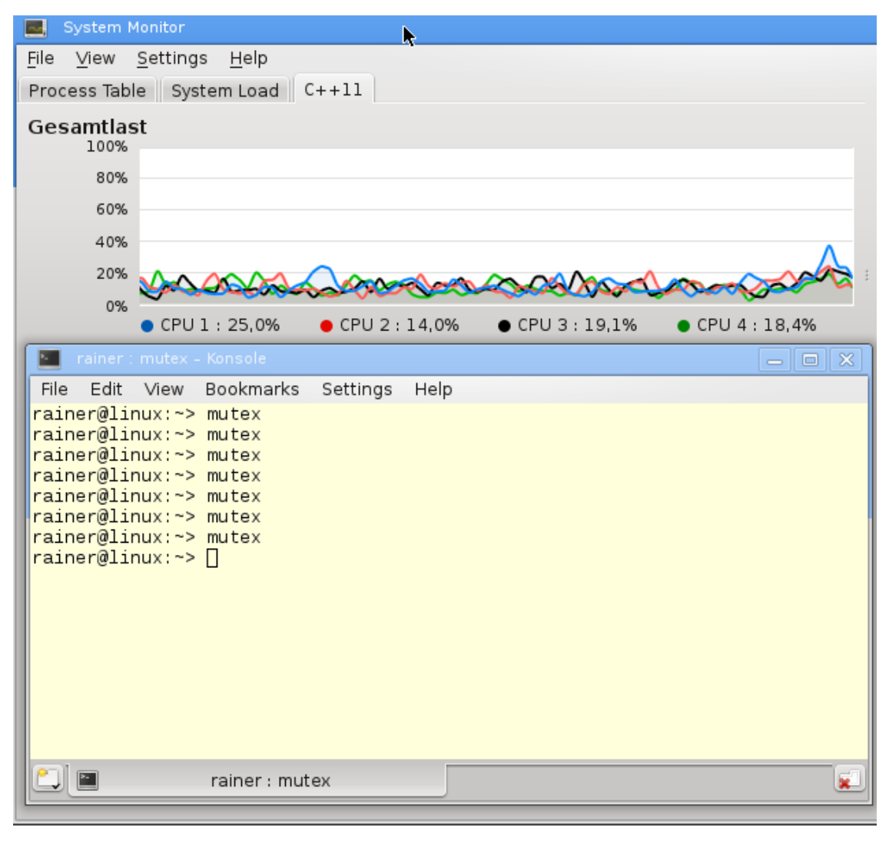
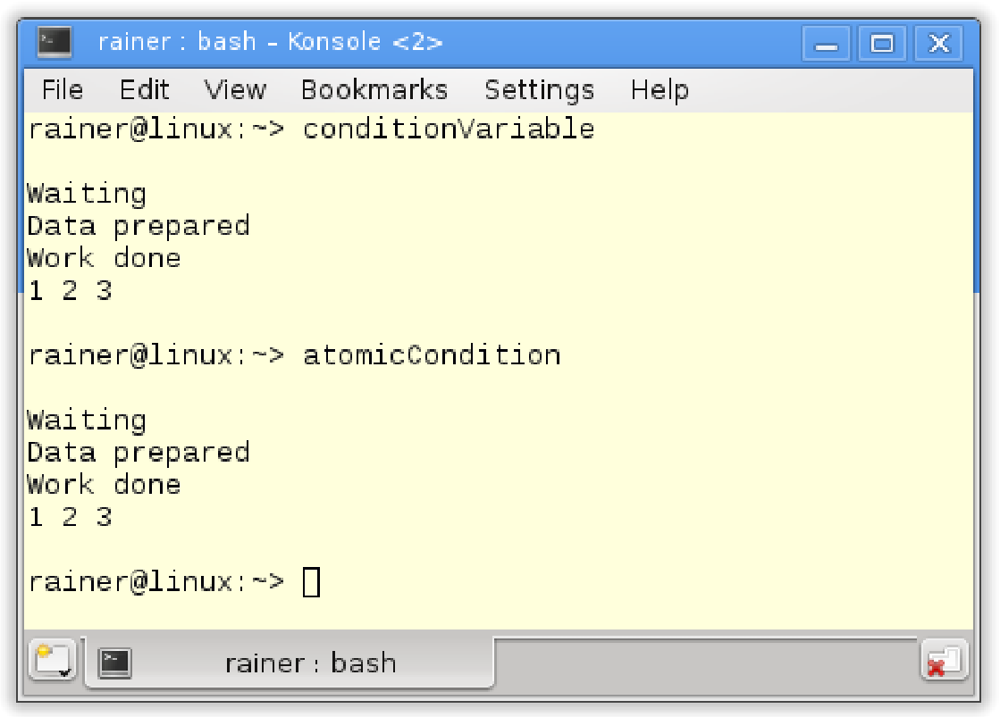

# 原子操作

原子操作是C++内存模型的基础。默认情况下，原子操作基于强内存模型的支持，所以理解强内存模型很有意义。

##强/弱内存模型

您可能已经从编程协议的章节中了解到：顺序一致语义是强内存模型，自由语义是弱内存模型。

###强内存模型

2004年，Java 5.0有了内存模型。2011年，C++添加了内存模型。在此之前，Java有个错误的内存模型，而C++则没有内存模型，而多线程编程已经有40~50年的历史了。在1979年时，[Leslie Lamport](https://en.wikipedia.org/wiki/Leslie_Lamport) 就定义了顺序一致的概念。

顺序一致有两个特点:

* 指令按源码顺序执行。
*  线程上的所有操作都遵循一个全局顺序。

深入研究这两个特点之前，我想强调一下，这些声明只适用于原子操作，但影响并不仅对原子操作而言。

下面图形显示了两个线程。每个线程分别将值存储到变量`x`或`y`中，获取另一个变量`y`或`x`，并存储在变量`res1`或`res2`中。



通常，原子操作是顺序一致的。问题是：这些语句以什么顺序执行?

顺序一致的第一个特点：指令按照源码中的顺序执行。任何存储操作都无法在获取操作之前进行。

顺序一致的第二个特点：所有线程的指令必须遵循全局顺序。上图中的情况，线程2看到线程1的操作的顺序与线程1执行它们的顺序相同。线程2按照线程1的源码顺序查看线程1的所有操作，从线程1的角度来看也是如此。可以将这个特性，想象成一个所有线程都必须遵循的全局时钟(全局时钟就是全局顺序)。时钟每发出一次滴答声，就会发生一个原子操作，但永远不知道执行的是哪个。

解谜还没有结束。我们仍然需要观察，两个线程交错运行的方式。两个线程有以下六种交替运行的方式。



很简单，对吧？这就是顺序一致语义，也称为**强内存模型**。

### 弱内存模型

我们再参考一下开发者和系统之间的协议。

这个特殊的例子中，开发者使用了原子操作(开发者遵循协议)。系统保证了程序的行为，从而不会存在数据竞争。另外，系统可以在每个组合中执行四个操作。如果开发者使用自由语义，协议的基础部分就会发生巨大的变化。一方面，开发者可能很难理解两个线程之间的交错；另一方面，系统有更大的优化空间。

使用自由语义(也称为弱内存模型)，可使这四种操作有更多的组合。有种很难理解的行为是，线程1可以以不同的顺序查看线程2的操作，这样全局顺序就不存在了。从线程1的角度来看，操作`res2= x.load()`可能在`y.store(1)`之前执行。甚至是，线程1或线程2没有按照源代码中的顺序执行。例如，线程2可以先执行`res2= x.load()`，再执行`y.store(1)`。

“序列一致语义”和“自由语义”之间还有存在其他内存模型，其中最重要的是“获取-释放语义“。“获取-释放语义”中，开发人员需要遵守比“顺序一致语义”弱的规则。这样，系统有了更多优化空间。因为线程在特定同步点上进行同步，所以“获取-释放语义“是理解多线程编程中，同步和部分排序的关键。没有同步点，就不可能有(定义良好的)线程、任务或条件变量。

上一节中，介绍了原子操作的默认行为——顺序一致(为每个原子操作指定内存顺序)。如果没有指定内存顺序，则应用保持顺序一致，这意味着`std::memory_order_seq_cst`将默认应用于每个原子操作。

下面两端段代码是等价的：

```c++
x.store(1);
res = x.load();
```

```c++
x.store(1, std::memory_order_seq_cst);
res = x.load(std::memory_order_seq_cst);
```

简单起见，本书使用第一种形式。现在，来深入了解C++内存模型原子性，先从`std::atomic_flag`开始吧。

## 原子标志

`std::atomic_flag`是原子布尔类型，可以对其状态进行设置和清除。为了简化说明，我将`clear`状态称为`false`，将`set`状态称为`true`。`clear`方法可将其状态设置为`false`。`test_and_set`方法，可以将状态设置回`true`，并返回先前的值。这里，没有方法获取当前值。使用`std::atomic_flag`时，必须使用常量`ATOMIC_FLAG_INIT`将`std::atomic_flag`初始化为`false`。

> **ATOMIC_FLAG_INIT**
>
> `std::atomic_flag`需要初始化时，可以是这样：`std::atomic_flag flag = ATOMIC_FLAG_INIT`。
>
> 不过，不能这样进行初始化：`std::atomic_flag flag(ATOMIC_FLAG_INIT) `。

`std::atomic_flag`有两个特点：

* 无锁原子类型。程序是系统级别进程的话，执行的非阻塞算法就是无锁的。
* 更高级别的线程构建块。

除了`std::atomic_flag`之外，C++标准中的原子内部都会使用互斥锁。这些原子类型有一个`is_lock_free`成员函数，可用来检查原子内部是否使用了互斥锁。时下主流的微处理器架构上，都能得到“使用了互斥锁”的结果。如果想要无锁编程，那么就要使用该成员函数进行检查，确定是否使用了锁。

> **`std::is_always_lock_free`**
>
> 可以使用`obj.is_lock_free()`，在运行时检查原子类型的实例`obj`是否无锁。在C++17中，可以通过`constexpr`(常量)[`atomic<type>::is_always_lock_free`](https://zh.cppreference.com/w/cpp/atomic/atomic/is_always_lock_free)，在编译时对每个原子类型进行检查，支持该操作的所有硬件实现都无锁时，才返回true。

`std::atomic_flag`的接口非常强大，能够构建自旋锁。自旋锁可以像使用互斥锁一样保护临界区。

> **自旋锁**
>
> 自旋锁与互斥锁不同，它并不获取锁。而是，通过频繁地请求锁来获取临界区的访问权。不过，这会导致上下文频繁切换(从用户空间到内核空间)，虽然充分使用了CPU，但也浪费了非常多的时钟周期。线程短时间阻塞时，自旋锁非常有效。通常，会将自旋锁和互斥锁组合着使用。首先，在有限的时间内使用自旋锁；如果不成功，则将线程置于等待(休眠)状态。
>
> 自旋锁不应该在单处理器系统上使用。否则，自旋锁就不仅浪费了资源，而且还会减慢程序处理的速度(最好的情况)，或出现死锁(最坏的情况)。

下面的代码，使用`std::atomic_flag`实现了自旋锁。

```c++
// spinLock.cpp

#include <atomic>
#include <thread>

class Spinlock{
  std::atomic_flag flag = ATOMIC_FLAG_INIT;
public:
  
  void lock(){
    while(flag.test_and_set());
  }
  
  void unlock(){
    flag.clear();
  }
  
};

Spinlock spin;

void workOnResource(){
  spin.lock();
  // shared resource
  spin.unlock();
}


int main(){
  
  std::thread t(workOnResource);
  std::thread t2(workOnResource);
  
  t.join();
  t2.join();
  
}
```

线程`t`和`t2`(第31行和第32行)在争夺临界区的访问权。这里的自旋锁是如何工作的呢？自旋锁也有锁定和解锁的阶段。

当线程`t`执行函数`workOnResource`时，可能会发生以下情况：

1.  线程`t`获取锁，若第11行的标志初始值为false，则锁调用成功。这种情况下，线程`t`的原子操作将其设置为true。所以，当`t`线程获取锁后，true将会让while陷入死循环，使得线程`t2`陷入了激烈的竞争当中。线程`t2`不能将标志设置为false，因此`t2`必须等待，直到线程`t1`执行`unlock`(解锁)并将标志设置为false(第14 - 16行)时，才能获取锁。
2.  线程`t`没有得到锁时，情况1中的`t2`一样，需要等待。

我们将注意力放在`std::atomic_flag`的`test_and_set`成员函数上。`test_and_set`函数包含两个操作：读和写。原子操作就是对这两种操作进行限制。如果没有限制，线程将对共享资源同时进行读和写(第24行)，根据定义，这就属于“数据竞争”，程序还会有未定义行为发生。

将自旋锁的主动等待和互斥锁的被动等待做一下比较。

### 自旋锁 vs. 互斥锁

如果函数`workOnResource`在第24行停顿2秒，那CPU负载会发生怎样的变化?

```c++
// spinLockSleep.cpp

#include <atomic>
#include <thread>

class Spinlock{
  std::atomic_flag flag = ATOMIC_FLAG_INIT;
public:
  
  void lock(){
    while(flag.test_and_set());
  }
  
  void unlock(){
    flag.clear();
  }
  
};

Spinlock spin;

void workOnResource(){
  spin.lock();
  std::this_thread::sleep_for(std::chrono::milliseconds(2000));
  spin.unlock();
}

int main(){
  
  std::thread t(workOnResource);
  std::thread t2(workOnResource);
  
  t.join();
  t2.join();
  
}
```

如下图所示，四个核中每次有一个是跑满了的。



我的PC上有一个核的负载达到100%，每次不同的核芯执行”忙等待“。

我现在用互斥锁来替换自旋锁。让我们看下会发生什么。

```c++
// mutex.cpp

#include <mutex>
#include <thread>

std::mutex mut;

void workOnResource(){
  mut.lock();
  std::this_thread::sleep_for(std::chrono::milliseconds(5000));
  mut.unlock();
}

int main(){
  
  std::thread t(workOnResource);
  std::thread t2(workOnResource);
  
  t.join();
  t2.join();
  
}
```

虽然执行了好几次，但是并没有观察到任何一个核上有显著的负载。

这样就能看出二者的区别了吧。



接下来，了解下`std::atomic`模板。

##  `std::atomic`模板

`std::atomic`有各种变体。

直接使用模板类：`std::atomic<bool>`和`std::atomic<user-defined type>`。

部分特化可用于指针类：`std::atomic<T*>`。

完全特化只能用于整型：`std::atomic<integral type>`。

布尔原子类型和用户定义原子类型具有相同的接口，原子指针扩展了布尔原子类型，以及整数原子类型的接口。因其扩展了原子指针的接口，所以同样适用于整数原子类型。

不过，不保证`std::atomic`的各种变体都是无锁的。

先从最简单的`std::atomic<bool>`开始吧。

### `std::atomic<bool>`

`std::atomic<bool>`的功能比`std::atomic_flag`强大很多。并且，可以显式地将其设置为true或false。

> **原子类型不可为volatile**
>
> C#和Java中的`volatile`与C++中的`volatile`不同，这也是`volatile`和`std::atomic`之间的区别。
>
> * `volatile`：表示不允许对特定的对象进行读写优化。
>* `std::atomic`：用来定义线程安全的原子变量。
> 
> `volatile`在Java和C#中，与`std::atomic`在C++中的含义相同。另外，在C++多线程语义中，没有`volatile`。
>
> `volatile`多应用于嵌入式编程中，表示可以(独立于常规程序流)进行更改的对象，例如：表示外部设备的对象(内存映射I/O)。由于这些对象可以更改，并且会直接写入主存中，因此不会在缓存中进行优化存储。

这对于同步两个线程已经足够了，可以用`std::atomic<bool>`实现条件变量。

因此，先使用条件变量。

```c++
// conditionVariable.cpp

#include <condition_variable>
#include <iostream>
#include <thread>
#include <vector>

std::vector<int> mySharedWork;
std::mutex mutex_;
std::condition_variable condVar;

bool dataReady{false};

void waitingForWork(){
  std::cout << "Waiting " << std::endl;
  std::unique_lock<std::mutex> lck(mutex_);
  condVar.wait(lck, []{return dataReady;});
  mySharedWork[1] = 2;
  std::cout << "Work done " << std::endl;
}

void setDataReady(){
  mySharedWork = {1, 0, 3};
  {
    std::lock_guard<std::mutex> lck(mutex_);
    dataReady = true;
  }
  std::cout << "Data prepared" << std::endl;
  condVar.notify_one();
}

int main(){
  std:cout << std::endl;
  
  std::thread t1(waitingForWork);
  std::thread t2(setDataReady);
  
  t1.join();
  t2.join();
  
  for (auto v : mySharedWork){
    std::cout << v << " ";
  }
  
  std::cout << "\n\n";
}
```

简单说一下这段代码。线程`t1`在(第17行)等待线程`t2`的通知。两个线程使用相同的条件变量`condVar`，并在同一个互斥锁上进行同步。工作流如下所示：

* 线程t1
  * 获取锁`lck`时，等待数据准备好的通知 `condVar.wait(lck, []{ return dataReady; })` 。
  * 得到通知后，执行`mySharedWork[1] = 2`。

* 线程t2
  * 准备数据`mySharedWork = {1, 0, 3}`
  * 将非原子布尔类型的`dataReady`置为true。
  * 通过`condVar.notify_one`发布通知。

线程`t2`将`dataReady`设置为true，线程`t1`使用Lambda表达式对`dataReady`进行检查。不过，条件变量可能会出现两种不好的情况:

1. 伪唤醒：接受者在没有收到通知时被唤醒。
2. 未唤醒：接收方在未处于等待状态时获得通知。

使用`std::atomic<bool> `进行实现：

```c++
// atomicCondition.cpp

#include <atomic>
#include <chrono>
#include <iostream>
#include <thread>
#include <vector>

std::vector<int> mySharedWork;
std::atomic<bool> dataReady(false);

void waitingForWork(){
  std::cout << "Waiting " << std::endl;
  while(!dataReady.load()){
    std::this_thread::sleep_for(std::chrono::milliseconds(5)); 
  }
  mySharedWork[1] = 2;
  std::cout << "Work done " << std::endl;
}

void setDataReady(){
  mySharedWork = {1,0,3};
  dataReady = true;
  std::cout << "Data prepared" << std::endl;
}

int main(){
  
  std::cout << std::endl;
  
  std::thread t1(waitingForWork);
  std::thread t2(setDataReady);
  
  t1.join();
  t2.join();
  
  for (auto v : mySharedWork){
    std::cout << v << " "; 
  }
  
  std::cout << "\n\n";
}
```

如何保证第17行在第14行之后执行？或者说，线程`t1`在线程`t2`执行`mySharedWork ={1,0,3}`(第22行)后，执行`mySharedWork[1] = 2`(第17行)。

* 第22行先于第23行执行。
* 第14行先于第17行执行。
* 第14、23行与第14行同步
* 因为同步建立了先行关系，并且先行关系可以传递，所以`mySharedWork = {1,0,3}`先于`mySharedWork[1] = 2`执行。

很容易理解，对吧？简单起见，忽略同步创建的线程间先行关系，以及线程间已建立的先行关系。如果对这里的细节感兴趣，可以参考这里：[内存序(memory_order)](http://en.cppreference.com/w/cpp/atomic/memory_order)。

两段程序产生了相同的结果。



> **推拉原理**
>
> 条件变量的同步与`std::atomic<bool>`之间有一个关键性的区别。条件变量会让线程等待通知(`condVar.notify()`)。检查`std::atomic<bool>`的线程，只是为了确定发送方是否完成了其工作(`dataRead = true`)。
>
> 条件变量通知等待线程对应为"推原则(push principle)"，而原子布尔值的重复轮询对应为"拉原则(pull principle)"。

`std::atomic<bool>`和`std::atomic`的其他全/偏特化都支持的原子操作：`compare_exchange_strong`和`compare_exchange_strong`。

> **compare_exchange_strong和compare_exchange_weak** 
>
> compare_exchange_strong的声明为`bool compare_exchange_strong(T& expected, T& desired)`。此操作为比较和交换，因此也称为比较-交换(compare and swap，CAS)操作。这种操作在许多编程语言中都有用到，并且是非阻塞算法的基础。当然，C++中的行为可能会与其他语言不同。`atomicValue.compare_exchange_strong(expected, desired)`具有以下行为。
>
> *  如果`atomicValue`的值与期望值(expected)的比较返回true，则将`atomicValue`设置为所需值(desired)。
>* 如果比较返回false，则将expected值设置为`atomicValue`的值。
> 
> compare_exchange_strong称为**strong**的原因显而易见。当然，还有一个compare_exchange_weak，**weak**版本可能会伪失败。这意味着，虽然`*atomicValue == expected`成立，但`atomicValue`没有被设置成`desired`，函数返回`false`，因此必须在循环中进行检查：`while (!atomicValue.compare_exchange_weak(expected, desired))`。弱形式的存在原因是，因为一些处理器(硬件)不支持原子比较交换指令。循环调用时，也应该首选弱形式。在某些平台上，弱形式运行得更快。
>
> CAS操作对于[ABA问题](https://lumian2015.github.io/lockFreeProgramming/aba-problem.html)，解决方式是开放的。先描述一下这个问题：读取一个值两次，每次都返回相同的值A；因此得出结论，在这两者之间没有变化。但是，两次读取过程中数值可能已经更改为B了。

弱版本允许伪失败，也就是说，即使它们是相等的，结果也和`*this !=expected`一样。当比较-交换操作处于循环中时，弱版本可能在某些平台上具有更好的性能。

除了布尔值之外，还有指针、整型和用户定义类型的原子操作。

所有`std::atomic`的变种类型都支持CAS操作。

### 用户定义类型的原子操作`std::atomic<user-defined type>`

因为`std::atomic`是模板类，所以可以使用自定义的原子类型。

使用自定义类型用于原子类型`std::atomic<user-defined type>`时，有很多限制。原子类型`std::atomic<user-defined type`>与`std::atomic<bool>`具有相同的接口。

以下是自定义类型成为原子类型的限制：

* 自定义类型对所有基类和有非静态成员的复制赋值操作必须非常简单。这意味着不能定义复制赋值操作符，但是可以使用[default](http://en.cppreference.com/w/cpp/keyword/default)让编译器来完成这个操作符的定义。
* 自定义的类型不能有虚方法或虚基类
* 自定义的类型必须可按位比较，这样才能使用C函数[memcpy](http://en.cppreference.com/w/cpp/string/byte/memcpy)或[memcmp]( http://en.cppreference.com/w/cpp/string/byte/memcmp)。

主流平台都可以对`std::atomic<user-defined type>`进行原子操作，前提是用户定义类型的大小不大于`int`。

> **编译时检查类型属性**
>
> 可以使用以下函数在编译时，检查自定义类型的类型属性：`std::is_trivially_copy_constructible`, `std:: is_polymorphic`和`std::is_trivial`。这些函数都是类型特征库([type-traits library]( http://en.cppreference.com/w/cpp/header/type_traits))的一部分。

**`std::atomic<T*>`**

`std::atomic<T*>`是`std::atomic`类模板的偏特化类型。原子指针`std::atomic<T*>`支持与`std::atomic<bool>` 或` std::atomic<user-defined type> `相同的成员函数。它的行为就像一个普通的指针`T*`。`std::atomic<T*> `支持指针运算和前后递增或前后递减操作。

看个简单的例子。

```c++
int intArray[5];
std::atomic<int*> p(intArray);
p++;
assert(p.load() == &intArray[1]);
p+=1;
assert(p.load() == &intArray[2]);
--p;
assert(p.load() == &intArray[1]);
```

在C++11中，有原子整型。

**`std::atomic<integral type>`**

对于每个整数类型，都有相应的全特化`std::atomic<integral type>`版本。

对于哪些整型存做了全特化？让我们来看一下:

* 字符类型: char , char16_t , char32_t 和 wchar_t
* 标准有符号整型: signed char , short , int , long 和 long long
*  标准无符号整型: unsigned char , unsigned short , unsigned int , unsigned long 和 unsigned long long
*  还有很多整型，都定义在[`<cstdint>`](http://en.cppreference.com/w/cpp/header/cstdint)中
  * int8_t , int16_t , int32_t 和 int64_t (8, 16, 32 和 64位的有符号整型)
  * uint8_t , uint16_t , uint32_t 和 uint64_t (8, 16, 32 和 64位的无符号整型)
  * int_fast8_t , int_fast16_t , int_fast32_t 和 int_fast64_t (8, 16, 32 和 64位的高速有符号整型)
  * uint_fast8_t , uint_fast16_t , uint_fast32_t 和 uint_fast64_t (8, 16, 32 和 64 位的高速无符号整型)
  * int_least8_t , int_least16_t , int_least32_t 和 int_least64_t (8, 16, 32 和 64 位的最小有符号整型)
  * uint_least8_t , uint_least16_t , uint_least32_t 和 uint_least64_t (8, 16, 32 和 64 位的最小无符号整型)
  * intmax_t 和 uintmax_t (最大有符号整数和无符号整数)
  * intptr_t 和 uintptr_t (用于存放有符号整数和无符号整数指针)

`std::atomic<integral type>`支持复合赋值运算符`+=`、`-=`、`&=`、`|=`和`^=`，以及相应操作的方法：`fetch_add`、`fetch_sub`、`fetch_and`、`fetch_or`和`fetch_xor`。复合赋值运算符返回新值，而fetch操作返回旧值。此外，复合赋值运算符还支持前增量和后增量，以及前减量和后减量(++x, x++，--x和x--)。

更深入的研究前需要了解一些前提：原子操作没有原子乘法、原子除法，也没有移位操作。这不是重要的限制，因为这些操作很少需要，并且很容易实现。下面就是是实现原子`fetch_mult`的例子。

```c++
// fetch_mult.cpp

#include <atomic>
#include <iostream>

template <typename T>
T fetch_mult(std::atomic<T>& shared, T mult){
  T oldValue = shared.load();
  while(!shared.compare_exchange_strong(oldValue, oldValue * mult));
  return oldValue;
}

int main(){
  std::atomic<int> myInt{5};
  std::cout << myInt << std::endl;
  fetch_mult(myInt, 5);
  std::cout << myInt << std::endl;
}
```

值得一提的是，第9行的乘法只在`oldValue == shared`成立时才会发生。因为在第8行中有两条读取`oldValue`的指令，我将乘法放在`while`循环中，以确保乘法能顺利执行。


> **fetch_mult无锁**
>
> `fetch_mult`(第6行)将`std::atomic`变量与`mult`相乘。关键在读取旧值`T oldValue = shared Load`(第8行)和比较第9行中的新值之间，有一个窗口时间。因此，其他线程总是可以介入并更改`oldValue`。如果线程间有糟糕的交错，就会发现每个线程可能都有自己的结果。
>
> 该算法是无锁的，但不是无等待的。

### 类型别名

对于所有`std::atomic<bool>`和`std::atomic<integral type>`(如果integral类型可用)，C++标准提供类型别名。

`std::atomic<bool>`和`std::atomic<integral type>`的类型别名如下：

|           类型别名           |              具体定义              |
| :--------------------------: | :--------------------------------: |
|      `std::atomic_bool`      |        `std::atomic<bool>`         |
|      `std::atomic_char`      |        `std::atomic<char>`         |
|     `std::atomic_schar`      |     `std::atomic<signed char>`     |
|     `std::atomic_uchar`      |    `std::atomic<unsigned char>`    |
|     `std::atomic_short`      |        `std::atomic<short>`        |
|     `std::atomic_ushort`     |   `std::atomic<unsigned short>`    |
|      `std::atomic_int`       |         `std::atomic<int>`         |
|      `std::atomic_uint`      |    `std::atomic<unsigned int>`     |
|      `std::atomic_long`      |        `std::atomic<long>`         |
|     `std::atomic_ulong`      |    `std::atomic<unsigned long>`    |
|     `std::atomic_llong`      |      `std::atomic<long long>`      |
|     `std::atomic_ullong`     | `std::atomic<unsigned long long>`  |
|    `std::atomic_char16_t`    |      `std::atomic<char16_t>`       |
|    `std::atomic_char32_t`    |      `std::atomic<char32_t>`       |
|    `std::atomic_wchar_t`     |       `std::atomic<wchar_t>`       |
|     `std::atomic_int8_t`     |     `std::atomic<std::int8_t>`     |
|    `std::atomic_uint8_t`     |    `std::atomic<std::uint8_t>`     |
|    `std::atomic_int16_t`     |    `std::atomic<std::int16_t`>     |
|    `std::atomic_uint16_t`    |    `std::atomic<std::uint16_t`>    |
|    `std::atomic_int32_t`     |    `std::atomic<std::int32_t>`     |
|    `std::atomic_uint32_t`    |    `std::atomic<std::uint32_t>`    |
|    `std::atomic_int64_t`     |    `std::atomic<std::int64_t>`     |
|    `std::atomic_uint64_t`    |    `std::atomic<std::uint64_t>`    |
|  `std::atomic_int_least8_t`  |  `std::atomic<std::int_least8_t>`  |
| `std::atomic_uint_least8_t`  | `std::atomic<std::uint_least8_t>`  |
| `std::atomic_int_least16_t`  | `std::atomic<std::int_least16_t>`  |
| `std::atomic_uint_least16_t` | `std::atomic<std::uint_least16_t>` |
| `std::atomic_int_least32_t`  | `std::atomic<std::int_least32_t>`  |
| `std::atomic_uint_least32_t` | `std::atomic<std::uint_least32_t>` |
| `std::atomic_int_least64_t`  | `std::atomic<std::int_least64_t>`  |
| `std::atomic_uint_least64_t` | `std::atomic<std::uint_least64_t>` |
|  `std::atomic_int_fast8_t`   |  `std::atomic<std::int_fast8_t>`   |
|  `std::atomic_uint_fast8_t`  |  `std::atomic<std::uint_fast8_t>`  |
|  `std::atomic_int_fast16_t`  |  `std::atomic<std::int_fast16_t>`  |
| `std::atomic_uint_fast16_t`  | `std::atomic<std::uint_fast16_t>`  |
|  `std::atomic_int_fast32_t`  |  `std::atomic<std::int_fast32_t>`  |
| `std::atomic_uint_fast32_t`  | `std::atomic<std::uint_fast32_t>`  |
|  `std::atomic_int_fast64_t`  |  `std::atomic<std::int_fast64_t>`  |
| `std::atomic_uint_fast64_t`  | `std::atomic<std::uint_fast64_t>`  |
|    `std::atomic_intptr_t`    |    `std::atomic<std::intptr_t>`    |
|   `std::atomic_uintptr_t`    |   `std::atomic<std::uintptr_t>`    |
|     `std::atomic_size_t`     |     `std::atomic<std::size_t>`     |
|   `std::atomic_ptrdiff_t`    |   `std::atomic<std::ptrdiff_t>`    |
|    `std::atomic_intmax_t`    |    `std::atomic<std::intmax_t>`    |
|   `std::atomic_uintmax_t`    |   `std::atomic<std::uintmax_t>`    |

### 所有原子操作

这是关于所有原子操作的列表。

|        成员函数         |                  描述                  |
| :---------------------: | :------------------------------------: |
|      test_and_set       | (原子性地)将标记设置为true，并返回旧值 |
|          clear          |      (原子性地)将标记设置为false       |
|      is_lock_free       |            检查原子是否无锁            |
|          load           |       (原子性地)返回原子变量的值       |
|          store          | (原子性地)将原子变量的值替换为非原子值 |
|        exchange         |    (原子性地)用新值替换值，返回旧值    |
| compare_exchange_strong |         (原子性地)比较并交换值         |
|  compare_exchange_weak  |         (原子性地)比较并交换值         |
|     fetch_add , +=      |             (原子性地)加法             |
|     fetch_sub , -=      |             (原子性地)减法             |
|     fetch_or , \|=      |            (原子性地)逻辑或            |
|     fetch_and , &=      |            (原子性地)逻辑与            |
|     fetch_xor , ^=      |           (原子性地)逻辑异或           |
|         ++ , --         |          (原子性地)自加和自减          |

原子类型没有复制构造函数或复制赋值操作符，但支持从内置类型进行赋值和隐式转换。复合赋值运算符返回新值，fetch操作返回旧值。复合赋值运算符返回值，而不是所赋值对象的引用。

隐式转换为基础类型

```c++
std::atomic<long long> atomOb(2011);
atomObj = 2014;
long long nonAtomObj = atomObj;
```

每个方法都支持内存序参数。默认的内存序是`std::memory_order_seq_cst`，也可以使用`std::memory_order_relaxed`, `std::memory_order_consume`, `std::memory_order_acquire`, `std::memory_order_release`或`std::memory_order_acq_rel`。`compare_exchange_strong`和 `compare_exchange_weak`可以传入两个内存序，一个是在比较成功的情况下所使用的内存序，另一个是在比较失败的情况下使用的。

如果只显式地提供一个内存序，那么成功和失败的情况都会使用该内存序。

当然，并不是所有操作对所有原子类型都可用。下表显示了所有原子类型支持的原子操作。

|         函数名          | atomic_flag | `atomic<bool>` | `atomic<user>` | `atomic<T*>` | `atomic<integral>` |
| :---------------------: | :---------: | :------------: | :------------: | :----------: | :----------------: |
|      test_and_set       |     yes     |                |                |              |                    |
|          clear          |     yes     |                |                |              |                    |
|      is_lock_free       |             |      yes       |      yes       |     yes      |        yes         |
|          load           |             |      yes       |      yes       |     yes      |        yes         |
|          store          |             |      yes       |      yes       |     yes      |        yes         |
|        exchange         |             |      yes       |      yes       |     yes      |        yes         |
| compare_exchange_strong |             |      yes       |      yes       |     yes      |        yes         |
|  compare_exchange_weak  |             |                |                |              |                    |
|      fetch_add, +=      |             |                |                |     yes      |        yes         |
|      fetch_sub, -=      |             |                |                |              |                    |
|      fetch_or, \|=      |             |                |                |              |        yes         |
|      fetch_and, &=      |             |                |                |              |                    |
|      fetch_xor, ^=      |             |                |                |              |                    |
|         ++, --          |             |                |                |     yes      |        yes         |

### 原子函数

为了与C语言兼容，这些函数使用的是指针而不是引用。所以，`std::atomic_flag`和类模板`std::atomic`的功能也可以与原子函数一起使用。

`std::atomic_flag`的原子函数有：`std::atomic_flag_clear()`、`std::atomic_flag_clear_explicit`、`std::atomic_flag_test_and_set()`和`std::atomic_flag_test_set_explicit()`。所有函数的第一个参数都是指向`std::atomic_flag`的指针。另外，以`_explicit`为后缀的函数需要传入内存序。

对于每个`std::atomic`类型，都有相应的原子函数。原子函数遵循一个简单的命名约定：只在前面添加前缀`atomic_`。例如，`std::atomic`上的方法调用`at.store()`变成`std::atomic_store()`， `std::atomic_store_explicit()`。

可以在[atomic]( http://en.cppreference.com/w/cpp/atomic)了解所有的重载。

`std::shared_ptr`算是个例外，其原子函数只能在原子类型上使用。

### std::shared_ptr

`std::shared_ptr `是唯一可以使用原子操作的非原子数据类型。说明一下这样设计的动机。

C++委员会了解到，智能指针需要在多线程中提供最小原子性保证的必要性，所以做出了这样的设计。先来解释“最小原子性保证”，也就是`std::shared_ptr`的控制块是线程安全的，这意味着增加和减少引用计数器的是原子操作，也就能保证资源只被销毁一次了。

`std::shared_ptr`的声明由[Boost](http://www.boost.org/doc/libs/1_57_0/libs/smart_ptr/shared_ptr.htm#ThreadSafety)提供：

1. `shared_ptr`实例可以被多个线程同时“读”(仅`const`方式访问)。
2. 不同的`shared_ptr`实例可以被多个线程同时“写”(通过操作符`=`或`reset`等操作访问)(即使这些实例是副本，但在底层共享引用计数)。

为了使这两个表述更清楚，举一个简单的例子。当在一个线程中复制`std::shared_ptr`时，一切正常。

```c++
std::shared_ptr<int> ptr = std::make_shared<int>(2011);

for (auto i = 0; i < 10; i++){
  std::thread([ptr]{
    std::shared_ptr<int> localPtr(ptr);
    localPtr = std::make_shared<int>(2014);
  }).detach();
}
```

先看第5行，通过对`std::shared_ptr localPtr`使用复制构造，只使用控制块，这是线程安全的。第6行更有趣一些，为`localPtr`设置了一个新的`std::shared_ptr`。从多线程的角度来看，这不是问题：Lambda函数(第4行)通过复制绑定`ptr`。因此，对`localPtr`的修改在副本上进行。

如果通过引用获得`std::shared_ptr`，情况会发生巨变。

```c++
std::shared_ptr<int> ptr = std::make_shared<int>(2011);

for (auto i = 0; i < 10; i++){
  std::thread([&ptr]{
    ptr = std::make_shared<int>(2014);
  }).detach();
}
```

Lambda函数通过引用，绑定了第4行中的`std::shared_ptr ptr`。这意味着，赋值(第5行)可能触发底层的并发读写，所以该段程序具有未定义行为(数据竞争)。

诚然，最后一个例子并不容易实现，但在多线程环境下使用`std::shared_ptr`也需要特别注意。同样需要注意的是，`std::shared_ptr`是C++中唯一存在原子操作的非原子数据类型。

### std::shared_ptr的原子操作

`std::shared_ptr`的原子操作`load`、`store`、`compare_and_exchange`有专用的方法，甚至可以指定内存序。下面是`std::shared_ptr`的原子函数。

`std::shared_ptr`的原子函数列表

----

`std::atomic_is_lock_free(std::shared_ptr)`
`std::atomic_load(std::shared_ptr)`
`std::atomic_load_explicit(std::shared_ptr)`
`std::atomic_store(std::shared_ptr)`
`std::atomic_store_explicit(std::shared_ptr)`
`std::atomic_exchange(std::shared_ptr)`
`std::atomic_exchange_explicit(std::shared_ptr)`
`std::atomic_compare_exchange_weak(std::shared_ptr)`
`std::atomic_compare_exchange_strong(std::shared_ptr)`
`std::atomic_compare_exchange_weak_explicit(std::shared_ptr)`
`std::atomic_compare_exchange_strong_explicit(std::shared_ptr)`

----

更多详情信息，请访问[cppreference.com]( http://en.cppreference.com/w/cpp/memory/shared_ptr)。现在，可以非常容易以线程安全的方式，修改引用绑定的共享指针了。

`std::shared_ptr`数据竞争的解决实现

```c++
std::shared_ptr<int> ptr = std::make_shared<int>(2011);

for (auto i = 0; i < 10; i++){
  std::thread([&ptr]{
    auto localPtr = std::make_shared<int>(2014);
    std::atomic_store(&ptr, localPtr);
  }).detach();
}
```

`auto localPtr = std::make_shared<int>(2014)`对`std::shared_ptr ptr`的更新是线程安全的。这样就完了吗？不！最后，我们需要了解下原子智能指针。

> **原子智能指针(Atomic Smart Pointers)**
>
> 原子智能指针的故事还没有结束。C++20中，我们很有可能看到两个新的智能指针:`std::atomic<std::shared_ptr>`和`std::atomic<std::weak_ptr>`。想要了解的读者可以翻到本书的原子智能指针章节，了解更多的细节。

原子变量及其原子操作是内存模型的基础件，它们为原子和非原子建立同步和顺序约束。下面，让我们更深入地了解同步和顺序约束。


