#同步和顺序

虽然不能配置原子数据，但可以调整原子操作的同步和顺序。这在C#或Java的内存模型中是不可能的。

C++中有六种不同的内存模型，那这些内存模型分别是什么呢?

## C++的六种内存序

我们已经知道C++有六种不同的内存序。原子操作默认的内存序是`std::memory_order_seq_cst`，这表示顺序一致。此外，也可以显式地指定其他五个中的一个。那么剩余几个是什么呢?

C++中定义的内存序

```c++
enum memory_order{
  memory_order_relaxed,
  memory_order_consume,
  memory_order_acquire,
  memory_order_release,
  memory_order_acq_rel,
  memory_order_seq_cst
}
```

对这六种内存序进行分类，需要回答两个问题:

1. 不同的原子操作应该使用哪种内存模型?
2. 6个内存序定义了哪些同步和顺序?

接下来的内容就是回答这两个问题。

## 原子操作的种类

这里有三种不同类型的原子操作：

* 读(read)操作: `memory_order_acquire`和`memory_order_consume`
* 写(write)操作: `memory_order_release`
* 读改写(read-modify-write)操作: `memory_order_acq_rel`和`memory_order_seq_cst`

`memory_order_relaxed`无同步和操作顺序，所以它不适用于这种分类方式。

下表根据原子操作的读写特性对它们进行排序。

|        操作名称         | read | write | read-modify-write |
| :---------------------: | :--: | :---: | :---------------: |
|      test_and_set       |      |       |        yes        |
|          clear          |      |  yes  |                   |
|      is_lock_free       | yes  |       |                   |
|          load           | yes  |       |                   |
|          store          |      |  yes  |                   |
|        exchange         |      |       |        yes        |
| compare_exchange_strong |      |       |        yes        |
|  compare_exchange_weak  |      |       |                   |
|      fetch_add, +=      |      |       |        yes        |
|      fetch_sub, -=      |      |       |                   |
|      fetch_or, \|=      |      |       |        yes        |
|      fetch_and, &=      |      |       |                   |
|      fetch_xor, ^=      |      |       |                   |
|         ++, --          |      |       |        yes        |

“读改写”操作还需要提供最新的值，不同线程上的`atomVar.fetch_sub(1)`操作序列一个接一个地无缝衔接或进行重复的计数。

如果将原子操作`atomVar.load()`与“写”或“读改写”操作一起使用，那么“写”的部分将不起作用。结果就是：`atomVar.load(std::memory_order_acq_rel)`等价于`atomVar.load(std::memory_order_acquire)`，`atomVar.load(std::memory_order_release)`等价于`atomVar.load(std::memory_order_relax)`。

## 同步与顺序的不同

大致说来，C++中有三种不同类型的同步和顺序:

* 顺序一致: `memory_order_seq_cst`
* 获取-释放(Acquire-release)：`memory_order_consume` , `memory_order_acquire` ,` memory_order_release`和`memory_order_acq_rel`
* 自由序(Relaxed): `memory_order_relaxed`

顺序一致在线程之间建立全局顺序。获取-释放语义为不同线程之间，对同一原子变量进行读写操作时建立顺序。自由语序只保证了原子变量的修改顺序，修改顺序是指对一个特定原子变量的所有修改都以某种特定的顺序发生。因此，由特定线程读取原子对象时，不会看到“更旧”的值。

不同的内存模型，及其对原子和非原子操作的影响，也使得C++内存模型好玩但又有挑战性。下面我们来讨论顺序一致、获得-释放语义和自由语义的同步和顺序。

### 顺序一致

让我们深入地研究一下顺序一致，其关键是所有线程上的所有操作都遵从一个通用时钟。这个全球时钟让我们可以很直观的想象它的存在。

顺序一致的直观性是有代价的，缺点是系统必须对线程进行同步。

下面的程序在顺序一致性的帮助下，同步生产者和消费者线程。

```c++
// producerConsumer.cpp

#include <atomic>
#include <iostream>
#include <string>
#include <thread>

std::string work;
std::atomic<bool> ready(false);

void consumer(){
  while(!ready.load()){}
  std::cout << work << std::endl;
}

void producer(){
  work = "done";
  ready = true;
}

int main(){
  std::thread prod(producer);
  std::thread con(consumer);
  prod.join();
  con.join();
}
```

这个程序的输出：

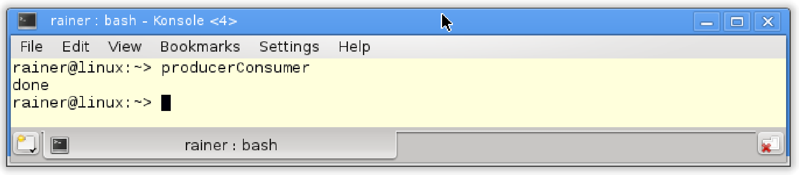

由于顺序一致，程序执行结果是确定的，所以总是输出“done”。

下图描述了操作的顺序。消费者线程在`while`循环中等待，等待原子变量`ready`被生产者线程设置为`true`。当这种情况发生时，消费者线程将继续其工作。

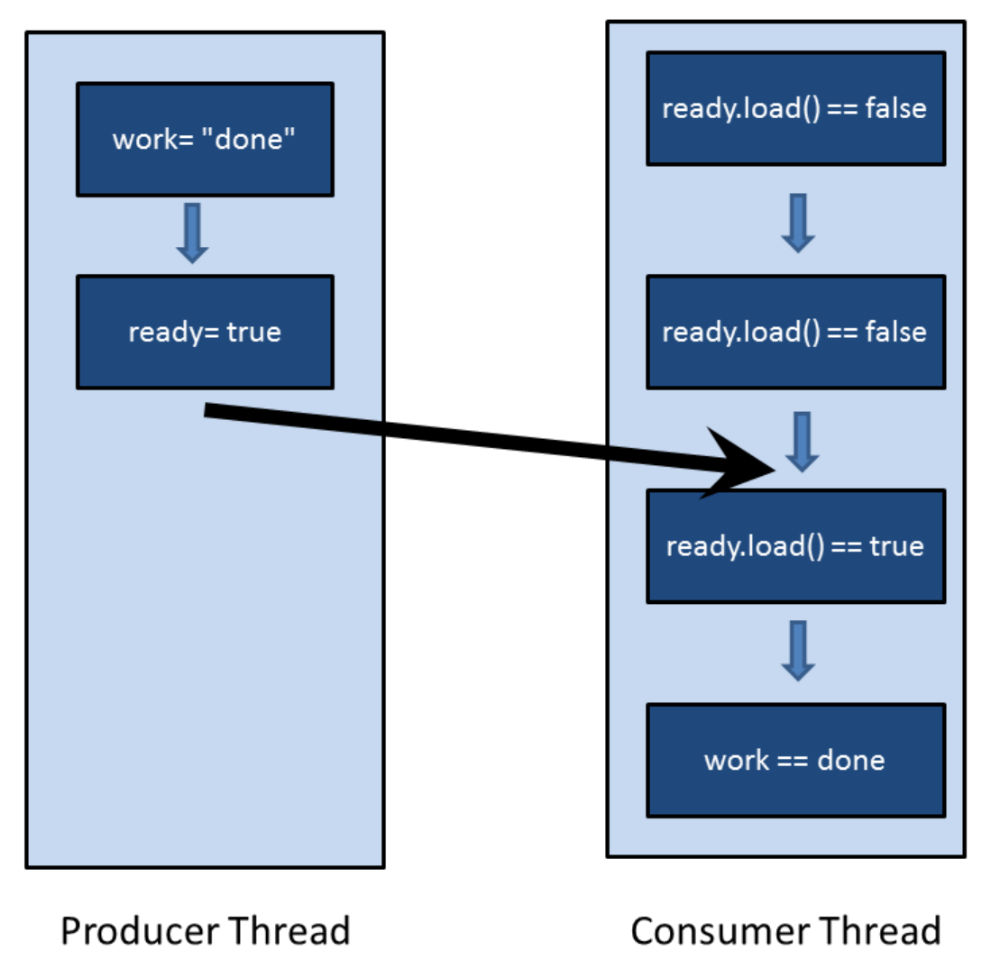

理解程序总是返回“done”并不难，只需要使用顺序一致的两个特点：一方面，两个线程以源码顺序执行指令；另一方面，每个线程以相同的顺序查看另一个线程的操作。也就是，两个线程遵循相同的时钟。`while(!ready.load()){}`循环中，这种同步也可以保持下去——用于同步生产者线程和消费者线程。

通过使用内存序，可以更正式地解释这个过程。以下是正式版本:

1. `work= "done"`在序列中，位于`ready = true`之前
   ⇒ `work= "done"`先行与`ready = true`
2. `while(!ready.load()){}`序列位于`std::cout << work << std::endl`之前
   ⇒ `while(!ready.load()){}`先行与`std::cout<< work << std::endl`
3. `ready= true`与`while(!ready.load()){}`同步
   ⇒ `ready= true`(线程间)先行于`while (!ready.load()){}`
   ⇒ `ready= true`先行于`while (!ready.load()){}`

最终的结论：因为先行关系是可以传递的，所以`work = "done"`先行于`ready= true`，且先行于`while(!ready.load()){}`，更先行于`std::cout<< work << std::endl`。

顺序一致中，一个线程可以看到另一个线程的操作，因此也可以看到所有其他线程的操作。如果使用原子操作的获取-释放语义，那么顺序一致就不成立了。这是与C#和Java不同的地方，也是容易产生疑惑的地方。

### 获取-释放语义

获取-释放语义中，线程间不存在全局同步：只有同一原子变量上的原子操作才进行同步。比如：一个线程上的写操作与另一个线程上的读操作，只有作用于同一个原子变量时才进行同步。

获取-释放语义的基本思想：释放操作与获取操作在同一原子上同步，并建立一个顺序。这意味着，在释放操作之后不能进行所有的读写操作，在获取操作之前不能进行所有的读写操作。

什么是获取/释放操作？使用`load`或`test_and_set`读取原子变量是一个获取操作。还有，锁或互斥锁的释放与获取是同步的，线程的构造与调用间是同步的，线程的完成与汇入调用间的操作是同步的，任务可调用的完成与等待或获取future的调用操作是同步的。所以，获取和释放操作是成对的。

下面这张图有助于对获取-释放语义的理解：

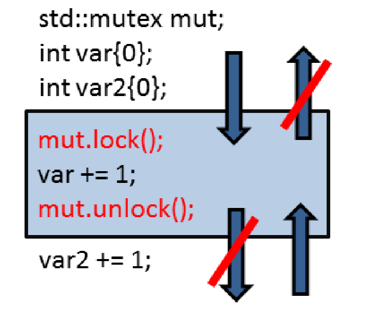

> **内存模型——更深入地理解多线程**
>
> 这应该是了解内存模型的主要原因。特别是，获取-释放语义可以更好地理解高级同步原语，比如互斥锁。同样的原理也适用于线程的启动和汇入。这两种操作都是获取-释放操作。接下来是`wait`和`notify_one`对条件变量的调用；`wait`是获取操作，`notify_one`是释放操作。那`notify_all`呢？当然，也是一个释放操作。

现在，再看`std::atomic_flag`小节中的自旋锁。因为同步是使用`atomic_flag flag`完成的，所以可以使用获取-释放语义，进行更高效的实现。

```c++
// spinlockAcquireRelease.cpp

#include <atomic>
#include <thread>

class Spinlock{
  std::atomic_flag flag;
public:
  Spinlock():flag(ATOMIC_FLAG_INIT){}
  
  void lock(){
    while(flag.test_and_set(std::memory_order_acquire));
  }
  
  void unlock(){
    flag.clear(std::memory_order_release);
  }
};

Spinlock spin;

void workOnResource(){
	spin.lock();
  // shared resource
  spin.unlock();
}

int main(){
  
  std::thread t(workOnResource);
  std::thread t2(workOnResource);
  
  t.join();
  t2.join();
}
```

第16行` flag.clear `清除标志，`test_and_set`在第12行调用一个获取操作，获取操作与释放操作同步。具有顺序一致的两个线程的同步(重量级同步)(`std::memory_order_seq_cst`)被更轻量级的和性能更强的获取-释放语义(`std::memory_order_acquire`和`std::memory_order_release`)所取代，且程序行为不受影响。

虽然`flag.test_and_set(std::memory_order_acquire)`调用是一个"读改写"操作，但是获取语义已经足够了。因为`flag`是原子的，可以保证修改顺序。这也就意味着，对`flag`的所有修改，都可以某种特定的顺序进行。

获得-释放语义是可传递的。如果两个线程(a,b)之间遵循获取-释放语义，且线程(b,c)之间也遵循获取-释放语义，那么在线程(a, c)之间也遵循获取-释放语义。

#### 传递性

释放与获取操作在同一个原子变量上同步，并建立顺序。如果它们作用于相同的原子变量，这些组件将以最高效的方式同步线程。如果两个线程没有共享的原子变量，会如何工作呢？不想使用顺序一致语义，因为代价过高，我们想要更轻量级的获取-释放语义。

解决方式很简单，就是利用获取-释放语义的传递性，可以同步独立线程。

下面的示例中，线程`t2`及其工作包`deliveryBoy`是两个独立线程`t1`和`t3`之间的连接线程。

```c++
// transitivity.cpp

#include <atomic>
#include <iostream>
#include <thread>
#include <vector>

std::vector<int> mySharedWork;
std::atomic<bool> dataProduced(false);
std::atomic<bool> dataConsumed(false);

void dataProducer(){
  mySharedWork = {1,0,3};
  dataProduced.store(true, std::memory_order_release);
}

void deliverBoy(){
  while(!dataProduced.load(std::memory_order_acquire));
  dataConsumed.store(true, std::memory_order_release);
}

void dataConsumer(){
  while(!dataConsumed.load(std::memory_order_acquire));
  mySharedWork[1] = 2;
}

int main(){
  std::cout << std::endl;
  
  std::thread t1(dataConsumer);
  std::thread t2(deliverBoy);
  std::thread t3(dataProducer);
  
  t1.join();
  t2.join();
  t3.join();
  
  for (auto v : mySharedWork){
    std::cout << v << " ";
  }
  
  std::cout << "\n\n";
  
}
```

程序的输出是唯一的，`mySharedWork`的值为`1, 2, 3`。

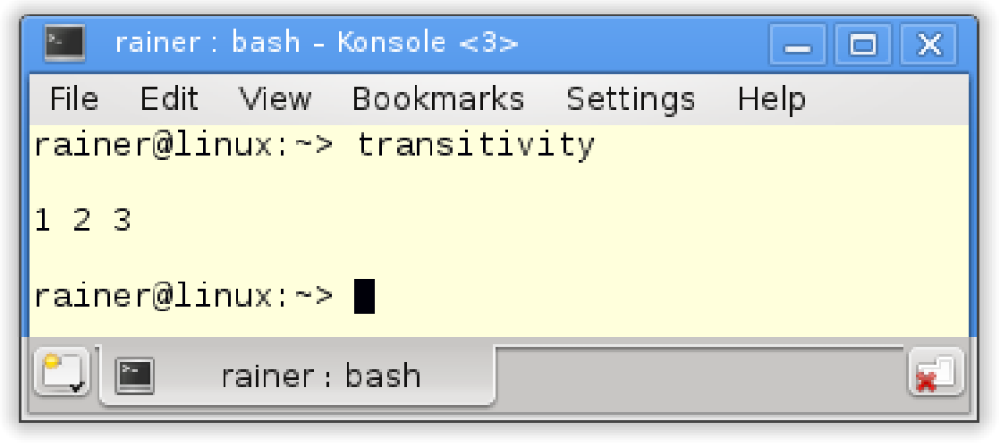

通过观察，得出两个结论：

1. 线程`t2`在第18行等待，直到线程`t3`将`dataProduced`设置为`true`(第14行)。
2. 线程`t1`在第23行等待，直到线程`t2`将`dataConsumed`设置为`true`(第19行)。

用图来解释下：

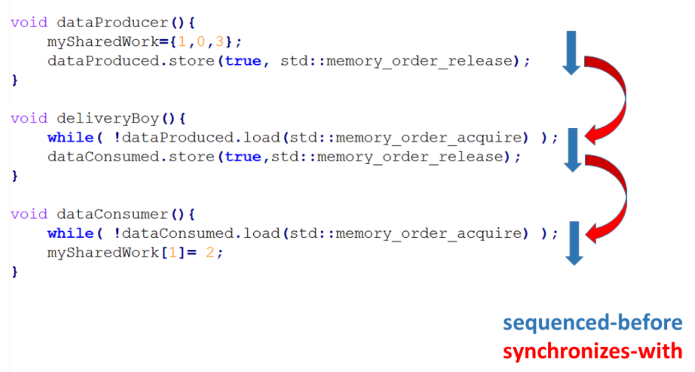

图中主要部分是箭头。

* 蓝色箭头是顺序关系，线程中的所有操作都是按源码顺序执行。
* 红色的箭头是同步关系。原因是对同一原子变量的原子操作遵循的获取-释放语义。原子变量之间，以及线程同步发生在特定的点上。
* 顺序关系建立了先行关系，再使用线程间的先行关系建立同步关系。

剩下的部分就好理解了，线程间的先行指令顺序对应于箭头的方向。最后，能够保证`mySharedWork[1] == 2`。

释放-获取操作是同步的(同一个原子变量)，所以可以很容易地同步线程，不过…… 我们还要看几个误解。

#### 典型的误解

写关于获取-释放语义误解的原因是什么?我的许多读者和学生已经发现了这些陷阱。让我们来看一个简单的例子。

##### 等待

以一个简单的程序作为基点。

```c++
// acquireReleaseWithWaiting.cpp

#include <atomic>
#include <iostream>
#include <thread>
#include <vector>

std::vector<int> mySharedWork;
std::atomic<bool> dataProduced(false);

void dataProducer(){
  mySharedWork = {1,0,3};
  dataProduced.store(true, std::memory_order_release);
}

void dataConsumer(){
  while(!dataProduced.load(std::memory_order_acquire));
  mySharedWork[1] = 2;
}

int main(){
  
  std::cout << std::endl;
  
  std::thread t1(dataConsumer);
  std::thread t2(dataProducer);
  
  t1.join();
  t2.join();
  
  for (auto v: mySharedWork){
    std::cout << v << " ";
  }
    
  std::cout << "\n\n";
  
}
```

第17行的消费者线程`t1`持续等待，直到第13行的消费者线程`t2`将数据设置为true。非原子变量`mySharedWork`受`dataProduced`的保护，访问是同步的。这意味着生产者线程`t2`初始化`mySharedWork`，然后消费者线程`t2`通过设置`mySharedWork[1]`为2来完成工作，是没有问题的。

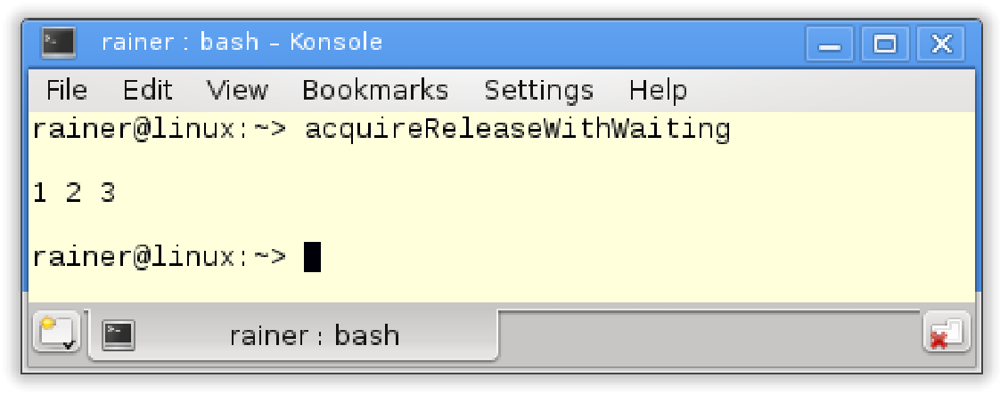

下图显示了线程中的先行关系和线程之间的同步关系。同步在线程间建立了先行关系，其余顺序可以根据先行关系的传递性推理得出。

最后，让`mySharedWork = {1, 0, 3} `先行于`mySharedWork[1] = 2 `。

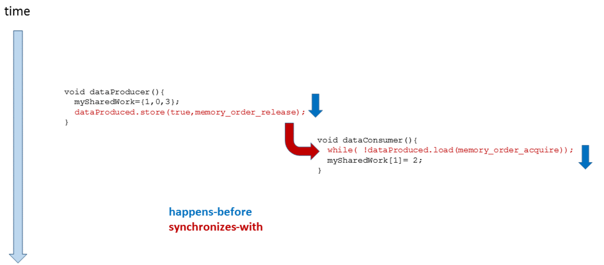

有没有感觉这个推理过程中经常缺少什么？

##### 如果……

如果第17行中的消费者线程`t1`没有等待生产者线程`t2`，会发生什么?

```c++
// acquireReleaseWithoutWaiting.cpp

#include <atomic>
#include <iostream>
#include <thread>
#include <vector>

std::vector<int> mySharedWork;
std::atomic<bool> dataProduced(false);

void dataProducer(){
  mySharedWork = {1,0,3};
  dataProduced.store(true, std::memory_order_release);
}

void dataConsumer(){
 	dataProduced.load(std::memory_order_acquire);
  myShraedWork[1] = 2;
}

int main(){
  
  std::cout << std::endl;
  
  std::thread t1(dataConsumer);
  std::thread t2(dataProducer);
  
  t1.join();
  t2.join();
  
  for (auto v : mySharedWork){
    std::cout << v << " ";
  }
  
  std::cout << "\n\n";
  
}
```

因为变量`mySharedWork`上存在数据竞争，所以该程序具有未定义行为。当程序运行时，将得到以下结果。

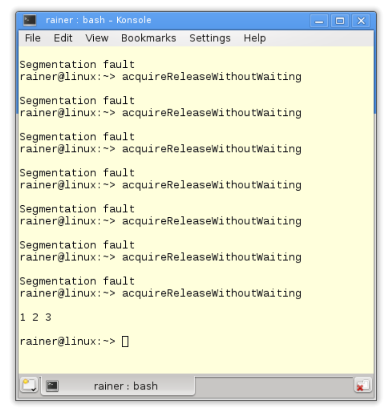

问题在哪里呢？`dataProduced.store(true, std::memory_order_release)`与`dataProduced.load(std::memory_order_acquire)`同步。不过，并不意味着获取操作要对释操作进行等待，而这正是下图中的内容。图中，`dataProduced.load(std::memory_order_acquire)`在指令`dataProduced.store(true, std::memory_order_release)`之前，所以这里没有同步关系。

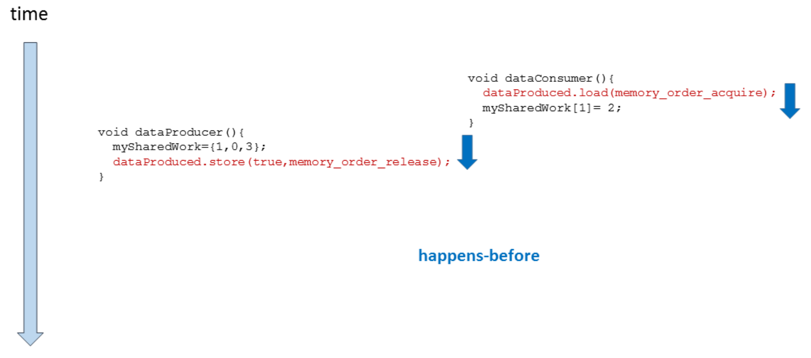

#### 解决办法

同步意味着：当`dataProduced.store(true, std::memory_order_release) `先行于`dataProduced.load(std::memory_order_acquire)`，那么`dataProduced.store(true, std::memory_order_release)`之前和`dataProduced.load(std::memory_order_acquire)`之后执行的操作是所有线程可见的。第一个程序中使用`while(! dataproduct .load(std::memory_order_acquire))`来保证同步关系。

再描述一次，使用正式方式。

当满足条件：`dataProduced.store(true, std::memory_order_release)`先行于`dataProduced.load(std::memory_order_acquire) `时，`dataProduced.store(true, std::memory_order_release)`之前执行的操作先行于所有`dataProduced.load(std::memory_order_acquire)`之后执行的操作。

#### 释放顺序

处理获取-释放语义时，释放顺序是一个相当高级的概念。因此，我们首先从以下的获取-释放语义示例开始说起。

```c++
// releaseSequence.cpp

#include <atomic>
#include <thread>
#include <iostream>
#include <mutex>

std::atomic<int> atom{0};
int somethingShared{0};

using namespace std::chrono_literals;

void writeShared(){
  somethingShared = 2011;
  atom.store(2, std::memory_order_release);
}

void readShared(){
  while(!(atom.fetch_sub(1, std::memory_order_acquire) > 0)){
    std::this_thread::sleep_for(100ms);
  }
  std::cout << "somethingShared: " << somethingShared << std::endl;
}

int main(){
  
  std::cout << std::endl;
  
  std::thread t1(writeShared);
  std::thread t2(readShared);
  // std::thread t3(readShared);
  
  t1.join();
  t2.join();
  // t3.join();
  
  std::cout << "atom: " << atom << std::endl;
  
  std::cout << std::endl;
  
}
```

先看看没有线程`t3`的例子。第15行对原子进行存储操作，第19行对原子获取并同步线程，这里对非原子变量`somethingShared`的访问不存在数据竞争。

如果打开`t3`线程的注释，会发生什么变化？现在就有可能出现“数据竞争”了。如前所述，`atom.fetch_sub(1, std::memory_order_acquire) `(第19行)与` atom.store(2, std::memory_order_release)`(第15行)间，`atom`变量遵循获取-释放语序；因此，在`somethingShared `变量的访问上没有数据竞争。

但对于第二次调用`atom.fetch_sub(1, std::memory_order_acquire)`，获取-释放语序则不起作用了。第二次调用则是一个读改写操作，因为已经没有在对`std::memory_order_release`进行标记了。这也就时第二次调用与第一次调用并没有同步关系，所以会发生对共享变量的数据竞争。也许，释放顺序可能不会让数据竞争发生。这里，释放序列扩展到对`atom.fetch_sub(1, std::memory_order_acquire) `的第二次调用；因此，第二次调用`atom.fetch_sub(1, std::memory_order_acquire)`先行于第一次调用。

最终，我们可能会得到如下的结果：


更正式的释放顺序的由N4659定义([N4659: Working Draft, Standard for Programming Language C++]( http://www.open-std.org/jtc1/sc22/wg21/docs/papers/2017/n4659.pdf))。

> **释放顺序**
>
> 释放顺序由一个释放操作A和一个原子对象M构成，修改M顺序会对最大连续子操作序列有所影响，也就是A的第一次调用和随后由相同线程执行的的`*`操作。这里`*`指的是对源子的读改写操作。

如果仔细看了我的解释，可能会期待接下来出现自由语义；不过，我们还是来看下内存模型`std:: memory_order_consumption`，它与`std::memory_order_acquire`非常相似

#### std::memory_order_consume

`std::memory_order_consume `是六种内存序中最传奇的一个。原因有二：一，`std:: memory_order_consumption`非常难理解；二，因为目前没有编译器支持它，所以这个内存序可能在未来会进行修改。C++17中的情况更糟，官方的说法是：“释放-消费序的规范正在修改，暂不推荐使用`memory_order_consumption`。”

为什么不支持`std:: memory_order_consumption`呢？答案是，编译器会将`std:: memory_order_consumption`映射为`std::memory_order_acquire`。这没毛病，因为两者都是加载或获取操作。`std::memory_order_consume`比`std::memory_order_acquire`需要的同步和顺序更弱。因此，释放-获排序可能比释放-消费序慢，但关键是内存序有良好的定义。

将释放-消费序与释放-获取序进行比较，可以对其进行更好的了解。下一小节中，将讨论释放-获取序，以了解`std::memory_order_consume`和`std::memory_order_acquire`之间的关系。

#### 释放-获取序

首先，让使用下面的程序和两个线程`t1`和`t2`。`t1`扮演生产者的角色，`t2`扮演消费者的角色。原子变量`ptr`用于同步生产者和消费者。

```c++
// acquireRelease.cpp

#include <atomic>
#include <thread>
#include <iostream>
#include <string>

using namespace std;

atomic<string*> ptr;
int data;
atomic<int> atoData;

void producer(){
  string *p = new string("C++11");
  data = 2011;
  atoData.store(2014, memory_order_relaxed);
  ptr.store(p, memory_order_release);
}

void consumer(){
  string *p2;
  while(!(p2 = ptr.load(memory_order_acquire)));
  cout << "*p2: " << *p2 << endl;
  cout << "data: " << data << endl;
  cout << "atoData: " << atoData.load(memory_order_relaxed) << endl;
}

int main(){
  
  cout << endl;
  
  thread t1(producer);
  thread t2(consumer);
  
  t1.join();
  t2.join();
  
  cout << endl;
  
}
```

分析程序之前，进行一些修改。

#### 释放-消费序

将第21行中的内存顺序`std::memory_order_acquire`替换为`std:: memory_order_consumption`。

```c++
// acquireConsume.cpp

#include <atomic>
#include <thread>
#include <iostream>
#include <string>

using namespace std;

atomic<string*> ptr;
int data;
atomic<int> atoData;

void producer(){
  string *p = new string("C++11");
  data = 2011;
  atoData.store(2014, memory_order_relaxed);
  ptr.store(p, memory_order_release);
}

void consumer(){
  string *p2;
  while(!(p2 = ptr.load(memory_order_acquire)));
  cout << "*p2: " << *p2 << endl;
  cout << "data: " << data << endl;
  cout << "atoData: " << atoData.load(memory_order_relaxed) << endl;
}

int main(){
  
  cout << endl;
  
  thread t1(producer);
  thread t2(consumer);
  
  t1.join();
  t2.join();
  
  cout << endl;
  
}
```

现在程序存在有未定义的行为。不过这种情况只能是一种猜测，因为GCC 5.4编译器使用`std::memory_order_acquire`实现了` std::memory_order_consume` ，所以程序改动前和改动后是相同的。

程序输出结果是相同的。

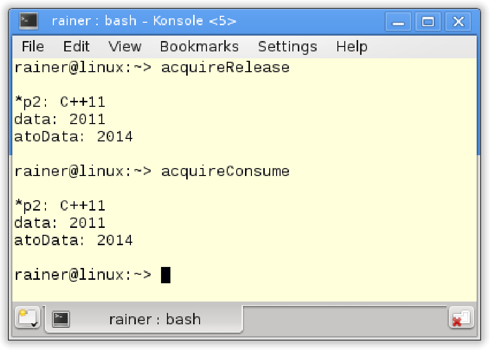

#### 释放-获取 Vs. 释放-消费

解释一下，为什么第一个程序(acquireRelease.cpp)没有问题(定义良好)。

因为存储操作使用`std::memory_order_release`，而加载操作使用`std::memory_order_acquire`，所以第16行上的存储操作与第21行中的加载操作同步。释放-获取序的约束是什么呢？释放-获取序确保在存储操作(第16行)前，所有操作的结果在加载操作(第21行)之后可用。同样，释放-获取操作对非原子变量(第14行)和原子变量`atoData`(第15行)的访问进行排序。虽然，`atoData`使用`std::memory_order_relax`排序，但这也没问题。

关键的问题是：如果用`std::memory_order_consumption`替换`std::memory_order_acquire`会发生什么?

#### std::memory_order_consume的数据依赖

`std::memory_order_consume`需要处理原子上的数据依赖关系，数据依赖性以两种方式存在。首先，让我们看看线程中的携依赖和两个线程之间的依赖关系。两个依赖都引入了一个先行关系。“携依赖(carries-a-dependency-to)”和“先依赖序(dependency-order-before)”是什么意思？

* 携依赖: 如果操作A的结果在操作B中作为操作数，则：A携依赖于B。
* 先依赖序：存储操作(使用`std::memory_order_release`、`std::memory_order_acq_rel`或`std:: memory_seq_cst`)是按依赖序进行排序的——如果同一个线程中的后续操作C中加载了操作B的结果，则需要在加载操作B之前使用`std::memory_order_consume`。需要注意的是，操作B和C必须在同一个线程中。

以我的经验，这两个定义不是很好懂，有用图可能会更直观一些。

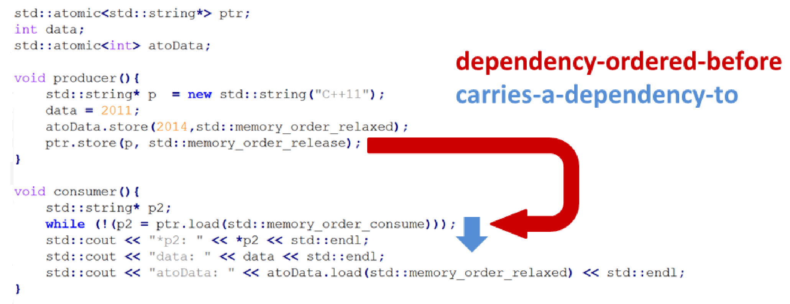

`ptr.store(p, std::memory_order_release)`是按先依赖序排列在`while (!(p2 = ptr.load(std::memory_order_consume))) `之前的，因为下行`std::cout << "*p2: " << p2 << std::endl`可看作为加载操作的结果输出。此外，`while (!(p2 = ptr.load(std::memory_order_consume))`携依赖于`cout << "p2: " << *p2 << < std::endl`，因为`*p2`使用了`ptr`的结果进行输出。

我们无法保证`data `和`atoData`的输出。这是因为两者与`ptr.load`操作没有携依赖关系。更糟糕的是：由于数据是非原子变量，因此存在竞争条件。原因是两个线程可以同时访问数据，并且线程`t1`要对数据进行修改。因此，程序具有未定义行为。

最后，我们来了解自由语义。

### 自由语义

自由语义是另一个极端。自由语义是所有内存模型中最弱的，只能保证原子的修改顺序，这意味着对原子的修改了，会以某种特定的顺序发生。

#### 无同步和顺序

这很容易理解。若没有规则，就无所谓违规。不过，程序应该具有定义良好的行为。这意味着，通常使用更强的内存序的同步和顺序可以控制自由语义的操作。这是怎么做到的呢？一个线程可以以任意顺序看到另一个线程的效果，因此必须确保程序中有一些点，在所有线程上的所有操作都是同步的。

原子操作是一个计数器，其中操作序列无关紧要。计数器遵守的不是不同线程增加计数器的顺序；对计数器的关键观察是，所有增量都是原子性的，所有线程的任务都在最后完成。请看下面的例子：

```c++
// relaxed.cpp

#include <vector>
#include <iostream>
#include <thread>
#include <atomic>

std::atomic<int> count = {0};

void add(){
  for (int n = 0; n < 1000; ++n){
    count.fetch_add(1, std::memory_order_relaxed);
  }
}

int main(){
  std::vector<std::thread> v;
  
  for (int n = 0; n < 10; ++n){
    v.emplace_back(add);
  }
  for (auto& t : v){
    t.join();
  }
  std::cout << "Final Counter value is " << count << '\n';
}
```

最重要的三行分别是13、24和26行。

第13行，原子数计数使用自由语义进行递增，因此可以保证操作是原子的。`fetch_add`操作建立计数排序，`add`函数(第10-15行)是线程的任务包。在第21行，为每个线程分配任务包。

线程创建是一个同步点，另一个同步点是第24行的`t.join()`。

主线程在第24行与所有子线程同步，使用`t.join()`进行等待，直到它的所有子节点都完成。

总之，第13行中的增量操作与第26行中计数器的读取之间存在先行关系。

结果是程序总是返回10000。有些无聊吗？不，这才是令人放心的！

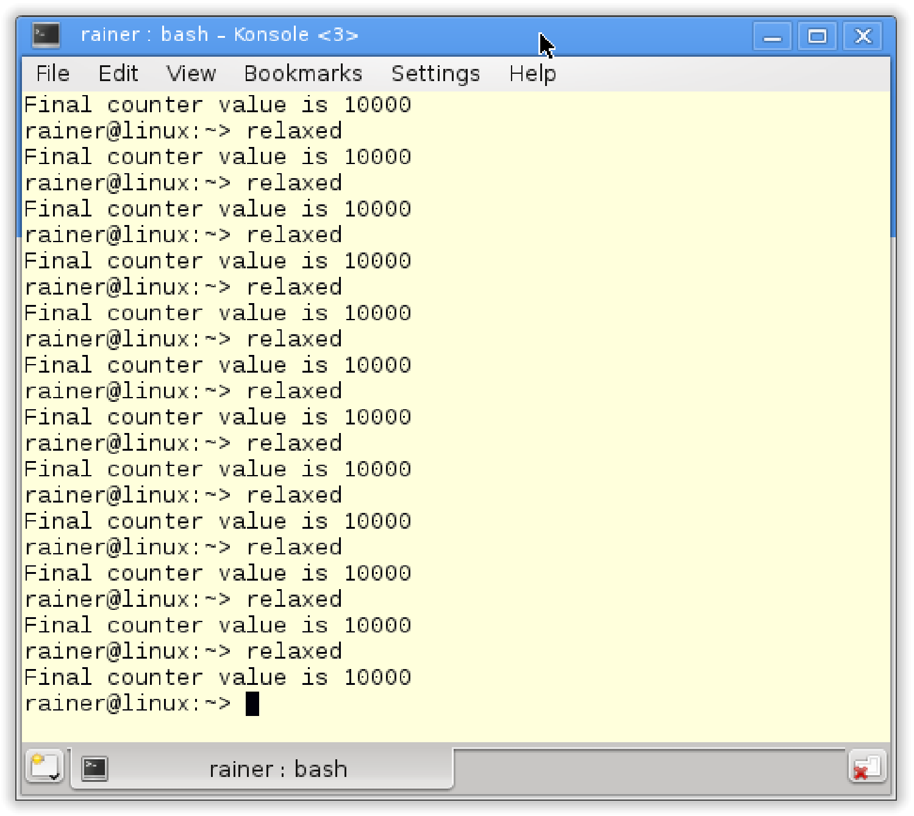

使用自由语义的原子计数器的另一个典型示例是`std::shared_ptr`的引用计数器。这只适用于增量操作，增加引用计数器的关键属性是操作是原子的。并且，增量操作的顺序并不重要，但这不适用于引用计数器的递减。这些操作需要遵循获取-释放语义的析构函数。

> **无等待的累加计算**
>
> 仔细看下第10行中的add函数。增量操作中不涉及同步(第13行)，值1被添加到原子变量`count`中。
>
> 因此，该算法不仅是无锁的，而且是无等待的。

`std::atomic_thread_fence`的基本思想是，没有原子操作的情况下，在线程之间建立同步和顺序。