# 栅栏

C++支持两种栅栏类型：`std::atomic_thread_fence`和`std::atomic_signal_fence`。

* `std::atomic_thread_fence` : 同步线程间的内存访问。
* `std::atomic_signal_fence` : 线程内信号之间的同步。

**`std::atomic_thread_fence`**

`std::atomic_thread_fence`可以阻止特定的操作翻过栅栏。

`std::atomic_thread_fence`不需要原子变量，通常称为栅栏或内存屏障。那就先来了解一下`std::atomic_thread_fence`。

## 栅栏当做内存屏障

这个小节的标题什么意思呢？特定的操作不能翻过内存屏障。那什么样的操作属于“特殊操作”呢？现在有两种操作：读写操作或加载/存储操作。` if(resultRead) return result `就是一个加载操作后跟一个存储操作。

有四种不同的方式来组合加载和存储操作：

* 加载-加载：一个加载操作后跟一个加载操作。
* 加载-存储：一个加载操作后跟一个存储操作。
* 存储-加载：一个存储操作后跟一个加载操作。
* 存储-存储：一个存储操作后跟一个存储操作。

当然，还有由多个加载和存储(`count++`)组成的更复杂的操作，这些操作都可由以上四个操作组成。

那么内存屏障是什么呢？如果在加载-加载、加载-存储、存储-加载或存储-存储等操作之间设置内存屏障，则可以保证不会对特定的操作进行重新排序。如果使用非原子或具有自由语义的原子操作，则存在重新排序的风险。

## 三种栅栏类型

通常，栅栏有三种：全栅(full fence)、获取栅栏(acquire fence)和释放栅栏(release fence)。提醒一下，获取是一个加载操作， 释放是一个存储操作。如果在加载和存储操作的四种组合之间，放一个内存屏障中会发生什么情况呢?

* 全栅: 任意两个操作之间使用完整的栅栏`std::atomic_thread_fence()`，可以避免这些操作的重新排序。不过，对于存储-加载操作来说，它们可能会被重新排序。
*  获取栅栏: `std::atomic_thread_fence(std::memory_order_acquire)`避免在获取栅栏之前的读操作，被获取栅栏之后的读或写操作重新排序。
* 释放栅栏: `std::atomic_thread_fence(std::memory_order_release)`避免释放栅栏之后的写操作，在释放栅栏之前通过读或写操作重新排序。

为了获得和释放栅栏的定义，以及对无锁编程的影响，我们花费了大量精力对其进行整理。特别难以理解的是，这种栅栏与原子操作获取-释放语义之间的差别。先用图来说明一些上面的定义。

哪种操作可以翻过内存屏障？先瞧瞧下面的三张图。如果箭头与红色横杠交叉，意味着栅栏会阻止这种操作。

**全栅**

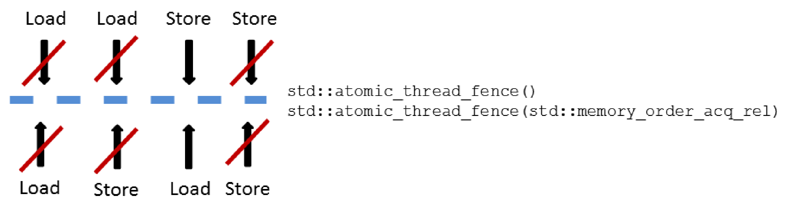

当然，可以显式地调用`std::atomic_thread_fence(std::memory_order_seq_cst)`，而不是`std::atomic_thread_fence()`。默认情况下，栅栏使用内存序为顺序一致性。如果对全栏使用顺序一致性，那么`std::atomic_thread_fence`也将遵循全局序。

**获取栅栏**

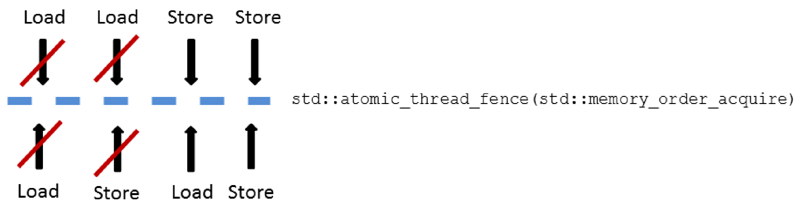

**释放栅栏**

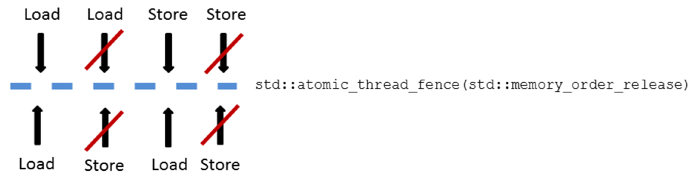

三种内存屏障可以描述得更简单。

**所有栅栏一览图**

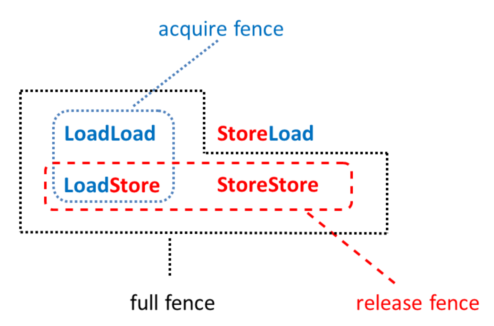

获取-释放栅栏与原子获取-释放语义有着相似的同步方式和顺序。

## 获取-释放栅栏

获取-释放栅栏与原子类的获取-释放语义最明显的区别是，栅栏不需要原子操作。还有一个更微妙的区别：获取-释放栅栏比原子操作更重量级。

### 原子操作 vs. 栅栏

简单起见，现在使用栅栏或带有获取语义的原子操作时引用获取操作，释放操作也是如此。

获取-释放操作的主要思想是，在线程间建立同步和排序约束，这些同步和顺序约束也适用于使用自由语义的原子操作或非原子操作。注意，获取-释放操作是成对出现的。此外，对获取-释放语义的原子变量的操作，必须作用在相同的原子变量上。不过，我现在是将这些操作分开来看待的。

让我们从获取操作开始对比。

### 获取操作

在原子变量(内存序为`std::memory_order_acquire`)上进行的加载 (读取)操作是一个获取操作。

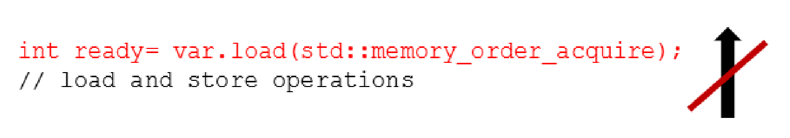

将`std::atomic_thread_fence`内存序设置为`std::memory_order_acquire`，这对内存访问重排添加了更严格的约束:

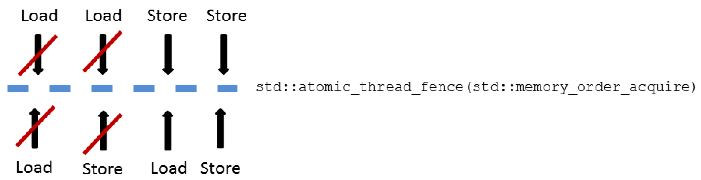

比较中可以总结了两点:

1. 具有获取语义的栅栏会建立更强的顺序约束。虽然，原子变量和栅栏的获取操作，要求在获取操作之前不能进行任何读或写操作。但是对获取栅栏有另一种方式，获取栅栏后不能进行读操作。
2. 自由语义足以读取原子变量`var`。由于`std::atomc_thread_fence(std::memory_order_acquire)`，所以这个操作在获取栅栏之后不能进行读取。

对于释放栅栏也可以进行类似的试验。

### 释放操作

对内存序为`std::memory_order_release`的原子变量，进行存储(写)操作时，这些操作属于释放操作。

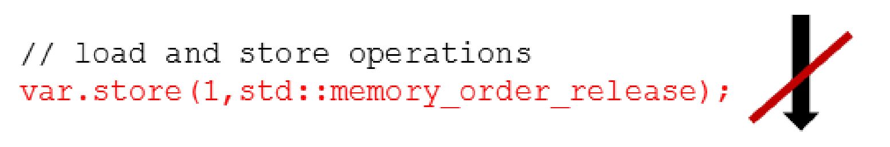

还有，释放栅栏。

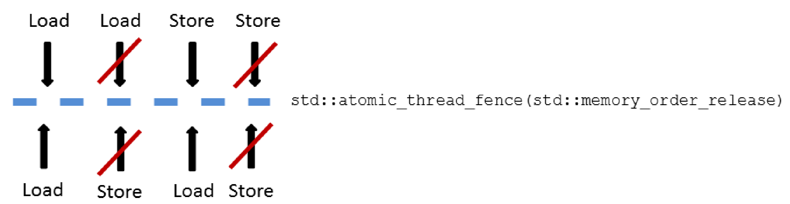

除了释放操作对原子变量`var`的约束外，释放栅栏有两个属性:

1. 存储的操作不能在栅栏前进行。
2. 变量`var`使用自由语义。

现在，就使用栅栏写一段程序。

## 使用原子变量或栅栏进行同步

之前，我们已经用获取-释放语义，实现了一个典型的消费者-生产者工作流。先使用原子的是原子操作，再切换到栅栏。

### 原子操作

我们从原子操作开始，大家对它们应该都很熟悉。

```c++
// acquireRelease.cpp

#include <atomic>
#include <thread>
#include <iostream>
#include <string>

using namespace std;

atomic<string*> ptr;
int data;
atomic<int> atoData;

void producer(){
  string *p = new string("C++11");
  data = 2011;
  atoData.store(2014, memory_order_relaxed);
  ptr.store(p, memory_order_release);
}

void consumer(){
  string* p2;
  while(!(p2 = ptr.load(memory_order_acquire)));
  cout << "*p2: " << *p2 << endl;
  cout << "data: " << data << endl;
  cout << "atoData: " << atoData.load(memory_order_relaxed) << endl;
}

int main(){
  
  cout << endl;
  
  thread t1(producer);
  thread t2(consumer);
  
  t1.join();
  t2.join();
  
  cout << endl;
  
}
```

这个程序应该很熟悉，这是我们在`std:: memory_order_consumption`小节中使用的示例。下图强调了消费者线程t2看到来自生产者线程t1的所有值。

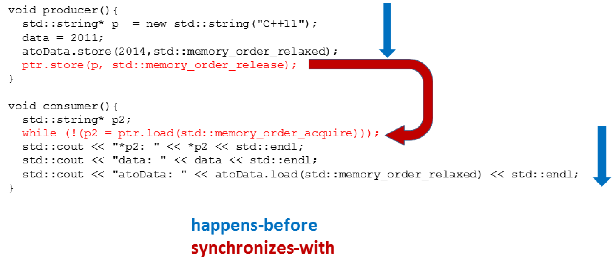

这段程序定义良好，因为先行关系是可传递的。只需要把三种发生前关系结合起来:

1. 第15-17行先行于第18行`ptr.store(p, std:: memory_order_release)`。
2. 第23行`while(!(p2= ptrl.load(std::memory_order_acquire)))` 先行于第24-26行。
3. 第18行与第23行同步⇒第18行线程内先行于第23行。

现在，事情变得更有趣了，我们要来聊聊栅栏了。有关C++内存模型的文献中，栅栏几乎完全被忽略了。

### 栅栏

将程序改成到使用栅栏。

```c++
// acquireReleaseFences.cpp

#include <atomic>
#include <thread>
#include <iostream>
#include <string>

using namespace std;

atomic<string*> ptr;
int data;
atomic<int> atoData;

void producer() {
  string* p = new string("C++11");
  data_ = 2011;
  atoData.store(2014, memory_order_relaxed);
  atomic_thread_fence(memory_order_release);
  ptr.store(p, memory_order_release);
}

void consumer() {
  string* p2;
  while (!(p2 = ptr.load(memory_order_relaxed)));
  atomic_thread_fence(memory_order_acquire);
  cout << "*p2: " << *p2 << endl;
  cout << "data: " << data_ << endl;
  cout << "atoData: " << atoData.load(memory_order_relaxed) << endl;
}

int main() {

  cout << endl;

  thread t1(producer);
  thread t2(consumer);

  t1.join();
  t2.join();
  
  delete ptr;

  cout << endl;

}
```

第一步是添加栅栏(使用释放和获取语义，第18行和第25行)。接下来，将原子操作从获取或释放语义很容易的改为自由语义(第19和24行)。当然，只能用相应的栅栏替换获取或释放操作。释放栅栏建立了与获取栅栏的同步，因此线程间的也有了先行关系。

下图是程序的输出：

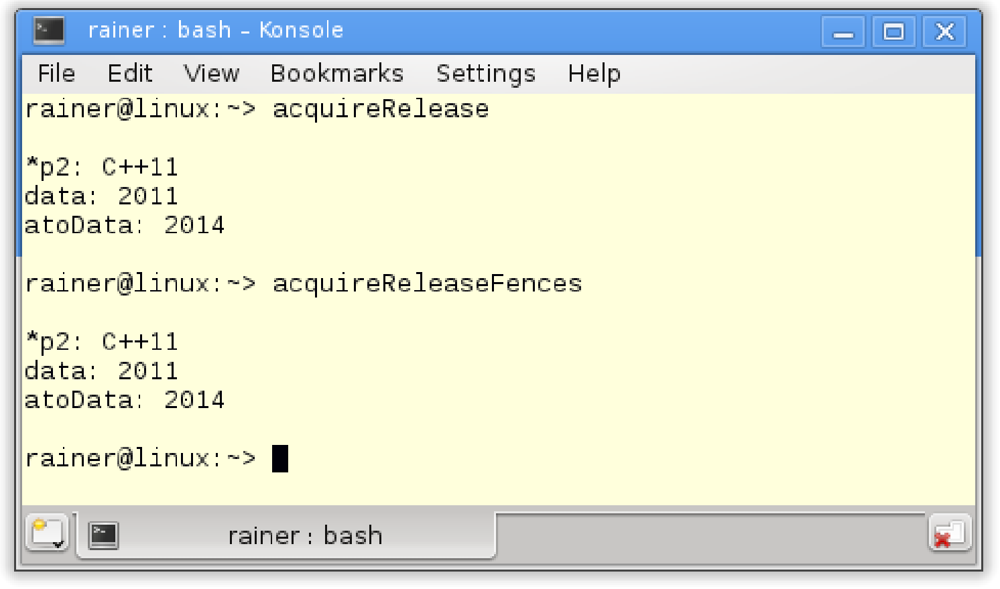

为了更直观的呈现给读者，下图是描述了整个关系。

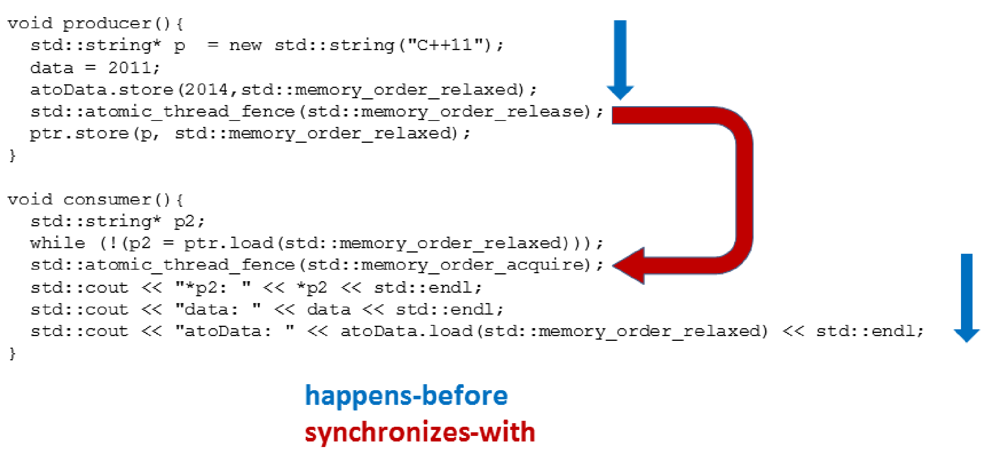

关键问题是：为什么获取栅栏之后的操作，会看到释放栅栏之前的操作呢？因为数据是一个非原子变量`atoData.store`，并且以自由语义使用，这意味着它们可以重新排序；不过，因为`std::atomic_thread_fence(std::memory_order_release)`与`std::atomic_thread_fence(std::memory_order_acquire)`相结合，所以两个操作都不能重新排序。

用更简洁的形式进行解释：

1.  获取-释放栅栏阻止了原子和非原子操作跨栅栏的重排序。
2. 消费者线程`t2`正在等待`while (!(p2= ptr.load(std::memory_order_relaxed)))`循环跳出，直到在生产者线程`t1`中设置对指针进行设置`ptr.store(p,std::memory_order_relaxed) `。
3.  释放栅栏与获取栅栏同步。
4.  自由操作或非原子操作的所有结果(在释放栅栏之前)，在获得栅栏之后都是可见的。

> **释放栅栏和获取栅栏之间的同步**
>
> 这两个定义来自于[N4659: Working Draft, Standard for Programming Language C++](http://www.open-std.org/jtc1/sc22/wg21/docs/papers/2017/n4659.pdf) ，并且标准文档的文字比较难懂：“如果操作X和操作Y对原子对象M的操作存在有原子操作，释放栅栏A同步于获取栅栏B；那么A的操作顺序位于X之前，X对M进行修改，Y位于B之前，并且Y读取X写入的值，或在进行释放操作时，释放序列X中的任何操作所写的值将被读取。”
> 
>让我借由acquireReleaseFence.cpp解释一下这段话：
> 
>* `atomic_thread_fence(memory_order_release)` (第18行)是一个释放栅栏A。
> * `atomic_thread_fence(memory_order_acquire)` (第25行)是一个获取栅栏B。
>* `ptr`(第10行)是一个原子对象M。
> * `ptr.store(p, memory_order_relaxed)` (第19行) 是一个原子存储操作X。
> * `while (!(p2 = ptr.load(memory_order_relaxed)))` (第24行)是一个原子加载操作Y。

可以在acquireRelease.cpp程序中的原子变量上，混合获取和释放操作(使用获取和释放栅栏)，而不影响同步关系。

#### std::atomic_signal_fence

`std::atomic_signal_fence`在线程和信号句柄间，建立了非原子和自由原子访问的内存同步序。下面的程序展示了`std::atomic_signal_fence`的用法。

```c++
// atomicSignal.cpp

#include <atomic>
#include <cassert>
#include <csignal>

std::atomic<bool> a{false};
std::atomic<bool> b{false};

extern "C" void handler(int){
  if (a.load(std::memory_order_relaxed)){
    std::atomic_signal_fence(std::memory_order_acquire);
    assert(b.load(std::memory_order_relaxed));
  }
}

int main(){
  
  std::signal(SIGTERM, handler);
  
  b.store(true, std::memory_order_relaxed);
  std::atomic_signal_fence(std::memory_order_release);
  a.store(true, std::memory_order_relaxed);
  
}
```

首先，第19行中为特定的信号SIGTERM设置了处理句柄。SIGTERM是程序的终止请求。` std::atomic_signal_handler`在释放操作`std:: signal_fence(std::memory_order_release)`(第22行)和获取操作`std:: signal_fence(std::memory_order_acquire)`(第12行)之间建立一个获取-释放栅栏。释放操作不能跨越释放栅栏进行重排序(第22行)，而获取操作不能跨越获取栅栏进行重排序(第11行)。因此，第13行`assert(b.load(std::memory_order_relax)`的断言永远不会触发，因为`a.store(true, std:: memory_order_relaxed)`(第23行)执行了的话, `b.store(true, std::memory_order_relax)`(第21行)就一定执行过。

