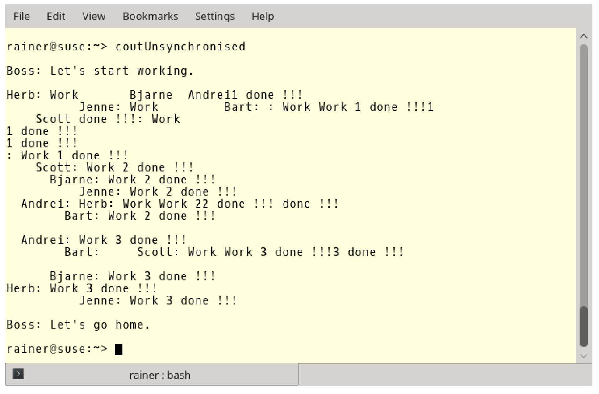
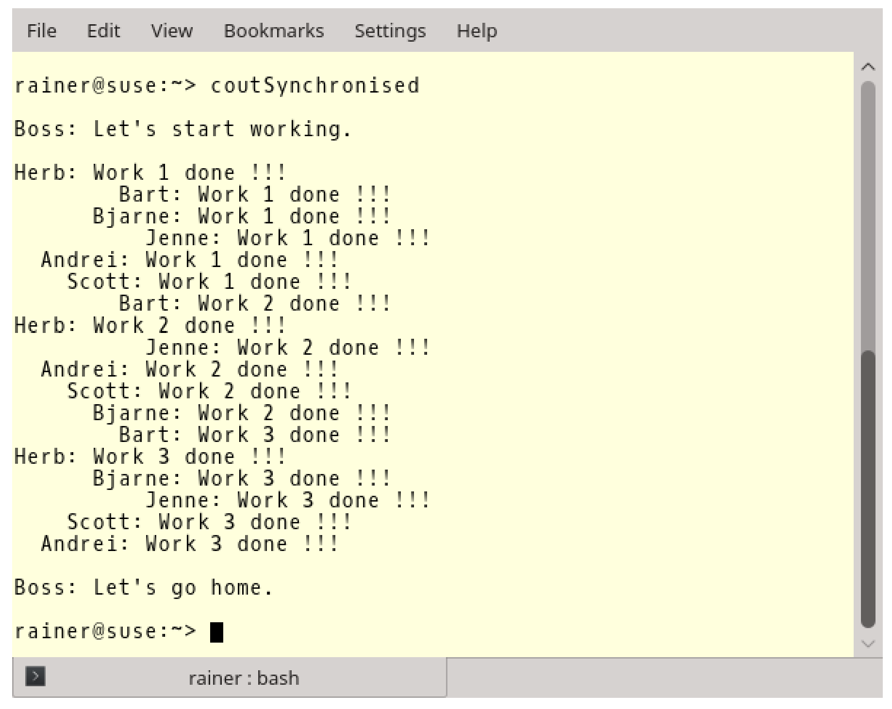
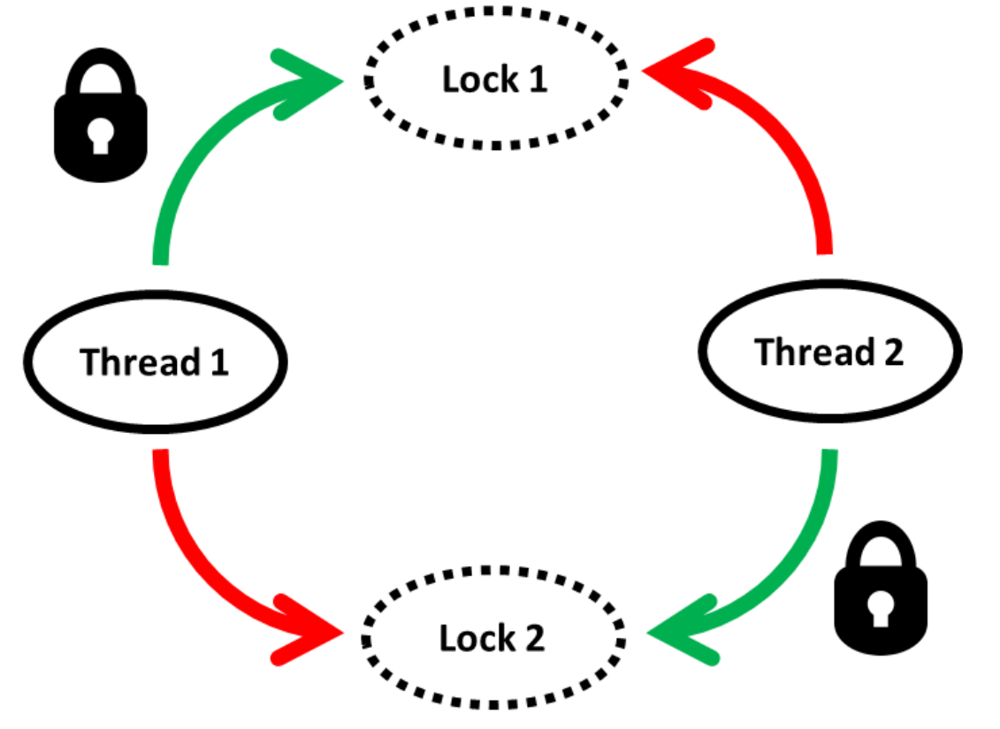
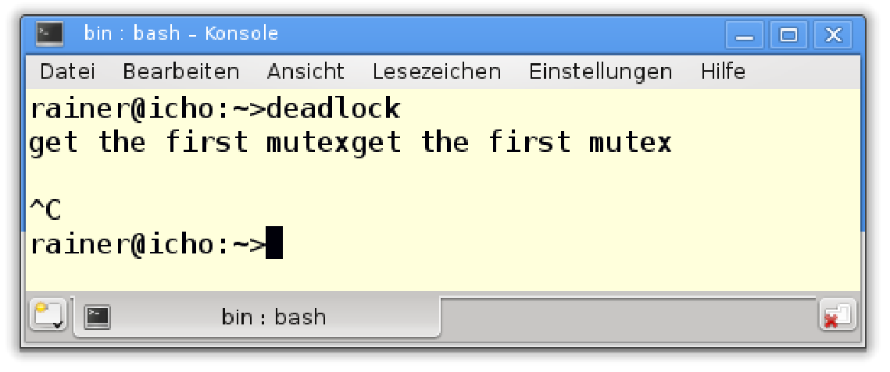
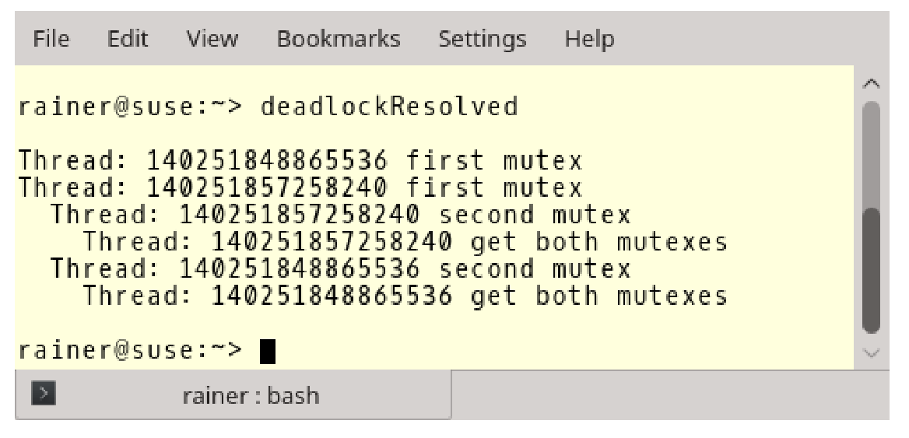
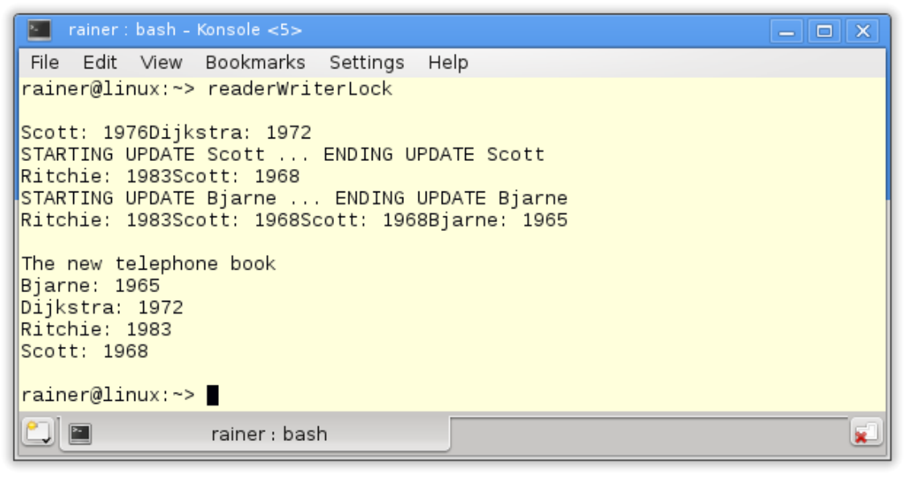
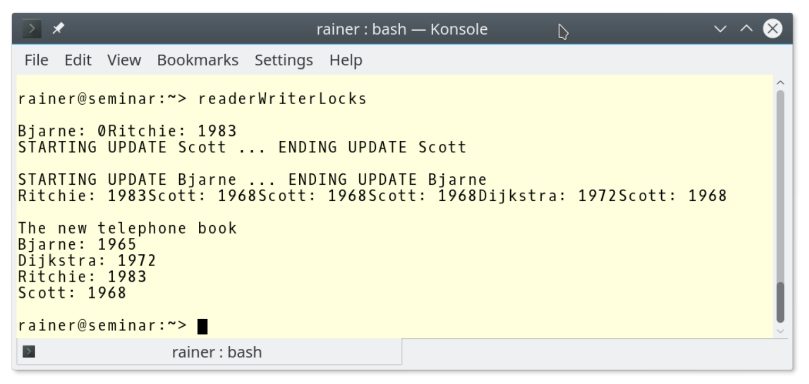
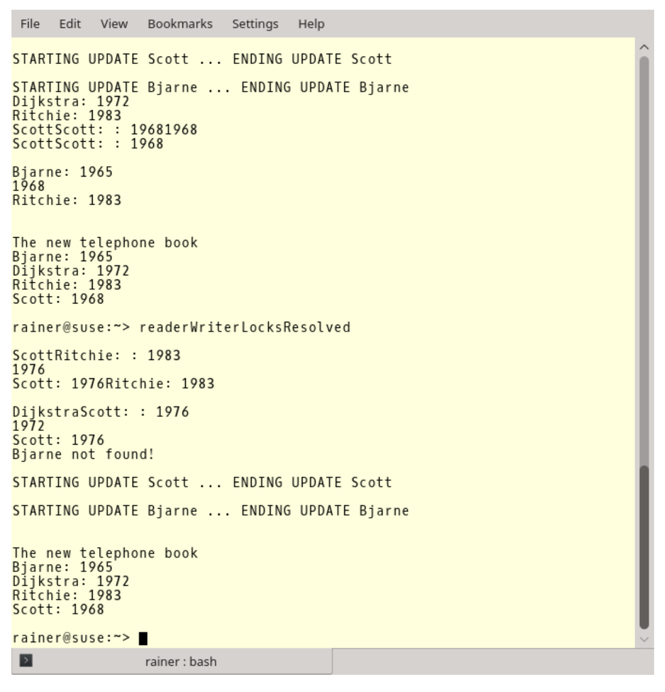
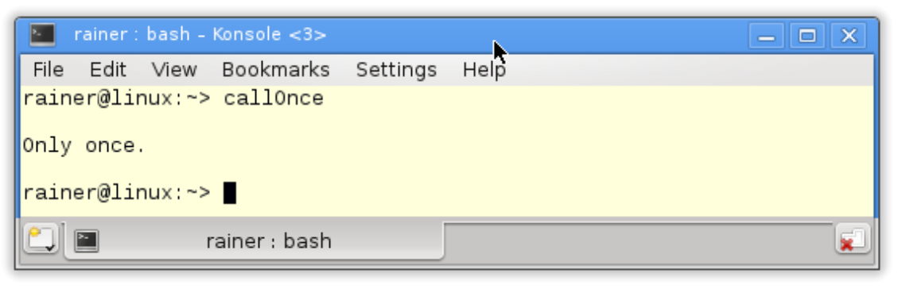
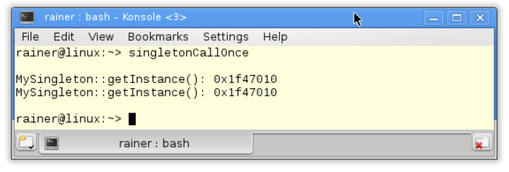

#共享数据

为了更清楚地说明这一点，就需要考虑共享数据的同步问题，因为数据竞争很容易在共享数据上发生。如果并发地对数据进行非同步读写访问，则会产生未定义行为。

验证并发、未同步的读写操作的最简单方法，就是向`std::cout`写入一些内容。

让我们来看一下，使用不同步的方式进行`std::cout`打印输出。

```c++
// coutUnsynchronised.cpp

#include <chrono>
#include <iostream>
#include <thread>

class Worker {
public:
  Worker(std::string n) :name(n) {}
  void operator()() {
    for (int i = 1; i <= 3; ++i) {
      // begin work
      std::this_thread::sleep_for(std::chrono::microseconds(200));
      // end work
      std::cout << name << ": " << "Work " << i << " done !!!" << std::endl;
    }
  }
private:
  std::string name;
};


int main() {
  
  std::cout << std::endl;

  std::cout << "Boss: Let's start working.\n\n";

  std::thread herb = std::thread(Worker("Herb"));
  std::thread andrei = std::thread(Worker(" Andrei"));
  std::thread scott = std::thread(Worker("  Scott"));
  std::thread bjarne = std::thread(Worker("   Bjarne"));
  std::thread bart = std::thread(Worker("    Bart"));
  std::thread jenne = std::thread(Worker("     Jenne"));


  herb.join();
  andrei.join();
  scott.join();
  bjarne.join();
  bart.join();
  jenne.join();

  std::cout << "\n" << "Boss: Let's go home." << std::endl;

  std::cout << std::endl;

}
```

该程序描述了一个工作流程：老板有六个员工(第29 - 34行)，每个员工必须处理3个工作包，处理每个工作包需要200毫秒(第13行)。当员工完成了他的所有工作包时，他向老板报告(第15行)。当老板收到所有员工的报告，老板就会把员工们送回家(第43行)。

这么简单的工作流程，输出却如此混乱。



让输出变清晰的最简单解决方法，就是使用互斥量。

##互斥量

Mutex是互斥(**mut**ual **ex**clusion)的意思，它确保在任何时候只有一个线程可以访问临界区。

通过使用互斥量，工作流程的混乱变的和谐许多。

```c++
// coutSynchronised.cpp

#include <chrono>
#include <iostream>
#include <mutex>
#include <thread>

std::mutex coutMutex;

class Worker {
public:
  Worker(std::string n) :name(n) {}
  void operator()() {
    for (int i = 1; i <= 3; ++i) {
      // begin work
      std::this_thread::sleep_for(std::chrono::microseconds(200));
      // end work
      coutMutex.lock();
      std::cout << name << ": " << "Work " << i << " done !!!" << std::endl;
      coutMutex.unlock();
    }
  }
private:
  std::string name;
};


int main() {
  
  std::cout << std::endl;

  std::cout << "Boss: Let's start working.\n\n";

  std::thread herb = std::thread(Worker("Herb"));
  std::thread andrei = std::thread(Worker(" Andrei"));
  std::thread scott = std::thread(Worker("  Scott"));
  std::thread bjarne = std::thread(Worker("   Bjarne"));
  std::thread bart = std::thread(Worker("    Bart"));
  std::thread jenne = std::thread(Worker("     Jenne"));


  herb.join();
  andrei.join();
  scott.join();
  bjarne.join();
  bart.join();
  jenne.join();

  std::cout << "\n" << "Boss: Let's go home." << std::endl;

  std::cout << std::endl;

}
```

第8行中`coutMutex`保护了`std::cout`，第19行中的`lock()`和第21行中的`unlock()`调用，确保工作人员不会同时进行报告。



> **std:: cout是线程安全的**
>
> C++11标准中，`std::cout`不需要额外的保护，每个字符都是原子式书写的。可能会有更多类似示例中的输出语句交织在一起的情况，但这些只是视觉问题，而程序则是定义良好的。所有全局流对象都是线程安全的，并且插入和提取全局流对象(`std::cout`、`std::cin`、`std::cerr`和`std::clog`)也都是线程安全的。
>
> 更正式地说：写入`std::cout`并不是数据竞争，而是一个竞争条件。这意味着输出内容的情况，完全取决于交错运行的线程。

C++11有4个不同的互斥量，可以递归地、暂时地锁定，并且不受时间限制。

|     成员函数     | mutex | recursive_mutex | timed_mutex | recursive_timed_mutex |
| :--------------: | :---: | :-------------: | :---------: | :-------------------: |
|      m.lock      |  yes  |       yes       |     yes     |          yes          |
|    m.try_lock    |  yes  |       yes       |     yes     |          yes          |
|  m.try_lock_for  |       |                 |     yes     |          yes          |
| m.try_lock_until |       |                 |     yes     |          yes          |
|     m.unlock     |  yes  |       yes       |     yes     |          yes          |

递归互斥量允许同一个线程多次锁定互斥锁。互斥量保持锁定状态，直到解锁次数与锁定次数相等。可以锁定互斥量的最大次数默认并未指定，当达到最大值时，会抛出[std::system_error]( http://en.cppreference.com/w/cpp/error/system_error)异常。

C++14中有`std::shared_timed_mutex`，C++17中有`std::shared_mutex`。`std::shared_mutex`和`std::shared_timed_mutex`非常相似，使用的锁可以是互斥或共享的。另外，使用`std::shared_timed_mutex`可以指定时间点或时间段进行锁定。

|        成员函数         | shared_timed_mutex | shared_mutex |
| :---------------------: | :----------------: | :----------: |
|         m.lock          |        yes         |     yes      |
|       m.try_lock        |        yes         |     yes      |
|     m.try_lock_for      |        yes         |              |
|    m.try_lock_until     |        yes         |              |
|        m.unlock         |        yes         |     yes      |
|      m.lock_shared      |        yes         |     yes      |
|    m.try_lock_shared    |        yes         |     yes      |
|  m.try_lock_shared_for  |        yes         |              |
| m.try_lock_shared_until |        yes         |              |
|     m.unlock_shared     |        yes         |     yes      |

`std::shared_timed_mutex(std::shared_mutex)`可以用来实现读写锁，也就可以使用`std::shared_timed_mutex(std::shared_mutex)`进行独占或共享锁定。如果将`std::shared_timed_mutex(std::shared_mutex)`放入`std::lock_guard`或`std::unique_lock`中，就可实现独占锁；如果将`std::shared_timed_mutex(std::shared_lock)`放入`std::shared_lock`中，就可实现共享锁。`m.try_lock_for(relTime)`和`m.try_lock_shared_for(relTime)`需要一个时间段；`m.try_lock_until(absTime)`和`m.try_lock_shared_until(absTime)`需要一个绝对的时间点。

`m.try_lock(m.try_lock_shared)`尝试锁定互斥量并立即返回。成功时，它返回true，否则返回false。相比之下，`m.try_lock_for(m.try_lock_shared_for)`和`m.try_lock_until(m.try_lock_shared_until)`也会尝试上锁，直到超时或完成锁定，这里应该使用稳定时钟来限制时间(稳定的时钟是不能调整的)。

不应该直接使用互斥量，应该将互斥量放入锁中，下面解释下原因。

### 互斥量的问题

互斥量的问题可以归结为一个：死锁。

> **死锁**
>
> 两个或两个以上的个线程处于阻塞状态，并且每个线程在释放之前都要等待其他线程的释放。

结果就是程序完全静止。试图获取资源的线程，通常会永久的阻塞程序。形成这种困局很简单，有兴趣了解一下吗?

### 异常和未知代码

下面的代码段有很多问题。

```c++
std::mutex m;
m.lock();
sharedVariable = getVar();
m.unlock();
```

问题如下：

1. 如果函数`getVar()`抛出异常，则互斥量`m`不会被释放。
2. 永远不要在持有锁的时候调用函数。因为`m`不是递归互斥量，如果函数`getVar`试图锁定互斥量`m`，则程序具有未定义的行为。大多数情况下，未定义行为会导致死锁。
3. 避免在持有锁时调用函数。可能这个函数来自一个库，但当这个函数发生改变，就有陷入僵局的可能。

程序需要的锁越多，程序的风险就越高(非线性)。

### 不同顺序锁定的互斥锁

下面是一个典型的死锁场景，死锁是按不同顺序进行锁定的。



线程1和线程2需要访问两个资源来完成它们的工作。当资源被两个单独的互斥体保护，并且以不同的顺序被请求(线程1:锁1，锁2;线程2:锁2，锁1)时，线程交错执行，线程1得到互斥锁1，然后线程2得到互斥锁2，从而程序进入停滞状态。每个线程都想获得另一个互斥锁，但需要另一个线程释放其需要的互斥锁。“死亡拥抱”这个形容，很好地描述了这种状态。

将这上图转换成代码。

```c++
// deadlock.cpp

#include <iostream>
#include <chrono>
#include <mutex>
#include <thread>

struct CriticalData {
  std::mutex mut;
};

void deadLock(CriticalData& a, CriticalData& b) {

  a.mut.lock();
  std::cout << "get the first mutex" << std::endl;
  std::this_thread::sleep_for(std::chrono::microseconds(1));
  b.mut.lock();
  std::cout << "get the second mutext" << std::endl;
  // do something with a and b
  a.mut.unlock();
  b.mut.unlock();

}

int main() {

  CriticalData c1;
  CriticalData c2;

  std::thread t1([&] {deadLock(c1, c2); });
  std::thread t2([&] {deadLock(c2, c1); });

  t1.join();
  t2.join();

}
```

线程`t1`和`t2`调用死锁函数(第12 - 23行)，向函数传入了`c1`和`c2`(第27行和第28行)。由于需要保护`c1`和`c2`不受共享访问的影响，它们在内部各持有一个互斥量(为了保持本例简短，关键数据除了互斥量外没有其他函数或成员)。

第16行中，约1毫秒的短睡眠就足以产生死锁。



这时，只能按CTRL+C终止进程。

互斥量不能解决所有问题，但在很多情况下，锁可以帮助我们解决这些问题。

### 锁

锁使用RAII方式处理它们的资源。锁在构造函数中自动绑定互斥量，并在析构函数中释放互斥量，这大大降低了死锁的风险。

锁有四种不同的形式：`std::lock_guard`用于简单程序，`std::unique_lock`用于高级程序。从C++14开始就可以用`std::shared_lock`来实现读写锁了。C++17中，添加了`std::scoped_lock`，它可以在原子操作中锁定更多的互斥对象。

首先，来看简单程序。

**std::lock_guard**

```c++
std::mutex m;
m.lock();
sharedVariable = getVar();
m.unlock();
```

互斥量`m`可以确保对`sharedVariable = getVar()`的访问是有序的。有序指的是，每个线程按照某种顺序，依次访问临界区。代码很简单，但是容易出现死锁。如果临界区抛出异常或者忘记解锁互斥量，就会出现死锁。使用`std::lock_guard`，可以很优雅的解决问题：

```c++
{
  std::mutex m,
  std::lock_guard<std::mutex> lockGuard(m);
  sharedVariable = getVar();
}
```

代码很简单，但是前后的花括号是什么呢？`std::lock_guard`的生存周期受其作用域的限制，作用域由[花括号](http://en.cppreference.com/w/cpp/language/scope#Block_scope)构成。生命周期在达到右花括号时结束，`std::lock_guard`析构函数被调用，并且互斥量被释放。这都是自动发生的，如果`sharedVariable = getVar()`中的`getVar()`抛出异常，释放过程也会自动发生。函数作用域和循环作用域，也会限制实例对象的生命周期。

**std::scoped_lock**

C++17中，添加了`std::scoped_lock`。与`std::lock_guard`非常相似，但可以原子地锁定任意数量的互斥对象。

1. 如果`std::scoped_lock`调用一个互斥量，它的行为就类似于`std::lock_guard`，并锁定互斥量`m`: `m.lock`。如果`std::scoped_lock`被多个互斥对象调用`std::scoped_lock(mutextypes&…)`，则使用`std::lock(m…)`函数进行锁定操作。
2. 如果当前线程已经拥有了互斥量，但这个互斥量不可递归，那么这个行为就是未定义的，很有可能出现死锁。
3. 只需要获得互斥量的所有权，而不需要锁定它们。这种情况下，必须将标志`std::adopt_lock_t`提供给构造函数：`std::scoped_lock(std::adopt_lock_t, mutextypes&…m)`。

使用`std::scoped_lock`，可以优雅地解决之前的死锁问题。下一节中，将讨论如何杜绝死锁。

**std::unique_lock**

`std::unique_lock`比`std::lock_guard`更强大，也更重量级。

除了包含`std::lock_guard`提供的功能之外，`std::unique_lock`还允许：

* 创建无需互斥量的锁
* 不锁定互斥量的情况下创建锁
* 显式地/重复地设置或释放关联的互斥锁量
* 递归锁定互斥量
* 移动互斥量
* 尝试锁定互斥量
* 延迟锁定关联的互斥量

下表展示了`std::unique_lock lk`的成员函数：

|               成员函数               |            功能描述            |
| :----------------------------------: | :----------------------------: |
|             `lk.lock()`              |         锁定相关互斥量         |
|           `lk.try_lock()`            |       尝试锁定相关互斥量       |
|      `lk.try_lock_for(relTime)`      |       尝试锁定相关互斥量       |
|     `lk.try_lock_until(absTime)`     |       尝试锁定相关互斥量       |
|            `lk.unlock()`             |         解锁相关互斥量         |
|            `lk.release()`            | 释放互斥量，互斥量保持锁定状态 |
| `lk.swap(lk2)`和`std::swap(lk, lk2)` |             交换锁             |
|             `lk.mutex()`             |    返回指向相关互斥量的指针    |
|     `lk.owns_lock()`和bool操作符     |  检查锁`lk`是否有锁住的互斥量  |

`try_lock_for(relTime)`需要传入一个时间段，`try_lock_until(absTime)`需要传入一个绝对的时间点。`lk.try_lock_for(lk.try_lock_until)`会调用关联的互斥量`mut`的成员函数`mut.try_lock_for(mut.try_lock_until) `。相关的互斥量需要支持定时阻塞，这就需要使用稳定的时钟来限制时间。

`lk.try_lock`尝试锁定互斥锁并立即返回。成功时返回true，否则返回false。相反，`lk.try_lock_for`和`lk.try_lock_until`则会让锁`lk`阻塞，直到超时或获得锁为止。如果没有关联的互斥锁，或者这个互斥锁已经被`std::unique_lock`锁定，那么`lk.try_lock`、`lk.try_lock_for`和`lk.try_lock_for`则抛出`std::system_error`异常。

`lk.release()`返回互斥量，必须手动对其进行解锁。

`std::unique_lock`在原子步骤中可以锁定多个互斥对象。因此，可以通过以不同的顺序锁定互斥量来避免死锁。还记得在互斥量中出现的死锁吗?

```c++
// deadlock.cpp

#include <iostream>
#include <chrono>
#include <mutex>
#include <thread>

struct CriticalData {
  std::mutex mut;
};

void deadLock(CriticalData& a, CriticalData& b) {

  a.mut.lock();
  std::cout << "get the first mutex" << std::endl;
  std::this_thread::sleep_for(std::chrono::microseconds(1));
  b.mut.lock();
  std::cout << "get the second mutext" << std::endl;
  // do something with a and b
  a.mut.unlock();
  b.mut.unlock();

}

int main() {

  CriticalData c1;
  CriticalData c2;

  std::thread t1([&] {deadLock(c1, c2); });
  std::thread t2([&] {deadLock(c2, c1); });

  t1.join();
  t2.join();

}
```

让我们来解决死锁问题。死锁必须原子地锁定互斥对象，也正是下面的程序中所展示的。

```c++
// deadlockResolved.cpp

#include <iostream>
#include <chrono>
#include <mutex>
#include <thread>

using namespace std;

struct CriticalData {
  mutex mut;
};

void deadLock(CriticalData& a, CriticalData& b) {

  unique_lock<mutex> guard1(a.mut, defer_lock);
  cout << "Thread: " << this_thread::get_id() << " first mutex" << endl;

  this_thread::sleep_for(chrono::milliseconds(1));

  unique_lock<mutex> guard2(b.mut, defer_lock);
  cout << " Thread: " << this_thread::get_id() << " second mutex" << endl;

  cout << "  Thread: " << this_thread::get_id() << " get both mutex" << endl;
  lock(guard1, guard2);
  // do something with a and b
}

int main() {

  cout << endl;

  CriticalData c1;
  CriticalData c2;

  thread t1([&] {deadLock(c1, c2); });
  thread t2([&] {deadLock(c2, c1); });

  t1.join();
  t2.join();

  cout << endl;

}
```

如果使用`std::defer_lock`对`std::unique_lock`进行构造，则底层的互斥量不会自动锁定。此时(第16行和第21行)，`std::unique_lock`就是互斥量的所有者。由于`std::lock`是可变参数模板，锁操作可以原子的执行(第25行)。

> **使用std::lock进行原子锁定**
>
> `std::lock`可以在原子的锁定互斥对象。`std::lock`是一个可变参数模板，因此可以接受任意数量的参数。`std::lock`尝试使用避免死锁的算法，在一个原子步骤获得所有锁。互斥量会锁定一系列操作，比如：`lock`、`try_lock`和`unlock`。如果对锁或解锁的调用异常，则解锁操作会在异常重新抛出之前执行。

本例中，`std::unique_lock`管理资源的生存期，`std::lock`锁定关联的互斥量，也可以反过来。第一步中锁住互斥量，第二步中`std::unique_lock`管理资源的生命周期。下面是第二种方法的例子：

```c++
std::lock(a.mut, b.mut);
std::lock_guard<std::mutex> guard1(a.mut, std::adopt_lock);
std::lock_guard<std::mutex> guard2(b.mut, std::adopt_lock);
```

这两个方式都能解决死锁。



> **使用std::scoped_lock解决死锁**
>
> C++17中解决死锁非常容易。有了`std::scoped_lock`帮助，可以原子地锁定任意数量的互斥。只需使用`std::scoped_lock`，就能解决所有问题。下面是修改后的死锁函数：
>
> ```c++
>// deadlockResolvedScopedLock.cpp
> ...
> void deadLock(CriticalData& a, CriticalData& b) {
> cout << "Thread: " << this_thread::get_id() << " first mutex" << endl;
> this_thread::sleep_for(chrono::milliseconds(1));
>   cout << " Thread: " << this_thread::get_id() << " second mutex" << endl;
>   cout << " Thread: " << this_thread::get_id() << " get both mutex" << endl;
>   
>   std::scoped_lock(a.mut, b.mut);
> // do something with a and b
>   }
>   
> ...
> ```

**std::shared_lock**

C++14中添加了`std::shared_lock`。

`std::shared_lock`与`std::unique_lock`的接口相同，但与`std::shared_timed_mutex`或`std::shared_mutex`一起使用时，行为会有所不同。许多线程可以共享一个`std::shared_timed_mutex (std::shared_mutex)`，从而实现读写锁。读写器锁的思想非常简单，而且非常有用。执行读操作的线程可以同时访问临界区，但是只允许一个线程写。

读写锁并不能解决最根本的问题——线程争着访问同一个关键区域。

电话本就是使用读写锁的典型例子。通常，许多人想要查询电话号码，但只有少数人想要更改。让我们看一个例子：

```c++
// readerWriterLock.cpp

#include <iostream>
#include <map>
#include <shared_mutex>
#include <string>
#include <thread>

std::map<std::string, int> teleBook{ {"Dijkstra", 1972}, {"Scott", 1976},
                                                          {"Ritchie", 1983} };

std::shared_timed_mutex teleBookMutex;

void addToTeleBook(const std::string& na, int tele) {
  std::lock_guard<std::shared_timed_mutex> writerLock(teleBookMutex);
  std::cout << "\nSTARTING UPDATE " << na;
  std::this_thread::sleep_for(std::chrono::milliseconds(500));
  teleBook[na] = tele;
  std::cout << " ... ENDING UPDATE " << na << std::endl;
}

void printNumber(const std::string& na) {
  std::shared_lock<std::shared_timed_mutex> readerLock(teleBookMutex);
  std::cout << na << ": " << teleBook[na];
}

int main() {

  std::cout << std::endl;

  std::thread reader1([] {printNumber("Scott"); });
  std::thread reader2([] {printNumber("Ritchie"); });
  std::thread w1([] {addToTeleBook("Scott",1968); });
  std::thread reader3([] {printNumber("Dijkstra"); });
  std::thread reader4([] {printNumber("Scott"); });
  std::thread w2([] {addToTeleBook("Bjarne", 1965); });
  std::thread reader5([] {printNumber("Scott"); });
  std::thread reader6([] {printNumber("Ritchie"); });
  std::thread reader7([] {printNumber("Scott"); });
  std::thread reader8([] {printNumber("Bjarne"); });

  reader1.join();
  reader2.join();
  reader3.join();
  reader4.join();
  reader5.join();
  reader6.join();
  reader7.join();
  reader8.join();
  w1.join();
  w2.join();

  std::cout << std::endl;

  std::cout << "\nThe new telephone book" << std::endl;
  for (auto teleIt : teleBook) {
    std::cout << teleIt.first << ": " << teleIt.second << std::endl;
  }

  std::cout << std::endl;

}
```

第9行中的电话簿是共享变量，必须对其进行保护。八个线程要查询电话簿，两个线程想要修改它(第31 - 40行)。为了同时访问电话簿，读取线程使用`std::shared_lock<std::shared_timed_mutex>`(第23行)。写线程需要以独占的方式访问临界区，第15行中的`std::lock_guard<std::shared_timed_mutex>`具有独占性。最后，程序显示了更新后的电话簿(第55 - 58行)。



屏幕截图显示，读线程的输出是重叠的，而写线程是一个接一个地执行。这就意味着，读取操作应该是同时执行的。

这很容易让“电话簿”有未定义行为。

### 未定义行为

程序有未定义行为。更准确地说，它有一个数据竞争。啊哈！？在继续之前，停下来想几秒钟。

数据竞争的特征是，至少有两个线程同时访问共享变量，并且其中至少有一个线程是写线程，这种情况很可能在程序执行时发生。使用索引操作符读取容器中的值，并可以修改它。如果元素在容器中不存在，就会发生这种情况。如果在电话簿中没有找到“Bjarne”，则从读访问中创建一对`(“Bjarne”，0)`。可以通过在第40行前面打印Bjarne的数据，强制数据竞争。

可以看到的是，Bjarne的值是0。



修复这个问题的最直接的方法是使用`printNumber`函数中的读取操作:

```c++
// readerWriterLocksResolved.cpp

...

void printNumber(const std::string& na){
  std::shared_lock<std::shared_timed_mutex> readerLock(teleBookMutex);
  auto searchEntry = teleBook.find(na);
  if(searchEntry != teleBook.end()){
    std::cout << searchEntry->first << ": " << searchEntry->second << std::endl;
  }
  else{
    std::cout << na << " not found!" << std::endl;
  }
}
...
```

如果电话簿里没有相应键值，就把键值写下来，并且向控制台输出“找不到!”。



第二个程序执行的输出中，可以看到Bjarne的信息没有找到。第一个程序执行中，首先执行了`addToTeleBook`，所以Bjarne被找到了。

### 线程安全的初始化

如果变量从未修改过，那么就不需要锁或原子变量来进行同步，只需确保以线程安全的方式初始化就可以了。

C++中有三种以线程安全初始化变量的方法：

* 常量表达式
* `std::call_once`与`std::once_flag`结合的方式
* 作用域的静态变量

> **主线程中的安全初始化**
>
> 以线程安全的方式初始化变量的最简单方法，是在创建任何子线程之前在主线程中初始化变量。

**常数表达式**

常量表达式，是编译器可以在编译时计算的表达式，隐式线程安全的。将关键字`constexpr`放在变量前面，会使该变量成为常量表达式。常量表达式必须初始化。

```c++
constexpr double pi = 3.14;
```

此外，用户定义的类型也可以是常量表达式。不过，必须满足一些条件才能在编译时初始化：

* 不能有虚方法或虚基类
* 构造函数必须为空，且本身为常量表达式
* 必须初始化每个基类和每个非静态成员
* 成员函数在编译时应该是可调用的，必须是常量表达式

`MyDouble`的实例满足所有这些需求，因此可以在编译时实例化。所以，这个实例化是线程安全的。

```c++
// constexpr.cpp

#include <iostream>

class MyDouble {
private:
  double myVal1;
  double myVal2;
public:
  constexpr MyDouble(double v1, double v2):myVal1(v1),myVal2(v2){}
  constexpr double getSum() const { return myVal1 + myVal2; }
};

int main() {

  constexpr double myStatVal = 2.0;
  constexpr MyDouble myStatic(10.5, myStatVal);
  constexpr double sumStat = myStatic.getSum();

}
```

**std::call_once和std::once_flag**

通过使用`std::call_once`函数，可以注册一个可调用单元。`std::once_flag`确保已注册的函数只调用一次。可以通过相同的`std::once_flag`注册其他函数，只能调用注册函数组中的一个函数。

`std::call_once`遵循以下规则:

*  只执行其中一个函数的一次，未定义选择哪个函数执行。所选函数与`std::call_once`在同一个线程中执行。
* 上述所选函数的执行成功完成之前，不返回任何调用。
* 如果函数异常退出，则将其传播到调用处。然后，执行另一个函数。

这个短例演示了`std::call_once`和`std::once_flag`的应用(都在头文件`<mutex>`中声明)。

```c++
// callOnce.cpp

#include <iostream>
#include <thread>
#include <mutex>

std::once_flag onceFlag;

void do_once() {
  std::call_once(onceFlag, [] {std::cout << "Only once." << std::endl; });
}

void do_once2() {
  std::call_once(onceFlag, [] {std::cout << "Only once2." << std::endl; });
}

int main() {
  
  std::cout << std::endl;

  std::thread t1(do_once);
  std::thread t2(do_once);
  std::thread t3(do_once2);
  std::thread t4(do_once2);

  t1.join();
  t2.join();
  t3.join();
  t4.join();

  std::cout << std::endl;

}
```

程序从四个线程开始(第21 - 24行)。其中两个调用`do_once`，另两个调用`do_once2`。预期的结果是“Only once”或“Only once2”只显示一次。



单例模式保证只创建类的一个实例，这在多线程环境中是一个具有挑战性的任务。由于`std::call_once`和`std::once_flag`的存在，实现这样的功能就非常容易了。

现在，单例以线程安全的方式初始化。

```c++
// singletonCallOnce.cpp

#include <iostream>
#include <mutex>

using namespace std;

class MySingleton {

private:
  static once_flag initInstanceFlag;
  static MySingleton* instance;
  MySingleton() = default;
  ~MySingleton() = default;

public:
  MySingleton(const MySingleton&) = delete;
  MySingleton& operator=(const MySingleton&) = delete;

  static MySingleton* getInstance() {
    call_once(initInstanceFlag, MySingleton::initSingleton);
    return instance;
  }

  static void initSingleton() {
    instance = new MySingleton();
  }
};

MySingleton* MySingleton::instance = nullptr;
once_flag MySingleton::initInstanceFlag;

int main() {

  cout << endl;

  cout << "MySingleton::getInstance(): " << MySingleton::getInstance() << endl;
  cout << "MySingleton::getInstance(): " << MySingleton::getInstance() << endl;

  cout << endl;

}
```

静态变量`initInstanceFlag`在第11行声明，在第31行初始化。静态方法`getInstance`(第20 - 23行)使用`initInstanceFlag`标志，来确保静态方法`initSingleton`(第25 - 27行)只执行一次。

> **default和delete修饰符**
>
> 可以使用关键字`default`向编译器申请函数实现，编译器可以创建并实现它们。
>
> 用`delete`修饰一个成员函数的话，则该函数不可用，因此不能被调用。如果尝试使用它们，将得到一个编译时错误。这里有[default和delete](https://isocpp.org/wiki/faq/cpp11-language-classes)的详细信息。

`MySingleton::getIstance() `函数显示了单例的地址。



### 有作用域的静态变量

具有作用域的静态变量只创建一次，并且是惰性的，惰性意味着它们只在使用时创建。这一特点是基于Meyers单例的基础，以[Scott Meyers](https://en.wikipedia.org/wiki/Scott_Meyers)命名，这是迄今为止C++中单例模式最优雅的实现。C++11中，带有作用域的静态变量有一个额外的特点，可以以线程安全的方式初始化。

下面是线程安全的Meyers单例模式。

```c++
// meyersSingleton.cpp

class MySingleton {
public:
  static MySingleton& getInstance() {
    static MySingleton instance;
    return instance;
  }

private:
  MySingleton();
  ~MySingleton();
  MySingleton(const MySingleton&) = delete;
  MySingleton& operator=(const MySingleton&) = delete;
  
};

MySingleton::MySingleton()= default;
MySingleton::~MySingleton()= default;


int main(){
  
  MySingleton::getInstance();
  
}
```

> **编译器对静态变量的支持**
>
> 如果在并发环境中使用Meyers单例，请确保编译器对于C++11的支持。开发者经常依赖于C++11的静态变量语义，但是有时他们的编译器不支持这项特性，结果可能会创建多个单例实例。

讨论了这么多，而在`thread_local`中就没有共享变量的问题了。

接下来，我们来了解一下`thread_local`。