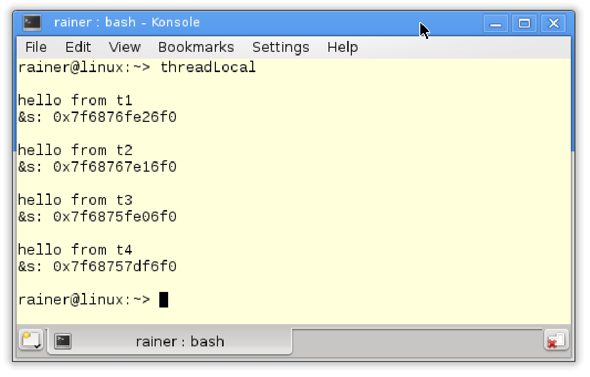
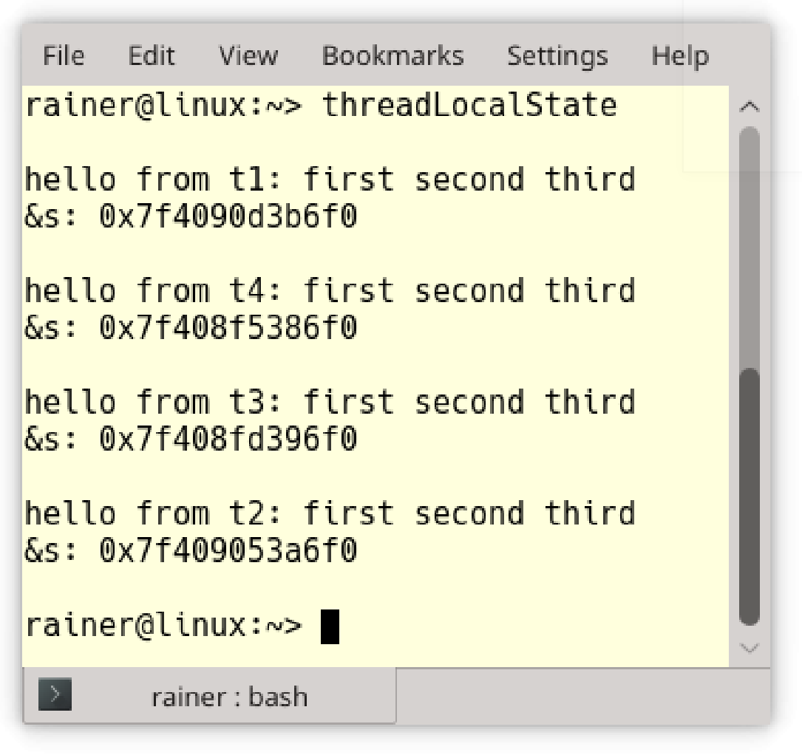

# 线程-本地数据

线程-本地数据(也称为线程-本地存储)是为每个线程单独创建的，其行为类似于静态数据。在命名空间范围内，或作为静态类成员的线程局部变量，是在第一次使用之前创建，而在函数中声明的线程局部变量是在第一次使用时创建，并且线程-本地数据只属于线程。

```c++
// threadLocal.cpp

#include <iostream>
#include <string>
#include <mutex>
#include <thread>

std::mutex coutMutex;

thread_local std::string s("hello from ");

void addThreadLocal(std::string const& s2) {
  
  s += s2;
  // protect std::cout
  std::lock_guard<std::mutex> guard(coutMutex);
  std::cout << s << std::endl;
  std::cout << "&s: " << &s << std::endl;
  std::cout << std::endl;

}

int main() {

  std::cout << std::endl;

  std::thread t1(addThreadLocal, "t1");
  std::thread t2(addThreadLocal, "t2");
  std::thread t3(addThreadLocal, "t3");
  std::thread t4(addThreadLocal, "t4");

  t1.join();
  t2.join();
  t3.join();
  t4.join();

}
```

通过在第10行中使用关键字`thread_local`，可以创建线程本地字符串`s`。线程`t1` - `t4`(第27 - 30行)使用`addThreadLocal`函数(第12 - 21行)作为工作包。线程分别获取字符串`t1`到`t4`作为参数，并添加到线程本地字符串`s`中。另外，`addThreadLocal`在第18行会打印`s`的地址。



程序的输出在第17行显示内容，在第18行显示地址。要为字符串`s`创建线程本地字符串：首先，每个输出显示新的线程本地字符串；其次，每个字符串都有不同的地址。

我经常在研讨会上讨论：静态变量、`thread_local`变量和局部变量之间的区别是什么？静态变量与主线程的生命周期相同，`thread_local`变量与其所在线程的生存周期相同，而局部变量与创建作用域的生存周期相同。为了说明我的观点，来看一下代码。

```c++
// threadLocalState.cpp

#include <iostream>
#include <string>
#include <mutex>
#include <thread>

std::mutex coutMutex;

thread_local std::string s("hello from ");

void first() {
  s += "first ";
}

void second() {
  s += "second ";
}

void third() {
  s += "third";
}

void addThreadLocal(std::string const& s2) {
  
  s += s2;

  first();
  second();
  third();
  // protect std::cout
  std::lock_guard<std::mutex> guard(coutMutex);
  std::cout << s << std::endl;
  std::cout << "&s: " << &s << std::endl;
  std::cout << std::endl;

}

int main() {

  std::cout << std::endl;

  std::thread t1(addThreadLocal, "t1: ");
  std::thread t2(addThreadLocal, "t2: ");
  std::thread t3(addThreadLocal, "t3: ");
  std::thread t4(addThreadLocal, "t4: ");

  t1.join();
  t2.join();
  t3.join();
  t4.join();

}
```

代码中，函数`addThreadLocal `(第24行)先调用函数`first` ，然后调用`second`，再调用`third` 。每个函数都使用`thread_local`字符串`s`来添加它的函数名。这种变化的关键之处在于，字符串`s`在函数`first`、`second`和`third`中操作时，处于一种本地数据的状态(第28 - 30行)，并且从输出表明字符串是独立存在的。



> **单线程到多线程**
>
> 线程本地数据有助于将单线程程序移植成多线程程序。如果全局变量是线程局部的，则可以保证每个线程都得到其数据的副本，从而避免数据竞争。

与线程-本地数据相比，条件变量的使用门槛更高。

