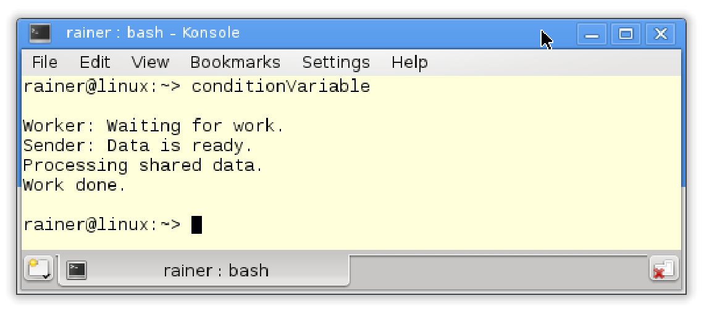
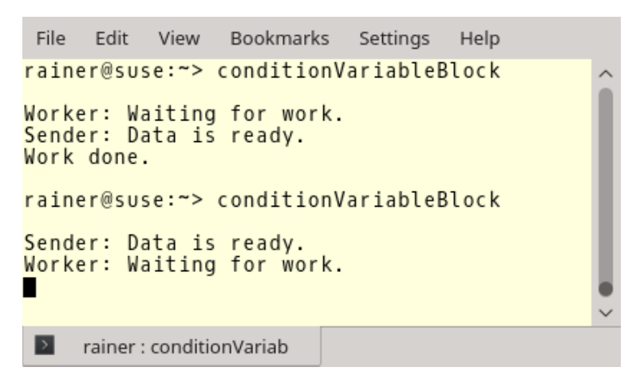

# 条件变量

条件变量通过消息对线程进行同步，需要包含`<condition_variable>`头文件。一个线程作为发送方，另一个线程作为接收方，接收方等待来自发送方的通知。条件变量的典型用例是发送方-接收方或生产者-消费者模式。

条件变量cv的成员函数

|             成员函数              |                         函数描述                         |
| :-------------------------------: | :------------------------------------------------------: |
|          cv.notify_one()          |                 通知一个正在等待中的线程                 |
|          cv.notify_all()          |                   通知所有等待中的线程                   |
|        cv.wait(lock, ...)         |            持有`std::unique_lock`，并等待通知            |
|  cv.wait_for(lock, relTime, ...)  |    持有`std::unique_lock`，并在给定的时间段内等待通知    |
| cv.wait_until(lock, absTime, ...) | 持有`std::unique_lock`的同时，并在给定的时间点前等待通知 |
|        cv.native_handle()         |                  返回条件变量的底层句柄                  |

`cv.notify_one`和`cv.notify_all`相比较，`cv.notify_all`会通知所有正在等待的线程，`cv.notify_one`只通知一个正在等待的线程，其他条件变量依旧保持在等待状态。介绍条件变量的详细信息(即等待操作中的三个点)之前，来看个示例。

```c++
// conditionVariable.cpp

#include <iostream>
#include <condition_variable>
#include <mutex>
#include <thread>

std::mutex mutex_;
std::condition_variable condVar;

bool dataReady{ false };

void doTheWork() {
  std::cout << "Processing shared data." << std::endl;
}

void waitingForWork() {
  std::cout << "Worker: Waiting for work." << std::endl;
  std::unique_lock<std::mutex> lck(mutex_);
  condVar.wait(lck, [] {return dataReady; });
  doTheWork();
  std::cout << "Work done." << std::endl;
}

void setDataReady() {
  {
    std::lock_guard<std::mutex> lck(mutex_);
    dataReady = true;
  }
  std::cout << "Sender: Data is ready." << std::endl;
  condVar.notify_one();
}

int main() {

  std::cout << std::endl;

  std::thread t1(waitingForWork);
  std::thread t2(setDataReady);

  t1.join();
  t2.join();

  std::cout << std::endl;

}
```

该程序有两个子线程：`t1`和`t2`。第38行和第39行中，他们得到工作包`waitingForWork`和`setDataRead`。`setDataReady`使用条件变量`condVar`通知其他线程准备工作已经完成：`condVar.notify_one()`。当持有锁时，线程`t1`等待它的通知：`condVar.wait(lck, []{ return dataReady; }) `。发送方和接收方需要一个锁，对于发送方，`std::lock_guard`就足够了，因为它只调用`lock`和`unlock`一次；对于接收方来说，`std::unique_lock`是必需的，因为它需要锁定和解锁互斥锁。

程序的输出如下：



> 知识点
>
> **std::condition_variable_any**
>
> `std::condition_variable`只能等待类型为`std::unique_lock<mutex>`的对象，但是`std::condition_variable_any`可以等待符合[BasicLockable]( http://en.cppreference.com/w/cpp/concept/BasicLockable)原则的锁类型。`std::condition_variable_any`与`std::condition_variable`支持的接口相同。

## 谓词

您可能想知道为什么需要谓词来调用wait，因为可以在没有谓词的情况下调用wait。我们来试试。

等待使用谓词与否都是可以的，我们来看个例子。

```c++
// conditionVariableBlock.cpp

#include <iostream>
#include <condition_variable>
#include <mutex>
#include <thread>

std::mutex mutex_;
std::condition_variable condVar;

void waitingForWork() {

  std::cout << "Worker: Waiting for work." << std::endl;

  std::unique_lock<std::mutex> lck(mutex_);
  condVar.wait(lck);
  // do the work
  std::cout << "Work done." << std::endl;

}

void setDataReady() {

  std::cout << "Sender: Data is ready." << std::endl;
  condVar.notify_one();

}

int main() {

  std::cout << std::endl;

  std::thread t1(setDataReady);
  std::thread t2(waitingForWork);

  t1.join();
  t2.join();

  std::cout << std::endl;

}
```

程序的第一次运行正常，但第二次阻塞是因为通知(第25行)发生在线程t2(第34行)进入等待状态(第16行)之前。



现在就很清楚了，谓词是无状态条件变量；因此，等待过程中总是首先检查谓词。条件变量有两个已知有害现象：未唤醒和伪唤醒。

## 未唤醒和伪唤醒

**未唤醒**

该现象是发送方在接收方到达其等待状态之前发送通知，结果是通知丢失了。C++标准将条件变量描述为同步机制：“条件变量类是同步原语，可用于阻塞一个线程，或同时阻塞多个线程……”所以通知丢失了，接收者就会持续等待……

**伪唤醒**

还有一种情况，就会没有发通知，但接收方会被唤醒。在使用[POSIX Threads](https://en.wikipedia.org/wiki/POSIX_Threads)和 [Windows API](https://en.wikipedia.org/wiki/Windows_API)时，都会出现这样的现象。伪唤醒的真相很可能是本来就没有处于休眠状态。这意味着，在被唤醒的线程有机会运行之前，另一个线程早就等候多时了。

## 等待线程的工作流程

等待线程的工作流程相当复杂。

下面是来自前面示例conditionVariable.cpp的19和20行。

```c++
std::unique_lock<std::mutex> lck(mutex_);
condVar.wait(lck, []{ return dataReady; });
```

这两行与下面四行等价：

```c++
std::unique_lock<std::mutex> lck(mutex_);
while ( ![]{ return dataReady; }() {
	condVar.wait(lck);
}
```

首先，必须区分`std::unique_lock<std::mutex> lck(mutex_)`的第一次调用与条件变量的通知：`condVar.wait(lck)`。

* `std::unique_lock<std::mutex> lck(mutex_)` : 在初始化阶段，线程就将互斥量锁定，并对谓词函数` []{ return dataReady;} `进行检查。
  *  谓词返回值：
    * true : 线程持续等待。
    * false : `condVar.wait()`解锁互斥量，并将线程置为等待(阻塞)状态。
* `condVar.wait(lck)` : 如果`condition_variable condVar`处于等待状态，并获得通知或伪唤醒处于运行状态，则执行以下步骤。
  * 线程解除阻塞，并重新获得互斥锁。
  * 检查谓词函数。
  * 当谓词函数返回值为：
    * true : 线程继续工作。
    * false : `condVar.wait()`解锁互斥量，并将线程置为等待(阻塞)状态。

即使共享变量是原子的，也必须在互斥锁保护下进行修改，以便将正确地内容告知等待的线程。

> 警告
>
> **使用互斥锁来保护共享变量**
>
> 即使将`dataReady`设置为原子变量，也必须在互斥锁的保护下进行修改；如果没有，对于等待线程来说`dataReady`的内容可能就是错误的。此竞争条件可能导致死锁。让我们再一次仔细查看一下等待工作流，并假设`deadReady`是一个原子变量，在不受互斥锁`mutex_`的保护时进行修改。
>
> ```c++
> std::unique_lock<std::mutex> lck(mutex_);
> while ( ![]{ return dataReady.load(); }() {
>   // time window
>   condVar.wait(lck);
> }
> ```
>
> 假设在条件变量`condVar`，在不处于等待状态时发送通知。这意味着线程的执行到第2行和第4行之间时(参见注释时间窗口)，丢失通知。之后，线程返回到等待状态，可能会永远休眠。
>
> 如果`dataReady`被互斥锁保护，就不会发生这种情况。由于与互斥锁能够同步，只有在接收线程处于等待状态的情况下才会发送通知。

大多数用例中，任务用不容易出错的方式同步线程。我在“任务-通知”章节中，比较了条件变量和任务。