# 任务

除了线程之外，C++还有可以异步处理任务，这种方式处理任务需要包含`<future>`头文件。任务由一个参数化工作包和两个组件组成：promise和future，两者构建一条数据通道。promise执行工作包并将结果放入数据通道，对应的future可以获取结果，两个通信端可以在不同的线程中运行。特别的是future可以在之后的某个时间点获取结果，所以通过promise计算结果与通过future查询结果的步骤是分开的。

> **将任务视为通信端间的数据通道**
>
> 任务的行为类似于通信点之间的数据通道。数据通道的一端称为promise，另一端称为future。这些端点可以存在于相同的线程中，也可以存在于不同的线程中。promise将其结果放入数据通道，future会在晚些时候把结果取走。

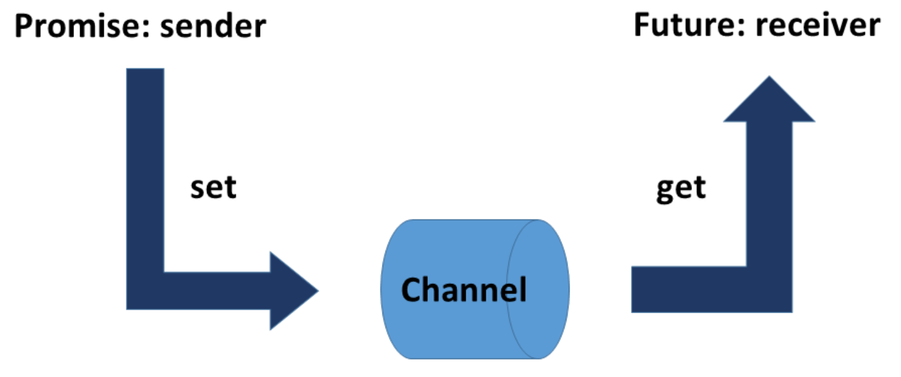

##  任务 vs. 线程

任务与线程有很大的不同。

```c++
// asyncVersusThread.cpp

#include <future>
#include <thread>
#include <iostream>

int main() {

  std::cout << std::endl;

  int res;
  std::thread t([&] {res = 2000 + 11; });
  t.join();
  std::cout << "res: " << res << std::endl;

  auto fut = std::async([] {return 2000 + 11; });
  std::cout << "fut.get(): " << fut.get() << std::endl;

  std::cout << std::endl;

}
```

线程`t`和`std::async`异步调用函数同时计算2000和11的和。主线程通过共享变量`res`获取其线程`t`的计算结果，并在第14行中显示它。第16行中，使用`std::async`在发送方(`promise`)和接收方(`future`)之间创建数据通道。future 变量使用`fut.get()`(第17行)，通过数据通道获得计算结果。`fut.get `为阻塞调用。

下面是程序输出的结果：

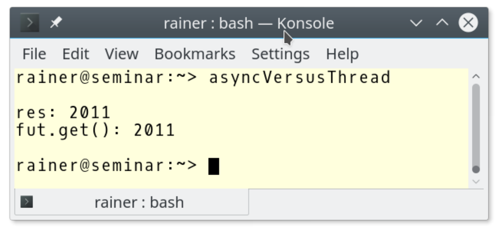

基于这个程序，我想强调线程和任务之间的区别。

任务 vs. 线程

|     标准     |         线程         |        任务         |
| :----------: | :------------------: | :-----------------: |
|   构成元素   |   创建线程和子线程   |   promise和future   |
|   通讯方式   |       共享变量       |      通信通道       |
|   创建线程   |       必定创建       |        可选         |
|   同步方式   |  通过`join()`(等待)  | 使用`get`阻塞式调用 |
| 线程中的异常 | 子线程和创建线程终止 |   返回promise的值   |
|   通信类型   |        变量值        | 变量值、通知和异常  |

线程需要包含`<thread>`头文件，任务需要包含`<future>`头文件。

创建线程和子线程之间的通信需要使用共享变量，任务通过其隐式的数据通道保护数据通信。因此，任务不需要互斥锁之类的保护机制。

虽然，可以使用共享变量(的可变)来在子线程及其创建线程之间进行通信，但任务的通信方式更为明确。future只能获取一次任务的结果(通过调用`fut.get()`)，多次调用它会导致未定义的行为(而`std::shared_future`可以查询多次)。

创建线程需要等待子线程汇入。而使用`fut.get()`时，该调用将一直阻塞，直到获取结果为止。

如果子线程中抛出异常，创建的线程将终止，创建者和整个进程也将终止。相反，promise可以将异常发送给future，而future必须对异常进行处理。

一个promise可以对应于一个或多个future。它可以发送值、异常，或者只是通知，可以使用它们替换条件变量。

`std::async `是创建future最简单的方法。

**std::async**

`std::async`的行为类似于异步函数调用，可调用带有参数的函数。`std::async`是一个可变参数模板，因此可以接受任意数量的参数。对`std::async`的调用会返回一个future 的对象`fut`。可以通过`fut.get()`获得结果。

> **std::async应该首选**
>
> C++运行时决定`std::async`是否在独立的线程中执行，决策可能取决于可用的CPU内核的数量、系统的利用率或工作包的大小。通过使用`std::async`，只需要指定运行的任务，C++运行时会自动管理线程。

可以指定`std::async`的启动策略。

##启动策略

使用启动策略，可以显式地指定异步调用应该在同一线程(`std::launch::deferred`)中执行，还是在不同线程(`std::launch::async`)中执行。

> **[及早求值]([https://zh.wikipedia.org/wiki/%E5%8F%8A%E6%97%A9%E6%B1%82%E5%80%BC](https://zh.wikipedia.org/wiki/及早求值))与[惰性求值]([https://zh.wikipedia.org/wiki/%E6%83%B0%E6%80%A7%E6%B1%82%E5%80%BC](https://zh.wikipedia.org/wiki/惰性求值))**
>
> 及早求值与惰性求值是计算结果表达式的两种策略。在[及早求值](https://en.wikipedia.org/wiki/Eager_evaluation)的情况下，立即计算表达式，而在[惰性求值](https://en.wikipedia.org/wiki/Lazy_evaluation) 的情况下，仅在需要时才计算表达式。及早求值通常称为贪婪求值，而惰性求值通常称为按需调用。使用惰性求值，可以节省时间和计算资源。

调用`auto fut = std::async(std::launch::deferred，…)`的特殊之处在于，promise可能不会立即执行，调用`fut.get()`时才执行对应的promise 。这意味着，promise只在future调用`fut.get()`时计算得到结果。

```c++
// asyncLazy.cpp

#include <chrono>
#include <future>
#include <iostream>

int main() {

  std::cout << std::endl;

  auto begin = std::chrono::system_clock::now();

  auto asyncLazy = std::async(std::launch::deferred,
    [] {return std::chrono::system_clock::now(); });

  auto asyncEager = std::async(std::launch::async,
    [] {return std::chrono::system_clock::now(); });

  std::this_thread::sleep_for(std::chrono::seconds(1));

  auto lazyStart = asyncLazy.get() - begin;
  auto eagerStart = asyncEager.get() - begin;

  auto lazyDuration = std::chrono::duration<double>(lazyStart).count();
  auto eagerDuration = std::chrono::duration<double>(eagerStart).count();

  std::cout << "asyncLazy evaluated after : " << lazyDuration
    << " seconds." << std::endl;
  std::cout << "asyncEager  evaluated after : " << eagerDuration
    << " seconds." << std::endl;

  std::cout << std::endl;

}
```

两个`std::async`调用(第13行和第16行)都返回当前时间点。但是，第一个调用是`lazy`，第二个调用是`eager`。第21行中的`asyncLazy.get()`调用触发了第13行promise的执行——短睡一秒(第19行)。这对于`asyncEager`来说是不存在的，`asyncEager.get()`会立即获取执行结果。

下面就是该程序输出的结果：

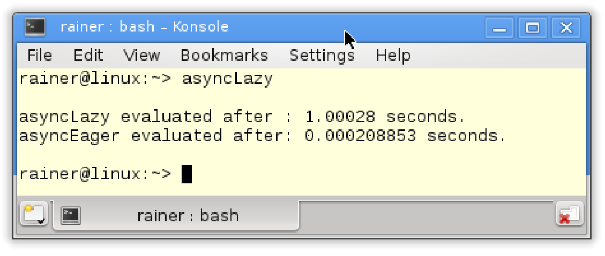

不必把future绑定到变量上。

## [发后即忘]([https://zh.wikipedia.org/wiki/%E5%B0%84%E5%BE%8C%E4%B8%8D%E7%90%86](https://zh.wikipedia.org/wiki/射後不理))(Fire and Forget)

发后即忘是比较特殊的future。因为其future不受某个变量的约束，所以只是在原地执行。对于一个发后即忘的future，相应的promise运行在一个不同的线程中，所以可以立即开始(这是通过`std::launch::async`策略完成的)。

我们对普通的future和发后即忘的future进行比较。

```c++
auto fut= std::async([]{ return 2011; });
std::cout << fut.get() << std::endl;

std::async(std::launch::async,
						[]{ std::cout << "fire and forget" << std::endl; });
```

发后即忘的future看起来很有美好，但有一个很大的缺点。`std::async`创建的future会等待promise完成，才会进行析构。这种情况下，等待和阻塞就没有太大的区别了。future的析构函数会中阻塞程序的进程，当使用发后即忘的future时，这一点变得更加明显，看起来程序上是并发的，但实际上是串行运行的。

```c++
// fireAndForgetFutures.cpp

#include <chrono>
#include <future>
#include <iostream>
#include <thread>

int main() {

  std::cout << std::endl;

  std::async(std::launch::async, [] {
    std::this_thread::sleep_for(std::chrono::seconds(2));
    std::cout << "first thread" << std::endl;
    });

  std::async(std::launch::async, [] {
    std::this_thread::sleep_for(std::chrono::seconds(2));
    std::cout << "second thread" << std::endl; }
  );

  std::cout << "main thread" << std::endl;

  std::cout << std::endl;

}
```

程序在线程中执行两个promise，这样就会产生发后即忘的future。future在析构函数中阻塞线程，直到相关的promise完成。promise是按照源代码顺序执行的，执行顺序与执行时间无关。

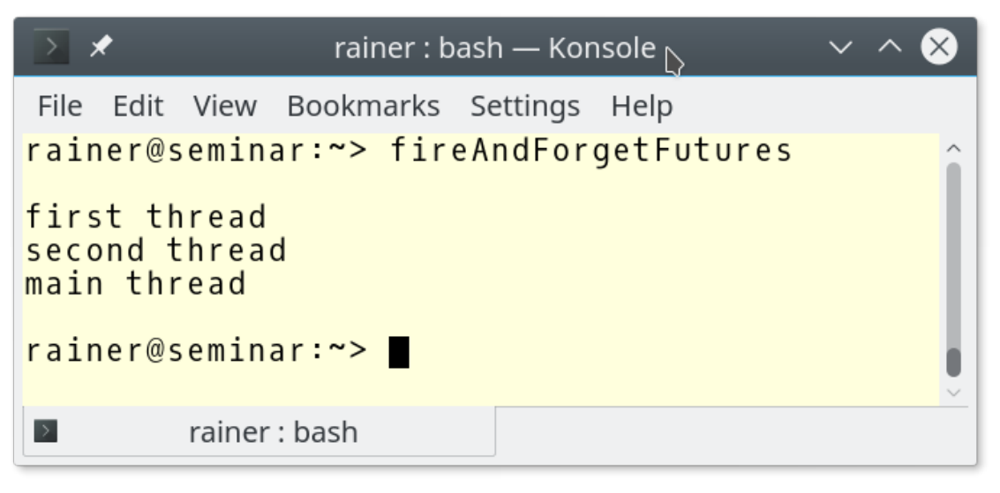

`std::async`是一种方便的机制，可用于在分解较大的计算任务。

## 并行计算

标量乘积的计算可分布在四个异步调用中。

```c++
// dotProductAsync.cpp

#include <iostream>
#include <future>
#include <random>
#include <vector>
#include <numeric>

using namespace std;

static const int NUM = 100000000;

long long getDotProduct(vector<int>& v, vector<int>& w) {

  auto vSize = v.size();

  auto future1 = async([&] {
    return inner_product(&v[0], &v[vSize / 4], &w[0], 0LL);
    });

  auto future2 = async([&] {
    return inner_product(&v[vSize / 4], &v[vSize / 2], &w[vSize / 4], 0LL);
    });

  auto future3 = async([&] {
    return inner_product(&v[vSize / 2], &v[vSize * 3 / 4], &w[vSize / 2], 0LL);
    });

  auto future4 = async([&] {
    return inner_product(&v[vSize * 3 / 4], &v[vSize], &w[vSize * 3 / 4], 0LL);
    });

  return future1.get() + future2.get() + future3.get() + future4.get();
}


int main() {

  cout << endl;

  random_device seed;

  // generator
  mt19937 engine(seed());

  // distribution
  uniform_int_distribution<int> dist(0, 100);

  // fill the vector
  vector<int> v, w;
  v.reserve(NUM);
  w.reserve(NUM);
  for (int i = 0; i < NUM; ++i) {
    v.push_back(dist(engine));
    w.push_back(dist(engine));
  }

  cout << "getDotProduct(v, w): " << getDotProduct(v, w) << endl;

  cout << endl;

}
```

该程序使用了随机库和时间库，创建两个向量`v`和`w`并用随机数填充(第50-56行)，每个向量添加(第53 - 56行)1亿个元素。第54和55行中的`dist(engine)`生成均匀分布在0到100之间的随机数。标量乘积的计算在`getDotProduct`中进行(第13 - 34行)。内部实现中，`std::async`使用标准库算法`std::inner_product`。最后，使用future获取结果进行相加，就得到了最终结果。

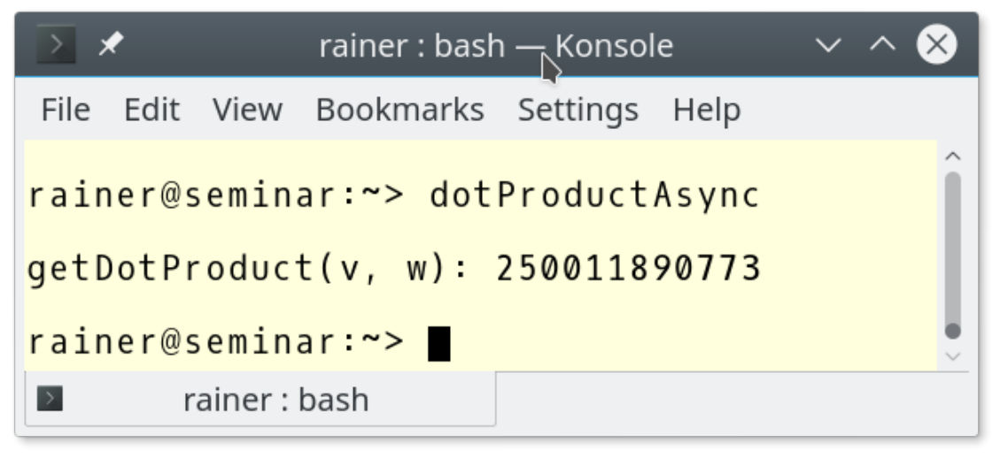

`std::packaged_task`通常也用于并发。

**std::packaged_task**

`std::packaged_task`是用于异步调用的包装器。通过`pack.get_future() `可以获得相关的future。可以使用可调用操作符`pack(pack())`执行`std::packaged_task`。

处理`std::packaged_task`通常包括四个步骤:

I. 打包:

```c++
std::packaged_task<int(int, int)> sumTask([](int a, int b){ return a + b; });
```

II. 创建future:

````c++
std::future<int> sumResult= sumTask.get_future();
````

III. 执行计算:

```c++
sumTask(2000, 11);
```

IV. 查询结果:

```c++
sumResult.get();
```

下面的示例，展示了这四个步骤。

```c++
// packagedTask.cpp

#include <utility>
#include <future>
#include <iostream>
#include <thread>
#include <deque>

class SumUp {
public:
  int operator()(int beg, int end) {
    long long int sum{ 0 };
    for (int i = beg; i < end; ++i) sum += i;
    return static_cast<int>(sum);
  }
};

int main() {

  std::cout << std::endl;

  SumUp sumUp1;
  SumUp sumUp2;
  SumUp sumUp3;
  SumUp sumUp4;

  // wrap the task
  std::packaged_task<int(int, int)> sumTask1(sumUp1);
  std::packaged_task<int(int, int)> sumTask2(sumUp2);
  std::packaged_task<int(int, int)> sumTask3(sumUp3);
  std::packaged_task<int(int, int)> sumTask4(sumUp4);

  // create the futures
  std::future<int> sumResult1 = sumTask1.get_future();
  std::future<int> sumResult2 = sumTask2.get_future();
  std::future<int> sumResult3 = sumTask3.get_future();
  std::future<int> sumResult4 = sumTask4.get_future();

  // push the task on the container
  std::deque<std::packaged_task<int(int, int)>> allTasks;
  allTasks.push_back(std::move(sumTask1));
  allTasks.push_back(std::move(sumTask2));
  allTasks.push_back(std::move(sumTask3));
  allTasks.push_back(std::move(sumTask4));

  int begin{ 1 };
  int increment{ 2500 };
  int end = begin + increment;

  // preform each calculation in a separate thread
  while (!allTasks.empty()) {
    std::packaged_task<int(int, int)> myTask = std::move(allTasks.front());
    allTasks.pop_front();
    std::thread sumThread(std::move(myTask), begin, end);
    begin = end;
    end += increment;
    sumThread.detach();
  }
  
  // pick up the results
  auto sum = sumResult1.get() + sumResult2.get() +
    sumResult3.get() + sumResult4.get();

  std::cout << "sum of 0 .. 10000 = " << sum << std::endl;

  std::cout << std::endl;

}
```

这段程序的是计算从0到10000的整数和。创建四个`std::packaged_task`的对象，并且每个`std::packaged_task`有自己的线程，并使用future来汇总结果。当然，也可以直接使用[Gaußschen Summenformel](https://de.wikipedia.org/wiki/Gau%C3%9Fsche_Summenformel)(高斯求和公式)。真奇怪，我没有找到英文网页。(译者注：打开网页就是最熟悉的高斯求和公式，也就是[等差数列求和公式]([https://baike.baidu.com/item/%E9%AB%98%E6%96%AF%E7%AE%97%E6%B3%95/4727683](https://baike.baidu.com/item/高斯算法/4727683))。翻了下维基百科，确实没有相关的英文页面。)

**I. 打包任务**：程序将工作包打包进`std::packaged_task`(第28 - 31行)的实例中，工作包就是`SumUp`的实例(第9 - 16行)，使用函数操作符完成任务(第11 - 15行)。函数操作符将`beg`到`end - 1`的所有整数相加并返回结果。第28 - 31行中的`std::packaged_task`实例可以处理需要两个`int`参数的函数调用，并返回一个`int: int(int, int)`类型的任务包。

**II.创建future**：第34到37行中，使用`std::packaged_task`创建future对象，这时`std::packaged_task`对象属于通信通道中的promise。future的类型有明确定义：`std::future<int> sumResult1 = sumTask1.get_future()`，也可以让编译器来确认future的具体类型：`auto  sumResult1 sumTask1.get_future()`。

**III. 进行计算**：开始计算。将任务包移动到[`std::deque`](http://en.cppreference.com/w/cpp/container/deque)(第40 - 44行)中，while循环(第51 - 58行)会执行每个任务包。为此，将`std::deque`的队头任务包移动到一个`std::packaged_task`实例中(第52行)，并将这个实例移动到一个新线程中(第54行)，并让这个线程在后台运行(第57行)。因为`packaged_task`对象不可复制的，所以会在52和54行中使用`move`语义。这个限制不仅适用于所有的promise实例，但也适用于future和线程实例。但有一个例外：`std::shared_future`。

**IV. 查询结果**：最后一步中，从每个future获取计算的结果，并把它们加起来(第61行)。

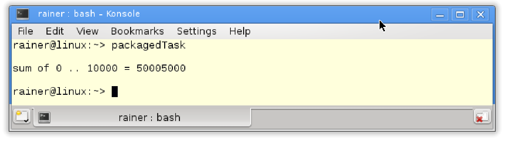

下表展示`std::packaged_task pack`的接口

|                   成员函数                   |                    函数描述                    |
| :------------------------------------------: | :--------------------------------------------: |
| `pack.swap(pack2)`和`std::swap(pack, pack2)` |                    交换对象                    |
|                `pack.valid()`                |            检查对象中的函数是否合法            |
|             `pack.get_future()`              |                   返回future                   |
|     `pack.make_ready_at_thread_exit(ex)`     | 执行的函数，如果线程还存在，那么结果还是可用的 |
|                `pack.reset()`                |       重置任务的状态，擦除之前执行的结果       |

与`std::async`或`std::promise`相比，`std::packaged_task`可以复位并重复使用。下面的程序展示了`std::packaged_task`的“特殊”使用方式。

```c++
// packagedTaskReuse.cpp

#include <functional>
#include <future>
#include <iostream>
#include <utility>
#include <vector>

void calcProducts(std::packaged_task<int(int, int)>& task,
  const std::vector<std::pair<int, int>>& pairs) {
  for (auto& pair : pairs) {
    auto fut = task.get_future();
    task(pair.first, pair.second);
    std::cout << pair.first << " * " << pair.second << " = " << fut.get()<<
      std::endl;
    task.reset();
  }
}

int main() {

  std::cout << std::endl;

  std::vector<std::pair<int, int>> allPairs;
  allPairs.push_back(std::make_pair(1, 2));
  allPairs.push_back(std::make_pair(2, 3));
  allPairs.push_back(std::make_pair(3, 4));
  allPairs.push_back(std::make_pair(4, 5));

  std::packaged_task<int(int, int)> task{ [](int fir, int sec) {
    return fir * sec; }
  };

  calcProducts(task, allPairs);

  std::cout << std::endl;
  
  std::thread t(calcProducts, std::ref(task), allPairs);
  t.join();

  std::cout << std::endl;

}
```

函数`calcProduct`(第9行)有两个参数：`task`和`pairs`。使用任务包`task`来计算`pairs`中的每个整数对的乘积(第13行)，并在第16行重置任务`task`。这样，`calcProduct`就能在主线程(第34行)和另外开启的线程(第38行)中运行。下面是程序的输出。

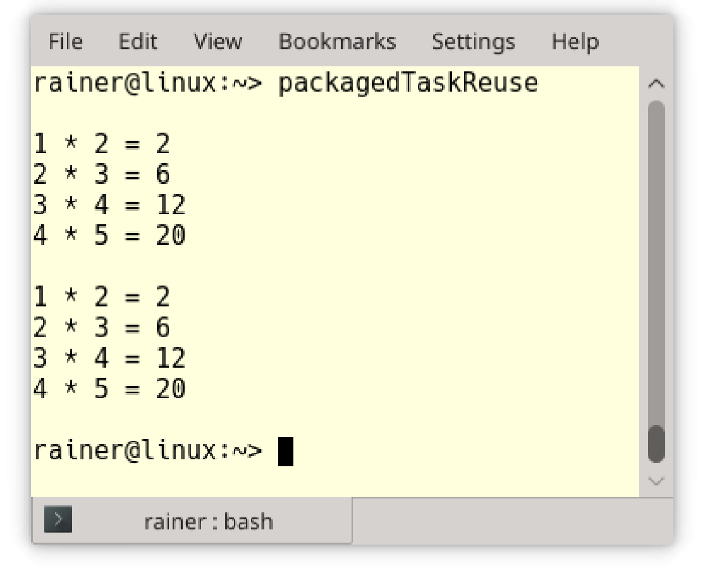

**std::promise和std::future**

`std::promise`和`std::future`可以完全控制任务。

promise和future是一对强有力的组合。promise可以将值、异常或通知放入数据通道。一个promise可以对应多个`std::shared_future`对象。

下面是`std::promise`和`std::future`用法的示例。两个通信端点都可以在不同的的线程中，因此通信可以在线程间发生。

```c++
// promiseFuture.cpp

#include <future>
#include <iostream>
#include <thread>
#include <utility>

void product(std::promise<int>&& intPromise, int a, int b) {
  intPromise.set_value(a * b);
}

struct Div {

  void operator()(std::promise<int>&& intPromise, int a, int b) const {
    intPromise.set_value(a / b);
  }

};

int main() {
  
  int a = 20;
  int b = 10;

  std::cout << std::endl;

  // define the promises
  std::promise<int> prodPromise;
  std::promise<int> divPromise;

  // get the futures
  std::future<int> prodResult = prodPromise.get_future();
  std::future<int> divResult = divPromise.get_future();

  // calculate the result in a separate thread
  std::thread prodThread(product, std::move(prodPromise), a, b);
  Div div;
  std::thread divThread(div, std::move(divPromise), a, b);

  // get the result
  std::cout << "20*10 = " << prodResult.get() << std::endl;
  std::cout << "20/10 = " << divResult.get() << std::endl;

  prodThread.join();

  divThread.join();

  std::cout << std::endl;

}
```

将函数`product`(第8 -10行)、`prodPromise`(第32行)以及数字`a`和`b`放入线程`Thread prodThread`(第36行)中。`prodThread`的第一个参数需要一个可调用的参数，上面程序中就是函数乘积函数。函数需要一个类型右值引用的promise(`std::promise<int>&& intPromise`)和两个数字。`std::move`(第36行)创建一个右值引用。剩下的就简单了，`divThread`(第38行)将`a`和`b`分开传入。

future通过`prodResult.get()`和`divResult.get()`获取结果

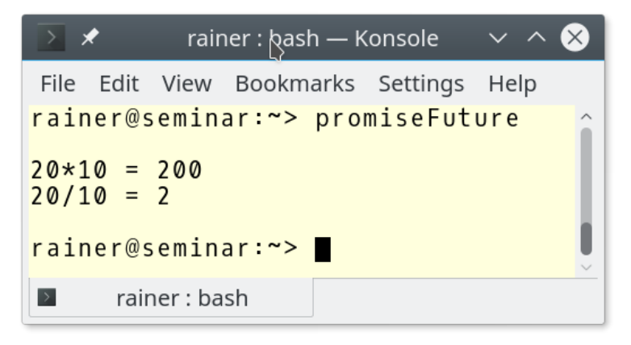

**std::promise**

`std::promise`允许设置一个值、一个通知或一个异常。此外，promise可以以延迟的方式提供结果。

`std::promise prom`的成员函数

|                   成员函数                   |        函数描述         |
| :------------------------------------------: | :---------------------: |
| `prom.swap(prom2)`和`std::swap(prom, prom2)` |        交换对象         |
|             `prom.get_future()`              |       返回future        |
|            `prom.set_value(val)`             |         设置值          |
|           `prom.set_exception(ex)`           |        设置异常         |
|     `prom.set_value_at_thread_exit(val)`     |  promise退出前存储该值  |
|   `prom.set_exception_at_thread_exit(ex)`    | promise退出前存储该异常 |

如果多次对promise设置值或异常，则会抛出`std::future_error`。

**std::future**

`std::future`可以完成的事情有：

* 从promise中获取值。
* 查询promise值是否可获取。
* 等待promise通知，这种等待可以用一个时间段或一个绝对的时间点来完成。
* 创建共享future(`std::shared_future`)。

future实例`fut`的成员函数

|         成员函数          |                           函数描述                           |
| :-----------------------: | :----------------------------------------------------------: |
|       `fut.share()`       |                   返回`std::shared_future`                   |
|        `fut.get()`        |                      返回可以是值或异常                      |
|       `fut.valid()`       | 检查当前实例是否可用调用`fut.get()`。使用get()之后，返回false |
|       `fut.wait()`        |                           等待结果                           |
|  `fut.wait_for(relTime)`  | 在`relTime`时间段内等待获取结果，并返回`std:: future_status`实例 |
| `fut.wait_until(absTime)` | 在`absTime`时间点前等待获取结果，并返回`std:: future_status`实例 |

与`wait`不同，`wait_for`和`wait_until`会返回future的状态。

**std::future_status**

future和共享future的`wait_for`和`wait_until`成员函数将返回其状态。有三种可能:

```c++
enum class future_status {
  ready,
  timeout,
  deferred
};	
```

下表描述了每种状态:

|   状态   |          描述          |
| :------: | :--------------------: |
| deferred |      函数还未运行      |
|  ready   |    结果已经准备就绪    |
| timeout  | 结果超时得到，视为过期 |

使用`wait_for`或`wait_until`可以一直等到相关的promise完成。

```c++
// waitFor.cpp

#include <iostream>
#include <future>
#include <thread>
#include <chrono>

using namespace std::literals::chrono_literals;

void getAnswer(std::promise<int> intPromise) {
  std::this_thread::sleep_for(3s);
  intPromise.set_value(42);
}

int main() {

  std::cout << std::endl;

  std::promise<int> answerPromise;
  auto fut = answerPromise.get_future();

  std::thread prodThread(getAnswer, std::move(answerPromise));

  std::future_status status{};
  do {
    status = fut.wait_for(0.2s);
    std::cout << "... doing something else" << std::endl;
  } while (status != std::future_status::ready);

  std::cout << std::endl;

  std::cout << "The Answer: " << fut.get() << '\n';

  prodThread.join();

  std::cout << std::endl;
}
```

在future`fut`在等待promise时，可以执行其他操作。

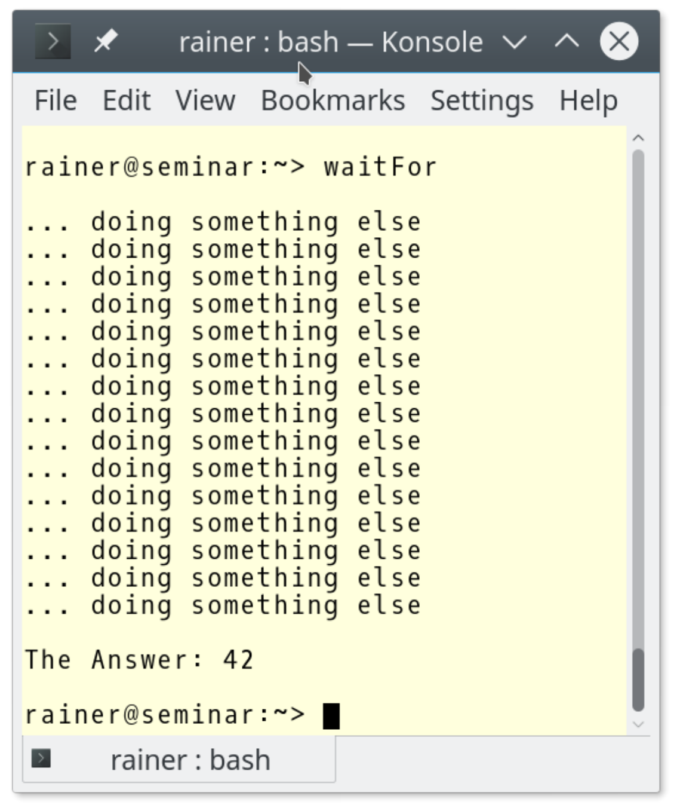

如果多次获取future`fut`的结果，会抛出`std::future_error`异常。

promise和future是一对一的关系，而`std::shared_future`支持一个promise 对应多个future。

**std::shared_future**

创建`std::shared_future `的两种方式：

1. 通过promise实例`prom`创建`std::shared_future`:` std::shared_future<int> fut = prom.get_future()`。
2. 使用`fut`的`fut.share()`进行创建。执行了`fut.share()`后，`fut.valid()`会返回false。

共享future是与相应的promise相关联的，可以获取promise的结果。共享future与`std::future`有相同的接口。

除了有`std::future`的功能外，`std::shared_future`还允许和其他future查询关联promise的值。

`std::shared_future`的操作很特殊，下面的代码中就直接创建了一个`std::shared_future`。

```c++
// sharedFuture.cpp

#include <future>
#include <iostream>
#include <thread>
#include <utility>

std::mutex coutMutex;

struct Div {

  void operator()(std::promise<int>&& intPromise, int a, int b) {
    intPromise.set_value(a / b);
  }

};

struct Requestor {

  void operator()(std::shared_future<int> shaFut) {

    // lock std::cout
    std::lock_guard<std::mutex> coutGuard(coutMutex);

    // get the thread id
    std::cout << "threadId(" << std::this_thread::get_id() << "): ";

    std::cout << "20/10= " << shaFut.get() << std::endl;

  }

};

int main() {

  std::cout << std::endl;

  // define the promises
  std::promise<int> divPromise;

  // get the futures
  std::shared_future<int> divResult = divPromise.get_future();

  // calculate the result in a separate thread
  Div div;
  std::thread divThread(div, std::move(divPromise), 20, 10);

  Requestor req;
  std::thread sharedThread1(req, divResult);
  std::thread sharedThread2(req, divResult);
  std::thread sharedThread3(req, divResult);
  std::thread sharedThread4(req, divResult);
  std::thread sharedThread5(req, divResult);

  divThread.join();

  sharedThread1.join();
  sharedThread2.join();
  sharedThread3.join();
  sharedThread4.join();
  sharedThread5.join();

  std::cout << std::endl;

}
```

promise和future的工作包都是函数对象。第46行中将`divPromise`移动到线程`divThread`中执行，因此会将`std::shared_future`复制到5个线程中(第49 - 53行)。与只能移动的`std::future`对象不同，可以`std::shared_future`对象可以进行复制。

主线程在第57到61行等待子线程完成它们的任务。

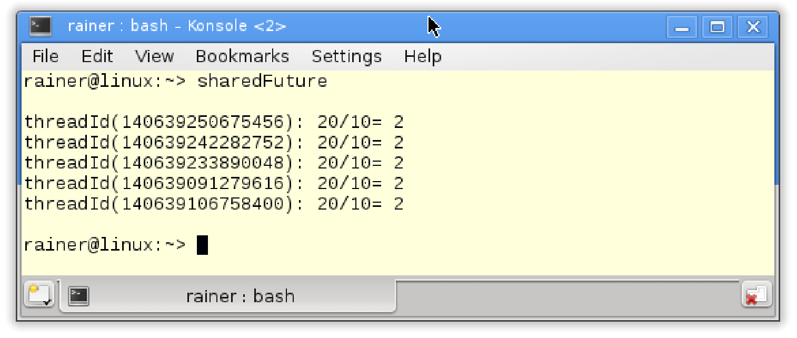

前面提到过，可以通过使用`std::future`的成员函数创建`std::shared_future`。我们把上面的代码改一下。

```c++
// sharedFutureFromFuture.cpp

#include <future>
#include <iostream>
#include <thread>
#include <utility>

std::mutex coutMutex;

struct Div {

  void operator()(std::promise<int>&& intPromise, int a, int b) {
    intPromise.set_value(a / b);
  }

};

struct Requestor {

  void operator()(std::shared_future<int> shaFut) {

    // lock std::cout
    std::lock_guard<std::mutex> coutGuard(coutMutex);

    // get the thread id
    std::cout << "threadId(" << std::this_thread::get_id() << "): ";

    std::cout << "20/10= " << shaFut.get() << std::endl;

  }

};

int main() {

  std::cout << std::boolalpha << std::endl;

  // define the promises
  std::promise<int> divPromise;

  // get the futures
  std::future<int> divResult = divPromise.get_future();

  std::cout << "divResult.valid(): " << divResult.valid() << std::endl;

  // calculate the result in a separate thread
  Div div;
  std::thread divThread(div, std::move(divPromise), 20, 10);

  std::cout << "divResult.valid(): " << divResult.valid() << std::endl;

  std::shared_future<int> sharedResult = divResult.share();

  std::cout << "divResult.valid(): " << divResult.valid() << "\n\n";

  Requestor req;
  std::thread sharedThread1(req, sharedResult);
  std::thread sharedThread2(req, sharedResult);
  std::thread sharedThread3(req, sharedResult);
  std::thread sharedThread4(req, sharedResult);
  std::thread sharedThread5(req, sharedResult);

  divThread.join();

  sharedThread1.join();
  sharedThread2.join();
  sharedThread3.join();
  sharedThread4.join();
  sharedThread5.join();

  std::cout << std::endl;

}
```

`std::future`(第44行和第50行)前两次调用`divResult.valid()`都返回true。第52行执行`divResult.share()`之后，因为该操作使得状态转换为共享，所以在执行到第54行时，程序会返回false。

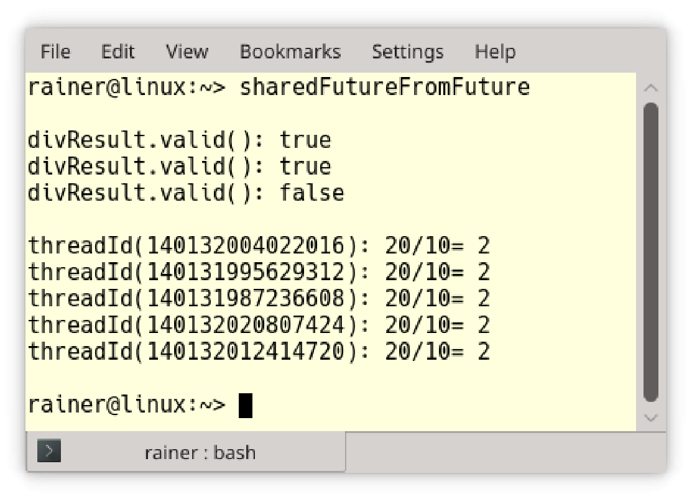

## 异常

如果`std::async`或`std::packaged_task`的工作包抛出错误，则异常会存储在共享状态中。当future`fut`调用`fut.get()`时，异常将重新抛出。

`std::promise prom`提供了相同的功能，但是它有一个成员函数`prom.set_value(std::current_exception())`可以将异常设置为共享状态。

数字除以0是未定义的行为，函数`executeDivision`显示计算结果或异常。

```c++
// promiseFutureException.cpp

#include <exception>
#include <future>
#include <iostream>
#include <thread>
#include <utility>

#ifdef WIN32
#include <string>
#endif

struct Div {
  void operator()(std::promise<int>&& intPromise, int a, int b){
    try {
      if (b == 0) {
        std::string errMess = std::string("Illegal division by zero: ") +
          std::to_string(a) + "/" + std::to_string(b);
        throw std::runtime_error(errMess);
      }
      intPromise.set_value(a / b);
    }
    catch (...) {
      intPromise.set_exception(std::current_exception());
    }
  }
};

void executeDivision(int nom, int denom) {
  std::promise<int> divPromise;
  std::future<int> divResult = divPromise.get_future();

  Div div;
  std::thread divThread(div, std::move(divPromise), nom, denom);

  // get the result or the exception
  try {
    std::cout << nom << "/" << denom << " = " << divResult.get() << std::endl;
  }
  catch (std::runtime_error& e) {
    std::cout << e.what() << std::endl;
  }

  divThread.join();
}

int main() {

  std::cout << std::endl;

  executeDivision(20, 0);
  executeDivision(20, 10);

  std::cout << std::endl;

}
```

这个程序中，promise会处理分母为0的情况。如果分母为0，则在第24行中将异常设置为返回值：`intPromise.set_exception(std::current_exception())`。future需要在try-catch中处理异常(第37 - 42行)。

下面是程序的输出。

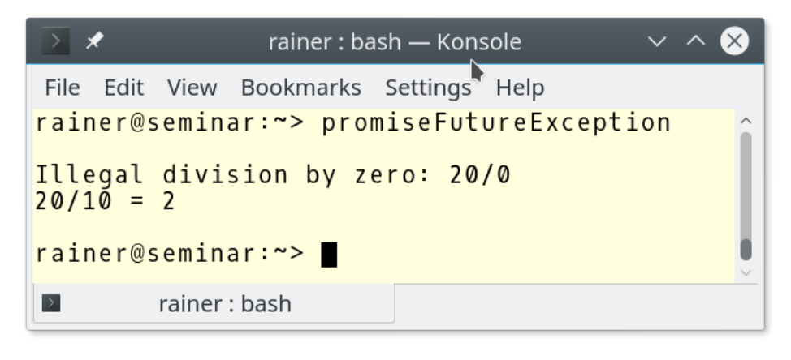

> **std::current_exception和std::make_exception_ptr**
>
> `std::current_exception()`捕获当前异常对象，并创建一个
>`std:: exception_ptr`。`std::exception_ptr`保存异常对象的副本或引用。如果在没有异常处理时调用该函数，则返回一个空的[`std::exception_ptr`]( http://en.cppreference.com/w/cpp/error/current_exception)。
> 
> 为了不在try/catch中使用`intPromise.set_exception(std::current_exception())`检索抛出的异常，可以直接调用`intPromise.set_exception(std::make_exception_ptr(std::runtime_error(errMess)))`。

如果在`std::promise`销毁之前没有调用设置类的成员函数，或是在`std::packaged_task`调用它，那么`std::future_error`异常和错误代码`std::future_errc::broken_promise`将存储在共享future中。

## 通知

任务是条件变量的一种替代方式。如果使用promise和future来同步线程，它们与条件变量有很多相同之处。大多数时候，promise和future是更好的选择。

在看例子之前，先了解下任务和条件变量的差异。

|     对比标准     | 条件变量 | 任务 |
| :--------------: | :------: | :--: |
|     多重同步     |   Yes    |  No  |
|    临界区保护    |   Yes    |  No  |
| 接收错误处理机制 |    No    | Yes  |
|      伪唤醒      |   Yes    |  No  |
|      未唤醒      |   Yes    |  No  |

与promise和future相比，条件变量的优点是可以多次同步线程，而promise只能发送一次通知，因此必须使用更多promise和future对，才能模拟出条件变量的功能。如果只同步一次，那条件变量正确的使用方式或许将更具大的挑战。promise和future对不需要共享变量，所以不需要锁，并且不大可能出现伪唤醒或未唤醒的情况。除了这些，任务还可以处理异常。所以，在同步线程上我会更偏重于选择任务，而不是条件变量。

还记得使用条件变量有多难吗？如果忘记了，这里展示了两个线程同步所需的关键部分。

```c++
void waitingForWork(){
  std::cout << "Worker: Waiting for work." << std::endl;
  
  std::unique_lock<std::mutex> lck(mutex_);
  condVar.wait(lck, []{ return dataReady; });
  doTheWork();
  std::cout << "Work done." << std::endl;
}

void setDataReady(){
  std::lock_guard<std::mutex> lck(mutex_);
  dataReady=true;
  std::cout << "Sender: Data is ready." << std::endl;
  condVar.notify_one();
}
```

函数`setDataReady`为同步通知，函数`waitingForWork`为同步等待。

使用任务完成相同的工作流程。

```c++
// promiseFutureSynchronise.cpp

#include <future>
#include <iostream>
#include <utility>


void doTheWork() {
  std::cout << "Processing shared data." << std::endl;
}

void waitingForWork(std::future<void>&& fut) {

  std::cout << "Worker: Waiting for work." << std::endl;
  fut.wait();
  doTheWork();
  std::cout << "Work done." << std::endl;

}

void setDataReady(std::promise<void>&& prom) {

  std::cout << "Sender: Data is ready." << std::endl;
  prom.set_value();

}

int main() {

  std::cout << std::endl;

  std::promise<void> sendReady;
  auto fut = sendReady.get_future();

  std::thread t1(waitingForWork, std::move(fut));
  std::thread t2(setDataReady, std::move(sendReady));

  t1.join();
  t2.join();

  std::cout << std::endl;

}
```

是不是非常简单？

通过`sendReady`(第32行)获得了一个future`fut`(第33行)，promise使用其返回值`void (std::promise<void> sendReady)`进行通信，并且只能够发送通知。两个通信端点分别移动到线程`t1`和`t2`中(第35行和第36行)，调用`fut.wait()`(第15行)等待promise的通知(`prom.set_value()`(第24行))。

程序结构和输出，与条件变量章节程序的输出一致。

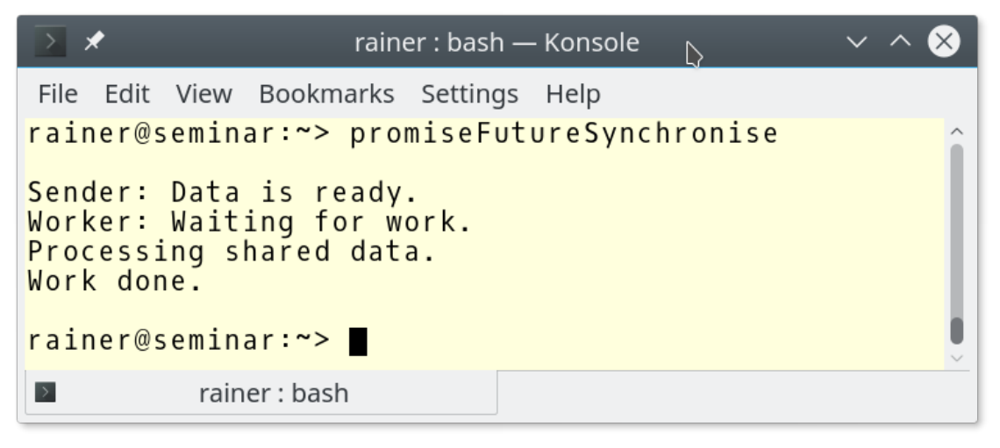