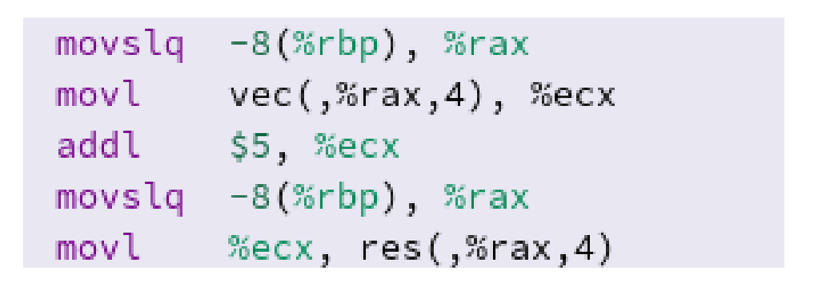
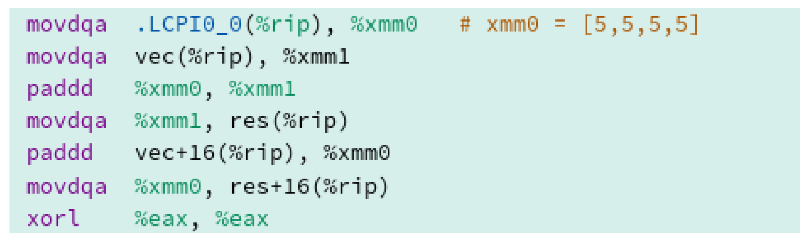
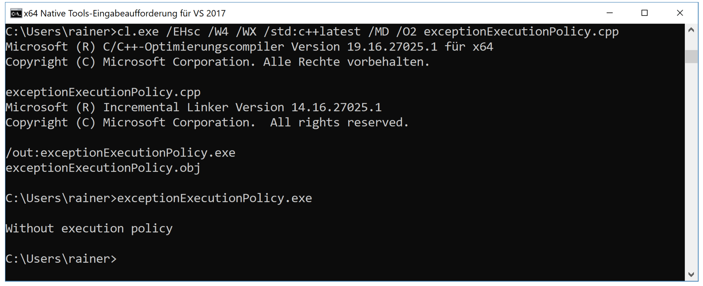

# 执行策略

C++17标准中定义了三种执行策略:

* `std::execution::sequenced_policy`
* `std::execution::parallel_policy`
* `std::execution::parallel_unsequenced_policy`

(译者注：C++20中添加了`unsequenced_policy`策略)

相应的策略标定了程序应该串行、并行，还是与向量化并行。

* `std::execution::seq `: 串行执行
* `std::execution::par `: 多线程并行执行
* `std::execution::par_unseq`: 多个线程上并行，可以循环交叉，也能使用[SIMD]( https://en.wikipedia.org/wiki/SIMD)(单指令多数据)

`std::execution::par`或`std::execution::par_unseq`允许算法并行或向量化并行。

下面的代码片段展示了所有执行策略的使用方式。

```c++

#include <execution>
#include <vector>
#include <algorithm>

int main() {
  
  std::vector<int> v = { 1, 2, 3, 4, 5, 6, 7, 8, 9 };

  // standard sequential sort
  std::sort(v.begin(), v.end());

  // sequential execution
  std::sort(std::execution::seq, v.begin(), v.end());
                    
  // permitting parallel execution
  std::sort(std::execution::par, v.begin(), v.end());

  //permitting parallel and vectorized execution
  std::sort(std::execution::par_unseq, v.begin(), v.end());

}
```

示例中，可以使用经典的`std::sort`(第11行)。C++17中，可以明确指定使用方式：串行(第14行)、并行(第17行)，还是向量化并行(第20行)。

`std::is_execution_policy`可以检查模板参数`T`是标准数据类型，还是执行策略类型：`std::is_execution_policy<T>::value`。如果`T`是`std::execution::sequenced_policy`, `std::execution::parallel_policy`, `std::execution::parallel_unsequenced_policy`，或已定义的执行策略类型，则表达式结果为true；否则，为false。

## 并行和向量化执行

算法是否以并行和向量化的方式运行，取决于许多因素。例如：CPU和编译器是否支持SIMD指令，还取决于编译器实现和代码的优化级别。

下面的示例使用循环填充数组。

```c++

#include <iostream>

const int SIZE = 8;

int vec[] = { 1, 2, 3, 4, 5, 6, 7, 8 };
int res[] = { 0, 0, 0, 0, 0, 0, 0, 0 };

int main() {

  for (int i = 0; i < SIZE; ++i) {
    res[i] = vec[i] + 5;
  }

  for (int i = 0; i < SIZE; ++i) {
    std::cout << res[i] << " ";
  }
  std::cout << std::endl;

}
```

第12行是这个示例中的关键。我们可以在[compiler explorer]( https://godbolt.org)看一下clang 3.6生成的相应汇编指令。

**无优化**

汇编指令中，每个加法都是串行进行的。



**使用最高优化级别**

通过使用最高的优化级别`-O3`，寄存器(如：xmm0)可以容纳128位，或者说是4个整型数字。这样，加法就可以同时在四个元素进行了。



无执行策略算法的重载，与具有串行执行策略`std::execution::seq`算法的重载在**异常**处理方面有所不同。

##异常

如果执行策略的算法发生异常，将调用[`std::terminate`](https://en.cppreference.com/w/cpp/error/terminate)。`std::terminate`调用[`std::terminate_handler`](https://en.cppreference.com/w/cpp/error/terminate_handler)，之后使用[`std::abort`]( https://en.cppreference.com/w/cpp/utility/program/abort)，让异常程序终止。执行策略的算法与调用`std::execution::seq`执行策略的算法之间没有区别。无执行策略的算法会传播异常，因此可以对异常进行处理。exceptionExecutionPolicy.cpp可以佐证我的观点。

```c++
// exceptionExecutionPolicy.cpp

#include <algorithm>
#include <execution>
#include <iostream>
#include <stdexcept>
#include <string>
#include <vector>

int main() {

  std::cout << std::endl;

  std::vector<int> myVec{ 1,2,3,4,5 };

  try {
    std::for_each(myVec.begin(), myVec.end(),
      [](int) {throw std::runtime_error("Without  execution policy"); }
    );
  }
  catch (const std::runtime_error & e) {
    std::cout << e.what() << std::endl;
  }

  try {
    std::for_each(std::execution::seq, myVec.begin(), myVec.end(),
      [](int) {throw std::runtime_error("With execution policy"); }
    );
  }
  catch (const std::runtime_error & e) {
    std::cout << e.what() << std::endl;
  }
  catch (...) {
    std::cout << "Catch-all exceptions" << std::endl;
  }

}
```

第21行可以捕获异常`std::runtime_error`，但不能捕获第30行中的异常，甚至在第33行中的捕获全部异常也无法捕获相应的异常。

使用新的MSVC编译器，并开启`std:c++latest`选项，程序会给出期望的输出。



只有第一个异常顺利捕获。

##数据竞争和死锁的风险

并行算法无法避免数据竞争和死锁。

下面的并行代码中，就存在数据竞争。

```c++

#include <execution>
#include <vector>

int main() {

  std::vector<int> v = { 1, 2, 3 };
  int sum = 0;
  std::for_each(std::execution::par, v.begin(), v.end(), [&sum](int i) {
    sum += i + i;
    });

}
```

代码段中，`sum`有数据竞争。`sum`上累加了`i + i`的和，并且是并发修改的，所以必须保护`sum`。

```c++

#include <execution>
#include <vector>
#include <mutex>

std::mutex m;

int main() {

  std::vector<int> v = { 1, 2, 3 };

  int sum = 0;
  std::for_each(std::execution::par, v.begin(), v.end(), [&sum](int i) {
    std::lock_guard<std::mutex> lock(m);
    sum += i + i;
    });

}
```

将执行策略更改为`std::execution::par_unseq`时，会出现条件竞争，并导致死锁。

```c++

#include <execution>
#include <vector>
#include <mutex>

std::mutex m;

int main() {

  std::vector<int> v = { 1, 2, 3 };

  int sum = 0;
  std::for_each(std::execution::par_unseq, v.begin(), v.end(), [&sum](int i) {
    std::lock_guard<std::mutex> lock(m);
    sum += i + i;
    });

}
```

同一个线程上，Lambda函数可能连续两次调用`m.lock`，这会产生未定义行为，大多数情况下会导致死锁。这里，可以使用原子来避免死锁。

```c++
#include <execution>
#include <vector>
#include <mutex>
#include <atomic>

std::mutex m;

int main() {

  std::vector<int> v = { 1, 2, 3 };

  std::atomic<int> sum = 0;
  std::for_each(std::execution::par_unseq, v.begin(), v.end(), [&sum](int i) {
    std::lock_guard<std::mutex> lock(m);
    sum += i + i;
    });

}
```

因为`sum`是一个原子计数器，所以将语义放宽也没关系：`sum.fetch_add(i * i, std::memory_order_relaxed)` .

执行策略可以作为参数传入69个STL重载算法中，以及C++17添加的8个新算法中。

