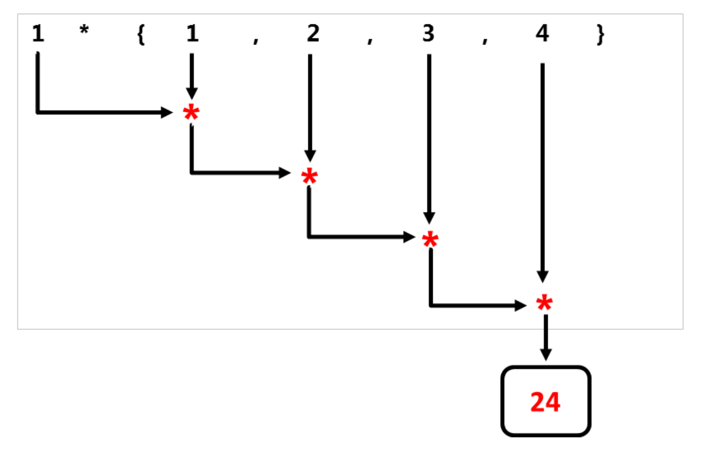
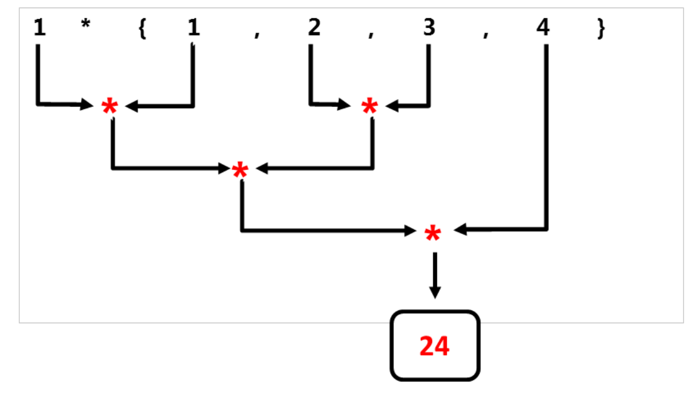
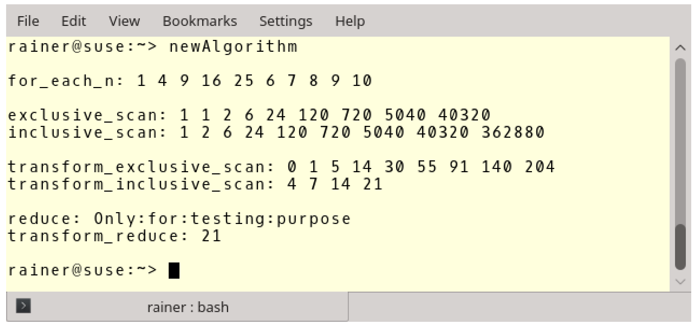
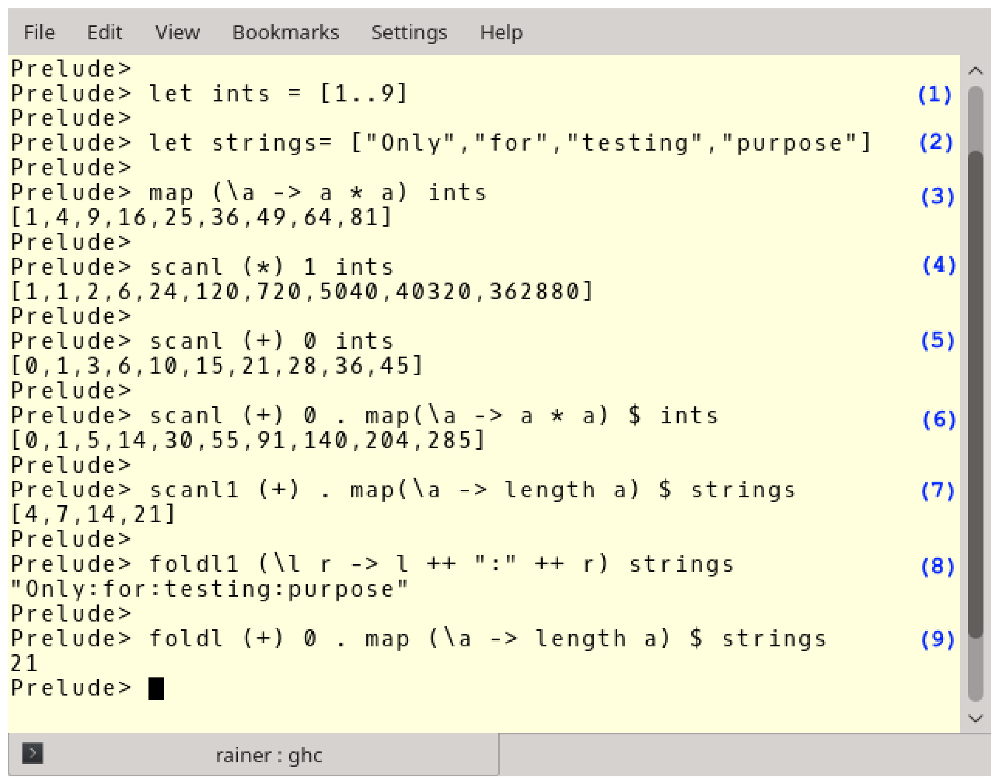

# 新算法

新算法包含在`std`命名空间中，`std::for_each`和`std::for_each_n`在`<algorithm>`头文件中声明，其余六种算法在`<numeric>`头文件中声明。

下面是新算法的概述。

|              算法               |                             描述                             |
| :-----------------------------: | :----------------------------------------------------------: |
|         `std::for_each`         |                将一元函数对象应用于引用范围。                |
|        `std::for_each_n`        |          将一元函数对象应用于引用范围的前n个元素。           |
|      `std::exclusive_scan`      | 将二元函数对象从左向右应用与引用范围。“排除性”(exclusive)表示第i个输入元素不包含在第i个和内。二元函数对象的第一个参数是之前计算的结果，运算可能以任意顺序进行，并存储中间结果。若二元函数对象不满足结合律，则函数行为不确定。行为与[`std::partial_sum`](http://en.cppreference.com/w/cpp/algorithm/partial_sum)类似。 |
|      `std::inclusive_scan`      | 将二元函数对象从左向右应用与引用范围。“包含性”(inclusive)表示第i个输入元素包含于第i个和中。二元函数对象的第一个参数是之前计算的结果，运算可能以任意顺序进行，并存储中间结果。若二元函数对象不满足结合律，则函数行为不确定。行为与[`std::partial_sum`](http://en.cppreference.com/w/cpp/algorithm/partial_sum)类似 |
| `std::transform_exclusive_scan` | 首先，将一元函数对象应用于引用范围，然后使用`std::exclusive_scan`。若二元函数对象不满足结合律，则函数行为不确定。 |
| `std::transform_inclusive_scan` | 首先，将一元函数对象应用于引用范围，然后使用`std::inclusive_scan`。若二元函数对象不满足结合律，则函数行为不确定。 |
|          `std::reduce`          | 将二元函数对象从左向右应用与引用范围。若二元函数对象不满足交换律或结合律，则函数行为不确定。行为与[`std::accumulate`](http://en.cppreference.com/w/cpp/algorithm/accumulate)类似。 |
|     `std::transform_reduce`     | 首先，将一元函数对象应用于引用范围，然后使用`std::reduce`。若二元函数对象不满足交换律或结合律，则函数行为不确定。 |

表中的函数描述不大容易理解，若对`std::accumulate`和`std::partial_sum`比较了解，那对前缀求和算法应该是非常熟悉。归约算法可以并行使用累加的方式，扫描算法可以并行的使用`partial_sum`。这就是`std::reduce`(归约算法)需要满足交换律和结合律的原因。

首先，给出一个算法示例，然后介绍这些函数的功能。示例中，忽略了新的`std::for_each`算法。与返回一元函数的C++98实现不同，C++17中什么也不返回。`std::accumulate`从左到右处理元素，而`std::reduce`可以以任意的顺序处理元素。让我们从使用`std::accumulate`和`std::reduce`的小代码段开始，二元函数对象为Lambda函数` [](int a, int b){ return a * b; }`。

```c++
std::vector<int> v{1, 2, 3, 4};
std::accumulate(v.begin(), v.end(), 1, [](int a, int b){ return a * b; });
std::reduce(std::execution::par, v.begin(), v.end(), 1 ,
[](int a, int b){ return a * b; });
```

下面两张图显示了`std::accumulate`和`std::reduce`的不同策略。

`std::accumulate`从左开始，依次使用二进制操作符。



与`std::accumulate`不同，`std::reduce`以一种不确定的方式使用二元操作符。




结合律允许`std::reduce`算法计算任意邻接元素对。因为元素顺序可交换，所以中间结果可以按任意顺序计算。

> **当前可用的算法实现**
>
> 展示代码之前，必须做个说明。据我所知，本书更新的时候(2018年9月)，并没有完全符合标准的并行STL实现。MSVC 17.8也只是增加了对大约30种算法的支持。
>
> MSVC 17.8中的并行算法
>
> | `std::adjacent_difference` |      `std::adjacent_find`       |          `std::all_of`          |
>| :------------------------: | :-----------------------------: | :-----------------------------: |
> |       `std::any_of`        |          `std::count`           |         `std::count_if`         |
>|        `std::equal`        |      `std::exclusive_scan`      |           `std::find`           |
> |      `std::find_end`       |      `std::find_first_of`       |         `std::find_if`          |
> |      `std::for_each`       |        `std::for_each_n`        |      `std::inclusive_scan`      |
> |      `std::mismatch`       |         `std::none_of`          |          `std::reduce`          |
> |       `std::remove`        |        `std::remove_if`         |          `std::search`          |
> |      `std::search_n`       |           `std::sort`           |       `std::stable_sort`        |
> |      `std::transform`      | `std::transform_exclusive_scan` | `std::transform_inclusive_scan` |
> |  `std::transform_reduce`   |                                 |                                 |
> 
> 这里使用HPX实现功能，并生成输出，[HPX (High-Performance ParalleX)](http://stellar.cct.lsu.edu/projects/hpx)是一种可用于任何规模的并行和分布式应用程序的通用C++运行时系统框架。HPX已经在其的一个名称空间中实现了所有并行STL。
> 
> 为了完整性，这里是并行STL的部分实现连接:
>
> * [Intel](https://software.intel.com/en-us/get-started-with-pstl)
>* [Thibaut Lutz](https://github.com/t-lutz/ParallelSTL)
> * [Nvidia(thrust)]( https://thrust.github.io/doc/group__execution__policies.html)
>* [Codeplay](https://github.com/KhronosGroup/SyclParallelSTL)

新算法示例代码

```c++
// newAlgorithm.cpp

#include <algorithm>
#include <execution>
#include <numeric>
#include <iostream>
#include <string>
#include <vector>


int main() {

  std::cout << std::endl;

  // for_each_n

  std::vector<int> intVec{ 1,2,3,4,5,6,7,8,9,10 };
  std::for_each_n(std::execution::par,
    intVec.begin(), 5, [](int& arg) {arg *= arg; });

  std::cout << "for_each_n: ";
  for (auto v : intVec)std::cout << v << " ";
  std::cout << "\n\n";

  // exclusive_scan and inclusive_scan
  std::vector<int> resVec{ 1,2,3,4,5,6,7,8,9 };
  std::exclusive_scan(std::execution::par,
    resVec.begin(), resVec.end(), resVec.begin(), 1,
    [](int fir, int sec) {return fir * sec; });

  std::cout << "exclusive_scan: ";
  for (auto v : resVec)std::cout << v << " ";
  std::cout << std::endl;

  std::vector<int> resVec2{ 1,2,3,4,5,6,7,8,9 };

  std::inclusive_scan(std::execution::par,
    resVec2.begin(), resVec2.end(), resVec2.begin(),
    [](int fir, int sec) {return fir * sec; });

  std::cout << "inclusive_scan: ";
  for (auto v : resVec2)std::cout << v << " ";
  std::cout << "\n\n";

  // transform_exclusive_scan and transform_inclusive_scan
  std::vector<int> resVec3{ 1,2,3,4,5,6,7,8,9 };
  std::vector<int> resVec4(resVec3.size());
  std::transform_exclusive_scan(std::execution::par,
    resVec3.begin(), resVec3.end(),
    resVec4.begin(), 0,
    [](int fir, int sec) {return fir + sec; },
    [](int arg) {return arg *= arg; });

  std::cout << "transform_exclusive_scan: ";
  for (auto v : resVec4)std::cout << v << " ";
  std::cout << std::endl;

  std::vector<std::string> strVec{ "Only", "for","testing", "purpose" };
  std::vector<int> resVec5(strVec.size());

  std::transform_inclusive_scan(std::execution::par,
    strVec.begin(), strVec.end(),
    resVec5.begin(), 0,
    [](auto fir, auto sec) {return fir + sec; },
    [](auto s) {return s.length(); });

  std::cout << "transform_inclusive_scan: ";
  for (auto v : resVec5) std::cout << v << " ";
  std::cout << "\n\n";

  // reduce and transform_reduce
  std::vector<std::string> strVec2{ "Only", "for", "testing", "purpose" };

  std::string res = std::reduce(std::execution::par,
    strVec2.begin() + 1, strVec2.end(), strVec2[0],
    [](auto fir, auto sec) {return fir + ":" + sec; });

  std::cout << "reduce: " << res << std::endl;

  std::size_t res7 = std::transform_reduce(std::execution::par,
    strVec2.begin(), strVec2.end(),
    [](std::string s) {return s.length(); },
    0, [](std::size_t a, std::size_t b) {return a + b; });


  std::cout << "transform_reduce: " << res7 << std::endl;

  std::cout << std::endl;

}
```

程序在第17行使用了`std::vector<int>`，在第58行使用了`std::vectorstd::string`。

第18行中的`std::for_each_n`将向量的前n个元素映射为2次幂。`std::exclusive_scan`(第27行)和`std::inclusive_scan`(第37行)非常相似，两者都对元素应用二元操作。区别在于`std::exclusive_scan`排除了每个迭代中的最后一个元素。

第48行中的`std::transform_exclusive_scan`比较难理解。第一步中，使用Lambda函数`[](int arg){return arg *= arg;}`，对`resVec3.begin()`到`resVec3.end()`范围内的每个元素，进行2次幂操作。第二步，对保存中间结果的向量(`resVec4`)使用二元运算`[](int fir, int sec){return fir + sec;}`。这样，使用0作为元素求和的初始值，结果放在`resVec4.begin()`中。

第61行中的`std::transform_inclusive_scan`类似，而这里操作的是元素的长度。

这里的`std::reduce`应该比较容易理解，程序中在输入向量的每两个元素之间放置“:”字符，因为结果字符串不应该以“:”字符开头，所以从第二个元素`(strVec2.begin() + 1)`开始，并使用`strVec2[0]`作为初始值。

> **transform_reduce与map_reduce** 
>
> 关于第80行的`std::transform_reduce`，我还想多补充两句。首先，C++算法的转换算法，在其他语言中通常称为映射(map)。因此，也可以称`std::transform_reduce`为` std::map_reduce`。`std::transform_reduce`的后端实现，使用的是C++中著名的并行[MapReduce](https://en.wikipedia.org/wiki/MapReduce)算法。相应地，`std::transform_reduce`在某个范围内使用一元函数(`([](std::string s){ return s.length();})`)，并将结果归约为一个输出值：`[](std::size_t a, std::size_t b){return a+b;}`。

下面是程序的输出。



## 更多的重载

归约和扫描算法的C++实现有很多重载版本。最简版本中，可以在没有二元函数对象和初始元素的情况下使用。如果不使用二元函数对象，则默认将加法作为二元操作符。如果没有指定初始元素，则初始元素取决于使用的算法:

* `std::inclusive_scan`和`std::transform_inclusive_scan`算法 : 选用第一个元素。
* `std::reduce` 和`std::transform_reduce`算法 : 相应类型的构造值`std::iterator_traits<InputIt>::value_type{}`。

接下来，从函数的角度再来看看这些新算法。

## 功能性继承
时间宝贵，长话短说：所有的C++新算法在纯函数语言Haskell中都有对应。

*  `std::for_each_n`对应map。
* `std::exclusive_scan`和`std::inclusive_scan` 分别对应scanl和scanl1。
* `std::transform_exclusive_scan`和`std::transform_inclusive_scan` 分别对应map与scan1和scan2的组合。
* `std::reduce`对应foldl或foldl1。
* `std::transform_reduce` 对应于foldl或foldl1与map的组合。

展示Haskell的实际效果之前，先了解下功能上的差异。

* map将一个函数应用于列表。
* foldl和foldl1将一个二元操作符应用于列表，并将该列表的值归约成一个。与foldl1不同，foldl需要一个初始值。
* scanl和scanl1与foldl和foldl1类似，但可以获取计算时的中间结果列表。
* foldl , foldl1 , scanl和scanl1从左向右处理元素。

让我们看一下这些Haskell函数，下面是Haskell解释器的命令行界面。



(1)和(2)定义了一个整数列表和一个字符串列表。(3)中将Lambda函数`(\a -> a * a)`应用到整数列表中。(4)和(5)比较复杂，表达式(4)以1作为乘法的中间元素，乘以`(*)`所有整数对。表达式(5)做相应的加法运算。理解(6)、(7)和(9)是比较具有挑战性的，必须从右到左读。`scanl1(+).map(\a->length)`(7)是一个函数组合，点`(.)`左右是两个函数。第一个函数将每个元素映射为自身长度，第二个函数将长度列表累加。(9)与(7)相似，不同之处在于`foldl`生成一个值，并需要一个初始值。到这，表达式(8)就好理解了，它连续地用“:”字符将两个字符串连接起来。