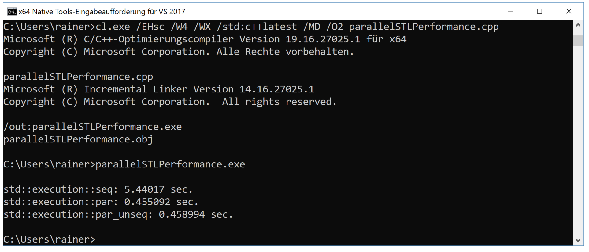

# 性能概况

使用并行STL的首要原因，肯定是性能。

下面的代码就能反映不同执行策略的性能差异。

```c++
// parallelSTLPerformance.cpp

#include <algorithm>
#include <cmath>
#include <chrono>
#include <execution>
#include <iostream>
#include <random>
#include <string>
#include <vector>

constexpr long long size = 500'000'000;

const double pi = std::acos(-1);

template <typename Func>
void getExecutionTime(const std::string& title, Func func) {

  const auto sta = std::chrono::steady_clock::now();
  func();
  const std::chrono::duration<double> dur = std::chrono::steady_clock::now() - sta;

  std::cout << title << ": " << dur.count() << " sec." << std::endl;

}

int main() {

  std::cout << std::endl;

  std::vector<double> randValues;
  randValues.reserve(size);

  std::mt19937 engine;
  std::uniform_real_distribution<> uniformDist(0, pi / 2);
  for (long long i = 0; i < size; ++i) randValues.push_back(uniformDist(engine));

  std::vector<double> workVec(randValues);

  getExecutionTime("std::execution::seq", [workVec]()mutable {
    std::transform(std::execution::seq, workVec.begin(), workVec.end(),
      workVec.begin(),
      [](double arg) {return std::tan(arg); }
    );
    });

  getExecutionTime("std::execution::par", [workVec]()mutable {
    std::transform(std::execution::par, workVec.begin(), workVec.end(),
      workVec.begin(),
      [](double arg) {return std::tan(arg); }
    );
    });

  getExecutionTime("std::execution::par_unseq", [workVec]()mutable {
    std::transform(std::execution::par_unseq, workVec.begin(), workVec.end(),
      workVec.begin(),
      [](double arg) {return std::tan(arg); }
    );
    });

}
```

parallelSTLPerformance.cpp统计了串行(第39行)、并行(第46行)和向量化并行(第53行)执行策略的耗时。首先，`randValues`由区间在[0,pi/2)的5亿个数字填充。函数模板`getExecutionTime`(第16 - 24行)获取标题和Lambda函数，在第20行执行Lambda函数，并显示执行耗时(第22行)。程序使用了三个Lambda函数(第39、46和53行)，它们被声明为`mutable`。因为Lambda函数修改它的参数`workVec`，而Lambda函数默认是不能对其进行修改的。如果Lambda函数想要修改，那么就必须声明为`mutable`。

我的windows笔记本电脑有8个逻辑核心，但并行执行速度要比串行的快10倍以上。



并行执行和并行向量化执行的性能大致相同。Visual C++团队的博客对此进行了解释：[使用C++17并行算法更好的性能]( https://blogs.msdn.microsoft.com/vcblog/2018/09/11/using-c17-parallel-algorithms-for-better-performance)。Visual C++团队使用相同的方式实现了并行计算和并行策略，所以目前就不要期望`par_unseq`有更好性能(但未来就不好说了)。