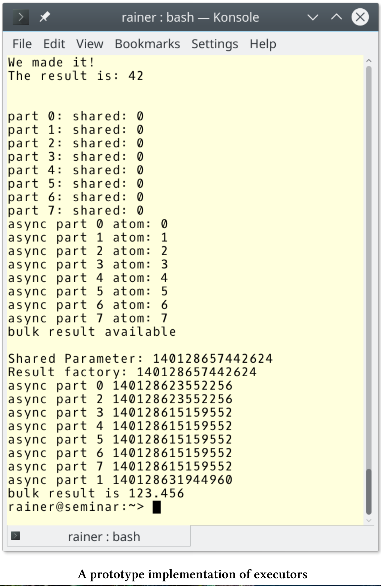

# 关于执行

Executor是C++中执行的基本构造块，在执行中扮演如同容器分配器的角色。异步、标准模板库的并行算法、future的协同、任务块的运行、[网络TS(技术规范，technical specification)](https://en.cppreference.com/w/cpp/experimental)的提交、调度或延迟调用等功能都会使用到异步执行。此外，因为没有标准化的执行方式，所以“执行”是编程时的基本关注点。

下面是提案[P0761](http://www.open-std.org/jtc1/sc22/wg21/docs/papers/2018/p0761r2.pdf)的示例。

parallel_for的实现

```c++
void parallel_for(int facility, int n, function<void(int)> f) {
	if(facility == OPENMP) {
		#pragma omp parallel for
		for(int i = 0; i < n; ++i) {
			f(i);
		}
	}
	else if(facility == GPU) {
		parallel_for_gpu_kernel<<<n>>>(f);
	}
	else if(facility == THREAD_POOL) {
		global_thread_pool_variable.submit(n, f);
	}
}
```

这个parallel_for有一些问题：

* parallel_for这样看起来简单的函数，维护起来其实非常复杂。如果支持新的算法或新的并行范例，会变得越来越复杂。(译者：这里指的是分支中不同平台的实现，如果有新算法或新平台，则函数体会变得越来越臃肿。)
* 函数的每个分支的同步属性也不同。OpenMP可能会阻塞运行，直到所有的派生线程完成，GPU通常异步运行的，线程池可能阻塞或不阻塞。不完全的同步可能会导致数据竞争或死锁。
* parallel_for的限制太多。例如，没有办法使用自定义的线程池替换全局线程池：`global_thread_pool_variable.submit(n, f); `

## 路漫漫其修远兮

2018年10月，已经提交了很多关于executor的提案了，许多设计非常开放，真期望它们能成为C++23的一部分，或有可能用C++20对单向执行进行标准化。本章主要是基于对executor的[P0761号提案](](http://www.open-std.org/jtc1/sc22/wg21/docs/papers/2018/p0761r2.pdf))的设计建议，和在[P0443](http://open-std.org/JTC1/SC22/WG21/docs/papers/2018/p0443r7.html)和[P1244](http://www.open-std.org/jtc1/sc22/wg21/docs/papers/2018/p1244r0.html)提案中的描述进行的。P0443(统一的executor)中提出了单向执行，它可能是C++20的一部分，P1244(统一的executor的从属执行)提出了从属执行，它可能是C++23的一部分。本章还提到了相对较新的[P1055](http://open-std.org/JTC1/SC22/WG21/docs/papers/2018/p1055r0.pdf)提案，“适当executor提案”。

## Executor是什么?

什么是executor?executor由一组关于在何处、何时以及如何运行可调用单元的规则组成。

*  何处: 可调用项可以在内部或外部处理器上运行，并且结果是从内部或外部处理器中进行读取。
* 何时: 可调用项可以立即运行，也可以延迟运行。
* 如何: 可调用项的可以在CPU或GPU上运行，甚至可以以向量化的方式执行。

更正式地说，每个executor都具有与所执行函数相关联的属性。

**Executor属性**

可以通过两种方式，将这些属性与executor关联起来：`execution::require`或`execution::prefer `

1.  方向性：执行函数可以是“触发即忘”(`execution::oneway`)、返回一个future(`execution::twoway`)或返回一个continuation(`execution::then`)。
2.  基数性：执行函数可以创建一个(`execution::single`)或多个执行代理(`execution::bulk`)。
3.  阻塞性：函数可阻塞也可不阻塞，有三个互斥的阻塞属性:`execution::blocking.never`，`execution::blocking.possibly`和`execution::blocking.always`。
4.  持续性：任务可能是由客户端上的线程执行(`execution::continuation`)，也可能不执行(`execution::not_continuation`)。
5.  可溯性：指定跟踪未完成的工作(`exection::outstanding_work`),或不跟踪(`execution::outstanding_work.untracked`)。
6.  批量进度保证：指定在批量属性，`execution::bulk_sequenced_execution`、`execution::bulk_parallel_execution`和`execution::bulk_unsequenced_execution`，这些属性是互斥的，通过使用这些属性创建的执行代理，可以保证任务的进度。
7.  执行线程映射：将每个执行代理映射到一个新线程(`execution::new_thread_execution_mapping`)，或者不映射(`execution::thread_execution_mapping`)。
8.  分配器：将分配器(`execution::allocator`)与executor关联起来。

也可以自己来定义属性。

> Executor是基础构建块
>
> 因为executor是执行的构建块，C++的并发性和并行性特性在很大程度上依赖于它们。这也适用于扩展future，网络的[N4734](http://www.open-std.org/jtc1/sc22/wg21/docs/papers/2018/n4734.pdf)扩展，甚至是适用于STL的并行算法，以及C++20/23中的新并发特性，如门闩和栅栏、协程、事务性内存和任务块。

## 举个例子

**使用Executor**

下面的代码片段，展示了executor的用法:

**std::async**

```c++
// get an executor through some means
my_executor_type my_executor = ...
  
// launch an async using my executor
auto future = std::async(my_executor, [] {
	std::cout << "Hello world, from a new execution agent!" << std::endl;
});
```

**STL算法std::for_each**

```c++
// get an executor through some means
my_executor_type my_executor = ...
  
// execute a parallel for_each "on" my executor
std::for_each(std::execution::par.on(my_executor),
							 data.begin(), data.end(), func);
```

**网络技术规范：允许客户端连接默认系统Executor**

```c++
// obtain an acceptor (a listening socket) through some means
tcp::acceptor my_acceptor = ...
  
// perform an asynchronous operation to accept a new connection
acceptor.async_accept(
  [](std::error_code ec, tcp::socket new_connection)
    {
    	...
    }
  );
```

**网络技术规范：允许客户端连接带有线程池的Executor**

```c++
// obtain an acceptor (a listening socket) through some means
tcp::acceptor my_acceptor = ...
  
// obtain an executor for a specific thread pool
auto my_thread_pool_executor = ...
  
// perform an asynchronous operation to accept a new connection
acceptor.async_accept(
    std::experimental::net::bind_executor(my_thread_pool_executor,
    [](std::error_code ec, tcp::socket new_connection)
      {
      	...
      }
    )
  );
```

网络技术规范[N4734](http://www.open-std.org/jtc1/sc22/wg21/docs/papers/2018/n4734.pdf)的`std::experimental::net::bind_executor`函数允许使用特定的executor。本例中，程序在线程池中执行Lambda函数。

要使用executor ，必须进行获取。

**获取Executor**

获取Executor的方法有很多。

**源于自执行上下文static_thread_pool**

```c++
// create a thread pool with 4 threads
static_thread_pool pool(4);

// get an executor from the thread pool
auto exec = pool.executor();

// use the executor on some long-running task
auto task1 = long_running_task(exec);
```

**源自执行策略std:: Execution::par**

```c++
// get par's associated executor
auto par_exec = std::execution::par.executor();

// use the executor on some long-running task
auto task2 = long_running_task(par_exec);
```

**源于系统的Executor **

通常使用线程执行的默认程序。如果有变量没有指定，那就可以使用它。

**源于Executor适配器**

```c++
// get an executor from a thread pool
auto exec = pool.executor();

// wrap the thread pool's executor in a logging_executor
logging_executor<decltype(exec)> logging_exec(exec);

// use the logging executor in a parallel sort
std::sort(std::execution::par.on(logging_exec), my_data.begin(), my_data.end());
```

logging_executo是循环executor的包装器。

## Executor的目标

提案[P1055]( http://open-std.org/JTC1/SC22/WG21/docs/papers/2018/p1055r0.pdf)中，executor的目的是什么呢?

1. 批量化：权衡可调用单元的转换成本和大小。
2. 异构化：允许可调用单元在异构上下文中运行，并能返回结果。
3. 有序化：可指定调用顺序，可选的顺序有：后进先出[LIFO](https://en.wikipedia.org/wiki/Stack_(abstract_data_type))、先进先出[FIFO](https://en.wikipedia.org/wiki/FIFO_(computing_and_electronics)) 、优先级或耗时顺序，甚至是串行执行。
4. 可控化：可调用的对象必须是特定计算资源的目标，可以延迟，也可以取消。
5. 持续化：需要可调用信号来控制异步，这些信号必须指示结果是否可用、是否发生了错误、何时完成或调用方是否希望取消，并且显式启动或停止可调用项也应该是可以的。
6. 层级化：层次结构允许在不增加用例复杂性的情况下添加功能。
7. 可用化：易实现和易使用，应该是主要目标。
8. 组合化：允许用户扩展executor的功能。
9. 最小化：executor中不应该存在任何库外添加的内容。

## 术语

提案[P0761](http://www.open-std.org/jtc1/sc22/wg21/docs/papers/2018/p0761r2.pdf)为可执行单元定义了一些执行的新术语:

* 执行资源：能够执行可调用的硬件和/或软件，执行单元可以是SIMD，也可以是管理大量线程集合的运行时。CPU或GPU的执行资源是异构的，所以它们有不同的限制。
* 执行上下文：是一个程序对象，表示特定的执行资源集合和这些资源中的执行代理。典型的例子是线程池、分布式运行时或异构运行时。
* 执行代理：特定执行单元的上下文，该上下文映射到执行资源上的单个可调用单元。典型的例子是CPU线程或GPU执行单元。
* 执行器：与特定上下文关联的执行对象。提供一个或多个执行函数，用于创建可调用函数对象的执行代理。

## 执行函数

执行程序可提供一个或多个执行函数，用于创建可调用对象的执行代理。执行程序至少支持以下六个功能中的一个。

|        名称         | 基数性 | 方向性 |
| :-----------------: | :----: | :----: |
|       execute       |  单个  | oneway |
|   twoway_execute    |  单个  | twoway |
|    then_execute     |  单个  |  then  |
|    bulk_execute     |  批量  | oneway |
| bulk_twoway_execute |  批量  | twoway |
|  bulk_then_execute  |  批量  |  then  |

每个执行函数都有两个属性：基数性和方向性。

* 基数性
  * 单个: 创建一个执行代理
  * 批量 : 创建一组执行代理
* 方向性
  * oneway : 创建执行代理，但不返回结果
  * twoway : 创建一个执行代理，并返回一个可用于等待执行完成的future
  * then : 创建一个执行代理，并返回一个可用于等待执行完成的future。给定的future准备好后，执行代理开始执行。

让我更简单的解释一下执行功能，他们都有一个可执行单元。

**基数性：单个**

单个基数性很简单，单向执行函数是以“触发即忘”的方式执行，返回void。它非常类似于“触发即忘”的future，但它不会自动阻止future的销毁。twoway执行函数返回future，可以使用它来获取结果。类似于`std::promise`，它将返回关联`std::future`的句柄。这种情况下，执行代理仅在提供的future准备好时才运行。

**基数性：批量**

批量基数性的情况比较复杂。这些函数创建一组执行代理，每个执行代理调用给定的可调用单元`f`，它们返回一个结果代理。`f`的第一个参数是`shape`参数，它是一个整型，代表代理类型的索引。进一步的参数是结果代理，如果是twoway执行器，那么就和所有代理共享`shape`代理。用于创建共享代理的参数，其生存期与代理的生存期绑定在一起。因为它们能够通过执行可调用单元产生相应的价值，所以称为代理。客户端负责通过这个结果代理，消除结果的歧义。

使用bulk_then_execute函数时，可调用单元`f`将其之前的future作为附加参数。因为没有代理是所有者，所以可调用单元`f`可通过引用获取结果、共享参数和前次结果。

**execution::require**

如何确保执行程序支持特定的执行功能?

在特殊情况下，你需要对其有所了解。

```c++
void concrete_context(const my_oneway_single_executor& ex)
{
  auto task = ...;
  ex.execute(task);
}
```

通常情况下，可以使用函数`execution::require`来申请。

```c++
template<class Executor>
void generic_context(const Executor& ex)
{
  auto task = ...;
  // ensure .toway_execute() is available with execution::require()
  execution::require(ex, execution::single, execution::twoway).toway_execute(task);
}
```

## 实现原型

基于提案[P0443R5]( http://www.open-std.org/jtc1/sc22/wg21/docs/papers/2018/p0443r5.html)，executor提案有了具体的实现原型。这个实现原型，可以帮助我们更深入地了解了批量基数。

```c++
// executor.cpp

#include <atomic>
#include <experimental/thread_pool>
#include <iostream>
#include <utility>

namespace execution = std::experimental::execution;
using std::experimental::static_thread_pool;
using std::experimental::executors_v1::future;

int main() {

  static_thread_pool pool{ 4 };
  auto ex = pool.executor();

  // One way, single
  ex.execute([] {std::cout << "We made it!" << std::endl; });

  std::cout << std::endl;

  // Two way, single
  future<int> f1 = ex.twoway_execute([] {return 42; });
  f1.wait();
  std::cout << "The result is: " << f1.get() << std::endl;

  std::cout << std::endl;

  // One way, bulk.
  ex.bulk_execute([](int n, int& sha) {
    std::cout << "part " << n << ": " << "shared: " << sha << "\n";
    }, 8,
    [] {return 0; }
    );

  std::cout << std::endl;

  // Two way, bulk, void result
  future<void> f2 = ex.bulk_twoway_execute(
    [](int n, std::atomic<short>& m) {
      std::cout << "async part " << n;
      std::cout << " atom: " << m++ << std::endl;
    }, 8,
    [] {},
      [] {
      std::atomic<short> atom(0);
      return std::ref(atom);
    }
    );
  f2.wait();
  std::cout << "bulk result available" << std::endl;

  std::cout << std::endl;

  // Two way, bulk, non-void result.
  future<double> f3 = ex.bulk_twoway_execute(
    [](int n, double&, int&) {
      std::cout << "async part " << n << " ";
      std::cout << std::this_thread::get_id() << std::endl;
    }, 8,
    [] {
      std::cout << "Result factory: "
        << std::this_thread::get_id() << std::endl;
      return 123.456; },
      [] {
        std::cout << "Shared Parameter: "
          << std::this_thread::get_id() << std::endl;
        return 0; }
      );
  f3.wait();
  std::cout << "bulk result is " << f3.get() << std::endl;
  
}
```

该程序使用具有四个线程的线程池进行执行(第14行和第15行)。第18行和第23行使用单基数的执行函数，并创建两个单基数的代理。第二个是twoway执行函数，因此返回一个结果。

第30、39和56行中的执行函数具有批量基数性。每个函数创建8个代理(第32、43和60行)。第一种情况中，可调用单元会显示索引`n`和共享值`sha`，`sha`是由共享代理在第33行创建的。下一个执行函数`bulk_twoway_execute`更有趣。虽然它的结果代理返回void，但共享状态是原子变量`atom`。每个代理将其值增加1(第42行)。通过结果代理，最后一个执行函数(第56到69行)返回123.456。有趣的是，在可调用的执行、结果和共享代理的执行中涉及到多少线程呢？程序的输出显示结果和共享代理运行在同一个线程中，而其他代理运行在不同的线程中。

