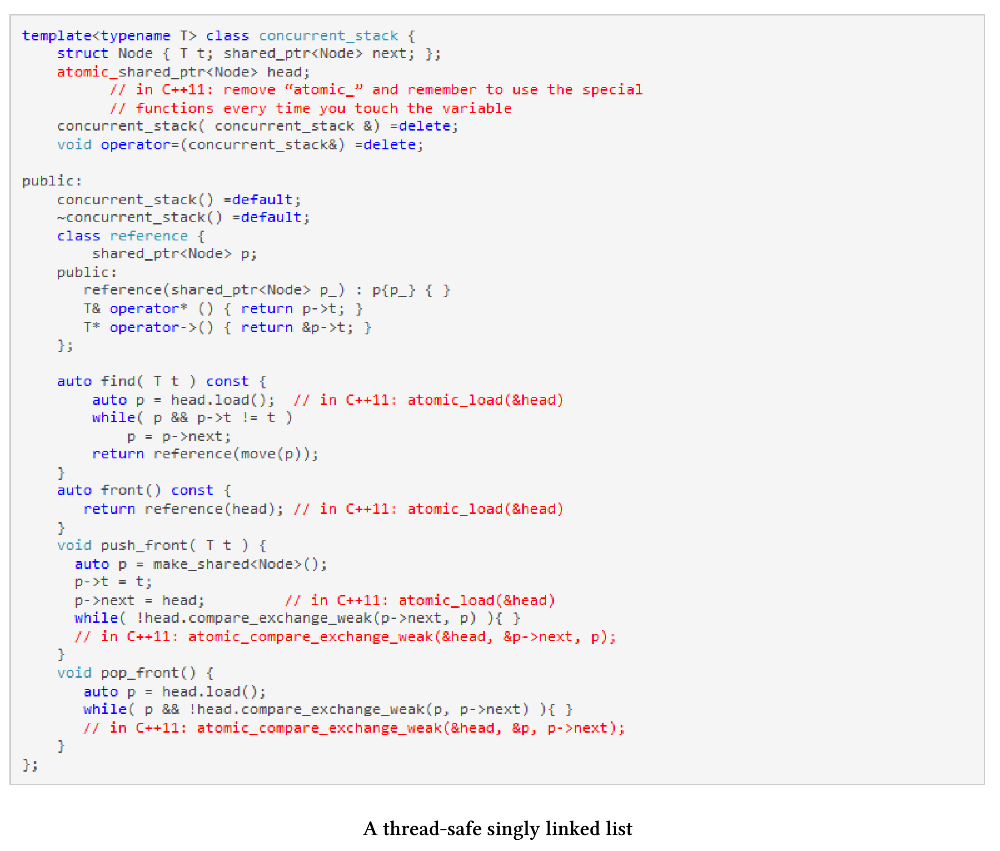

# 原子智能指针

`std::shared_ptr`由控制块和相关资源组成。`std::shared_ptr`能够保证控制块是线程安全的，但是对相关资源的访问就不是了。这意味着，修改引用计数器是一个原子操作，可以确保资源删除一次。

> **线程安全的重要性** 
>
> 这里只说明`std::shared_ptr`具有定义良好的多线程语义是有多么重要。乍一看，使用`std::shared_ptr`并不是多线程程序的明智选择。根据定义，它是共享和可变的，是数据竞争和未定义行为的理想对象。另一方面，现代C++中有一条准则：不要接触内存。这意味着在多线程程序中，要尽可能使用智能指针。

关于原子智能指针的[N4162](http://wg21.link/n4162)提议，直接解决了当前智能指针实现的缺陷。这些缺陷可以归结为以下三点：一致性、正确性和高效性。下面将概述这三点，详系内容可参见提案N4162。

* 一致性：`std::shared_ptr`对非原子数据类型，只能进行原子操作。
* 正确性：因为正确的使用方式是基于严格的规则，所以使用全局性的原子操作非常容易出错。很容易忘记使用原子操作——例如，使用`ptr = localPtr`代替`std::atomic_store(&ptr, localPtr)`。由于数据竞争，结果是未定义的。如果使用原子智能指针，系统将不允许数据竞争的出现。
* 高效性：与`atomic_*`函数相比，原子智能指针有很大的优势。原子版本是为特殊用例设计的，可以在内部使用`std::atomic_flag`作为一种低开销的自旋锁。如果将指针函数的非原子版设计为线程安全的，并用于单线程场景，那就太大材小用了，并且还会受到性能上的惩罚。

对我来说，正确性是最重要的。为什么?答案就在提案中。这个建议提供了一个线程安全的单链表，它支持插入、删除和搜索元素，并且这个单链表以无锁的方式实现。

## 线程安全的单链表

需要使用C++11编译器编译的地方都用红色标记。这个链表，使用原子智能指针实现要容易得多，也不容易出错。C++20的类型系统不允许在原子智能指针上使用非原子操作。

[N4162](http://wg21.link/n4162)提议将`std::atomic_shared_ptr`和`std::atomic_weak_ptr`作为原子智能指针。将它们合并到主流的ISO C++标准中，就变成了`std::atomic`: `std::atomicstd::shared_ptr<T>`和`std::atomicstd::weak_ptr<T>`偏特化模板。

因此，`std::shared_ptr`的原子操作在C++20中是废弃的。