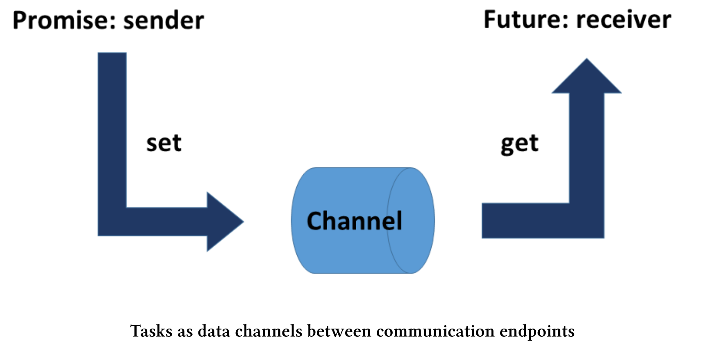

# 扩展特性

promise和future形式的任务在C++11中的名声很微妙。一方面，它们比线程或条件变量更容易使用；另一方面，也有明显的不足——不能合成。C++20/23中弥补了这个缺陷。

我曾经以`std::async`、`std::packaged_task`或`std::promise`和`std::future`的形式，写过关于任务的文章。C++20/23中，我们可以使用加强版的future。

## 并发技术标准 v1

**std::future**

扩展future很容易解释。首先，扩展了C++11的`std::future`接口；其次，一些新功能可组合创建特殊的future。先从第一点开始说起：

扩展future有三种新特性:

* 展开构造函数，可用于展开已包装的外部future(`future<future<T>>`)。
* 如果共享状态可用，则返回谓词is_ready。
*  添加了可延续附加到future的方法。

起初，future的状态可以是valid或ready。

**valid与ready**

*  valid: 如果future具有共享状态(带有promise)，那么它就是有效的。这并不是必须的，因为可以默认构造一个没有promise的`std::future`。
* ready: 如果共享状态可用，future就已经准备好了。换句话说，如果promise已经完成，则future就已经准备好了。

因此，`(valid == true)`是`(ready == true)`的一个必要不充分条件。

我对promise和future的建模就是数据通道的两个端点。



现在，valid和ready的区别就非常自然了。如果有一个数据通道的promise，则future的状态是valid。如果promise已经将其结果放入数据通道中，则future的状态是ready。

现在，为了延迟future，我们来了解一下then。

**使用then的延迟**

then具有将一个future附加到另一个future的能力，这样一个future就能被另一个future所嵌套。展开构造函数的任务是对外部future进行展开的。

> **N3721提案**
>
> 迎来第一个代码段之前，必须介绍一下[N3721](https://isocpp.org/files/papers/N3721.pdf)提案。本节的大部分内容是关于“`std::future<T>`和相关API”的改进建议。奇怪的是，提案作者最初没有使用`get`获取future最后的结果。因此，我在示例添加了`res.get`，并将结果保存在变量`myResult`中，并修正了一些错别字。

```c++
#include <future>
using namespace std;
int main() {

  future<int> f1 = async([]() {return123; });
  future<string> f2 = f1.then([](future<int> f) {
    return to_string(f.get()); // here .get() won't block
    });

  auto myResult = f2.get();

}
```

`to_string(f.get())`(第7行)和`f2.get()`(第10行)之间有细微的区别。正如我在代码片段中已经提到的：第一个调用是非阻塞/异步的，第二个调用是阻塞/同步的。`f2.get() `会一直等待，直到future链的结果可用。这种方法也适用于长链似的调用：`f1.then(…).then(…).then(…).then(…).then(…)`。最后，阻塞式调用`f2.get()`获取结果。

**std::async , std::packaged_task和std::promise**

关于`std::async`、`std::package_task`和`std::promise`的扩展没有太多可说的。那为什么还要提一下，是因为在C++ 20/23中这三种扩展都会返回扩展了的future。

future的构成令人越来越兴奋了，现在我们可以组合异步任务了。

**创建新future**

C++20获得了四个用于创建新future的新函数。这些函数是`std::make_ready_future`、`std::make_execptional_future`、`std::when_all`和`std::when_any`。首先，让我们看看`std::make_ready_future`和`std::make_exceptional_future`。

**std::make_ready_future和std::make_exceptional_future**

这两个功能都立即创建了一个处于ready状态的future 。第一种情况下，future是有价值的；第二种情况下是出现了异常。一开始看起来很奇怪的事情，但细想却很有道理。C++11中，创建一个future需要promise。即使共享状态可用，这也是必要的。

使用make_ready_future创建future

```c++
future<int> compute(int x) {
  if (x < 0) return make_ready_future<int>(-1);
  if (x == 0) return make_ready_future<int>(0);
  future<int> f1 = async([]() { return do_work(x); });
  return f1;
}
```

因此，如果(x > 0)保持不变，则只能通过promise来计算结果。

简短说明一下：这两个函数都是单子(monad)中返回的函数挂件。现在，让我们从future的合成开始说起。

**std::when_any和std::when_all**

这两种功能有很多共同之处。首先，来看看输入：

```c++
template < class InputIt >
auto when_any(InputIt first, InputIt last)
	-> future<when_any_result<
		std::vector<typename std::iterator_traits<InputIt>::value_type>>>;

template < class... Futures >
auto when_any(Futures&&... futures)
	-> future<when_any_result<std::tuple<std::decay_t<Futures>...>>>;

template < class InputIt >
auto when_all(InputIt first, InputIt last)
	-> future<std::vector<typename std::iterator_traits<InputIt>::value_type>>;

template < class... Futures >
auto when_all(Futures&&... futures)
	-> future<std::tuple<std::decay_t<Futures>...>>;
```

这两个函数都接受一对关于future范围的迭代器，或任意数量的future迭代器。二者最大的区别是，在使用迭代器对的情况下，future必须是相同类型的；而对于任意数量的future，可以使用不同类型的future，甚至可以混用`std::future`和`std::shared_future`。

函数的输出，取决于是否使用了一对迭代器或任意数量的future(可变参数模板)。这两个函数都返回一个future。如果使用一对迭代器，将得到`std::vector`: `future<vector<future<R>>>`中的future。如果使用可变参数模板，会得到`std::tuple`: `future<tuple<future<R0>, future<R1>,…>>`。

已经了解了它们的共性。如果所有输入future(when_all)或任何输入future(when_any)都处于ready状态，那么这两个函数返回的future也就处于ready状态。

接下来的两个例子，会展示`std::when_all`和`std::when_any`的用法。

**std::when_all**

Future的组合与`std::when_all`

```c++
#include <future>

using namespace std;

int main() {

  shared_future<int> shared_future1 = async([] {return intResult(123); });
  future<string> future2 = async([]() {return stringResult("hi"); });

  future<tuple<shared_future<int>, future<string>>>all_f =
    when_all(shared_future1, future2);

  future<int> result = all_f.then(
    [](future<tuple<shared_future<int>, future<string>>> f) {
      return doWork(f.get());
    });

  auto myResult = result.get();
}
```

`future all_f`(第10行)由future的`shared_future1`(第7行)和`future2`(第8行)组成。如果所有future都准备好了，则执行第13行获取future的结果。本例中，将执行第15行中的`all_f`。结果保存在future中，可以在第18行进行获取。

**std::when_any**

Future的组合与std::when_any

```c++
#include <future>
#include <vector>

using namespace std;

int main() {

  vector<future<int>> v{ ..... };
  auto future_any = when_any(v.begin(), v.end());

  when_any_result<vector<future<int>>> result = future_any.get();

  future<int>& read_future = result.futures[result.index];

  auto myResult = ready_future.get();
}
```

when_any中的future可以在第11行中获取结果。`result`会提供已经准备就绪future的信息。如果不使用when_any_result，就没必要查询每个future是否处于ready状态了。

如果它的某个输入future处于ready状态，那么future_any就处于ready状态。第11行中的`future_any.get()`会返回future的结果。通过使用`result.futures[result.index]`(第13行)，可以获取ready_future，并且由于使用`ready_future.get()`，也可以对任务的结果进行查询。

如[P0701r1](http://www.open-std.org/jtc1/sc22/wg21/docs/papers/2017/p0701r1.html)中描述，“它们没想象的那样通用、有表现力或强大”，其既不是标准化的future，也不是并发的[TS v1 future](http://en.cppreference.com/w/cpp/experimental/concurrency)。此外，执行者作为执行的基本构件，必须与新的future相统一。

## 统一的Future

标准化和并发TSv1的future有什么缺点吗?

**缺点**

上述文件(P0701r1)很好地说明了future的不足之处。

**future/promise不应该耦合到std::thread执行代理中**

C++11只有一个executor:`std::thread`。因此，future和`std::thread`是不可分割的。这种情况在C++17和STL的并行算法中得到了改变，新的executor中变化更大，并可以使用它来配置future。例如，future可以在单独的线程中运行，也可以在线程池中运行，或者只是串行运行。

**在哪里持续调用了.then ?**

下面的例子中，有一个简单的延续。

使用`std::future`的延续

```c++
future<int> f1 = async([]() { return 123; });
future<string> f2 = f1.then([](future<int> f) {
	return to_string(f.get());
});
```

问题是：延续应该在哪里运行?有一些可能性:

1.  消费端：消费者执行代理总是执行延续。
2. 生产端：生产者执行代理总是执行延续。
3.  inline_executor语义：如果在设置延续时，共享状态已就绪，则使用者线程将执行该延续。如果在设置延续时，共享状态还没有准备好，则生产者线程将执行该延续。
4.  thread_executor语义：使用新`std::thread`执行延续。

前两种可能性有一个显著的缺点：它们会阻塞。第一种情况下，使用者阻塞，直到生产者准备好为止。第二种情况下，生产者阻塞，直到消费者准备好。

下面是文档[P0701r1](http://www.open-std.org/jtc1/sc22/wg21/docs/papers/2017/p0701r1.html)中的一些不错的executor传播用例:

```c++
auto i = std::async(thread_pool, f).then(g).then(h);
// f, g and h are executed on thread_pool.

auto i = std::async(thread_pool, f).then(g, gpu).then(h);
// f is executed on thread_pool, g and h are executed on gpu.

auto i = std::async(inline_executor, f).then(g).then(h);
// h(g(f())) are invoked in the calling execution agent.
```

**将future传递给.then的延续是不明智的**

因为传递给continuation的是future，而不是它的值，所以语法非常复杂。越多的传递会让表达式变得非常复杂。

```c++
std::future<int> f1 = std::async([]() { return 123; });
std::future<std::string> f2 = f1.then([](std::future<int> f) {
	return std::to_string(f.get());
});
```

现在，我假设这个值可以传递，因为`std::future<int>`重载了`to_string`。

使用`std::future`传递值的延续

```c++
std::future<int> f1 = std::async([]() { return 123; });
std::future<std::string> f2 = f1.then(std::to_string);
```

**when_all和when_any的返回类型让人费解**

介绍`std::when_all`和`std::when_any`的这两章，展示了它们相当复杂的使用方法。

**future析构中的条件块必须去掉**

触发即忘的future看起来非常有用，但也有一个很大的限制。由`std::async`创建的future会等待它的析构函数，直到对应的promise完成。看起来并发的东西，实际是串行运行的。根据文档P0701r1的观点，这是不可接受的，并且非常容易出错。

我在参考章节中描述了触发即忘future的特殊行为。

**当前值和future值应该易于组合**

C++11中，没有简易的方法来创建future，必须从promise开始。

在当前标准中创造future 

```c++
std::promise<std::string> p;
std::future<std::string> fut = p.get_future();
p.set_value("hello");
```

这可能会因为并发技术规范v1中的`std::make_ready_future`函数而改变。

使用并发TS v1标准创建future

```c++
std::future<std::string> fut = make_ready_future("hello");
```

使用future和非future参数将使我们的工作更加舒服。

```c++
bool f(std::string, double, int);

std::future<std::string> a = /* ... */;
std::future<int> c = /* ... */;

std::future<bool> d1 = when_all(a, make_ready_future(3.14), c).then(f);
// f(a.get(), 3.14, c.get())

std::future<bool> d2 = when_all(a, 3.14, c).then(f);
// f(a.get(), 3.14, c.get())
```

并发技术标准v1中，`d1`和`d2`都是不可能的。

**五个新概念**

提案[1054R0](http://www.open-std.org/jtc1/sc22/wg21/docs/papers/2018/p1054r0.html)提出了future和promise的5个新概念。

* FutureContinuation：使用future的值或异常作为参数调用的可调用对象。
* SemiFuture：它可以被绑定到一个执行器上，并产生一个`ContinuableFuture`的操作`(f = sf.via(exec))`。
* ContinuableFuture：它细化了SemiFuture，实例可以在`(f.then(c))`上附加一个`FutureContinuation`。当future处于ready状态时，就会在future关联执行器上执行。
* SharedFuture：它细化了ContinuableFuture，实例可以附加多个FutureContinuation。
* Promise：每一个promise都与一个future相关联，当future中设置好一个值或一个异常时，future处于ready状态。

文章还对这些新概念进行了详细描述。

future和promise的五个新概念

```c++
template <typename T>
struct FutureContinuation
{
  // At least one of these two overloads exists:
  auto operator()(T value);
  auto operator()(exception_arg_t, exception_ptr exception);
};

template <typename T>
struct SemiFuture
{
  template <typename Executor>
  ContinuableFuture<Executor, T> via(Executor&& exec) &&;
};

template <typename Executor, typename T>
struct ContinuableFuture
{
  template <typename RExecutor>
  ContinuableFuture<RExecutor, T> via(RExecutor&& exec) &&;
  
  template <typename Continuation>
  ContinuableFuture<Executor, auto> then(Continuation&& c) &&;
};

template <typename Executor, typename T>
struct SharedFuture
{
  template <typename RExecutor>
  ContinuableFuture<RExecutor, auto> via(RExecutor&& exec);
  
  template <typename Continuation>
  SharedFuture<Executor, auto> then(Continuation&& c);
};

template <typename T>
struct Promise
{
  void set_value(T value) &&;
  
  template <typename Error>
  void set_exception(Error exception) &&;
  
  bool valid() const;
};
```

根据这些概念，提出一些意见:

* 可以使用值或异常调用FutureContinuation。它是一个可调用的单元，使用future的值或异常。
* 所有future(SemiFuture 、ContinuableFuture和SharedFuture)都有一个方法，可以通过该方法指定一个执行器并返回一个ContinuableFuture，并且可以通过使用不同的执行程序将一种future类型转换为另一种类型。
* 只有一个ContinuableFuture或SharedFuture有then方法用来继续。then方法可以接受FutureContinuation，并返回ContinuableFuture。
* SharedFuture是一个可复制的future 。
* Promise可以设置值或异常。

**未完成的工作**

[提案1054R0]( http://www.open-std.org/jtc1/sc22/wg21/docs/papers/2018/p1054r0.html)中为未来留下了几个需要完成的工作：

* future和promise还有前进空间。
* 非并发执行代理使用future和promise时需要同步。
* `std::future/std::promise`的互操作性.
* future的展开，支持包括`future<future<T>>`的更高级形式。
* when_all/when_any/when_n 
* async 

