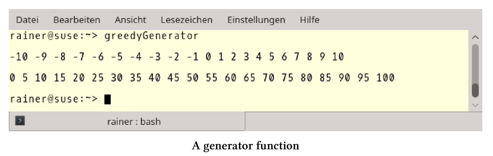

# 协程

协程是可以挂起，保持函数执行状态，并可以在之后继续执行的方式。这种方式的演化在C++中算是一种进步，协程大概率是C++20标准的一部分。

本节中介绍的C++20中的新思想，其实已经已经相当古老了。“coroutine”这个词是由[Melvin Conway](https://en.wikipedia.org/wiki/Melvin_Conway)创造的，他在1963年关于编译器的出版物中使用了这个词。[Donald Knuth](https://en.wikipedia.org/wiki/Donald_Knuth)称程序是协程的一个特例。有时候，有些想法需要一段时间才能被世人接受。

C++20用两个新的关键字co_await和co_yield，扩展了C++函数的执行。

co_await可以挂起表达式，如果在函数`func`中使用co_await，当调用`auto getResult = func()`不阻塞时，函数的结果不可用。不是资源消耗式的阻塞，而是资源友好式的等待。

co_yield允许编写一个生成器，生成器每次返回一个新值。生成器是一种数据流，并可以从中选择相应的值。数据流可以是无限的，这样我们就可以使用C++进行惰性求值了。

## 生成器

下面的程序不太难，函数`getNumbers`返回所有的整数，从开始到结束递增为`inc`。`begin`必须小于`end`，且`inc`必须是正数。

贪婪生成器

```c++
// greedyGenerator.cpp

#include <iostream>
#include <vector>

std::vector<int> getNumbers(int begin, int end, int inc = 1) {

  std::vector<int> numbers;
  for (int i = begin; i < end; i += inc) {
    numbers.push_back(i);
  }
  
  return numbers;

}

int main() {

  std::cout << std::endl;

  const auto numbers = getNumbers(-10, 11);

  for (auto n : numbers) std::cout << n << " ";

  std::cout << "\n\n";

  for (auto n : getNumbers(0, 101, 5)) std::cout << n << " ";

  std::cout << "\n\n";

}
```

当然，这里用`getNumbers`重新发明轮子了，自从C++11以来，这项工作可以使用[std::iota](http://en.cppreference.com/w/cpp/algorithm/iota)来完成。

下面是输出：



对这个程序的两个观察结果比较重要：一方面，即使我只对一个有1000个元素的vector的前5个元素感兴趣，第8行的vector也会存放这1000个值。另一方面，很容易将函数`getNumbers`转换为惰性生成器。

惰性生成器

```c++
// lazyGenerator.cpp

#include <iostream>
#include <vector>

generator<int> generatorForNumbers(int begin, int end, int inc = 1) {

  for (int i = begin; i < end; i += inc) {
    co_yield i;
  }

}

int main() {

  std::cout << std::endl;

  const auto numbers = generatorForNumbers(-10);

  for (int i = 1; i <= 20; ++i) std::cout << numbers << " ";

  std::cout << "\n\n";

  for (auto n : generatorForNumbers(0, 5)) std::cout << n << " ";

  std::cout << "\n\n";

}
```

当greedyGenerator.cpp中的函数`getNumbers`返回`std::vector<int>`时，lazyGenerator.cpp中的协程`generatorForNumbers`返回生成器。第18行中的生成器编号或第24行的`generatorForNumbers(0,5)`在请求时，会返回一个新编号，并基于for循环触发查询。更准确地说，协程的查询通过`co_yield i`返回值`i`，并立即暂停执行。如果请求一个新值，协程将在该位置恢复执行。

第24行中的`generatorForNumbers(0,5)`是生成器的直接使用的一种方式。

我想强调一点，协程`generatorForNumbers`会创建无限的数据流，因为第8行中的for循环没有结束条件。如果值的数量有限(第20行)是可以的，但因为没有结束条件，第24行不会停下来，而会一直运行。

因为协程是C++添加的一个新概念，所以我想聊一聊它的细节。

## 其他细节

**典型用例**

协程是编写[事件驱动应用]( https://en.wikipedia.org/wiki/Event-driven_programming)的常用方法，可以是模拟、游戏、服务器、用户界面，甚至是算法。协同程序通常用于协作的[多任务处理]( https://de.wikipedia.org/wiki/Multitasking)，协作式的多任务处理的关键是，每个任务需要多少时间就花多少时间。这与抢占式的多任务形成了对比，我们可以有计划的决定每个任务占用CPU的时间。

协程还有很多种。

**基础概念**

C++20中的协程是不对称的、优秀的、无堆栈的。

非对称协程的工作流，会返回给调用者，这并不适用于对称协程。对称协同程序，可以将其工作流委托给另一个协同程序。

优秀的协程类似于优秀的函数，因为协序的行为类似于数据。这意味着可以将它们作为函数的参数或返回值，将它们存储在变量中。

无堆栈协程使其能够挂起，并恢复上级协同程序，但此协程不能调用另一个协程。所以，无堆栈协程通常称为可恢复函数。

**设计目的**

Gor Nishanov描述了协同程序的设计目的：

协程应该具有的能力：

* 高度可扩展性(可到数十亿并发协程)。
* 具有高效的恢复和挂起，其成本不高于函数的开销。
* 与现有特性进行无缝，无开销交互。
* 具有开放的协同程序机制，允许库设计人员开发使用各种高级语义(如生成器、[goroutines](https://tour.golang.org/concurrency/1)、任务等)。

由于可扩展性和与现有设施的无缝交互的设计理念，所以协同程序是无堆栈的。相反，对于堆栈式协程，在Windows上会保留默认堆栈为1MB，在Linux上会保留默认堆栈为2MB。

将函数变成协程有四种方式。

**成为协程**

函数使用了协程，就变成了协程：

* co_return
* co_await
* co_yield
* co_await基于for循环的表达式。

这个解释源自提案N4628。

最后，讨论下新的关键字co_return、co_yield和co_await。

**co_return , co_yield和co_await**

co_return：协程使用co_return作为其返回语句。

co_yield：可以实现一个生成器。这意味着可以创建一个生成器，并生成一个无限的数据流，可以连续地查询值。生成器`generator<int> generatorForNumbers(int begin, int inc= 1)`的返回类型是`generator<int>`。`generator<int>`内部包含一个特殊的`promise p`，这样调用`co_yield i`就等于调用`co_await p.yield_value(i)`。`co_yield i`可以调用任意次。调用之后，协程立即暂停。

co_await：会让协程挂起，并在之后恢复。`co_await exp`中的`exp`必须是可等待的表达式。`exp`必须实现一个特定的接口，这个接口由`await_ready`、`await_suspend`和`wait_resume`三个函数组成。

co_await的典型用例是事件等待服务器。

阻塞式服务器

```c++
Acceptor acceptor{443};
while (true){
  Socket socket= acceptor.accept(); // blocking
  auto request= socket.read(); // blocking
  auto response= handleRequest(request);
  socket.write(response); // blocking
}
```

这个服务器非常简单，因为会在同一个线程中依次响应每个请求。服务器监听端口443(第1行)，接受连接(第3行)，读取来自客户机的数据(第4行)，并将应答信息传回客户机(第6行)。第3、4和6行中的所有调用都被阻塞。

由于co_await，阻塞调用现在可以暂停并恢复。

等待式服务器

```c++
Acceptor acceptor{443};
while (true){
  Socket socket= co_await acceptor.accept();
  auto request= co_await socket.read();
  auto response= handleRequest(request);
  co_await socket.write(response);
}
```

