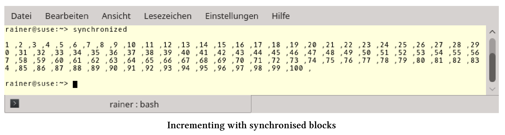
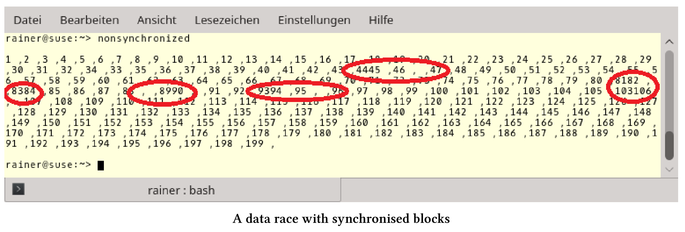

# 事务性内存

事务性内存是基于数据库理论中的事务概念。事务性内存可让使用线程变得更加容易，原因有二：第一，避免数据竞争和死锁；第二，可以组合事务。

事务具有以下属性的操作：原子性(Atomicity)、一致性(Consistency)、独立性(Isolation)和持久性(Durability)(ACID)。除了持久性和存储操作结果之外，所有的属性都适用于C++的事务性内存。现在还有三个问题。

## ACI(D)

ACID是数据库事务正确执行的四个基本要素的缩写。

对于由一些语句组成的原子块，原子性、一致性和独立性意味着什么呢?

原子块

```c++
atomic{
  statement1;
  statement2;
  statement3;
}
```

原子性：执行块中的所有语句或不执行块中任何语句。

一致性：系统始终处于一致的状态，所有事务确定统一的顺序。

独立性：每个事务在完全独立的情况下运行。

如何应用这些属性?事务会记住初始状态，并且在不同步的情况下执行。如果在执行过程中发生冲突，事务将中断，并恢复到初始状态，此回滚操作将再次执行事务。如果事务结束时，初始状态仍然存在，则为提交事务。冲突通常可以通过标记状态的引用来检测。

事务是一种推测行为，只有在初始状态时才会提交。与互斥锁相比，它是一种相对乐观的方法。事务在不同步的情况下执行，只有在没有冲突的情况下才会释放。互斥是一种较为悲观的方法。首先，互斥确保没有其他线程可以进入临界区。接下来，如果线程是互斥量的独占所有者，那么它将进入临界区，从而阻塞其他线程。

C++以两种方式支持事务性内存：同步块和原子块。

## 同步块和原子块

目前为止，只聊了事务，现在来聊下同步块和原子块，两者可以相互封装。更具体地说，同步块不是事务，因为它们可以执行不安全事务。事务不安全的例子，类似于控制台输出的代码无法撤消。因此，同步块通常也称为自由块。

**同步块**

同步块的行为就像全局锁一样，这意味着所有同步块都遵循相同的顺序，特别对同步块的所有更改，都可以在之后的同步块中使用。由于事务的提交与启动是同步的，所以在同步的块之间存在着同步关系。它们会建立一个总顺序，所以同步块不会死锁。互斥锁保护的是程序的关键区域，而同步块的则是保护整个程序。

这也就是为什么下面的程序定义良好的原因。

一个同步块

```c++
// synchronized.cpp

#include <iostream>
#include <vector>
#include <thread>

int i = 0;

void increment() {
  synchronized{
    std::cout << ++i << " ,";
  }
}

int main() {

  std::cout << std::endl;

  std::vector<std::thread> vecSyn(10);
  for (auto& thr : vecSyn)
    thr = std::thread([] {for (int n = 0; n < 10; ++n)increment(); });
  for (auto& thr : vecSyn)thr.join();

  std::cout << "\n\n";

}
```

第7行中的变量`i`是一个全局变量，同步块中的操作是事务不安全的，但是程序是定义良好的。10个线程并发调用函数`increment`(第21行)，10次增加第11行的变量`i`，对`i`和`std::cout`的访问是完全按顺序进行的，这就是同步块的特性。

程序返回预期的结果。`i`的值是按递增的顺序写的，中间用逗号隔开。下面是输出。



那么数据竞争呢?可以把它们与同步块放在一起。对源代码的一个小修改就可以引入数据竞争。

同步块的数据竞争

```c++
// nonsynchronized.cpp

#include <chrono>
#include <iostream>
#include <vector>
#include <thread>

using namespace std::chrono_literals;


int i = 0;

void increment() {
  synchronized{
    std::cout << ++i << " ,";
    this_thread::sleep_for(1ns);
  }
}

int main() {

  std::cout << std::endl;

  std::vector<std::thread> vecSyn(10);
  std::vector<std::thread> vecUnsyn(10);

  for (auto& thr : vecSyn)
    thr = std::thread([] {for (int n = 0; n < 10; ++n)increment(); });
  for (auto& thr : vecUnsyn)
    thr = std::thread([] {for (int n = 0; n < 10; ++n)increment(); });

  for (auto& thr : vecSyn)thr.join();
  for (auto& thr : vecSvecUnsynyn)thr.join();

  std::cout << "\n\n";

}
```

为了观察到数据竞争，我让同步块休眠了1纳秒(第16行)。同时，在没有没有同步块(第30行)时，访问输出流`std::cout`。总共有20个线程增加了全局变量`i`，其中一半没有同步，所以输出显示就出问题了。



我在有输出的问题的输出周围画上红色的圆圈。这些是`std::cout`由至少两个线程同时写入的位置。C++11保证字符是自动编写的，而这并不是问题的原因。更糟糕的是，变量`i`是由多于两个线程进行修改的，这就是一场数据竞赛。因此，程序会出现未定义行为。计数器的最终结果应该是200，但结果是199。这意味着，计数中有值被覆盖了。

同步块的顺序也适用于原子块。

**原子块**

可以在同步块中执行事务不安全代码，但不能在原子块中执行。原子块有三种形式：`atomic_noexcept`、`atomic_commit`和`atomic_cancel`。三个后缀`_noexcept`、`_commit`和`_cancel`定义了原子块如何对异常进行管理：

atomic_noexcept：如果抛出异常，将调用`std::abort`中止程序。

atomic_cancel：默认情况下，会调用`std::abort`。如果抛出一个终止事务的安全异常，则不存在这种情况。在这种情况下，事务将取消，并进入初始状态并抛出异常。

atomic_commit：如果抛出异常，则提交事务。

具有事务安全异常的有: [std::bad_alloc](http://en.cppreference.com/w/cpp/memory/new/bad_alloc), [std::bad_array_length]( https://www.cs.helsinki.fi/group/boi2016/doc/cppreference/reference/en.cppreference.com/w/cpp/memory/new/bad_array_length.html), [std::bad_array_new_length](http://en.cppreference.com/w/cpp/memory/new/bad_array_new_length), [std::bad_cast](http://en.cppreference.com/w/cpp/types/bad_cast), [std::bad_typeid](http://en.cppreference.com/w/cpp/types/bad_typeid), [std::bad_exception](http://en.cppreference.com/w/cpp/error/bad_exception), [std::exception](http://en.cppreference.com/w/cpp/error/exception), 以及所有(从这些异常中)派生出来的异常。

## transaction_safe与transaction_unsafe的代码比较

可以将函数声明为transaction_safe，或者将transaction_unsafe属性附加到它。

transaction_safe与transaction_unsafe

```c++
int transactionSafeFunction() transaction_safe;

[[transaction_unsafe]] int transactionUnsafeFunction();
```

transaction_safe属于函数类型，但transaction_safe是什么意思?根据[N4265]( http://www.open-std.org/jtc1/sc22/wg21/docs/papers/2014/n4265.html), transaction_safe函数是一个具有transaction_safe定义的函数。如果不出现下列属性定义，则该定义成立:

* 有volatile参数或变量。
* 有事务不安全的语句。
* 当函数体中使用一个类的构造和析构函数，而这个类具有volatile的非静态成员。

当然，这个transaction_safe定义是不稳定的，你可以阅读提案[N4265]( http://www.open-std.org/jtc1/sc22/wg21/docs/papers/2014/n4265.html) ，了解更多细节。

