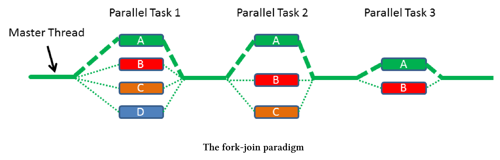

# 任务块

任务块使用fork-join范型来并行执行任务，其已经是[C++扩展并行性2版技术规范](http://www.open-std.org/jtc1/sc22/wg21/docs/papers/2018/n4742.html)的一部分。因此，我们很有可能在C++20中看到它们。

谁在C++中发明了任务块?微软的[Parallel Patterns Library (PPL)](https://en.wikipedia.org/wiki/Parallel_Patterns_Library)和英特尔的[Threading Building Blocks (TBB)](https://en.wikipedia.org/wiki/Threading_Building_Blocks)都参与了[N4441提案](http://www.open-std.org/jtc1/sc22/wg21/docs/papers/2015/n4411.pdf)。另外，Intel使用了他们的[Cilk Plus语言库](https://en.wikipedia.org/wiki/Cilk)。

fork-join这个很容易理解。

## Fork和Join

解释fork-join范式最直接的方法是使用图形。



它是如何工作的?

创建者调用`define_task_block`或`define_task_block_restore_thread`，此调用会创建一个任务块，该任务块可以创建任务，也可以等待任务完成，同步位于任务块的末尾。创建新任务是fork阶段，任务块的同步是工作流的联接阶段，这只是一个简单的描述。让我们来看一段代码。

定义一个任务块

```c++
template <typename Func>
int traverse(node& n, Func &&f){
  int left = 0, right = 0;
  define_task_block(
  	[&](task_block& tb){
      if (n.left) tb.run([&]{left = traverse(*n.left, f);});
      if (n.right) tb.run([&]{right = traverse(*n.right, f);});
    }
  );
  return f(n) + left + right;
}
```

traverse是一个函数模板，它在树的每个节点上调用函数`f`。关键字`define_task_block`定义了任务块，任务块`tb`可以在任务块中启动一个新任务，这发生在第6行和第7行树的左右分支上。第9行是任务块的末端，因此是同步点。

> **HPX(高性能ParalleX)**
>
> 上面的例子来自[HPX (High-Performance ParalleX)](http://stellar.cct.lsu.edu/projects/hpx/)框架的文档，它是一个通用的C++运行时，适用于任何规模的并行和分布式应用程序。HPX已经实现了许多本章介绍的，即将发布的C++ 20/23标准中的特性。

可以使用`define_task_block`函数或`define_task_block_restore_thread`函数定义一个任务块。

## define_task_block与define_task_block_restore_thread

区别在于，`define_task_block_restore_thread`函数保证任务块的创建者线程与任务块完成后运行的线程是相同的，而`define_task_block`函数则相反。

define_task_block与define_task_block_restore_thread

```c++
  ...
  define_task_block([&](auto& tb){
    tb.run([&]{[]fun();});
    define_task_block_restore_thread([&](auot& tb){
      tb.run([&]{[]{func2();}); 
      define_task_block([&](auto& tb){
        tb.run([&]{func3();});
      });
      ...
      ...
    });
    ...
    ...
  });
  ...
  ...
```

任务块确保最外层任务块(第2 - 14行)的创建者线程，与完成任务块后运行语句的线程完全相同。这意味着执行第2行的线程与执行第15和16行的线程相同。这种保证不适用于嵌套的任务块，第6 - 8行任务块的创建者线程不会自动执行第9行和第10行。现在执行第4行的创建者线程与执行第12行和第13行的线程是相同的，如果需要嵌套，则应该使用define_task_block_restore_thread函数(第4行)。

## 接口

任务块的接口非常有限，不能构造、销毁、复制或移动task_block类的实例。只能对其使用define_task_block函数或define_task_block_restore_thread函数。`task_block tb`在定义的任务块范围内活动，因此可以启动新任务(`tb.run`)或等待(`tb.wait`)直到任务完成。

任务块的最小接口

```c++
define_task_block([&](auto& tb){
  tb.run([&]{process(x1, x2)});
  if(x2==x3) tb.wait();
  process(x3, x4);
});
```

这段代码在做什么呢?第2行启动了一个新任务，这个任务需要数据`x1`和`x2`才能进行，第4行使用数据`x3`和`x4`。如果`x2 == x3`为真，则必须保护变量不受共享访问。这就是任务块`tb`等待第2行任务完成的原因。

如果函数`task_block::run`或`task_block::wait`检测到当前任务块中有异常，则会抛出一个类似于`task_cancelled_exception`的异常。

## 调度器

调度器管理线程运行，这意味着决定谁执行任务不再是程序开发者的责任。线程只是一个实现细节。

执行新创建的任务有两种策略。父线程表示创建者线程，子线程表示新任务。

窃取子任务：调度程序窃取其任务并执行它。

窃取父任务：现在调度器窃取任务块`tb`本身执行任务。

[提案N4441](http://www.open-std.org/jtc1/sc22/wg21/docs/papers/2015/n4411.pdf)支持这两种策略。

